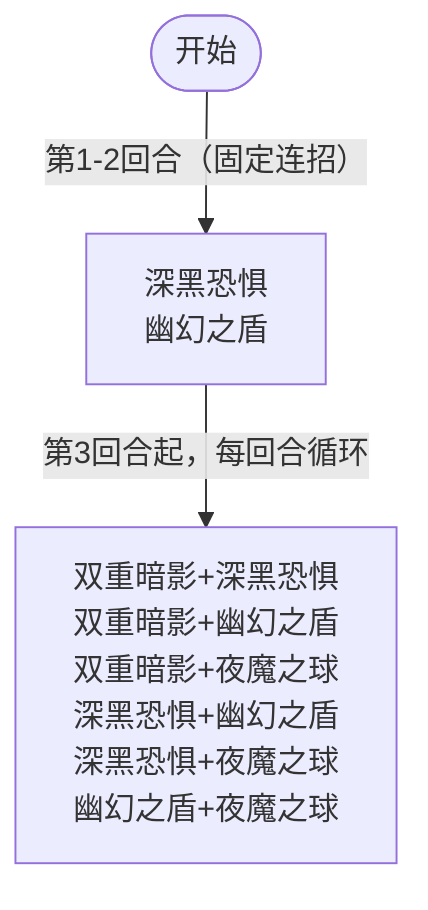

# 布莱克

> **类型**：Boss 怪物
> **初始生命**：78 - 83
> **遭遇战**：第一层 Boss 池
> **特性**：三身一体真假身切换 + 双意图伪随机组合 + 双重暗影被击晕削弱 + 深黑恐惧塞诅咒 + 幽幻之盾降级卡牌 + 夜魔之球奥斯提翻倍

## 被动能力

### 暗夜守护（开局三身一体）

**三身一体：真身与两个分身共同作战。分身受到的伤害固定为 1 点，且受到伤害后被击晕。在其回合结束时真身随机切换。**

- **开局**：3 只布莱克加入房间时均施加暗影守护。第一个被添加的为真身，其余两个为假身。
- **真身切换**：每回合结束时，从所有存活的布莱克中随机选 1 个为新真身（专用随机源，多端同步）。
- **真身初始化兜底**：回合开始时若发现场上还没有真身，则强制把第一个设为真身，避免开局三假身卡死。
- **假身受伤**：假身受到的伤害固定为 1 点，并在受伤后被击晕。
- **真身死亡 = 胜利**：真身死亡时，所有活着的假身逃跑（非击杀，不计掉落）。
- **能力类型**：被动型，不可消除。

::: warning 真假身识别
3 只布莱克外观完全相同，玩家无法直接区分真假身。只有攻击后观察伤害才能判断：受到 1 点伤害的是假身（且会被击晕），正常受伤的是真身。每回合结束真身随机切换，需重新识别。
:::

## 行动逻辑

3 只布莱克（1 真 2 假），假身受 1 点伤害即晕，真身死亡即胜利。每回合结束真身随机切换。前 2 回合固定连招，第 3 回合起伪随机选双招组合。

> **双重暗影**：7伤害×5次（基础），每有1个被击晕队友连击-1；**深黑恐惧**：自身力量+3，抽牌堆加1张随机诅咒；**幽幻之盾**：1层缓冲，随机降级1张已升级卡牌；**夜魔之球**：12伤害（有奥斯提时24），生成1个黑暗充能球。每回合结束真身随机切换。

## 招式表

### 单意图招式

| 招式名 | 意图 | 类型 | 效果 | 数值 |
|--------|------|------|------|------|
| **双重暗影** | 双重暗影 | 多段攻击 | 造成伤害多次，场上每有 1 个被击晕的队友（含假身），连击次数 -1 | 7 伤害 ×5 次（基础），最少 0 次 |
| **深黑恐惧** | 深黑恐惧 | 自身增益 + 牌组污染 | 自身力量 +3，向你的抽牌堆顶部加入 1 张随机赛尔诅咒 | 力量 +3，诅咒 ×1 |
| **幽幻之盾** | 幽幻之盾 | 自身增益 + 卡牌降级 | 自身获得 1 层缓冲，随机降级 1 张你已升级的卡牌 | 缓冲 1 层 |
| **夜魔之球** | 夜魔之球 | 攻击 + 充能球 | 生成 1 个黑暗充能球，造成伤害。若你拥有奥斯提，伤害翻倍 | 12 伤害（有奥斯提时 24）+ 1 球 |

::: tip 本地化"攻击"即力量
深黑恐惧的本地化描述为"自身攻击 +3"，在 seer mod 中，"攻击"属性即力量，两者同义。每层力量 +1 点造成的攻击伤害。
:::

### 双意图组合招式

| 招式名 | 组成 | 执行顺序 | 备注 |
|--------|------|----------|------|
| **深黑恐惧·幽幻之盾** | ③深黑恐惧 + ④幽幻之盾 | 先 ③ 后 ④ | 前 2 回合固定使用 |
| **双重暗影·深黑恐惧** | ②双重暗影 + ③深黑恐惧 | 先 ② 后 ③ | 随机池 |
| **双重暗影·幽幻之盾** | ②双重暗影 + ④幽幻之盾 | 先 ② 后 ④ | 随机池 |
| **双重暗影·夜魔之球** | ②双重暗影 + ⑤夜魔之球 | 先 ② 后 ⑤ | 随机池 |
| **深黑恐惧·夜魔之球** | ③深黑恐惧 + ⑤夜魔之球 | 先 ③ 后 ⑤ | 随机池 |
| **幽幻之盾·夜魔之球** | ④幽幻之盾 + ⑤夜魔之球 | 先 ④ 后 ⑤ | 随机池 |

### 双重暗影的连击削弱机制

双重暗影基础连击 5 次，场上每个被击晕的队友（含假身）减 1 次（统计场上被击晕的队友数量）：

| 己方被击晕数 | 连击次数 | 总伤害 |
|--------------|----------|--------|
| 0 | 5 | 35 |
| 1 | 4 | 28 |
| 2（布莱克战上限） | 3 | 21 |

::: warning 布莱克战中被击晕数上限为 2
布莱克遭遇战中共 3 只布莱克（1 真 2 假），队友统计不含自身，所以最多 2 只队友被击晕，连击次数最低降至 3 次（21 伤害）。表中 3+ 被击晕仅在多人模式下其他队友也被击晕时才可能。
:::

::: warning 假身被击晕会削弱双重暗影
假身受伤后会被击晕，被击晕的假身计入双重暗影的连击削弱。攻击假身虽然只造成 1 点伤害，但会使假身被击晕，从而减少双重暗影的连击次数。3 只布莱克中最多 2 只假身，若 2 只假身都被击晕，双重暗影连击数降至 3 次（21 伤害）。
:::

### 夜魔之球的奥斯提翻倍

夜魔之球检查敌方队伍中是否有奥斯提（原版 Seeker 角色的伙伴怪物）：

- **无奥斯提**：12 点伤害
- **有奥斯提**：24 点伤害（翻倍）

奥斯提是原版 Seeker 角色的专属伙伴，如果队伍中有 Seeker 玩家且带了奥斯提，夜魔之球威胁翻倍。

## 遭遇战

| 遭遇战 | 房间类型 | 池子 | 数量 | 说明 |
|--------|----------|------|------|------|
| `SeerBlakeBoss` | Boss | 第一层 Boss 池 | 3 只 | 3 只同模板布莱克，1 真 2 假 |

## 策略提示

### 真假身识别（核心机制）

3 只布莱克外观完全相同，**只有攻击后才能区分真假身**：

- **假身**：受到伤害固定为 1（假身受伤修正固定返回 1），且受伤后**立即被击晕**
- **真身**：正常受伤，不会被击晕

**识别流程**：

1. 用低费攻击逐个试探（推荐 1 费或 0 费攻击牌）
2. 观察伤害数字：1 伤害的是假身（且会晕眩），正常伤害的是真身
3. 找到真身后集火输出

**注意**：每回合结束真身随机切换（框架同步随机源确保多端一致），需重新识别。前 2 回合是识别真身的最佳窗口（无攻击伤害）。

### 前 2 回合是缓冲期

前 2 回合固定使用**深黑恐惧·幽幻之盾**（前 2 回合固定连招），无直接攻击伤害。这 2 回合的作用：

| 招式 | 效果 | 应对 |
|---|---|---|
| ③深黑恐惧 | 自身力量 +3，向抽牌堆**顶部**塞 1 张随机赛尔诅咒 | 下回合必抽诅咒，需净化或消耗 |
| ④幽幻之盾 | 自身 1 层缓冲，随机降级 1 张你已升级的卡牌 | 永久削弱牌组，关键升级牌需保护 |

**前 2 回合战术**：
1. 用低费攻击逐个识别真身（前 2 回合无攻击威胁，安全试探）
2. 准备净化诅咒的手段（深黑恐惧塞的诅咒下回合必抽）
3. 如果有重要升级卡，可考虑在 2 回合内不升级（避免被降级）

### 双重暗影连击削弱机制

双重暗影基础 5 段 × 7 伤 = 35 总伤，但**每个被击晕的队友（含假身）减 1 段**：

| 己方被击晕数 | 连击段数 | 总伤害 |
|---|---|---|
| 0（开局） | 5 | 35 |
| 1（1 假身被击晕） | 4 | 28 |
| 2（2 假身都被击晕） | 3 | 21 |

**战术：攻击假身是双刃剑**：

- ✅ **好处**：假身受伤 1 即被击晕，2 只假身都击晕后双重暗影降至 3 段（21 伤），威胁减半
- ❌ **坏处**：攻击假身只造成 1 点伤害（浪费输出），且真身每回合切换

**判断**：如果当前回合意图是双重暗影（②③/②④/②⑤），优先攻击假身降低连击；如果意图是其他，集火真身。

### 第 3 回合起的伪随机双招

第 3 回合起，每回合从 6 种双招组合中**伪随机选 1 个**（基于回合数哈希的伪随机算法）：

| Combo | 第一招 | 第二招 | 主要威胁 |
|---|---|---|---|
| ②③ | 双重暗影 | 深黑恐惧 | 35伤+力量+3+诅咒 |
| ②④ | 双重暗影 | 幽幻之盾 | 35伤+缓冲+降级 |
| ②⑤ | 双重暗影 | 夜魔之球 | 35伤+12伤+1球 |
| ③④ | 深黑恐惧 | 幽幻之盾 | 力量+3+诅咒+缓冲+降级 |
| ③⑤ | 深黑恐惧 | 夜魔之球 | 力量+3+诅咒+12伤+1球 |
| ④⑤ | 幽幻之盾 | 夜魔之球 | 缓冲+降级+12伤+1球 |

**双重暗影出现在 ②③/②④/②⑤ 三种 combo，概率 3/6=50%**。第 3 回合起每回合有 50% 概率挨双重暗影，需保留格挡。

### 黑暗充能球累积威胁

夜魔之球每次使用生成 1 个黑暗充能球：

- **槽位上限**：最多 2 个，满槽后再生成会先激发最旧的（对生命最少的敌人造成该球当前激发值伤害），再添加新球
- **激发值机制**：新球初始激发值 6，每回合结束时给每球 +6
- **伤害类型**：非攻击伤害（不受力量/暴击/易伤/虚弱影响）
- **目标选择**：激发时对生命值最少的敌人造成伤害

::: warning ⚠️ 被动效果不造成伤害
黑暗充能球的被动效果（回合结束 +6 激发值）只增加激发值，**不造成任何伤害**。伤害仅在满槽再生成时触发。原版黑暗充能球同样只增加激发值，无伤害逻辑。
:::

**累积威胁示意**（假设从第 3 回合起每回合都使用夜魔之球）：

| 回合 | 行动 | 球数 | 每球激发值（行动后/回合结束） | 激发伤害 |
|---|---|---|---|---|
| 第3回合 | 生成第1球 | 1 | 6 → 12（回合结束 +6） | 不触发（未满槽） |
| 第4回合 | 生成第2球 | 2 | 12/6 → 18/12（回合结束 +6） | 不触发（未满槽） |
| 第5回合 | 生成（满槽激发） | 2 | 12/6 → 18/12 | **18**（最旧球激发值） |
| 第6回合 | 生成（满槽激发） | 2 | 12/6 → 18/12 | **18** |
| 第7回合起 | 每回合稳定激发 | 2 | 12/6 → 18/12 | **18** |

**关键结论**：
- **前 2 次夜魔之球**：不造成激发伤害（球数未满槽）
- **第 3 次起每次夜魔之球**：稳定造成 **18 点** 激发伤害（受被动 +6 累积影响）
- 若夜魔之球被推迟（球停留在场上更久），激发值会更高，单次伤害更高
- 球伤害只对**生命最少的敌人**触发，多人模式下可能集中打一人

**战术**：
- 前 2 回合（③④）无夜魔之球威胁，可放心识别真身
- 第 3 回合起若意图含夜魔之球，需注意 Evoke 累积威胁
- **速战速决**：拖延越久，Evoke 值累积越高（每球每回合 +6）

### 夜魔之球对 Seeker 队伍翻倍

夜魔之球检查敌方队伍中是否有奥斯提（原版 Seeker 角色的伙伴怪物）：

- **无奥斯提**：12 点伤害
- **有奥斯提**：24 点伤害（翻倍）

奥斯提是原版 Seeker 角色的专属伙伴。如果队伍有 Seeker 玩家且带了奥斯提，夜魔之球威胁翻倍。**Seeker 玩家需特别注意格挡夜魔之球，或考虑在布莱克战中不召唤奥斯提**。

### 深黑恐惧的诅咒污染

深黑恐惧向你的抽牌堆**顶部**加入 1 张随机赛尔诅咒：

- 诅咒加入抽牌堆顶，**下回合必抽到**
- 赛尔诅咒池包含多种诅咒（削弱、烧牌、伤害类）
- 前 2 回合固定塞 2 张，后续 ③④/③⑤ combo 也会塞

**应对**：准备净化或消耗诅咒的卡牌，否则诅咒累积会拖垮牌组。

### 推荐策略总结

1. **前 2 回合识别真身**：用低费攻击逐个试探，找到真身后集火。如果没有低费攻击牌，可用任意攻击牌试探（前2回合无攻击威胁，安全试探）
2. **双重暗影回合攻击假身**：意图显示双重暗影时，攻击假身降低连击段数（2 假身击晕后降至 3 段）。如果牌组是单段高伤，可考虑直接集火真身（但双重暗影35伤仍需格挡）
3. **保留格挡应对双重暗影**：第 3 回合起 50% 概率挨双重暗影，需保留格挡
4. **净化诅咒**：深黑恐惧塞诅咒到抽牌堆顶，需净化手段
5. **节奏取舍**：黑暗充能球激发值累积（每球每回合 +6）+ 力量累积 + 诅咒污染，越拖越痛。
   - **爆发牌组**：识别真身后 3-4 回合速杀
   - **续航牌组**：无法速杀时，优先清除黑暗充能球（增益型可移除）减轻激发威胁，同时持续识别真身输出。注意真身每回合切换，需反复识别
6. **Seeker 队伍警惕夜魔之球**：有奥斯提时伤害翻倍至 24，需重格挡
7. **真身血量 78~83**：相对较低，识别真身后集中火力可在数回合内击杀

## 源码

- 怪物：`SeerBlakeMonster.cs`
- 被动能力：`SeerNightGuardPower.cs`
- 意图：`SeerBlakeIntents.cs`
- 黑暗充能球：`SeerDarkOrbCounterPower.cs`
- 遭遇战：`SeerBlakeBoss.cs`
- 本地化：`monsters.json`、`intents.json`、`powers.json`
