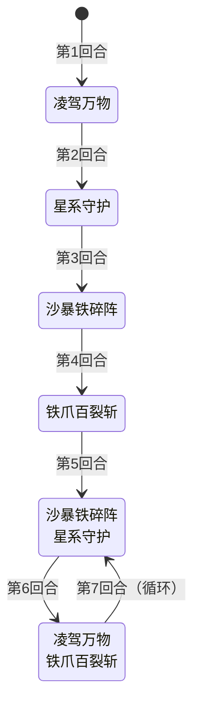

# 巴斯特

> **类型**：Boss 怪物
> **初始生命**：158 - 163
> **遭遇战**：第二层 Boss 池 · 神兽空间事件
> **特性**：大地守护（50%减伤+12覆甲+每回合+2防御）+ 防御雪球（沙暴固定伤害/铁爪力量随防御放大）+ 高塔充能球叠加覆甲 + 铁爪百裂斩爆发

## 被动能力

### 大地守护（开局自带，3 个能力组合）

加入房间时一次性施加 3 个独立能力，共同构成"大地守护"被动：

| 能力 | 数值 | 机制 | 能力类型 |
|------|------|------|----------|
| **永久减伤** | 50% | 受到的**攻击伤害**减少 50%（仅对攻击伤害生效，固定伤害/非攻击伤害不受影响） | 被动型，不可消除 |
| **大地守护** | 1 层（不显示层数） | 每回合开始时自身防御 +2 | 被动型，不可消除 |
| **覆甲** | 12 层 | 每次受到伤害时吸收 1 点并减 1 层（原版覆甲机制） | 被动（开局 12 层，被攻击消耗） |

::: warning 三层减伤链
巴斯特的减伤链：①50% 减伤（攻击伤害 ×0.5，乘法伤害修正最先执行）→ ②防御（每层 -1 攻击伤害，加法修饰）→ ③覆甲（每次吸收 1 点）。前期低伤卡牌几乎无效，需用高伤单次攻击或固定伤害/非攻击类手段应对。
:::

::: warning 本地化描述存在误导
游戏内"大地守护"能力的描述写为"受到的伤害减少50%。在其回合开始时获得2点防御"，但实际 50% 减伤由另一个独立能力"永久减伤"提供，大地守护自身只负责每回合 +2 防御。两个能力在 UI 上分别显示为两个图标。本页以实际逻辑为准。
:::

### 防御

巴斯特的"防御"是独立能力（非原版格挡），每有一层使受到的攻击伤害降低 1 点。防御来源：
- 大地守护：每回合开始 +2
- ③凌驾万物：+5
- 防御不会自然消退，持续累积。

## 行动逻辑

前 4 回合固定出招，第 5 回合起在两个双招组合之间交替循环。

> **凌驾万物**：防御+5，生成高塔充能球（槽位上限 2，满槽时 Evoke 最旧的球 +4 覆甲）；**星系守护**：20格挡，玩家力量-3；**沙暴铁碎阵**：10攻击伤害+防御层数固定伤害（下回合开始时结算，不可格挡）；**铁爪百裂斩**：力量拉平到防御值，2伤害×4次。防御每回合+2持续累积，铁爪伤害随防御雪球式放大。

## 招式表

### 单意图招式

| 招式名 | 意图 | 类型 | 效果 | 数值 |
|--------|------|------|------|------|
| **沙暴铁碎阵** | 沙暴铁碎阵 | 攻击 + 固定伤害 | 造成攻击伤害（受力量影响），附加等于自身防御层数的固定伤害（通过固定伤害能力施加，不可格挡） | 攻击伤害 10，固定伤害 = 防御层数 |
| **凌驾万物** | 凌驾万物 | 自身增益 | 自身防御 +5，生成 1 个高塔充能球（每球每回合 +1 覆甲） | 防御 +5，高塔球 ×1 |
| **星系守护** | 星系守护 | 自身增益 + Debuff | 自身获得 20 点格挡，对所有敌人施加力量 -3 | 格挡 20，玩家力量 -3 |
| **铁爪百裂斩** | 铁爪百裂斩 | 攻击（多段） | 自身力量提升至与防御相同，造成 2 点伤害 4 次（受力量加成） | 伤害 2（+力量）×4 次 |

### 双意图组合招式

| 招式名 | 组成 | 执行顺序 | 出现时机 |
|--------|------|----------|----------|
| **沙暴铁碎阵·星系守护** | ②沙暴铁碎阵 + ④星系守护 | 先 ② 后 ④ | 第 5 回合起（偶数计数） |
| **凌驾万物·铁爪百裂斩** | ③凌驾万物 + ⑤铁爪百裂斩 | 先 ③ 后 ⑤ | 第 6 回合起（奇数计数） |

### 沙暴铁碎阵的固定伤害机制

沙暴铁碎阵附加的固定伤害在**目标下回合开始时**结算（通过固定伤害能力施加，回合开始时触发）：

1. 造成 10 点攻击伤害后，对所有敌人施加等于巴斯特当前防御层数的固定伤害能力（Debuff，不可格挡，不受力量影响）。
2. 固定伤害能力在目标下回合开始时结算，造成等于层数的不可格挡非攻击伤害。
3. 反制手段：固定伤害不可格挡，只能通过清除巴斯特的防御层数（消除能力）或回血/护甲抵消。

### 铁爪百裂斩的伤害计算

铁爪百裂斩的伤害 = (2 + 力量) × 4 次，力量在攻击前提升至防御值：

| 回合 | 防御值（力量提升目标） | 每次伤害（2+力量） | 4 次总伤害（理论值） |
|------|----------------------|-------------------|---------------------|
| 第 4 回合 | 13 | 15 | 60 |
| 第 6 回合 | 22 | 24 | 96 |
| 第 8 回合 | 31 | 33 | 132 |

::: warning 铁爪伤害不受巴斯特自身减伤影响
上述为不考虑玩家格挡/易伤的理论值。50% 减伤只在巴斯特**受到**伤害时触发，铁爪百裂斩是巴斯特**造成**伤害，不受自身减伤影响。
:::

### 防御累积表

防御只增不减（每回合 +2 + 凌驾万物 +5），是巴斯特越拖越强的核心：

| 回合 | 招式 | 防御变化 | 回末防御 | 高塔球数 | 下回合覆甲增益 |
|------|------|----------|----------|----------|----------------|
| 第 1 回合 | ③凌驾万物 | +2(回合开始) +5(③) | 7 | 1 | +1 覆甲 |
| 第 2 回合 | ④星系守护 | +2 | 9 | 1 | +1 覆甲 |
| 第 3 回合 | ②沙暴铁碎阵 | +2 | 11 | 1 | +1 覆甲 |
| 第 4 回合 | ⑤铁爪百裂斩 | +2 | 13 | 1 | +1 覆甲 |
| 第 5 回合 | ②④ | +2 | 15 | 1 | +1 覆甲 |
| 第 6 回合 | ③⑤ | +2 +5(③) | 22 | 2 | +2 覆甲 |

## 遭遇战

| 遭遇战 | 房间类型 | 池子 | 数量 | 说明 |
|--------|----------|------|------|------|
| `SeerBusterBoss` | Boss | 第二层 Boss 池 | 1 只 | 第二层 Boss，单怪 |
| `SeerEventBusterEncounter` | Monster | 神兽空间事件 | 1 只 | 神兽空间·玄武巴斯特（奖励由神兽空间系统发放） |

## 策略提示

### 核心取舍：速战 vs 消除防御能力（两条路线，不是一概而论）

巴斯特的防御每回合 +2 且不消退，沙暴固定伤害和铁爪伤害都随防御放大。第 4 回合铁爪 60 伤害，第 6 回合 96 伤害，第 8 回合 132 伤害。**必须选择一条路线应对**：

- **路线 A（速战）**：前 4 回合单意图阶段全力输出，争取第 5 回合双意图循环前结束战斗。适用：爆发牌组（每回合 40+ 伤）
- **路线 B（消除防御能力）**：巴斯特核心被动 50% 减伤和大地守护是被动型（不可消除），但**防御能力是增益型（可被消除）**。防御同时驱动两大威胁——沙暴固定伤害 = 防御层数、铁爪力量提升至防御值。移除防御可同时削弱沙暴和铁爪。适用：续航牌组（有消除能力手段但缺乏爆发）

两条路线不互斥：前期速战压血，后期如果无法击杀则转消除防御。

1. **三层减伤链需穿透**：①防御（每层 -1 攻击伤害）+ ②50% 减伤（攻击 ×0.5）+ ③覆甲（每次吸收 1 点）。前期低伤多段攻击几乎无效（被覆甲+减伤吃光）。**穿透方式取舍**：
   - **高伤单次攻击**：破覆甲效率高（1 次攻击只消耗 1 层覆甲）
   - **固定伤害/非攻击类手段**：绕过整个减伤链（固定伤害不受减伤、防御、覆甲影响）
   - **多段低伤攻击**：被减伤链吃光，不推荐（除非用于破缓冲）

3. **沙暴固定伤害下回合结算**：沙暴铁碎阵的固定伤害等于防御层数，通过固定伤害能力施加，在**目标下回合开始时**结算（不可格挡，不受力量影响）。第 3 回合施加的固定伤害在第 4 回合开始时结算（11 点），第 5 回合施加的在第 6 回合开始时结算（15 点）。需通过消除巴斯特防御层或回血抵消。

4. **铁爪百裂斩是爆发点**：力量提升至防御值后 2+力量×4 次。第 4 回合 60 伤害，第 6 回合 96 伤害。第 4 回合前必须大幅压血或准备大量格挡。注意铁爪伤害不受巴斯特自身减伤影响（减伤只挡受到的伤害）。

5. **星系守护削弱输出**：20 格挡 + 玩家力量 -3。力量 -3 会显著降低玩家攻击伤害，配合巴斯特自身减伤链，输出进一步受限。第 2 回合固定使用星系守护，需准备非力量依赖的输出手段（固定伤害、Power 牌等）。

6. **高塔充能球叠加覆甲**：凌驾万物生成的高塔球每球每回合 +1 覆甲，槽位上限 2。满槽时第三次凌驾万物会 Evoke 最旧的球（+4 覆甲）并替换为新球，球数不会超过 2 但每次满槽 Channel 都额外 +4 覆甲。第 6 回合后双意图循环中 ③⑤会持续 Channel 高塔球，覆甲增长加速。需优先用消除能力类手段清除高塔球或覆甲。

7. **可移除能力清单**：巴斯特核心被动 50% 减伤和大地守护是被动型（不可消除）。但以下能力可被移除：
   - **[防御](/powers/defense_power.md)**：增益型，可移除。**移除防御同时削弱沙暴固定伤害（=防御层数）和铁爪力量（提升至防御值）**——最高优先级
   - **高塔充能球**：增益型，可移除。移除后停止覆甲累积
   - **覆甲**：可移除。但覆甲是开局 12 层固定值，移除后不再恢复

8. **前 4 回合是最佳输出窗口（但不是唯一窗口）**：前 4 回合为单意图，伤害相对可控（第 1 回合上 buff，第 2 回合上盾，第 3 回合沙暴，第 4 回合铁爪）。第 5 回合起进入双意图循环，每回合两个技能，威胁翻倍。
   - **爆发牌组**：前 4 回合全力压血，争取第 5 回合前结束
   - **续航牌组**：前 4 回合格挡苟活 + 移除防御能力。防御被移除后，铁爪力量提升至 0（2+0=2 伤害/段×4=8 总伤），沙暴固定伤害=0，威胁大幅降低。第 5 回合双意图循环后仍可持续战斗

## 源码

- 怪物：`SeerBusterMonster.cs`
- 被动能力：`SeerPermanentDamageReductionPower.cs`、`SeerEarthGuardPower.cs`、`PlatingPower.cs`
- 防御能力：`SeerDefensePower.cs`
- 高塔充能球：`SeerTowerOrbCounterPower.cs`
- 意图：`SeerBusterIntents.cs`、`SeerNamedMultiAttackIntent.cs`
- 遭遇战：`SeerBusterBoss.cs`、`SeerEventBusterEncounter.cs`
- 本地化：`monsters.json`、`intents.json`、`powers.json`、`orbs.json`