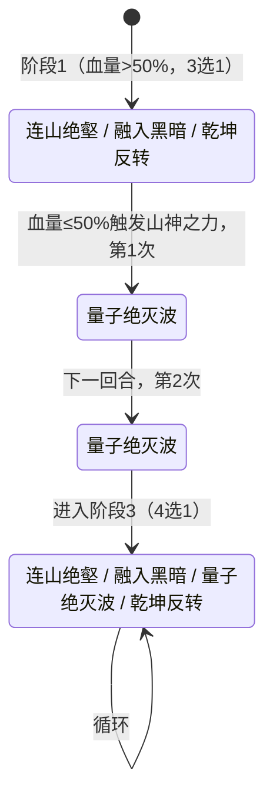

# 卡修斯

> **类型**：Boss 怪物
> **初始生命**：128 - 133
> **遭遇战**：第一层 Boss 池
> **特性**：山神之力（50%血触发30%减伤+壁垒+7状态牌）+ 状态牌污染联动（③状态牌数等额伤害/⑤多段伤害均按状态牌数）+ 量子绝灭波连续2次爆发 + 乾坤反转夺取属性

## 被动能力

### 山神之力（开局自带，仅触发一次）

**自身生命值首次低于 50% 时，获得 30% 伤害减免与壁垒，并向你的抽牌堆中加入 7 张随机状态牌。**

- **触发条件**：受到伤害后检查当前生命是否 ≤ 最大生命的 50%，仅触发一次。
- **触发效果**：
  - 获得 30% 减伤（攻击伤害 ×0.7）
  - 获得壁垒（格挡不再在回合开始时清空）
  - 向所有敌人抽牌堆加入 7 张随机状态牌（原版状态牌池 + seer mod 状态牌池，专用随机源多端同步）
- **能力类型**：被动型，不可消除。

::::::: warning 本地化描述与实际效果不符
本地化描述为"获得 **40%** 伤害减免"，但实际为 **30%** 减伤（攻击伤害 ×0.7）。本页以实际效果为准。
:::

## 行动逻辑

分 3 个阶段，由血量和量子绝灭波使用次数驱动。

> **阶段1**（血量>50%）：3选1随机，量子绝灭波禁用；山神之力触发（血量≤50%）获得30%减伤+壁垒+7张状态牌，**强制连续2回合量子绝灭波**（壁垒保留格挡，第2次可达60伤害）；**阶段3**：4选1随机循环。

## 招式表

| 招式名 | 意图 | 类型 | 效果 | 数值 |
|--------|------|------|------|------|
| **连山绝壑** | 连山绝壑 | 自身增益 + 牌组污染 | 自身全属性 +1（力量/防御/命中/速度各 +1），向你的弃牌堆加入 1 张侵蚀 + 1 张枯竭 | 全属性 +1，状态牌 ×2 |
| **融入黑暗** | 融入黑暗 | 自身增益 + 牌组污染 + 攻击 | 自身获得 2 层无实体，向你的弃牌堆加入 2 张虚空，对你造成等于你状态牌总数的伤害（非攻击伤害，不受力量/易伤影响，可被格挡） | 无实体 2 层，虚空 ×2，伤害 = 状态牌数 |
| **量子绝灭波** | 量子绝灭波 | 自身增益 + 攻击 | 自身获得 10 点格挡并翻倍（再获得等于当前格挡的格挡），造成等于当前格挡值的伤害 | 基础格挡 10→翻倍 20，伤害 20 |
| **乾坤反转** | 乾坤反转 | 属性夺取 + 攻击（多段） | 夺取你所有正值属性提升（力量/防御/命中/速度），造成 3 点伤害 × 你状态牌总数 | 伤害 3 × 状态牌数 |

::::::: warning 本地化"12点格挡"与实际效果不符
量子绝灭波的本地化描述为"获得 **12** 点格挡并翻倍"，但实际为基础 **10** 点格挡→翻倍 **20** 点→造成 **20** 点伤害。本页以实际效果为准。
:::::: warning 本地化"流失生命值"措辞与实际效果不符
融入黑暗的本地化描述为"**使你流失**等同于你状态牌数量的生命值"——"流失"在 STS 系列惯例中通常隐含"不可格挡"。但实际造成的是**可被格挡的非攻击伤害**（仅"不受力量/易伤影响"）。本页以实际效果为准：可被格挡。
:::

### 状态牌计数机制

③融入黑暗和 ⑤乾坤反转的伤害都与你的**状态牌总数**挂钩。状态牌计数统计你三个牌堆中的状态牌：

- **手牌**中的状态牌
- **抽牌堆**中的状态牌
- **弃牌堆**中的状态牌

::: tip 状态牌污染链
②连山绝壑塞 2 张状态牌到弃牌堆（侵蚀+枯竭），③融入黑暗塞 2 张虚空到弃牌堆，山神之力塞 7 张到抽牌堆。状态牌越多，③融入黑暗的伤害和 ⑤乾坤反转的多段伤害越高。需准备净化/消耗状态牌的手段。
:::

### 量子绝灭波的连续爆发

山神之力触发后强制连续 2 次使用 ④量子绝灭波，且壁垒让格挡不清空。第 2 次量子绝灭波时，上次的格挡还在，伤害会叠加：

| 次数 | 格挡变化 | 造成的伤害 |
|------|----------|------------|
| 第 1 次（触发后） | 0 +10 → 10，翻倍 +10 → 20 | 20 |
| 第 2 次（格挡保留 20） | 20 +10 → 30，翻倍 +30 → 60 | 60 |

::: danger 第 2 次量子绝灭波 60 伤害可秒杀
山神之力触发后连续 2 回合使用量子绝灭波，第 2 次因壁垒保留格挡可达 60 伤害。配合触发时塞的 7 张状态牌，③融入黑暗/⑤乾坤反转的威胁也大增。必须在 50% 血前结束战斗，或准备好应对 60 伤害爆发。
:::

### 乾坤反转的属性夺取

乾坤反转夺取你所有**正值**的属性提升：

| 属性 | 夺取条件 |
|------|----------|
| 力量 | 正值（> 0） |
| 防御 | 正值（> 0） |
| 命中 | 正值（> 0） |
| 速度 | 正值（> 0） |

夺取 = 移除你的正值属性（施加负值抵消）+ 给卡修斯施加等量正值。例如你有 +5 力量，乾坤反转后你变 0 力量，卡修斯 +5 力量。

## 遭遇战

| 遭遇战 | 房间类型 | 池子 | 数量 | 说明 |
|--------|----------|------|------|------|
| `SeerCasiusBoss` | Boss | 第一层 Boss 池 | 1 只 | 第一层 Boss，单怪 |

## 策略提示

### 阶段划分与节奏

卡修斯战斗分 3 阶段，由山神之力触发驱动：

| 阶段 | 触发条件 | 可用招式 | 战术要点 |
|---|---|---|---|
| **阶段1** | 开局到山神之力触发前 | ②连山绝壑 / ③融入黑暗 / ⑤乾坤反转（3选1随机，④禁用） | 输出窗口，压血到 50% 前 |
| **阶段2** | 山神之力触发后，连续 2 回合 | ④量子绝灭波（强制，其他禁用） | 危险期，第1次 20 伤+第2次 60 伤 |
| **阶段3** | 量子绝灭波用满 2 次后 | ②③④⑤全开（4选1随机） | 持续战斗期，状态牌污染累积 |

### 山神之力触发时机（关键转折点）

山神之力在**受到伤害后立即检查**，触发条件是当前生命 ≤ 最大生命 × 50%。触发效果：

1. **30% 减伤**：获得永久减伤能力，攻击伤害 ×0.7（注意本地化写 40%，实际为 30）
2. **壁垒**：格挡不再在回合开始时清空
3. **7 张随机状态牌**：动态从原版状态牌池 + seer mod 状态牌池随机抽取，加入你的抽牌堆

**战术建议**：
- 在 50% 血前尽量压血，争取阶段 1 击杀
- 不可避免触发时，**先准备好格挡/固定伤害免疫**再触发
- 触发后立即清状态牌，否则阶段 2 的 ④量子绝灭波 + 状态牌污染会一起爆发

### 量子绝灭波连续 2 次爆发（阶段 2 核心威胁）

山神之力触发后强制连续 2 回合使用 ④量子绝灭波。机制：

1. 获得 10 点格挡
2. 翻倍格挡（再获得等于当前格挡的格挡）
3. 造成等于当前格挡的伤害

| 次数 | 格挡变化 | 造成的伤害 | 总伤 |
|---|---|---|---|
| 第1次（触发后） | 0→10→翻倍20 | 20 | 20 |
| 第2次（壁垒保留20格挡） | 20→30→翻倍60 | 60 | **80** |

**第2次 60 伤害可秒杀多数角色**。配合山神之力塞的 7 张状态牌，③融入黑暗/⑤乾坤反转威胁也大增。

::: warning 60 伤害仅在玩家不攻击时成立——应攻击打掉格挡
量子绝灭波产生的格挡是**常规格挡**（受击时优先消耗），壁垒只防止回合开始时清空，不防止被攻击消耗。

- 若玩家**不攻击**（保留格挡）：第 2 次量子绝灭波 20+10=30→翻倍 60，造成 **60 伤害**
- 若玩家**攻击打掉 20 格挡**：第 2 次量子绝灭波 0+10=10→翻倍 20，造成 **仅 20 伤害**

**差别是 60 vs 20 = 40 点伤害**。"阶段 2 不输出全力保命"是错误策略——应**优先攻击打掉格挡**，将第 2 次量子绝灭波从 60 伤害降至 20，所需格挡从 ≥60 降至 ≥20。
:::

**应对**：
- **第1次量子绝灭波后优先攻击打掉 20 格挡**——这样第 2 次量子绝灭波仅造成 20 伤害（而非 60）
- 仅需保留 ≥20 格挡应对第 2 次（而非 ≥60）
- 或用固定伤害免疫能力（如长效生命、免疫固定伤害）
- 阶段 2 不是"不输出"，而是**攻击打掉格挡 + 保留 ≥20 格挡**

### 状态牌污染链（贯穿全程）

③融入黑暗和 ⑤乾坤反转的伤害都与你的**状态牌总数**挂钩（手牌+抽牌堆+弃牌堆中的状态牌）。

**状态牌来源**：

| 来源 | 牌名 | 数量 | 加入位置 |
|---|---|---|---|
| ②连山绝壑 | 侵蚀、枯竭 | 1+1=2 | 弃牌堆 |
| ③融入黑暗 | 虚空 | 2 | 弃牌堆 |
| 山神之力 | 7张随机状态牌 | 7 | 抽牌堆 |

状态牌越多，③融入黑暗的伤害和 ⑤乾坤反转的多段伤害越高：

- **③融入黑暗**：造成**等于状态牌数**的伤害（非攻击伤害，不受力量/易伤影响，但可被格挡）
- **⑤乾坤反转**：3 点伤害 × 状态牌数（多段攻击，受力量/易伤影响）

**战术**：必须准备净化/消耗状态牌的卡牌，否则状态牌累积后 ③⑤越来越痛。山神之力触发后立即清掉 7 张状态牌。

### 乾坤反转的属性夺取

乾坤反转夺取你**所有正值属性**：

- 移除你的正值属性（施加负值抵消到 0）
- 给卡修斯施加等量正值

例如你有 +5 力量 → 乾坤反转后你 0 力量，卡修斯 +5 力量。**双向放大属性差**。

**应对**：
- 爆发前不要堆叠过多属性，否则乾坤反转会让你的属性归零且强化卡修斯
- 在乾坤反转后重新铺属性（属性被夺走后再叠不晚）
- 注意乾坤反转的伤害段数 = 状态牌数，状态牌多时伤害极高

### 融入黑暗的无实体

③融入黑暗给卡修斯 2 层**无实体**（受伤害固定为 1）。配合 30% 减伤，触发后卡修斯极难被击杀。

**应对**：
- 用多段低伤攻击快速消耗无实体（每段消耗 1 层）
- 或等无实体自然消失（2 次有效攻击后）
- 不要在无实体期间打高伤牌，浪费伤害

### 连山绝壑的属性累积

②连山绝壑每次给卡修斯全属性 +1（力量/防御/命中/速度），多次使用后卡修斯越来越强：

| 使用次数 | 力量 | 防御 | 命中 | 速度 |
|---|---|---|---|---|
| 1次 | +1 | +1 | +1 | +1 |
| 3次 | +3 | +3 | +3 | +3 |
| 5次 | +5 | +5 | +5 | +5 |

力量 +5 后，④量子绝灭波的 60 伤害变 65，⑤乾坤反转的每段 3 伤变 8（5 段共 40）。**不能拖太久**。

### 推荐策略总结

1. **阶段 1 全力输出**：开局 ②③⑤ 随机无 ④，是最佳输出窗口，争取在山神之力触发前击杀
2. **阶段 2 攻击打掉格挡**：山神之力触发后连续 2 回合量子绝灭波。**第 1 次量子绝灭波后优先攻击打掉 20 格挡**，使第 2 次从 60 伤害降至 20。仅需保留 ≥20 格挡（而非 ≥60）
3. **清状态牌是核心**：山神之力触发后立即清掉 7 张状态牌，否则 ③⑤越来越痛
4. **不要堆属性对抗乾坤反转**：爆发前不堆属性，乾坤反转后重新铺属性
5. **应对无实体**：③融入黑暗后用多段低伤消耗无实体，不打高伤牌
6. **速战速决**：连山绝壑累积属性 + 状态牌污染累积，越拖越难打

## 源码

- 怪物：`SeerCasiusMonster.cs`（生命 128-133，动态权重 3 阶段：②③⑤随机 → 强制④×2 → 全开放）
- 被动能力：`SeerMountainGodPower.cs`（50% 血触发 30% 减伤 + 壁垒 + 7 张状态牌，仅一次）
- 减伤能力：`SeerPermanentDamageReductionPower.cs`（30% 攻击减伤）
- 壁垒：`BarricadePower`（原版，格挡不清空）
- 意图：`SeerCasiusIntents.cs`（连山绝壑、融入黑暗、量子绝灭波、乾坤反转意图）
- 遭遇战：`SeerCasiusBoss.cs`（第一层 Boss 池）
- 本地化：`monsters.json`（`SEER_MONSTER_SEER_CASIUS_MONSTER.*`）、`intents.json`（`SEER_MOUNTAIN_RIFT.*`、`SEER_MERGE_DARKNESS.*`、`SEER_QUANTUM_WAVE.*`、`SEER_COSMIC_REVERSAL.*`）、`powers.json`（`SEER_POWER_SEER_MOUNTAIN_GOD_POWER.*`）
