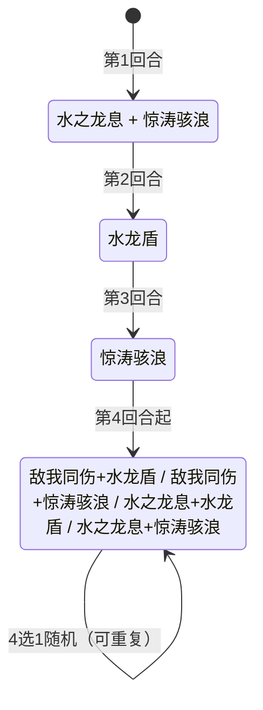

# 朵拉格

> **类型**：Boss 怪物
> **初始生命**：553 - 558
> **遭遇战**：第二层 Boss 池 · 神兽空间事件
> **特性**：青龙的震怒（每回合力量+1/回血10%已损失生命）+ 敌我同伤永久降上限（自损20%）+ 水龙盾2层滑溜+2层人工制品 + 惊涛骇浪塞2张状态牌

## 被动能力

### 青龙的震怒（开局自带）

**在其回合开始时，自身力量 +1，并回复已损失生命值的 10%。**

- **施加时机**：加入房间时施加青龙的震怒（1 层）。
- **触发时机**：朵拉格自身回合开始时，力量 +1 并回血。
- **回血公式**：已损失生命 × 10%，向下取整。满血时不回血，血量越低回血越多。
- **能力类型**：被动型，不可消除（不显示层数）。
- **属性累积**：力量每回合 +1 且不消失，水之龙息（受力量加成的攻击伤害）越往后越痛。

::: warning 持续回血 + 力量累积 = 拖不得
朵拉格 553-558 血 + 每回合回 10% 已损失生命 + 力量每回合 +1。长战中玩家不仅打不动（回血抵消输出），水之龙息伤害也会越来越高。必须准备爆发输出速战。
:::

## 行动逻辑

前 3 回合固定出招，第 4 回合起在 4 种**两技能组合**中随机选 1 种（可连续重复）。

> **说明**：前 3 回合固定单/双技能，第 4 回合起每回合 4 选 1 两技能组合，组合内技能顺序已固定。

> **敌我同伤**：自损20%最大生命（永久降上限），对玩家造成朵拉格最大生命5%非攻击伤害；**水之龙息**：20伤害（受力量加成）+疲惫2层；**水龙盾**：2层滑溜+2层人工制品；**惊涛骇浪**：向手牌加2张随机状态牌（从原版+seer mod 状态牌池随机）。青龙震怒每回合力量+1并回复10%已损失生命。

## 招式表

| 招式名 | 意图 | 类型 | 效果 | 数值 |
|--------|------|------|------|------|
| **敌我同伤** | 敌我同伤 | 自损 + 攻击 | 自身损失最大生命的 20%（永久降低上限，不可恢复），对所有敌人造成自身最大生命 5% 的伤害（非攻击伤害，不受力量/易伤影响） | 自损 20% 最大生命，玩家受到 5% 朵拉格最大生命伤害 |
| **水之龙息** | 水之龙息 | 攻击 + Debuff | 造成伤害（受力量加成），对所有敌人施加疲惫 2 层 | 伤害 20（+力量），疲惫 2 层 |
| **水龙盾** | 水龙盾 | 自身增益 | 自身获得 2 层滑溜 + 2 层人工制品 | 滑溜 2 层，人工制品 2 层 |
| **惊涛骇浪** | 惊涛骇浪 | 牌组污染 | 向你的手牌中加入 2 张随机状态牌（从原版 + seer mod 状态牌池随机，专用随机源多端同步） | 状态牌 ×2 |

::: warning 本地化描述错误
意图描述写"对你造成**你最大生命值5%**的伤害"，但实际效果是**朵拉格自身最大生命**的 5%，而非玩家最大生命。本页以实际效果为准。
:::

### 前三回合固定序列

| 回合 | 招式 | 说明 |
|------|------|------|
| 第 1 回合 | ③水之龙息 + ⑤惊涛骇浪 | 双技能：20伤害+疲惫2层 + 2张状态牌到手牌 |
| 第 2 回合 | ④水龙盾 | 单技能：2层滑溜+2层人工制品 |
| 第 3 回合 | ⑤惊涛骇浪 | 单技能：2张状态牌到手牌 |

### 两技能组合招式（第 4 回合起）

| 招式名 | 组成 | 执行顺序 |
|--------|------|----------|
| **敌我同伤·水龙盾** | ②敌我同伤 + ④水龙盾 | 先 ② 后 ④ |
| **敌我同伤·惊涛骇浪** | ②敌我同伤 + ⑤惊涛骇浪 | 先 ② 后 ⑤ |
| **水之龙息·水龙盾** | ③水之龙息 + ④水龙盾 | 先 ③ 后 ④ |
| **水之龙息·惊涛骇浪** | ③水之龙息 + ⑤惊涛骇浪 | 先 ③ 后 ⑤ |

### 敌我同伤的数值表

敌我同伤的自损与对玩家伤害均基于朵拉格**当前最大生命**计算（本回合自损与对玩家伤害用的是同一最大生命值）。由于自损永久降低上限，敌我同伤越往后越弱：

| 朵拉格当前最大生命 | 自损（20%） | 对玩家伤害（5%） |
|-------------------|-------------|------------------|
| 553（初始） | 110 | 27 |
| 443（自损 1 次后） | 88 | 22 |
| 355（自损 2 次后） | 71 | 17 |

::: tip 敌我同伤是相对有利的输出窗口
朵拉格自损永久降低最大生命上限（不可回血恢复），每次自损 20% 上限。而对玩家伤害是 5% 朵拉格当前最大生命（不受力量/易伤影响）。每次敌我同伤朵拉格永久损失 20% 上限，且青龙的震怒回血量也随上限降低而减少。出现敌我同伤时应抓住机会压血，但注意自身血量（约 27 点伤害不可忽视）。
:::

### 水龙盾的 4 层保护

水龙盾同时获得 2 层滑溜 + 2 层人工制品，共 4 层保护：

| 保护类型 | 层数 | 机制 |
|----------|------|------|
| 滑溜 | 2 | 每次受到未格挡伤害 ≥1 时，减 1 层并将该次生命损失降为 1 点（只掉 1 血） |
| 人工制品 | 2 | 每次受到 Debuff 时，消耗 1 层抵消该 Debuff |

::: tip 破盾顺序
滑溜只挡"未格挡伤害"，人工制品只挡"Debuff"。要破盾需：①多段攻击消耗滑溜（2 次未格挡伤害清空）；②先破人工制品再上关键 Debuff（否则 Debuff 被人工制品吞掉，2 层人工制品会吞掉 2 个 Debuff）。
:::

### 疲惫的减伤与自伤

水之龙息施加的疲惫是一个双效 Debuff（2 层），同时削弱玩家输出并反伤玩家：

| 效果 | 数值 | 说明 |
|------|------|------|
| 攻击伤害降低 | 20% | 疲惫持有者造成的**攻击伤害**降低 20%（固定值，不随层数叠加）。非攻击伤害不受影响 |
| 自伤 | 等于当前层数 | 每次造成攻击伤害时，自身受到等于层数的**不可格挡非攻击伤害**（2 层则自伤 2 点） |
| 回合衰减 | -1 层/回合 | 每回合结束减 1 层，2 层需 2 回合消失 |

::: warning 疲惫对玩家是双刃剑
疲惫施加在玩家身上：①玩家攻击伤害 -20%（持续 2 回合）；②玩家每次造成攻击伤害自伤 2 点（2 层期间）。低费多段攻击牌在疲惫期间尤其危险——每段都会触发 2 点自伤，4 段攻击就自伤 8 点。建议疲惫期间用 Power 伤害或固定伤害绕过（非攻击伤害不触发自伤），或保留高伤单次攻击牌等疲惫消失。
:::

## 遭遇战

| 遭遇战 | 房间类型 | 池子 | 数量 | 说明 |
|--------|----------|------|------|------|
| `SeerDurgarBoss` | Boss | 第二层 Boss 池 | 1 只 | 第二层 Boss，单怪 |
| `SeerEventDurgarEncounter` | Monster | 神兽空间事件 | 1 只 | 神兽空间·青龙朵拉格，无奖励（奖励由神兽空间系统发放） |

## 策略提示

1. **核心取舍：速战爆发 vs 利用敌我同伤自损**：553-558 血 + 每回合回 10% 已损失生命 + 力量每回合 +1。长战中回血抵消输出，水之龙息伤害也越来越高（第 4 回合力量已达 +4，水之龙息 24 伤害）。

   **路线 A（爆发流）**：牌组有每回合 50+ 伤的爆发能力时，直接速战。前 3 回合缓冲期铺 buff，第 4 回合起全力输出，争取 5-6 回合内击杀。

   **路线 B（利用敌我同伤自损）**：如果牌组缺乏爆发但有强格挡/回血，可以**利用敌我同伤自损推进**——每次敌我同伤朵拉格永久损失 20% 最大生命值（约 110 上限），4-5 次敌我同伤就能把最大生命值降到 200 以下。但敌我同伤只在第 4 回合后 4 种组合中的 2 种出现（50% 概率），且每次对玩家造成约 27 伤。需扛住 27 伤/次 + 水之龙息递增伤害 + 惊涛骇浪状态牌污染。

   **两条路线不互斥**：可以前期利用敌我同伤自损削最大生命值，后期转爆发收割。关键是不要纯被动等待——回血 + 力量累积会让拖战越来越难。

2. **敌我同伤是输出窗口**：朵拉格自损 20% 最大生命（永久降上限，不可恢复），对玩家造成约 27 点伤害（5% 朵拉格最大生命，不受力量影响）。每次敌我同伤朵拉格永久损失约 110 上限，且回血量随之减少。第 4 回合起 4 种组合中有 2 种含敌我同伤（②④、②⑤），概率 50%，应抓住机会集火。但注意 27 点伤害不可忽视，需保留格挡。

3. **前 3 回合是缓冲期**：第 1 回合水之龙息+惊涛骇浪（20伤害+疲惫+2张状态牌），第 2 回合水龙盾（无伤害），第 3 回合惊涛骇浪（无伤害）。前 3 回合伤害压力小，是铺 buff 和准备爆发的窗口。第 4 回合起进入双技能随机循环，每回合都有威胁。

4. **疲惫是水之龙息的核心威胁**：水之龙息不仅 20 点直伤，更危险的是施加 2 层疲惫——玩家攻击伤害 -20% + 每次造成攻击伤害自伤 2 点（持续 2 回合）。疲惫期间**不要打多段攻击牌**（4 段攻击就自伤 8 点），改用 Power 伤害、固定伤害绕过，或保留高伤单次攻击牌等疲惫消失。第 1 回合和第 4 回合后的"水之龙息·水龙盾""水之龙息·惊涛骇浪"组合都会刷新疲惫。

5. **水龙盾需多段破盾**：2 层滑溜 + 2 层人工制品共 4 层保护。多段攻击可快速清空滑溜（2 次未格挡伤害），但注意人工制品会吞掉你施加的易伤/虚弱等关键 Debuff（2 层吞 2 个）。建议先破盾再上 Debuff，或用"无法被格挡"类攻击绕过滑溜。

6. **惊涛骇浪塞 2 张状态牌到手牌**：状态牌直接进手牌（非弃牌堆），从原版 + seer mod 状态牌池随机。前 3 回合第 1、3 回合各塞 2 张，第 4 回合起 50% 概率塞 2 张。手牌会被状态牌挤占，需准备净化或消耗手段。

7. **青龙的震怒回血机制**：回血量 = 已损失生命 × 10%，满血时不回血。所以朵拉格满血时无威胁，压低血量后回血才明显。爆发输出应在 1-2 回合内压到底，避免被回血拖住。

## 源码

- 怪物：`SeerDurgarMonster.cs`（生命 553-558，前3回合固定，之后4选1两技能组合）
- 被动能力：`SeerDragonAngerPower.cs`（每回合力量 +1、回血 10% 已损失生命）
- 疲惫能力：`SeerFatiguePower.cs`
- 意图：`SeerDurgarIntents.cs`（敌我同伤、水之龙息、水龙盾、惊涛骇浪意图）
- 遭遇战：`SeerDurgarBoss.cs`（第二层 Boss 池）、`SeerEventDurgarEncounter.cs`（神兽空间事件）
- 本地化：`monsters.json`（`SEER_MONSTER_SEER_DURGAR_MONSTER.*`）、`intents.json`（`SEER_MUTUAL_DAMAGE.*`、`SEER_DRAGON_BREATH.*`、`SEER_DRAGON_SHIELD.*`、`SEER_TIDAL_WAVE.*`）、`powers.json`（`SEER_POWER_SEER_DRAGON_ANGER_POWER.*`、`SEER_POWER_SEER_FATIGUE_POWER.*`)
