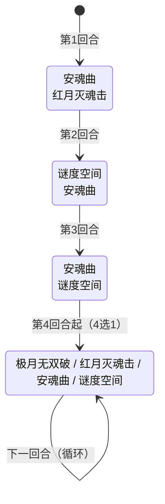

# 缪斯

## 基本信息

| 属性 | 数值 |
|---|---|
| 分类 | [Boss 怪物](/monsters/boss/) |
| 生命值 | 163 - 168 |
| 被动能力 | [天蛇之瞳](#被动能力)（每 7 张牌注视 1 张） |

## 行动逻辑

前 3 回合固定双招组合，第 4 回合起进入随机单招循环。

> **安魂曲**：接下来3次受击时令攻击者睡眠2层，天蛇之瞳阈值-1；**红月灭魂击**：21伤害+睡眠2层；**谜度空间**：全属性-1+随机9点PP流失；**极月无双破**：5伤害×(3+属性种类数)次。天蛇之瞳每7张牌注视1张（变X费），安魂曲会加速注视频率。

## 招式

### 单意图招式

| 招式 | 意图 | 描述 | 数值 |
|---|---|---|---|
| 极月无双破 | 多段攻击 | 造成 5 点伤害 3 + 属性种类数 次。你每拥有 1 种全属性提升（力量/防御/命中/速度），连击次数 +1 | 5 伤害 ×（3 + 属性种类数）次 |
| 红月灭魂击 | 攻击 | 造成 21 点伤害。你获得睡眠 2 层 | 伤害 21；睡眠 2 层 |
| 安魂曲 | 安魂曲 | 接下来 3 次受击时，令攻击者获得睡眠 2 层。天蛇之瞳的牌数限制 -1 | 受击反击 3 次 |
| 谜度空间 | 谜度空间 | 你的全属性 -1，并随机失去共 9 点 PP（未被注视的牌） | 全属性 -1；PP -9 |

### 双意图组合招式

依次执行两个单意图招式，效果与单意图完全一致。

| 招式 | 意图 1 | 意图 2 |
|---|---|---|
| 安魂曲·红月灭魂击 | 安魂曲 | 红月灭魂击 |
| 谜度空间·安魂曲 | 谜度空间 | 安魂曲 |
| 安魂曲·谜度空间 | 安魂曲 | 谜度空间 |

### 招式细节

- **极月无双破**：基础 3 次，你每拥有 1 种正值全属性提升（力量、防御、命中、速度各算 1 种），连击次数 +1，最高 7 次。
- **红月灭魂击**：造成 21 点伤害，并对目标施加睡眠 2 层。
- **安魂曲**：对自身施加安魂曲能力（计数器=3，强化类型）。受到攻击时令攻击者睡眠 2 层，受击 3 次后自动消失。同时将天蛇之瞳的牌数阈值 -1（最低 1）。
- **谜度空间**：目标全属性 -1，并随机失去共 9 点 PP（可重复作用于同一张牌，排除被注视的牌和 PP 为 0 的牌）。

## 被动能力

### 天蛇之瞳

敌人每打出 7 张牌，从其抽牌堆 + 手牌 + 弃牌堆中随机注视 1 张未被注视的牌（排除规范牌、状态牌、诅咒牌、含"不可打出"关键词的牌）。

- **注视效果**：被注视的牌费用变为 X（打出时消耗所有当前能量）。打出后清除注视、PP 清空、进入消耗牌堆。
- **阈值递减**：安魂曲每次将牌数阈值 -1（最低 1），即随战斗进行注视会越来越频繁。
- **能力类型**：不可消除（被动能力，不可被消除）。
- **显示**：能力图标上显示当前已计数牌数。战斗结束时清空注视与计数器，阈值重置为 7。

::::::: warning 本地化描述与实际效果不符
天蛇之瞳的本地化描述写"此能力存在时，敌人的睡眠状态不会因受击而消失，只会减少 1 层"，但实际效果中睡眠受到未被格挡的伤害时会直接移除整个能力，而非仅减少 1 层；天蛇之瞳能力中也无任何阻止睡眠受击消失的效果。本页相关说明以实际效果为准（即睡眠受击会立即消失）。
:::

## 遭遇战

| 遭遇战 | 房间类型 | 池子 | 数量 | 说明 |
|---|---|---|---|---|
| `SeerMuseBoss` | Boss | 第一层 | 1 只 | 单怪物 Boss，Boss 节点图标 seer_muse_boss_icon |

## 攻略要点

### 前 3 回合固定连招（关键节奏）

缪斯前 3 回合使用固定双招组合（按固定顺序链式执行），第 4 回合起进入 4 招随机循环：

| 回合 | 双招组合 | 主要威胁 |
|---|---|---|
| **第1回合** | ④安魂曲 + ③红月灭魂击 | 安魂曲反伤睡眠 + 21伤+睡眠2层 |
| **第2回合** | ⑤谜度空间 + ④安魂曲 | 全属性-1 + 9点PP流失 + 安魂曲反伤 |
| **第3回合** | ④安魂曲 + ⑤谜度空间 | 安魂曲反伤 + 全属性-1 + 9点PP流失 |
| **第4回合起** | ②③④⑤ 4选1随机（各25%） | 单招威胁 |

**前 3 回合战术**：
- 第1回合：安魂曲+红月灭魂击，21伤需格挡，**不要攻击缪斯**（安魂曲会让攻击者睡眠2层）
- 第2回合：谜度空间+安魂曲，全属性-1+9PP流失，**继续不攻击**
- 第3回合：安魂曲+谜度空间，与第2回合类似
- **前 3 回合是输出禁 window**，安魂曲存在期间攻击缪斯会被睡眠2层

### 天蛇之瞳的注视机制（核心被动）

缪斯开局自带天蛇之瞳，敌人每打出 7 张牌（阈值=7）注视 1 张牌：

**注视对象**：从你抽牌堆+手牌+弃牌堆中随机选 1 张未被注视的牌（多端同步随机选取）

**注视效果**：

1. 被注视的牌费用变为 X（消耗所有当前能量）
2. 打出后 PP 清空（如果是 PP 卡）
3. 进入消耗牌堆（不能再循环使用）

**排除的牌**：规范牌、状态牌、诅咒牌、含"不可打出"关键词的牌

**阈值递减**：安魂曲每次将阈值 -1（最低 1），随战斗进行注视越来越频繁：

| 安魂曲使用次数 | 天蛇之瞳阈值 | 注视频率 |
|---|---|---|
| 0 次 | 7 张牌 | 慢 |
| 1 次 | 6 张牌 | 较快 |
| 2 次 | 5 张牌 | 快 |
| 3 次 | 4 张牌 | 很快 |

**战术**：
- 控制出牌数节奏，避免快速触发注视
- 高费回合保留能量，避免关键牌被注视后无法打出
- 安魂曲使用越多次，注视越频繁，需尽快结束战斗

### 睡眠与天蛇之瞳联动（核心威胁）

**睡眠能力**：

1. 攻击伤害降低 **50%**
2. 受到未被格挡的伤害时**移除整个能力**（即受击一次直接解除）
3. 回合结束 -1 层

::: warning 未实现机制
天蛇之瞳的描述称"睡眠受击不消失，只 -1 层"，但源码睡眠能力在受到任何未被格挡伤害时直接移除整个能力，与层数无关；天蛇之瞳能力也未对此做任何修正。因此实际战斗中**睡眠受击会立即消失**，与本地化描述不符。本页所有战术均以实际效果为准。
:::

**战术影响**：
- 红月灭魂击给玩家 2 层睡眠：玩家攻击伤害 -50%，受击一次即消失（实际比描述更易解除）
- 安魂曲反伤给攻击者 2 层睡眠：攻击缪斯的人会被睡眠，但同样可被受击解除
- **天蛇之瞳存在期间，睡眠仍可通过受击解除**（与描述相反）

**应对**：
- 安魂曲期间不要攻击缪斯，避免被睡眠
- 被睡眠后可以**让队友或自己受一次攻击**来快速解除（实际机制）
- 用固定伤害（如固定伤害能力）绕过睡眠的 50% 减伤

### 极月无双破的属性惩罚

极月无双破基础 3 段 × 5 伤 = 15 总伤，**每拥有 1 种正值全属性提升 +1 段**：

| 正值属性种类数 | 连击段数 | 总伤害 |
|---|---|---|
| 0 种 | 3 | 15 |
| 1 种（如只+力量） | 4 | 20 |
| 2 种（如+力量+防御） | 5 | 25 |
| 3 种 | 6 | 30 |
| 4 种（全属性） | 7 | 35 |

**战术**：
- 不要同时堆多种正值属性（力量+防御+命中+速度全+会触发 7 段）
- 单一属性流（只堆力量）触发 4 段，相对安全
- 负值属性不受影响，可以将属性压成负值规避

### 谜度空间的 PP 流失

谜度空间造成**全属性 -1** + **随机失去共 9 点 PP**：

- 全属性 -1：力量/防御/命中/速度各 -1
- PP 流失：从你所有 PP 卡中随机选，**可重复作用于同一张牌**，总共扣 9 点
- **排除注视牌和 PP 为 0 的牌**（注视牌不能被打掉 PP，否则注视就白费了）

**战术**：
- PP 卡组（依赖 PP 的卡组）威胁最大，9 点 PP 流失可能瘫痪关键牌
- 注视牌不会被扣 PP，所以被注视反而是一种"PP 保护"
- 谜度空间只扣 PP 不扣血，PP 耗尽后威胁有限

### 安魂曲的反伤机制

安魂曲给缪斯自身施加：

- **受击 3 次内**，每次受攻击时令攻击者睡眠 2 层
- 受击 3 次后自动移除（计数器递减）
- 只对攻击伤害触发（非攻击伤害不触发）

**战术**：
- 安魂曲期间避免**攻击伤害**（会被睡眠2层，攻击伤害-50%），但**非攻击伤害（Power/固定伤害）不受影响**，可继续输出
- 安魂曲只对攻击伤害触发，非攻击伤害不触发反伤
- 用 Power 伤害或固定伤害绕过（如毒、固定伤害能力）
- **安魂曲不会自然消失**——重新施加会重置计数器为 3 而非叠加，只能通过受击 3 次清除
- 多人模式下可以让一个人用攻击伤害"消耗"安魂曲（被打 3 次清除），其他人用非攻击伤害输出

### 推荐策略总结

1. **前 3 回合用非攻击伤害输出**：安魂曲只对**攻击伤害**触发，非攻击伤害（Power 伤害、固定伤害能力、毒等）完全不受限。**不是"前 3 回合不攻击"，而是"用非攻击伤害输出"**。如果用攻击伤害，会被睡眠 2 层（攻击伤害 -50%）；但睡眠可被受击解除（红月灭魂击打你会解除睡眠）。前 3 回合缪斯反复使用安魂曲（计数器重置为 3），到第 4 回合安魂曲仍在场上（计数器=3），**"第 4 回合后输出"同样会触发睡眠**——除非用非攻击伤害或在第 3 回合用攻击伤害打掉 3 次清除安魂曲。

2. **控牌数避免注视**：天蛇之瞳每 7 张牌注视 1 张，控制出牌节奏。注意前 3 回合安魂曲使用 3 次后阈值已从 7 降到 4，注视频率大幅增加。

3. **被注视牌谨慎打出**：变 X 费消耗所有能量，高费回合避免被注视。注视牌打出后清除注视 + PP 清空 + 进入消耗牌堆，**本局战斗不能再使用**。

4. **避免多属性叠加**：极月无双破按属性种类数加段，单属性流更安全

5. **PP 卡组警惕谜度空间**：每次扣 9 点 PP，PP 卡组威胁大

6. **用固定伤害绕过睡眠**：睡眠 50% 减伤只对攻击伤害生效，固定伤害不受影响

7. **节奏取舍**：天蛇之瞳阈值递减（安魂曲每用一次 -1，最低1）+ 睡眠累积，越拖越难打。但有非攻击伤害手段的牌组可持久战（安魂曲不影响非攻击伤害）。**缺非攻击伤害的牌组必须速战**（否则安魂曲+睡眠+注视会压垮）；**有非攻击伤害的牌组**可稳步输出，但仍需注意注视阈值递减后关键牌被注视的风险

8. **真身血量 163~168**：相对较高，需用非攻击伤害持续输出（而非"保留爆发到第 4 回合后"——安魂曲仍在场上）

## 小贴士

- 安魂曲期间用非攻击伤害（Power伤害、毒、固定伤害）输出，避免攻击被睡眠。
- 控制出牌节奏，避免快速触发天蛇之瞳注视关键牌。

## 源码

- 怪物：`SeerMuseMonster.cs`
- 被动能力：`SeerSnakeEyePower.cs`
- 安魂曲能力：`SeerMuseRequiemPower.cs`
- 遭遇战：`SeerMuseBoss.cs`
- 本地化：`monsters.json`、`intents.json`、`powers.json`
