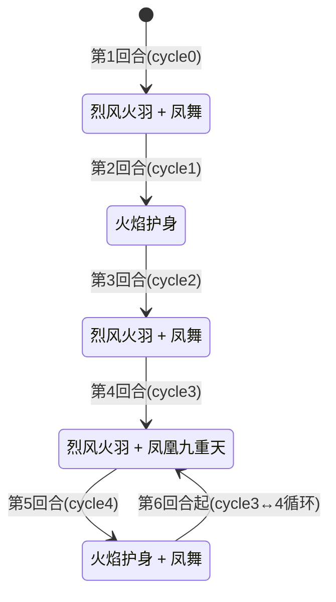

# 菲尼克斯

## 基本信息

| 属性 | 数值 |
|---|---|
| 分类 | [Boss 怪物](/monsters/boss/) |
| 生命值 | 45 - 50 |
| 被动能力 | [凤之涅槃](#被动能力)（每回合加烬翎到抽牌堆 + 无限复活 + 20 片烬翎胜利） |

## 行动逻辑

按固定循环出招，第 6 回合起在两个双招组合间交替循环：

> **烈风火羽**：自身全属性+2；**凤舞**：5伤害×4次；**火焰护身**：2层缓冲+2回合火焰光环（攻击必烧伤）；**凤凰九重天**：造成等于自身当前生命的伤害。无限复活，最大生命值每次×0.8复活+1层缓冲+1片烬翎，累计20片烬翎胜利。

## 招式

### 单意图招式（图鉴展示用）

| 招式 | 意图 | 描述 | 数值 |
|---|---|---|---|
| 烈风火羽 | 烈风火羽 | 自身全属性 +2（力量/防御/命中/速度） | 全属性 +2 |
| 凤舞 | 攻击 | 造成伤害多次 | 伤害 5 × 4 次 |
| 凤凰九重天 | 攻击 | 造成等于自身当前生命的伤害（单次） | 伤害 = 自身当前生命 |
| 火焰护身 | 增益 | 自身获得 2 层缓冲 + 2 回合火焰光环（期间攻击必让所有敌人烧伤 2 层） | 缓冲 2 层；光环 2 回合 |

### 双意图组合招式（战斗实际使用）

依次执行两个单意图招式，效果与单意图完全一致。

| 招式 | 意图 1 | 意图 2 | 触发 cycle |
|---|---|---|---|
| 烈风火羽·凤舞 | 烈风火羽 | 凤舞 | 0、2 |
| 烈风火羽·凤凰九重天 | 烈风火羽 | 凤凰九重天 | 3（循环） |
| 火焰护身·凤舞 | 火焰护身 | 凤舞 | 4（循环） |

::: warning cycle 1 是单意图
cycle 1（第 2 回合）只有火焰护身单招，不是双意图组合。
:::

### 招式细节

- **烈风火羽**：自身力量、防御、命中、速度各 +2，不造成伤害。纯增益招式，让菲尼克斯越打越强。
- **凤舞**：造成 5 点伤害 4 次（共 20 点，受力量加成）。4 段独立攻击动作。
- **凤凰九重天**：造成等于菲尼克斯**当前生命值**的伤害（单次攻击）。菲尼克斯血量越高伤害越高，血量越低伤害越低。意图显示伤害为当前生命的一半，但实际造成等于当前生命的伤害。
- **火焰护身**：获得 2 层缓冲 + 施加火焰光环（持续 2 回合）。光环期间菲尼克斯每次造成攻击伤害后，对所有敌人施加烧伤 2 层。

## 被动能力

### 凤之涅槃

菲尼克斯的核心被动，包含三个效果：

1. **每回合加烬翎**：每个怪物回合开始时，向每个敌人**抽牌堆随机位置**加入 1 张烬翎（衍生技能牌）。
2. **无限复活**：被击杀时（烬翎未达胜利条件前）阻止死亡，最大生命值降为上次的 80%（不低于 1）并满血复活，获得 1 层缓冲，再向每个敌人抽牌堆加 1 片烬翎。每次复活 最大生命值 递减，越来越容易杀死。
3. **烬翎胜利**：每次加烬翎后统计所有敌人抽牌堆+手牌+弃牌堆中的烬翎总数（不含消耗堆），累计达 20 片时设为可死亡并立即杀死菲尼克斯（玩家胜利）。

::: warning 本地化与实际不一致
本地化描述写"在其回合结束时，向你的抽牌堆中加入1张烬翎"，但实际在**怪物回合开始时**触发，而非回合结束。本页以实际行为为准。
:::

### 烬翎（衍生技能牌）

菲尼克斯向你的抽牌堆加入的特殊牌，是胜利条件的关键。

| 属性 | 数值 |
|---|---|
| 类型 | 技能牌（衍生） |
| 费用 | 0 费 |
| PP | 1 / 1 |
| 关键词 | [毁灭](/mechanics/keywords#毁灭) |

**打出效果**：抽 1 张牌，获得 2 点能量。毁灭关键词触发时清空你的消耗堆。

::: tip 烬翎可以打出，而且应该打出
烬翎是技能牌不是消耗牌——打出后进入**弃牌堆**（不是消耗堆），而弃牌堆的烬翎**仍然计入胜利条件**。打出烬翎还能抽 1 张牌、获得 2 点能量、清空消耗堆，是纯收益。唯一要注意的是烬翎 PP=1，打出后 PP 归零不可再次打出（但依然算在 20 片计数里）。
:::

- **复活期间无敌**：复活过程中受到伤害为 0、免疫能力变化、不可被攻击、阻止战斗结束。
- **能力类型**：不可消除（不被消除类效果清除，死亡后保留）。

## 遭遇战

| 遭遇战 | 房间类型 | 池子 | 数量 | 说明 |
|---|---|---|---|---|
| `SeerPhoenixBoss` | Boss | 第二层 | 1 只 | 单怪物 Boss |
| `SeerEventPhoenixEncounter` | Monster | 事件遭遇战（神兽空间·凤凰菲尼克斯/朱雀） | 1 只 | 无奖励，奖励由神兽空间系统发放 |

## 策略提示

### 先理解：菲尼克斯的三个机制陷阱（不看会输）

::: danger 陷阱 1：九重天意图显示半血，实际造成全额伤害
实际造成等于**当前生命值全额**的伤害（攻击伤害）。

但意图显示用的是当前生命值的一半，本地化描述也写"造成等于自身当前生命值**一半**的伤害"。

**意图显示的数字 ×2 才是真实伤害**。菲尼克斯 47 血时，意图显示 23，实际造成 47 点。看意图觉得安全，实际会被秒杀。
:::

::: danger 陷阱 2：击杀会满血复活——压血成果会被清零
击杀后最大生命值降为上次的 80%，当前生命值设为新最大生命值（满血复活）。

如果你把菲尼克斯从 47 压到 10 再击杀，复活后当前生命值=37（满血），等于**白压了 27 点血**。但如果你在 47 满血时击杀，复活后 37，削血 10 点（无浪费）。
:::

::: danger 陷阱 3：烧伤伤害是「每回合固定 3 点」，不是「每层 3 点」
烧伤在回合开始时造成每回合固定 **3** 点伤害（不乘层数），然后层数递减。

- 多次施加会叠加到同一实例的层数上
- 多次施加合并为一个能力，层数累加
- **层数 = 持续回合数，不是伤害倍率**

凤舞 4 段 × 光环每段施加 2 层 = 层数累加到 8。**8 层烧伤 = 持续 8 回合，每回合固定 3 点不可格挡伤害**（共 24 点伤害分摊到 8 回合），不是「每回合 24 点」。

烧伤还让持有者（玩家，不是菲尼克斯）的**攻击伤害固定 -1**（每次攻击 -1，与层数无关），非攻击伤害不受影响。
:::

### 核心取舍：不是"主动击杀 vs 被动等待"，而是多个矛盾目标的权衡

菲尼克斯战斗的本质是**三个互相牵制的目标**之间的取舍，没有标准答案，必须根据牌组能力选择：

| 目标 | 如何推进 | 代价 |
|---|---|---|
| **降九重天伤害** | 压低 CurrentHp（九重天=CurrentHp） | 不推进烬翎，属性持续累积 |
| **降 最大生命值 上限** | 击杀（最大生命值×0.8） | CurrentHp 满血复活（清零压血成果） |
| **加速烬翎胜利** | 击杀（+1烬翎）+ 被动（+1/回合） | 击杀需爆发，被动需存活 |

**关键矛盾**：压血让九重天弱（CurrentHp低），但击杀会让CurrentHp满血复活（九重天回到最大生命值）。你不能同时"CurrentHp低"和"已击杀"。

#### 取舍 A：压血 vs 击杀（每回合的战术选择）

**压血的价值**：降低**下一次九重天**（cycle 3 回合）的伤害。九重天在 cycle 3（第4、6、8...回合）出现，压血在 cycle 3 前一回合（cycle 2 或 cycle 4）最有价值。

**击杀的价值**：+1 烬翎 + 最大生命值 降低（下次满血九重天上限降低）。

**关键**：压血和击杀**可以同一回合做**——先输出压血，如果伤害足够再继续输出击杀。但击杀后CurrentHp满血，等于压血成果被清零。

**取舍判断**：
- **下回合是九重天（cycle 3）**：压血有价值（降低即将到来的九重天伤害）。如果压血后能击杀更好（最大生命值降+烬翎+1），但击杀后满血=新最大生命值（已降低）
- **下回合不是九重天（cycle 0/1/2/4）**：压血价值低（没有九重天要降），不如直接输出击杀推进烬翎

#### 取舍 B：满血击杀 vs 残血击杀（击杀时机的选择）

| 击杀时 CurrentHp | 复活后 最大生命值 | 复活后 CurrentHp | "浪费"的压血 |
|---|---|---|---|
| 47（满血） | 37 | 37 | 0（无浪费） |
| 30 | 37 | 37 | 17（30→37 回血） |
| 10 | 37 | 37 | 27（10→37 回血） |

- **满血击杀**：无浪费，但需要高爆发（47血一回合击杀）
- **残血击杀**：容易（10血即可），但复活后回血27点（等于白压了27血）
- **取舍**：如果牌组爆发足够，满血击杀最优；如果爆发不足，残血击杀仍比不击杀好（+1烬翎+最大生命值降，虽然回血但最大生命值已降）

#### 取舍 C：前期击杀 vs 后期击杀（击杀节奏的选择）

烈风火羽每 cycle +2 全属性，属性累积**不因击杀重置**（cycle 只按回合推进，与击杀无关）。

| 回合 | cycle | 招式 | 力量 | 凤舞/九重天威胁 |
|---|---|---|---|---|
| 1 | 0 | 烈风火羽+凤舞 | +2→2 | 凤舞 (5+2)×4=28 |
| 2 | 1 | 火焰护身（无攻击） | 2 | 无攻击，但获得缓冲+光环 |
| 3 | 2 | 烈风火羽+凤舞 | +2→4 | 凤舞 (5+4)×4=36 |
| 4 | 3 | 烈风火羽+九重天 | +2→6 | **九重天=CurrentHp（满血47→47伤）** |
| 5 | 4 | 火焰护身+凤舞 | 6 | 凤舞 (5+6)×4=44 + 烧伤8层 |
| 6 | 3 | 烈风火羽+九重天 | +2→8 | 九重天=CurrentHp |
| 7 | 4 | 火焰护身+凤舞 | 8 | 凤舞 (5+8)×4=52 + 烧伤8层 |
| 8 | 3 | 烈风火羽+九重天 | +2→10 | 九重天=CurrentHp |
| 9 | 4 | 火焰护身+凤舞 | 10 | 凤舞 (5+10)×4=60 + 烧伤8层 |

- **前期击杀**（1-3回合）：最大生命值高（47→37→29→23），每次削血多。但需要强爆发击杀47血
- **后期击杀**（6+回合）：最大生命值已降低（如果之前击杀过），每次削血少（如18→14仅削4）。但力量累积高，凤舞威胁大
- **取舍**：前期击杀削血效率高但爆发要求高；后期击杀削血效率低但爆发要求低。**爆发牌组前期击杀，续航牌组后期击杀**

### 烬翎累积速度：决定战斗节奏的硬指标

烬翎达 20 片（抽牌堆+手牌+弃牌堆，不含消耗堆）时自动胜利。检测在怪物回合开始时触发。

| 玩家数 | 被动烬翎速度 | 击杀烬翎速度 | 纯被动需回合 | 每次击杀省回合 |
|---|---|---|---|---|
| 单人 | +1/回合 | +1/次 | 20 回合 | 1 回合 |
| 双人 | +2/回合（每人+1） | +2/次（每人+1） | 10 回合 | 0.5 回合 |

- **单人**：被动等待20回合几乎不可能（第9回合凤舞60伤+烧伤24/回合），必须靠击杀加速
- **双人**：被动等待10回合相对可行（但仍需扛住第9回合凤舞52伤），击杀可缩短到5-6回合

### 三条路线（按牌组能力选择，不是一概而论）

#### 路线 A：爆发击杀流（每回合 40+ 伤的牌组）

**适用条件**：牌组能在 cycle 0-2（前3回合，无九重天）期间将菲尼克斯从满血击杀，且能格挡 37 伤九重天。

**核心思路**：利用 cycle 0-2 的无九重天窗口全力击杀。每次击杀 最大生命值 ×0.8，九重天满血伤害同步递减。

| 击杀次数 | 复活后 最大生命值 | 满血九重天 | 累计烬翎（单人） |
|---|---|---|---|
| 0（初始） | 47 | 47 | 0 |
| 1 | 37 | 37 | 1 |
| 2 | 29 | 29 | 2 |
| 3 | 23 | 23 | 3 |
| 4 | 18 | 18 | 4 |
| 5 | 14 | 14 | 5 |

- 单人：10次击杀+10回合被动=20片，约10回合结束
- 双人：5次击杀+5回合被动=20片，约5回合结束
- **前期最危险**：前3次击杀需扛37-47伤九重天
- **后期轻松**：最大生命值降到14以下，九重天14伤可承受

#### 路线 B：压血苟活流（格挡/回血/净化强的牌组，缺乏爆发）

**适用条件**：牌组无法一回合击杀47血，但有强力格挡、回血、净化烧伤手段。

**核心思路**：**只压血不击杀**——把 CurrentHp 压到 10-15，让九重天仅造成 10-15 伤。烬翎靠被动累积。

- 单人需20回合被动烬翎——**几乎不可能**（第9回合凤舞60伤+烧伤24/回合）
- 双人需10回合——相对可行，但第9回合凤舞52伤仍是威胁
- **关键限制**：必须持续净化烧伤（cycle 4 每2回合8层烧伤=24点/回合不可格挡）+ 扛住凤舞递增伤害

::: warning 被动等待有极限，不是"安全无限拖"
被动等待不是万能策略。第9回合凤舞60伤+烧伤24/回合，第11回合凤舞68伤。单人被动等待20回合几乎不可能（凤舞100+伤）。双人被动等待10回合相对可行但仍有风险。
:::

#### 路线 C：混合流（多数牌组的实际选择）

**适用条件**：牌组有中等爆发（能打 20-30 伤/回合）+ 一定格挡能力。

**核心思路**：前期压血苟活（避免满血九重天秒杀），中后期转击杀加速烬翎。

1. **前3回合（cycle 0-2）压血到 20 以下**：没有九重天，安全输出窗口。压到20血后，第4回合九重天仅20伤（意图显示10，实际20）
2. **第4-5回合**：第4回合九重天仅20伤可承受。第5回合火焰护身+凤舞，需格挡44伤+净化烧伤
3. **第6回合起转击杀**：此时 CurrentHp 低位（如10-15），击杀容易。虽然复活后满血（回血），但 最大生命值 降低+1烬翎，且力量持续累积必须加速结束
4. **注意**：转击杀时会满血复活，九重天回到最大生命值。但此时最大生命值已因前几次击杀降低

### 九重天应对细节

1. **意图显示半血，实际满血**：意图显示的是当前生命值的一半，实际造成的是当前生命值全额（攻击伤害）。看意图时 **×2** 才是真实威胁
2. **九重天是单体攻击**：九重天是攻击伤害，只打当前目标，双人模式另一人不受九重天伤害
3. **每 2 回合一次（第 4 回合起）**：cycle 3↔4 交替，九重天在奇数 cycle 3 回合（第 4、6、8...回合）
4. **格挡可挡九重天**：九重天是攻击伤害，可被格挡、受力量/易伤影响
5. **击杀不推进 cycle**：cycle 只在每个招式执行时推进，击杀/复活不影响 cycle 进程。无法通过击杀跳过九重天回合

### 火焰护身与烧伤管理

- **cycle 1（第 2 回合）**：火焰护身获得 2 层缓冲 + 2 回合火焰光环。无攻击，但此后光环期间菲尼克斯攻击必烧伤
- **光环持续 2 回合**：每回合层数 -1，归零后移除。第 2 回合施加（层数=2），第 3 回合开始 -1=1，第 4 回合开始 -1=0 移除
- **cycle 4（第 5、7、9 回合）火焰护身+凤舞**：凤舞 4 段攻击 × 光环（每次命中施加 2 层烧伤）= **8 层烧伤叠加**。多次施加会叠加到同一实例的层数上
- **烧伤伤害计算**：烧伤每回合开始固定自伤 **3 点**不可格挡伤害（不乘层数），结算后 -1 层。8 层烧伤 = 持续 8 个回合、每回合 3 点，总伤害 24 点。烧伤还让持有者攻击伤害固定 -1
- **烧伤不是每层独立结算**：烧伤是单个实例，层数=8 表示持续 8 回合，每回合造成固定 3 点伤害。不是 8 个独立实例各 3 点（那会是 24 点/回合）
- **必须准备净化烧伤手段**：8 层烧伤不净化 = 持续 8 回合每回合 3 点不可格挡伤害。若光环还在，下轮凤舞再叠 8 层 = 16 层（持续 16 回合每回合 3 点 = 48 点总伤害）

### 烬翎牌管理——打出 vs 保留的取舍

烬翎是 0 费技能牌，PP=1，打出后抽 1 牌 + 2 能量 + 毁灭关键词清空消耗堆。

**打出的收益**：
- 抽 1 张牌（加速过牌）
- 获得 2 点能量（资源补充）
- 打出后进**弃牌堆**（不是消耗堆），弃牌堆的烬翎仍算计数，**打出不影响胜利进度**

**打出的代价（毁灭副作用）**：
- 毁灭关键词触发时清空**你的消耗堆**
- 对依赖消耗堆的牌组（如消耗流、回收流）是**负面副作用**——清空消耗堆会丢失已消耗的关键牌
- 对不依赖消耗堆的牌组无影响

**PP 机制**：
- 打出后 PP 归零，PP 检查大于 0 才可打出，PP=0 后不可再打出
- 但仍在弃牌堆计数，不影响胜利进度

**取舍判断**：
- **不依赖消耗堆的牌组**：果断打出（纯收益：抽牌+能量，不影响计数）
- **依赖消耗堆的牌组**：谨慎打出。如果消耗堆里有关键牌（如消耗回收的目标），打出烬翎会清空它。可以考虑不打烬翎（留手里占位但保住消耗堆），或在消耗堆空时打出
- **手牌已满**：打出烬翎腾出手牌位 + 抽牌，优于保留

### 复活缓冲破盾

- 每次复活获得 1 层缓冲。缓冲 = 下次受到的伤害固定为 0，然后消耗 1 层
- **多段低伤牌是最佳破盾+输出手段**：4 段凤舞级伤害牌可 1 段破缓冲 + 3 段输出
- 若牌组缺乏多段伤害，击杀节奏变慢——这也是路线选择的考量因素之一

### 烬翎胜利检测时机

检测在**怪物回合开始时**触发：
1. 向每个敌人抽牌堆 +1 张烬翎
2. 统计所有敌人的抽牌堆+手牌+弃牌堆烬翎总数（不含消耗堆）
3. 达 20 片时设为可死亡并直接击杀（绕过复活，玩家胜利）

所以**不需要在玩家回合内打出 20 片烬翎**——怪物回合开始时烬翎 ≥ 20 即自动胜利。玩家回合击杀 → 复活 +1 片 → 怪物回合开始 +1 片 + 检测。

### 双人模式差异

- **烬翎累积翻倍**：被动和复活都是每人 +1 片，所以双人烬翎速度 ×2
- **被动等待 10 回合可达 20 片**（每人 10 片），比单人 20 回合可行得多
- **九重天只打一个目标**：九重天是攻击伤害，单体，另一人不受伤害。可轮流扛九重天
- **凤舞 4 段也只打当前目标**：双人可分担伤害

### 路线选择速查

| 牌组特征 | 推荐路线 | 理由 |
|---|---|---|
| 每回合 30+ 伤 + 有格挡 | 路线 A（满血击杀）| 快速削 最大生命值 + 烬翎，前期扛住后期轻松 |
| 爆发不足 + 强格挡/回血/净化 | 路线 B（压血苟活）| 压血降九重天，被动烬翎。双人更可行 |
| 中等爆发 + 中等格挡 | 路线 C（混合流）| 前期压血苟活，后期转击杀加速 |
| 无格挡无爆发 | 几乎必败 | 菲尼克斯机制要求要么扛九重天要么快速结束，两者都做不到无法赢 |

## 源码

- 怪物：`SeerPhoenixMonster.cs`
- 被动能力：`SeerPhoenixNirvanaPower.cs`
- 火焰光环：`SeerPhoenixFireAuraPower.cs`
- 烬翎卡牌：`SeerPhoenixFeatherCard.cs`
- 遭遇战：`SeerPhoenixBoss.cs`、`SeerEventPhoenixEncounter.cs`
- 本地化：`monsters.json`、`intents.json`、`powers.json`
