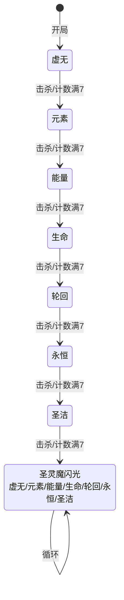
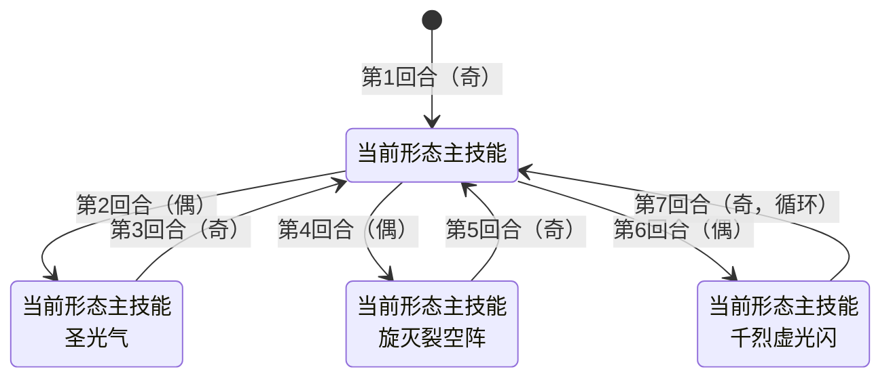

# 谱尼（Puni）

> **类型**：BOSS  
> **初始生命**：222  
> **遭遇战**：第三层（Glory）最终Boss · 圣灵领域（单怪）  
> **特性**：七形态变身 + 多阶段复活 + 最终真身觉醒

## 被动能力（开局自带）

| 名称 | 类型 | 效果 |
|------|------|------|
| **圣灵化身**（对所有玩家施加） | 能力（不可消除） | 你的回合结束时，未打出的手牌（不含保留牌）返回抽牌堆底部，而非进入弃牌堆 |
| **圣灵计数**（谱尼自身） | 能力（不可消除） | 圣灵牌每次改变位置时计数+1，达到7时清零，强制切换到下一形态 |
| **形态阶段**（谱尼自身） | 能力（不可消除） | 记录当前形态：0=虚无，1=元素，2=能量，3=生命，4=轮回，5=永恒，6=圣洁，7=真身 |
| **圣灵重生**（谱尼自身） | 能力（不可消除） | 被击杀时不会死亡，立刻进入下一形态并回满血，最大生命值永久+77（圣灵计数不清零） |

## 形态切换机制

- 谱尼共**7种基础形态**，按固定顺序依次切换：**虚无 → 元素 → 能量 → 生命 → 轮回 → 永恒 → 圣洁**
- 触发切换条件：
  1. **圣灵迭印**：圣灵牌被打出/弃掉/消耗/抽到时计数+1，积满7触发切换
  2. **被击杀**：血量归零时自动进入下一形态，同时触发圣灵重生
- 每次切换形态：**最大生命值+77，当前生命值回满**，屏幕中央显示对应形态的金色双字横幅
- 七形态全部击破后，进入**最终真身阶段**：最大生命再次+77并回满，此形态不再切换

## 行动逻辑

每个形态内的出招规则一致：**奇数回合**只放当前形态主技能，**偶数回合**放当前形态主技能+一个副技能（副技能按固定顺序轮换）。七形态全部击破后进入真身阶段，每回合放圣灵魔闪光+随机一个主技能。

**形态切换路线**：

> 每次切换形态：最大生命值 +77，当前生命值回满。七形态全部击破后进入真身阶段，每回合圣灵魔闪光+随机一个七形态主技能。

**形态内出招规律**（奇数回合单主技能，偶数回合主技能+副技能，副技能轮换）：

> 副技能按「圣光气 → 旋灭裂空阵 → 千烈虚光闪」顺序轮换，偶数回合附加使用。

## 招式表

### 七形态主技能

| 形态 | 招式名 | 类型 | 效果 |
|------|--------|------|------|
| **虚无** | 虚无 | 增益 | 自身获得 **3层缓冲** |
| **元素** | 元素 | 能力（固定伤害） | 对所有敌方目标附加 **25点固定伤害**（非直接伤害，受固定伤害免疫影响） |
| **能量** | 能量 | 增益 | 自身获得 **3层能量反弹**：接下来3次受到伤害时，以2倍伤害反弹给攻击者 |
| **生命** | 生命 | 自身强化 | 自身**最大生命值+15%**（当前生命值不恢复） |
| **轮回** | 轮回 | 恢复+削弱 | 自身回满生命；随机使敌方牌组中PP卡共损失 **20点PP**（优先消耗仍有PP的牌） |
| **永恒** | 永恒 | 防御+牌组干扰 | 自身获得 **75点格挡**；向敌方抽牌堆顶加入 **1张**圣逝 |
| **圣洁** | 圣洁 | 增益+驱散 | 1. 自身所有正面Buff层数翻倍（叠加等量层数） 2. 清除自身所有负面Debuff 3. 所有敌人的负面Debuff层数翻倍 4. 清除所有敌人的正面Buff |

### 副技能（偶数回合附加使用，按顺序轮换）

| 顺序 | 招式名 | 类型 | 效果 |
|------|--------|------|------|
| 1 | **圣光气** | 增益+削弱 | 1. 自身下次攻击**必定暴击** 2. 自身力量/防御/命中/速度 **全属性+2** 3. 所有敌人力量/防御/命中/速度 **全属性-2** 4. 向敌方弃牌堆顶加入 **2张**圣灵 |
| 2 | **旋灭裂空阵** | 攻击 | 对目标造成 **4次×8点** 伤害（共32点，单次攻击动画） |
| 3 | **千烈虚光闪** | 攻击 | 对目标造成 **40点** 伤害 |

### 真身阶段专属

| 招式名 | 类型 | 效果 |
|--------|------|------|
| **圣灵魔闪光** | 攻击+斩杀 | 对每个敌方目标： 1. 造成 **目标最大生命值 ÷ y** 点伤害（受力量/易伤影响） 2. 若目标当前生命值 **< x**，直接斩杀  **x = 敌方抽牌堆当前牌数** **y = 敌方手牌+抽牌堆+弃牌堆中的**圣灵**牌总数**（最少为1） |
| 随机七形态主技能 | — | 随机使用虚无/元素/能量/生命/轮回/永恒/圣洁中的一个主技能 |

## 特殊卡牌机制

| 卡牌 | 类型 | 来源 | 效果 |
|------|------|------|------|
| **圣灵** | 衍生 | 圣光气加入弃牌堆 | 每次这张牌改变位置（抽到/打出/弃掉/消耗）时，谱尼圣灵计数+1 |
| **圣逝** | 诅咒 | 永恒形态加入抽牌堆 | 无法被打出，回合结束时如果在手牌，对自身造成高额伤害 |

## 策略提示

1. **圣灵牌节奏——七形态阶段的核心取舍**：圣灵牌每次改变位置（抽到/打出/弃掉/消耗）都让谱尼圣灵计数+1，满 7 切换形态并回满血+77 最大生命。

   **关键取舍：消耗 vs 保留圣灵牌**
   - **消耗圣灵牌**：计数+1 一次后停止（牌进消耗堆不再循环）→ 切换形态**变慢** → 谱尼少回血+少 最大生命值 增长。但**消耗的牌在真身阶段也不在 y（圣灵牌总数）中** → 真身圣灵魔闪光伤害升高
   - **保留圣灵牌**（不消耗，留在牌堆中循环）→ 切换形态**变快** → 谱尼多回血+多 最大生命值 增长。但真身阶段 y 大 → 圣灵魔闪光伤害低

   **注意：圣灵化身会在回合结束时被动将手中的圣灵牌移回抽牌堆**，即使"不动"手中的圣灵牌也会触发计数+1。手中的圣灵牌每回合自动+1，抽牌堆/弃牌堆的圣灵牌在抽到/弃掉时+1。只有消耗堆的圣灵牌不再移动。

   **按当前形态危险度决定**（不是一概而论）：
   - **危险形态**（能量 2 倍反弹、圣洁翻倍负面、轮回扣 PP）→ **不消耗，快速计数切换走**。切换虽让谱尼回满血+77，但留在危险形态更致命
   - **安全形态**（虚无 3 层缓冲）→ **可消耗，拖在安全形态**。但要知道消耗的牌在真身阶段不在 y 中
   - **如果选择主动击杀推进**（见策略 #8），则不需要管圣灵牌节奏——每次击杀直接推进 1 形态

   **真身阶段策略反转**——绝对不要打出/消耗圣灵牌，保留在手里或弃牌堆增大 y 降低伤害（详见策略 #7）

2. **奇数回合是输出窗口**：奇数回合谱尼只放主技能，偶数回合同时放主+副技能，奇数回合压力小一半。爆发伤害尽量压在奇数回合

3. **七形态顺序固定但应对各异**：虚无→元素→能量→生命→轮回→永恒→圣洁。
   - **虚无**（3层缓冲）：缓冲会吸收伤害，等缓冲消失后再输出
   - **元素**（25固伤）：固伤不受格挡影响，需回血手段
   - **能量**（2倍反弹3次）：**这段时间绝对不能攻击谱尼**，否则2倍反弹会自杀！用非攻击伤害（Power/固定伤害）绕过
   - **生命**（+15% 最大生命值）：越早击杀越好，否则最大生命值滚雪球
   - **轮回**（回满血+扣20 PP）：轮回前把关键 PP 用掉比留着更划算
   - **永恒**（75格挡+加圣逝）：格挡会挡掉大量伤害，圣逝诅咒牌会干扰牌堆
   - **圣洁**（翻倍负面Debuff/清正面Buff）：圣洁前必须主动清除自身负面

4. **副技能轮换是全局计数器，不可预测**：偶数回合副技能按 圣光气 → 旋灭裂空阵 → 千烈虚光闪 顺序轮换，但 `_subMoveIndex` 是**全局计数器跨形态延续**，不会在形态切换时重置。无法在不追踪全局计数的情况下预测下一个偶数回合是哪个副技能——不要假设"每形态重新开始轮换"。圣光气回合谱尼自身全属性+2、下次必定暴击，且你全属性-2、弃牌堆多 2 张圣灵牌，是压力最大的一回合

5. **圣洁前清负面、用正面**：圣洁会翻倍你身上的负面 Debuff（如虚弱 3 层→6 层）、清除你所有正面 Buff。圣洁前必须主动清除自身负面、把依赖正面 Buff 的牌打出去

6. **轮回扣 PP 优先扣满 PP 牌**：轮回从你所有 PP 卡中随机扣共 20 点 PP，每次优先扣仍有 PP 的牌。轮回前把关键 PP 用掉比留着更划算（留着只会被扣）

7. **真身阶段保留圣灵牌、压缩抽牌堆**：圣灵魔闪光每回合触发——伤害=你最大生命÷圣灵牌总数（y，仅含手牌+抽牌堆+弃牌堆，**不含已消耗的圣灵牌**），斩杀条件=你抽牌堆牌数（x，当前生命<x 直接死）。所以真身阶段**绝对不要打出圣灵牌**（进消耗堆后 y 减少、伤害飙升），同时压缩抽牌堆降低 x。圣灵牌留手里或弃牌堆里都算 y，安全。**注意真身阶段随机主技能可能抽中轮回/圣洁等危险技能**，需保持警惕。

8. **七形态阶段用稳定输出主动击杀推进**：七形态阶段谱尼被击杀会立即进下一形态满血复活（最大生命+77），但**这是推进到真身阶段的高效方式**——每次击杀推进 1 形态，且圣灵计数不清零（继承进度）。不要交爆发牌（复活等于白打），但用**稳定输出**主动击杀 7 次快速推进到真身阶段。被动等待计数满 7 需要 49 次圣灵牌移动，极度缓慢。真身阶段不再复活，可以真正击杀——此时交爆发牌速杀。**复活期间有无敌窗口**（伤害为0、不可被攻击、免疫Power变化），需等待复活动画结束再输出。
