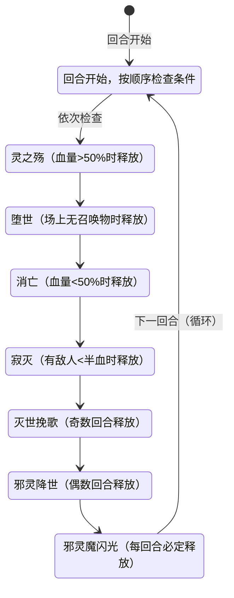

# 索伦森（Soulson）

> **类型**：BOSS  
> **生命值**：777  
> **遭遇战**：第三层（Glory）最终Boss · 混沌降临（单怪+可召唤最多2只小怪）  
> **特性**：七技能连段释放 + 混沌能量机制 + 复活召唤 + 牌组污染

## 被动能力（开局自带）

| 名称 | 类型 | 效果 |
|------|------|------|
| **混沌化身**（对所有玩家施加） | 能力（不可消除） | 你的能量不足时仍可打出卡牌，**超额部分扣等量最大生命**（如 1 能量打 3 费牌：能量-1、最大生命-2；费用≤能量时不扣最大生命） |
| **混沌迭印**（索伦森自身） | 能力（不可消除） | 混沌牌每次改变位置时计数+1；灵之殇一次加10层。计数**不清零**，每跨越7的倍数（6→7、13→14、20→21...）时，使你获得 **1层双倍消耗**（下一张牌耗能×2，打出后移除） |
| **堕世**（索伦森自身） | 增益（堕世技能施加，限时2回合） | 施加后2回合内，索伦森被击杀时会**立刻满血复活** |

::: warning ⚠️ 本地化描述不准确
- **混沌化身**的本地化描述写"你的能量为0时，仍可打出卡牌，消耗等量最大生命值"，但实际逻辑是：当**卡牌费用 > 当前能量**时（即能量不足，不限于能量为0），允许打出，并扣除**超额部分**（费用 - 当前能量）的最大生命。例如 1 能量打 3 费牌：能量归零（消耗1点），最大生命 -2（超额2点）。本页以实际效果为准。
- **混沌迭印**在源码内部称为"混沌计数"，但游戏内显示名称为"混沌迭印"。本页以本地化显示名称为准。
- **堕世**在源码内部称为"堕世复活"，但游戏内显示名称为"堕世"。本页以本地化显示名称为准。
:::

## 行动逻辑

索伦森的行动模式与谱尼完全不同——**每回合按编号顺序检查①~⑦七个技能，只要条件满足就全部释放**，不是随机选一个。

### 技能释放条件

| 编号 | 技能名 | 释放条件 |
|------|--------|----------|
| ① | **灵之殇** | 索伦森当前血量 > 50%（满血必定放） |
| ② | **堕世** | 场上没有索伦森召唤的小怪（第一回合必定放） |
| ③ | **消亡** | 索伦森当前血量 < 50%（半血后必定放） |
| ④ | **寂灭** | 任意敌方目标血量 < 50% |
| ⑤ | **灭世挽歌** | 当前是索伦森的**奇数回合**（第1、3、5...回合） |
| ⑥ | **邪灵降世** | 当前是索伦森的**偶数回合**（第2、4、6...回合） |
| ⑦ | **邪灵魔闪光** | **无任何条件，每回合必定释放** |

索伦森每回合按顺序依次检查 7 个技能，**满足条件的全部释放**（中后期一回合可能放 3~5 个技能）。只有⑦邪灵魔闪光是每回合必定释放。

> **灵之殇**（血量>50%）：16伤害+先制+1+混沌迭印+10+弃牌堆+1混沌牌；**堕世**（场上无召唤物）：2回合复活Buff+召唤1只随机小怪（最多2只）；**消亡**（血量<50%）：全属性-3+5层消亡+弃牌堆+1混沌牌；**寂灭**（有敌人<半血）：18伤害+目标已损HP15%固定伤害；**灭世挽歌**（奇数回合）：5伤害×5次+弃牌堆+1随机诅咒；**邪灵降世**（偶数回合）：清敌人正面Buff+清自身Debuff+抽牌堆+1张芜；**邪灵魔闪光**（每回合必定）：20伤害+敌人损失混沌÷10最大生命。混沌牌每改变位置混沌迭印+1，7倍数给玩家1层双倍消耗。

## 召唤物系统

- 索伦森通过**堕世**技能召唤小怪，最多同时存在 **2只**（遭遇战预留summon1/summon2两个槽位）
- 召唤池为**29种普通非精英非Boss怪物**（皮皮、安妮、比比鼠、仙人掌、布鲁克、吉尔、加布、猛虎王、摩哥斯、尼尔、史莱姆、史莱姆国王、史莱姆王子、攻击史莱姆、防御史莱姆、速度史莱姆、体力史莱姆、暴君史莱姆、狄修斯、斗神瑞尔斯、魔花仙子、泰勒斯、天雷鼠、斯普林特、萨克森、斯嘟尔、泰沃斯、特兰西、坤格）
- 所有召唤物带有**仆从（Minion）**标记，索伦森存活时仆从死亡不会复活
- 只要场上还有至少1只仆从，**堕世**就不会再次释放

## 招式表

所有技能按顺序释放，满足条件的全部打出来，一场战斗中后期索伦森每回合可能同时放3~5个技能。

| 编号 | 招式名 | 类型 | 效果 |
|------|--------|------|------|
| ① | **灵之殇** | 攻击+先制+叠层 | 1. 对目标造成 **16点伤害** 2. 自身获得 **1层先制** 3. 混沌迭印 **+10** 4. 向敌方弃牌堆顶加入 **1张[混沌牌]** |
| ② | **堕世** | 复活+召唤 | 1. 自身获得 **堕世**（2回合内死亡则满血复活） 2. 从29种普通怪中随机召唤 **1只小怪**（带仆从标记） |
| ③ | **消亡** | 全属性削弱+消亡debuff | 对所有敌方目标： 1. 力量/防御/命中/速度 **全属性-3** 2. 施加 **5层消亡**（回合结束时受到层数点伤害，不可格挡、不受力量影响） 3. 向敌方弃牌堆顶加入 **1张[混沌牌]** |
| ④ | **寂灭** | 攻击+百分比伤害 | 对所有敌方目标： 1. 造成 **18点伤害**（受力量/易伤影响） 2. 附加 **目标已损失生命值×15%** 的固定伤害（不受力量/易伤影响，下回合开始时结算） |
| ⑤ | **灭世挽歌** | 多段攻击+牌组污染 | 1. 对目标造成 **5次×5点** 伤害（共25点，单次攻击动画） 2. 向敌方弃牌堆顶加入 **1张随机Seer模组诅咒牌**（从seer诅咒池随机） |
| ⑥ | **邪灵降世** | 驱散+牌组污染 | 1. 清除**所有敌人的正面Buff** 2. 清除**索伦森自身所有负面Debuff** 3. 向敌方抽牌堆顶加入 **1张**芜**** |
| ⑦ | **邪灵魔闪光** | 攻击+最大生命损失 | 对所有敌方目标： 1. 造成 **20点伤害** 2. 使目标损失 **混沌迭印÷10（向下取整）** 点最大生命值（永久生命上限降低） |

## 特殊卡牌机制

| 卡牌 | 类型 | 来源 | 效果 |
|------|------|------|------|
| [混沌牌] | 衍生 | 灵之殇、消亡加入弃牌堆 | 每次这张牌改变位置（抽到/打出/弃掉/消耗）时，索伦森混沌迭印+1 |
| **芜** | 诅咒 | 邪灵降世加入抽牌堆 | 无法被打出，占手牌位置，所有牌堆累积 5 张时直接死亡 |
| 随机Seer诅咒 | 诅咒 | 灭世挽歌加入弃牌堆 | 从Seer模组诅咒牌池随机1张（如各种削弱、烧牌、伤害类诅咒） |

## 各回合典型连段参考

| 回合 | 索伦森血量 | 敌方血量 | 释放技能 | 说明 |
|------|------------|----------|----------|------|
| 第1回合（奇数） | 100% | 100% | ①灵之殇 → ②堕世 → ⑤灭世挽歌 → ⑦邪灵魔闪光 | 开局4连，先召唤小怪 |
| 第2回合（偶数） | 100% | 100%（满血） | ①灵之殇 → ⑥邪灵降世 → ⑦邪灵魔闪光 | 驱散你的Buff，塞芜进抽牌堆 |
| 半血后（血量<50%） | <50% | 有<半血目标 | ③消亡 → ④寂灭 → ⑤/⑥ → ⑦邪灵魔闪光 | 半血后灵之殇停止，消亡上线，压力陡增 |
| 混沌叠高后（≥20层） | — | — | 所有满足条件技能 → ⑦邪灵魔闪光 | 此时邪灵魔闪光额外削2点上限，双倍消耗叠多层 |

## 策略提示

1. **第一回合必召唤小怪——但不要清掉召唤物**：开局索伦森血量>50%（必放①灵之殇）+ 场上无召唤物（必放②堕世）+ 奇数回合（必放⑤灭世挽歌）+ 必放⑦邪灵魔闪光，第一回合就是 4 连。**关键：清掉召唤物反而有害**——堕世检查场上是否有带仆从标记的友军，清掉后条件不再满足，下回合 ②堕世会**再次触发**，给索伦森额外 2 回合复活 Buff + 新召唤物。正确策略是**保留召唤物不杀**，让堕世不再触发，集中火力打索伦森本体。只有当召唤物威胁过大时才考虑清除。

2. **半血是分水岭——但"尽快压半血"不是一概而论**：半血前①灵之殇每回合 **+10 混沌**（主增长源）+ 16 伤；半血后①停止，③消亡（全属性-3+5 消亡+塞混沌牌）+ ④寂灭（18 伤+**15%已损HP固定伤害**）上线。

   **压半血的取舍**：
   - **收益**：灵之殇停止，混沌增长从 +10/回合降到消亡塞牌的 +1/次位置变化
   - **代价**：③消亡全属性-3 + 5 消亡（回合结束不可格挡伤害）+ ④寂灭固定伤害。索伦森 777 血半血时已损 388，寂灭固定伤害 = 15%×388 ≈ **58 点固定伤害**。残血时更高（100 血时已损 677，固定伤害 101）

   **半血前 vs 半血后对比**：
   | 阶段 | 每回合攻击威胁 | 混沌增长 | 削上限 |
   |---|---|---|---|
   | 半血前 | ①16伤+先制 + ⑤25伤/⑥清Buff | +10/回合（灵之殇） | 混沌20层后 2点/回合 |
   | 半血后 | ③消亡+④寂灭 76伤/回合 | +1/次（消亡塞牌位置变化） | 大幅降低 |

   **路线选择（不是一概而论）**：
   - **速杀流（5-7 回合能击杀）**：不主动压半血，保持灵之殇阶段。灵之殇 16 伤/回合远比寂灭 76 伤/回合安全。混沌累积 5-7 回合约 50-70 层，削上限 5-7 点，可承受
   - **消耗流（10+ 回合）**：尽早压半血停止 +10 混沌/回合。否则 10 回合后混沌 100+ 层，每次邪灵魔闪光削 10+ 点 最大生命值，加上灵之殇持续 16 伤/回合，长期消耗会崩盘。但压半血后需扛住 76 伤/回合

   **关键**：不要"自然打到半血"——要么主动速杀避免触发半血，要么主动压半血控制混沌。最差的是打到 51% 血然后不继续压——此时灵之殇还在（+10 混沌），却没有触发寂灭的代价但也快了

3. **奇偶回合应对不同**：奇数回合吃⑤灭世挽歌（5×5 多段+塞随机诅咒到弃牌堆），偶数回合吃⑥邪灵降世（清你正面 Buff+清索伦森自身负面+塞芜到抽牌堆顶）。奇数回合开格挡挡多段、偶数回合身上不要留重要 Buff

4. **混沌牌是保留牌，无法消耗**：混沌牌带保留关键词，回合结束不弃留在手里。每次位置变化（抽到/打出/弃掉）都给索伦森混沌迭印+1，每跨越 7 的倍数（7→14→21...）给你 1 层双倍消耗（下一张牌耗能×2）。混沌迭印不清零，越拖越痛。**注意取舍**：①灵之殇每回合 +10 混沌是主增长源（半血前），混沌牌位置变化的 +1/次是次要的。但①只存在于半血前——如果走速杀流（不压半血），需接受 +10 混沌/回合但攻击威胁低；如果走消耗流（压半血），①停止但攻击威胁高（76 伤/回合）。混沌牌留手里可避免位置变化计数，但占手牌位置；打出可腾手牌但进弃牌堆继续循环。根据手牌拥挤度和路线选择动态判断，而非固定优先级。

5. **芜累积到 5 张直接死——芜不可打出，需外部消耗手段**：⑥邪灵降世每偶数回合塞 1 张芜到抽牌堆顶，芜累积到 **5 张**（所有牌堆合计，含抽牌堆+手牌+弃牌堆，不含消耗堆）时直接死亡。**芜带不可打出关键词，无法被打出**，只能依赖外部消耗效果（消耗类卡牌/遗物）移除。如果牌组没有消耗手段，遇到索伦森几乎必死——组队时务必携带消耗类卡牌。

6. **堕世复活窗口 2 回合**：堕世给索伦森 2 回合复活 Buff，这 2 回合内打空血条会满血复活。等复活 Buff 过了再交爆发伤害。**注意：如果清了召唤物，索伦森会再次释放②堕世获得新复活 Buff**——所以保留召唤物不仅阻止新召唤，也阻止新复活 Buff。

7. **混沌化身是超额扣血，不是免能量**：混沌化身让你能量不足时仍可出牌，但**超额部分扣等量最大生命**（如 1 能量打 3 费牌：能量-1、最大生命-2）。能量够时（费用≤能量）不扣最大生命。紧急情况可以用，但连续高费低能量会快速烧低最大生命，被⑦邪灵魔闪光的 20 伤害+混沌迭印÷10 的削上限一波带走

8. **邪灵魔闪光削最大生命看混沌迭印层数**：⑦每回合必定放，伤害固定 20，但额外削 混沌迭印÷10（向下取整）点最大生命。混沌迭印 20 层削 2 点、30 层削 3 点。①每回合 +10 混沌导致削上限增长很快（每 1-2 回合 +1 点削上限），**再次说明应尽快压半血停止①**，减缓混沌增长 → 减缓削上限。

## 源码

- 怪物：`SeerSoulsonMonster.cs`（生命 777，第三层 Glory Boss）
- 被动能力：
  - `SeerSoulsonChaosCounterPower.cs`（混沌迭印：计数器类型，不清零，每7倍数触发双倍消耗）
  - `SeerSoulsonChaosIncarnationPower.cs`（混沌化身：能量不足时仍可出牌，超额扣最大生命）
  - `SeerSoulsonFallenWorldRevivePower.cs`（堕世：2回合限时复活增益，复活后移除）
  - `SeerSoulsonChaosEnergyDoublePower.cs`（双倍消耗：下一张牌耗能×2）
- 七技能数值：灵之殇伤害16/混沌获得10、消亡全属性-3/5层、寂灭伤害18/已损生命比15%、灭世挽歌伤害5×5段、邪灵魔闪光伤害20/最大生命除数10
- 召唤池：`SummonableMonsterTypes`（29 种非 Boss 非 Elite 小怪类型）
- 遭遇战：`SeerSoulsonBoss.cs`（Slots: slot1 + summon1 + summon2，最多同时 2 只召唤物）
- 补丁：`SeerHasEnoughResourcesPatch.cs`（允许混沌化身下能量不足时出牌）
- 衍生卡牌：
  - `SeerSoulsonChaosCard.cs`（混沌牌：1费状态牌，保留，位置变化时混沌迭印+1）
  - `SeerBarren.cs`（芜：无法打出状态牌，所有牌堆累积5张直接死亡）
- 本地化：
  - `monsters.json`（`SEER_MONSTER_SEER_SOULSON_MONSTER.*`、`SEER_MONSTER_SEER_SOULSON_MONSTER.moves.*`）
  - `intents.json`（`SEER_SOULSON_SPIRIT_SORROW.*`、`SEER_SOULSON_FALLEN_WORLD.*`、`SEER_SOULSON_DEMISE.*`、`SEER_SOULSON_SILENCE.*`、`SEER_SOULSON_WORLD_REQUIEM.*`、`SEER_SOULSON_EVIL_DESCENT.*`、`SEER_SOULSON_EVIL_FLASH.*`、`SEER_SOULSON_COMBO.*`）
  - `powers.json`（`SEER_POWER_SEER_SOULSON_CHAOS_COUNTER_POWER.*`、`SEER_POWER_SEER_SOULSON_CHAOS_INCARNATION_POWER.*`、`SEER_POWER_SEER_SOULSON_FALLEN_WORLD_REVIVE_POWER.*`、`SEER_POWER_SEER_SOULSON_CHAOS_ENERGY_DOUBLE_POWER.*`）
  - `cards.json`（`SEER_CARD_SEER_SOULSON_CHAOS_CARD.*`、`SEER_CARD_SEER_BARREN.*`）
  - `encounters.json`（`SEER_ENCOUNTER_SEER_SOULSON_BOSS.*`）
