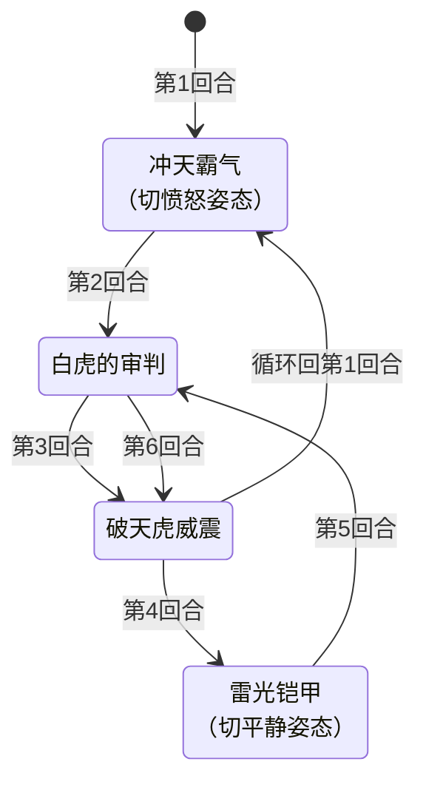

# 泰格尔

## 基本信息

| 属性 | 数值 |
|---|---|
| 分类 | [Boss 怪物](/monsters/boss/) |
| 生命值 | 173 - 178 |
| 被动能力 | [猛虎下山](#被动能力) + 开局进入"平静姿态" |

## 行动逻辑

开局自带"猛虎下山"被动，并施加"平静姿态"。招式按固定链式循环执行，每回合放1个单招式。冲天霸气和雷光铠甲切换姿态时触发清 PP + 解 debuff。

> **冲天霸气**：切愤怒姿态，下2次攻击必暴击，清空玩家随机2张PP牌；**白虎的审判**：10伤害，玩家获得瘫痪2层；**破天虎威震**：4伤害×3次；**雷光铠甲**：切平静姿态，全属性+2，清空玩家随机2张PP牌。姿态切换时清PP+解debuff。

## 招式

### 单意图招式

| 招式 | 意图 | 描述 | 数值 |
|---|---|---|---|
| 冲天霸气 | 冲天霸气 | 进入愤怒姿态，下两次攻击必定造成致命一击。切换姿态时清空玩家随机2张PP牌并解除自身负面减益。 | 暴击次数 2；清PP 2 张 |
| 白虎的审判 | 白虎的审判 | 造成伤害。你获得瘫痪2层。 | 伤害 10；瘫痪 2 层 |
| 破天虎威震 | 破天虎威震 | 造成伤害多次。 | 伤害 4 × 3 次 |
| 雷光铠甲 | 雷光铠甲 | 进入平静姿态，全属性+2。切换姿态时清空玩家随机2张PP牌并解除自身负面减益。 | 力量/防御/命中/速度 各 +2；清PP 2 张 |

### 瘫痪的减伤与副作用

白虎的审判施加的瘫痪是一个三效 Debuff（2 层），同时削弱玩家输出并附加惩罚：

| 效果 | 数值 | 说明 |
|------|------|------|
| 攻击伤害降低 | 固定 10% | 瘫痪持有者造成的**攻击伤害**固定 -10%（与层数无关，层数只影响持续时间）。非攻击伤害不受影响 |
| 未攻击惩罚 | 虚弱+易伤+缩小各 1 层 | 在瘫痪持有者的回合开始时，若上回合未造成伤害，则获得虚弱、易伤、缩小各 1 层 |
| 回合衰减 | -1 层/回合 | 每回合结束减 1 层，2 层需 2 回合消失 |

::: warning ⚠️ 减伤与层数无关
瘫痪的减伤机制为固定值计算，无论层数多少，**攻击伤害减伤始终为固定 10%**，层数只决定持续时间（每回合 -1 层）。
:::

::: warning 瘫痪逼玩家主动出击
瘫痪的"未攻击惩罚"机制逼迫玩家每回合都必须造成伤害——否则下回合开始获得虚弱+易伤+缩小三层 Debuff，输出和生存双双崩盘。但第 2 回合白虎的审判后玩家有 2 层瘫痪（攻击 -10%），此时若强行攻击输出会偏低，且若伤害不足以破格挡则不算"造成伤害"。建议用必中或固定伤害类卡牌确保每回合都有伤害产出，或用 Power 伤害绕过瘫痪的减伤。
:::

::: warning 本地化描述用词不一致
白虎的审判意图描述中写为"麻痹2层"，但实际施加的能力名为"瘫痪"（能力图标显示"瘫痪"）。这是 mod 本地化的用词不一致，本页以能力实际名称"瘫痪"为准。
:::

## 被动能力

### 猛虎下山

泰格尔加入房间时施加猛虎下山能力（不可消除，单例，纯展示无触发逻辑），并同时施加"平静姿态"。

**实际清 PP + 解 debuff 逻辑在姿态切换时实现**，每次"冲天霸气"或"雷光铠甲"切换姿态时触发：

1. **清空敌人随机 2 张 PP 牌的 PP 值**：遍历每个敌人，从战斗卡牌中筛选 PP 值大于 0 的 PP 卡牌，使用同步随机数随机选 2 张清空 PP。
2. **解除自身负面减益**：安全移除负面减益，只清除负面效果（Debuff 正层数或 Buff 负层数），保留正面增益如力量+6 不被清除。

### 平静姿态

平静姿态（不可消除，单例）。

- **效果**：每回合开始时获得 1 层先制。怪物侧的先制会**增加玩家卡牌耗能**（每层 +1），而非降低怪物自身耗能。

### 愤怒姿态

愤怒姿态（不可消除，单例）。

- **效果**：自身造成和受到的伤害翻倍。造成伤害时伤害 ×2，受到伤害时伤害 ×2。仅对受力量加成的攻击生效。

### 冲天霸气暴击计数器

冲天霸气暴击计数器（不可消除，计数器类型）。

- **效果**：下 2 次攻击必定致命一击（1.5x 伤害）。自身攻击且层数大于 0 时伤害 ×1.5。每次攻击后层数 -1，归零时移除。
- **与锁定II 的差异**：锁定II 是永久 100% 暴击（实例化类型），本能力是计数器类型，仅下 2 次攻击生效。

## 遭遇战

| 遭遇战 | 房间类型 | 池子 | 数量 | 说明 |
|---|---|---|---|---|
| `SeerTigerBoss` | Boss | Boss 池（第二层） | 1 只 | 第二层 Boss |
| `SeerEventTigerEncounter` | Monster | 神兽空间事件遭遇战 | 1 只 | 神兽空间·白虎泰格尔事件触发，无奖励（奖励由神兽空间系统自行发放）。**房间类型必须用 Monster（不能用 Event），否则存档加载时会崩溃**。 |

## 攻略要点

### 愤怒姿态是双刃剑（核心反制窗口）

愤怒姿态下泰格尔造成伤害翻倍，但**受到伤害也翻倍**。这是关键反制窗口——愤怒姿态期间玩家的攻击伤害会翻倍。第 1 回合冲天霸气进入愤怒 + 获得 2 次必暴，前 3 回合是高威胁期但也是玩家反制的黄金窗口：

| 回合 | 招式 | 伤害计算 | 总伤 |
|---|---|---|---|
| 第 2 回合 | 白虎的审判 | 10 × 1.5（必暴）× 2（愤怒） | 30 |
| 第 3 回合 | 破天虎威震 | 首段 4 × 1.5 × 2 + 后两段各 4 × 2 | 28（12+8+8） |

第 2 回合白虎的审判必暴击耗 1 次暴击计数器（剩 1 次），第 3 回合破天虎威震首段再耗最后一次。**愤怒姿态期间玩家的攻击伤害翻倍**——保留高伤单次攻击牌在第 1-3 回合打出可重创泰格尔。

### 瘫痪逼迫主动出击

白虎的审判（第 2、5 回合）施加 2 层瘫痪：①玩家攻击伤害固定 -10%（与层数无关）；②若玩家回合内未造成伤害，下回合开始获得虚弱+易伤+缩小各 1 层。第 2 回合后玩家若不攻击，第 3 回合开始就会被三层 Debuff 压制（易伤下 28 点破天虎威震会变成 42 点）。

**应对取舍（不是一概而论）**：
- **有必中/固定伤害牌**：用必中或固定伤害类卡牌绕过瘫痪的10%减伤
- **有Power伤害（毒/固定伤害能力）**：Power伤害不受瘫痪减伤影响（瘫痪只降低攻击伤害），可继续输出
- **纯攻击流**：接受10%减伤仍输出（10%减伤不算致命），关键是每回合至少造成1点伤害避免"未攻击惩罚"。用0费攻击牌满足条件
- **格挡苟活**：如果无法输出，至少格挡伤害。但下回合开始会被施加虚弱+易伤+缩小各1层，需准备清除手段

### 姿态切换清 PP + 解负面

第 1 回合冲天霸气（进入愤怒）和第 4 回合雷光铠甲（回到平静）都会触发"猛虎下山"：

1. **清空玩家随机 2 张 PP 牌的 PP 值**（多端同步随机）
2. **解除泰格尔自身负面减益**（仅清除减益类正面层数或增益类负面层数，保留力量+6 等正面增益）

**应对**：第 1、4 回合前尽量把关键 PP 牌打出，避免被清空。叠减益战术对泰格尔效果有限（每次姿态切换都会清除），应在姿态切换后再叠。

### 平静姿态的先制威胁

平静姿态下泰格尔每回合开始获得 1 层先制。**怪物侧的先制会使玩家的下一张牌耗能 +1**（每层 +1），打出第一张牌后先制即被消耗。第 4 回合雷光铠甲后回到平静姿态，第 5-6 回合期间玩家首张牌会变贵 1 费，需提前规划能量或用 0 费牌消耗先制。

### 第二循环更危险

第 7 回合回到冲天霸气，进入第二循环。此时泰格尔已通过第 4 回合雷光铠甲获得 +2 全属性（力量+2），第二循环的伤害比第一循环更高：

| 回合 | 招式 | 伤害计算（含力量+2） | 总伤 |
|---|---|---|---|
| 第 8 回合 | 白虎的审判 | (10+2) × 1.5 × 2 | 36 |
| 第 9 回合 | 破天虎威震 | 首段 (4+2) × 1.5 × 2 + 后两段各 (4+2) × 2 | 42（18+12+12） |

**应在第一循环（前 6 回合）内结束战斗**，否则第二循环伤害进一步放大（36+42=78，比第一循环的 58 高 35%）。如果牌组缺乏爆发无法6回合内结束：
- **用虚弱降低基础伤害**：虚弱让泰格尔攻击伤害-25%，暴击基础值降低（暴击仍触发但×1.5后总伤降低）。但注意第1、4回合姿态切换会清除泰格尔自身负面（保留力量+6等正面增益），虚弱要在姿态切换后重新施加
- **格挡苟活**：第二循环规律性输出（冲天霸气→白虎的审判→破天虎威震→雷光铠甲），可预判格挡
- **瘫痪逼迫每回合造成伤害**：即使无法速杀，也必须每回合造成至少1点伤害避免瘫痪的"未攻击惩罚"（虚弱+易伤+缩小各1层）。用0费攻击牌或Power伤害满足条件

### 其他要点

- **神兽空间事件**：通过神兽空间事件进入的战斗，胜利后不会直接给奖励，由神兽空间系统自行发放对应奖励。
- **房间类型陷阱**：泰格尔的神兽空间事件遭遇战虽是事件触发，但房间类型必须用 Monster（非 Event），否则存档加载会崩溃。
- **视觉资源**：使用自定义序列帧动画场景。

## 小贴士

- 愤怒姿态是反制黄金窗口，泰格尔受伤也翻倍，前3回合保留高伤牌全力输出。
- 尽量在第一循环（前6回合）结束战斗，第二循环伤害会大幅提升。

## 源码

- 怪物：`SeerTigerMonster.cs`
- 被动能力：`SeerTigerStances.cs`（含多种姿态能力）、`SeerFirstStrikePower.cs`、`SeerParalysisPower.cs`
- 遭遇战：`SeerTigerBoss.cs`、`SeerEventTigerEncounter.cs`
- 本地化：`monsters.json`（`SEER_MONSTER_SEER_TIGER_MONSTER.*`）、`intents.json`（`SEER_TIGER_MIGHT.*`、`SEER_WHITE_TIGER_JUDGMENT.*`、`SEER_TIGER_QUAKE.*`、`SEER_THUNDER_ARMOR.*`）、`powers.json`（`SEER_POWER_SEER_TIGER_DOWN_MOUNTAIN_POWER.*`、`SEER_POWER_SEER_CALM_STANCE_POWER.*`、`SEER_POWER_SEER_WRATH_STANCE_POWER.*`、`SEER_POWER_SEER_TIGER_CRIT_COUNTER_POWER.*`、`SEER_POWER_SEER_FIRST_STRIKE_POWER.*`、`SEER_POWER_SEER_PARALYSIS_POWER.*`)