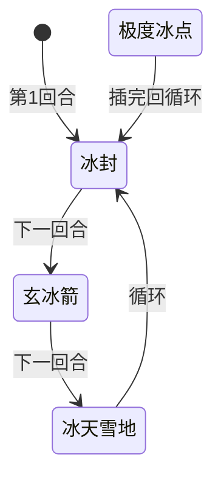

# 阿克希亚

> **类型**：精英怪物
> **初始生命**：173-178
> **遭遇战**：第二层精英战斗
> **特性**：寒冰护体（低于 5% 血回满，无限次）+ 极度冰点（首次回满后秒杀级反击）+ 冰系三招循环

## 被动能力（开局自带）

| 名称 | 类型 | 效果 |
|------|------|------|
| **[寒冰护体](/powers/ice_armor_power.md)** | 被动型，不可消除（不显示层数） | 受到伤害后，若自身生命值低于最大生命值的 5%，回复所有生命值。可无限次触发。首次触发后，下次行动插入「极度冰点」（仅一次） |

::: tip 寒冰护体机制
- 触发时机：受到伤害后检查，若当前生命值 ≤ 最大生命值 × 5% 即回满
- 175 血（平均）的 5% = 8.75，即**血量 ≤ 8 时触发**回满
- 回血量 = 最大生命值 - 当前生命值（直接回满）
- **回血可无限次触发**：每次低于 5% 都回满，不是一次性能力
- **极度冰点仅一次**：首次触发寒冰护体后，下次行动插入极度冰点；之后再次触发寒冰护体只回满，不再插入极度冰点
- 能力类型为不可消除（不被消除类效果清除）
:::

::: warning ⚠️ 本地化与实际不一致
意图描述写"每场战斗仅触发一次"，但实际**回血可无限次触发**。只有极度冰点是一次性的，寒冰护体本身的回血没有次数限制。本页以实际行为为准。
:::

## 行动逻辑

阿克希亚按「冰封 → 玄冰箭 → 冰天雪地」三招循环出招。寒冰护体首次触发后，会在下一次行动前插入一次极度冰点（仅一次，插完继续原循环，不打乱顺序）。

> **说明**：极度冰点在寒冰护体首次触发后插队使用一次（伤害=玩家最大生命值），不打乱循环顺序。

## 招式表

| 招式名 | 意图 | 类型 | 效果 |
|--------|------|------|------|
| **冰封** | 冰封 | Debuff | 所有敌人获得冰封 3 层 + 速度 -2；自身攻击 +2 |
| **玄冰箭** | 攻击 7×3 | 多段攻击 | 对单体目标造成 7 点伤害 3 次（共 21 点）；所有敌人先制 -1 |
| **冰天雪地** | 攻击 20 | 全体攻击 | 对所有敌方目标造成 20 点伤害；所有敌人获得冻伤 3 层 |
| **极度冰点** | 极度冰点 | 特殊反击 | 对所有敌方目标造成等于「所有玩家中最大的最大生命值」的伤害（可格挡，受力量影响）。仅寒冰护体首次触发后使用一次 |

::: tip 异常状态效果
- **冰封**：攻击伤害降低 20%，回合结束时移除并转化为 2 层冻伤
- **冻伤**：回合开始时受到 5 点伤害并减少 1 层（每层持续 1 回合）
- **先制 -1**：下一张打出的牌耗能 +1，打出后移除所有先制
- **速度 -2**：每 2 层影响 1 张抽牌数，-2 即少抽 1 张牌
- **攻击 +2**（自身力量）：每层 +1 攻击伤害
:::

::: warning 极度冰点伤害计算
- 伤害值 = 所有玩家中**最大的最大生命值**（不是当前生命值）
- 单人模式：伤害 = 你的最大生命值（满血时通常为75点）
- 多人模式：伤害 = 队伍中最大生命值最高的那个玩家的最大生命值，所有玩家受到相同伤害
- 伤害类型为攻击伤害（可格挡、受力量/易伤影响），不是固定伤害
- 例：最大生命值 75 时，极度冰点造成 75 点伤害，需要 75 点格挡才能完全防住
:::

## 遭遇战

| 遭遇战 | 房间类型 | 池子 | 数量 | 说明 |
|--------|----------|------|------|------|
| 阿克希亚精英 | Elite | 第二层精英池 | 1 只 | 单怪精英遭遇战 |
| 混合精英 | Elite | 第二层混合精英池 | 1 只（共 2 只） | 与 1 只原版精英同场，从原版池和 mod 池各随机选 1 只 |

::: tip 混合精英池
第二层混合精英的 mod 侧池子共 4 只：阿克希亚、莫杰、尤纳斯、奶泥粉多。原版侧池子共 2 只：蜂群术士、感染棱柱。每次遭遇从中各随机选 1 只组成 2 怪战斗。
:::

## 策略提示

1. **核心战术：控血**：阿克希亚不会主动回血，寒冰护体只在血量 ≤ 8 时被动触发回满。所以**平时正常打即可，只要不把血量打到 ≤ 8 就永远不会回血**。把血量压到 9-15 左右停手，等爆发牌到位再一击从 9+ 血直接打到 0，寒冰护体根本没机会触发。如果爆发足够，也可以从一开始就猛打直接秒杀，同样绕过寒冰护体。只有"无脑多段攻击不小心把血打到 ≤ 8"才会触发回满，属于操作失误。

2. **极度冰点只有一次，扛过就安全了**：极度冰点只在寒冰护体**首次**触发后插入一次，之后再触发寒冰护体也不会再用极度冰点。所以即使操作失误触发了回满，只要扛过这一次极度冰点（造成等于所有玩家中最大生命值的伤害，需准备等量格挡），之后阿克希亚就只剩三招循环，威胁大减。控血失误不是世界末日。

3. **三招循环可预判**：冰封 → 玄冰箭 → 冰天雪地，按固定顺序循环。冰封回合是控制回合（不造直接伤害但全队减速+减攻+冰封），玄冰箭是单体输出回合，冰天雪地是全体输出+debuff回合。提前预判下一招可以合理分配格挡资源，也能选在低威胁回合（如冰封回合）攒爆发牌。

4. **冰封回合的连环控制极强**：冰封施加全队冰封 3 层（减攻 20%+转化冻伤）+ 速度 -2（少抽 1 张），同时自身攻击 +2。紧接着的玄冰箭 7×3=21 点伤害 + 先制 -1（下张牌 +1 费），如果冰封没解掉，输出能力大打折扣。携带解冰封/解减速手段尤为重要。

5. **冻伤的持续伤害不可忽视**：冰封回合结束时转化 2 层冻伤（每回合 5 点，持续 2 回合共 10 点），冰天雪地直接施加 3 层冻伤（每回合 5 点，持续 3 回合共 15 点）。多回合积累下来伤害可观，一轮完整循环后身上可能叠了 5 层冻伤（每回合 25 点）。这也是控血战术要"打得干脆"的原因——拖太久冻伤会压垮自己。

6. **玄冰箭是单体攻击，冰天雪地是全体攻击**：玄冰箭 7×3=21 点伤害打同一目标，附带的先制 -1 是全队施加；冰天雪地 20 点伤害打全体，附带的冻伤 3 层也是全队施加。多人模式下玄冰箭需要被点名的玩家重点防御，冰天雪地则需要全队防御。

7. **多人模式极度冰点取最高最大生命值**：多人模式下极度冰点伤害 = 队伍中最大生命值最高的玩家的最大生命值，所有玩家受到相同伤害。队伍中不要有过高血量的角色可降低极度冰点伤害。建议高血量玩家优先叠格挡，或用嘲讽类能力保护。

8. **斩杀线参考**：175 血（平均）的 5% = 8.75，血量 ≤ 8 触发回满。控血时把血量压到 9-15 区间最安全，爆发牌准备好后一击带走。

## 源码

- 怪物：`SeerAxeMonster.cs`
- 被动能力：`SeerIceArmorPower.cs`（寒冰护体）
- 异常状态：`SeerFreezePower.cs`（冰封）、`SeerFrostbitePower.cs`（冻伤）、`SeerFirstStrikePower.cs`（先制）、`SeerSpeedPower.cs`（速度）
- 意图：`SeerAxeIntents.cs`（极度冰点、冰封、寒冰护体意图）
- 遭遇战：`SeerAxeElite.cs`（单怪精英）、`SeerMixedEliteEncounter.cs`（混合精英）
- 本地化：`monsters.json`（`SEER_MONSTER_SEER_AXE_MONSTER.*`）、`intents.json`（`SEER_EXTREME_ICE_POINT.*`、`SEER_ICE_STORM.*`、`SEER_ICE_ARROW.*`、`SEER_ICE_SEAL.*`、`SEER_ICE_ARMOR.*`）、`powers.json`（`SEER_POWER_SEER_ICE_ARMOR_POWER.*`、`SEER_POWER_SEER_FREEZE_POWER.*`、`SEER_POWER_SEER_FROSTBITE_POWER.*`）
