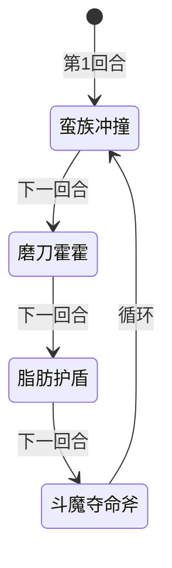

# 斗魔旺乔

## 基本信息

| 属性 | 数值 |
|---|---|
| 分类 | [精英怪物](/monsters/elite/) |
| 生命值 | 273 - 278 |

## 行动逻辑

按「蛮族冲撞 → 磨刀霍霍 → 脂肪护盾 → 斗魔夺命斧」固定顺序循环出招，无随机成分。

## 招式

| 招式 | 意图 | 描述 | 数值 |
|---|---|---|---|
| 蛮族冲撞 | 蛮族冲撞 | 自身损失20点生命值（不可格挡的非攻击伤害），对单体造成8点伤害4次 | 自损 20 / 伤害 8×4 |
| 磨刀霍霍 | 磨刀霍霍 | 自身力量+3，获得10层斗气 | 力量+3 / 斗气 10层 |
| 脂肪护盾 | 脂肪护盾 | 自身覆甲+7，获得18点格挡。接下来2回合受击时获得2层斗气 | 覆甲 7 / 格挡 18 / 斗气 2层/次 |
| 斗魔夺命斧 | 斗魔夺命斧 | 造成25点伤害（受力量加成），附加自身当前生命值10%的固定伤害（整数除法，满278血=27点） | 伤害 25 + 固定伤害（当前生命×10%） |

::: warning 意图描述与实际不符
脂肪护盾的**意图描述**写的是"获得 3 层斗气"，但**实际效果**和 Power 描述均为 2 层斗气/次（怪物文件中的 `FatShieldBattleFuryPerHit = 3` 为未使用的死常量，实际生效值为 2）。以实际 2 层为准。
:::

## 遭遇战

| 遭遇战 | 房间类型 | 池子 | 数量 | 说明 |
|---|---|---|---|---|
| `SeerDouMoWangQiaoElite` | Elite | 第三层精英池 | 1 只 | 单怪精英遭遇战，仅第三层（荣耀）出现 |
| `SeerMixedEliteEncounter` | Elite | 第三层混合精英池（mod 侧） | 1 只（共 2 只） | 与 1 只原版精英同场，仅第三层（荣耀） |

## 策略提示

1. **固定循环可预判，自损是免费输出**：斗魔旺乔按「蛮族冲撞 → 磨刀霍霍 → 脂肪护盾 → 斗魔夺命斧」固定顺序循环，无任何随机成分。蛮族冲撞每轮自损 20 血（不可格挡的非攻击伤害），4 轮循环下来自损 80 血，相当于玩家"免费"打了 80 点伤害。配合玩家输出，可以在 2~3 轮循环内击杀，根本不用拖到斗气叠满。

2. **斗气机制与满血免疫**：每层斗气使斗魔旺乔的攻击伤害附加**目标已损失生命值 1%** 的额外伤害（仅对攻击伤害生效，目标满血时不加成）。磨刀霍霍叠 10 层斗气，脂肪护盾期间每次受击额外获得 2 层斗气。若玩家满血则斗气无加成；若玩家残血且斗气层数高，斗魔夺命斧和蛮族冲撞的额外伤害会显著提升。保持高血量可大幅降低斗气威胁。

3. **脂肪护盾回合是输出禁区**：脂肪护盾期间（2 回合）每次受击获得 2 层斗气，多段攻击会快速给斗魔旺乔叠斗气。建议脂肪护盾回合用单次大伤害攻击或纯防御，避免多段攻击。等脂肪护盾结束后再集中输出。

4. **斗魔夺命斧的固定伤害随血量降低而降低**：斗魔夺命斧附加当前生命值 10% 的固定伤害（整数除法，`CurrentHp * 10 / 100`）。满 278 血 = 27 点固定伤害，但蛮族冲撞自损 20 后，下一轮斗魔夺命斧的固定伤害会降到约 25 点（258 血 × 10% = 25）。所以越往后斗魔夺命斧威胁越小，速战对自己有利。

5. **覆甲 vs 格挡**：脂肪护盾同时获得 7 层覆甲（`PlatingPower`，永久减伤，每受到 1 次未格挡伤害减 1 层）和 18 点格挡（下回合清空）。两种防御叠加，输出时优先用多段攻击消耗覆甲。但注意脂肪护盾回合多段攻击会触发斗气，所以破盾最好放在脂肪护盾结束后。

6. **273~278 血 + 2~3 轮循环击杀窗口**：斗魔旺乔血量 273~278，每轮循环（4 回合）自损 20 血。2 轮循环（8 回合）后自损 40 血，玩家需补 233~238 血即可击杀。配合玩家输出，6~8 回合内可完成击杀。若输出足够，2 轮循环内（8 回合）即可击杀，此时斗气仅 10 层（仅磨刀霍霍），威胁可控。

## 源码

- 怪物：`SeerDouMoWangQiaoMonster.cs`（生命 273~278，固定循环：蛮族冲撞→磨刀霍霍→脂肪护盾→斗魔夺命斧）
- 相关能力：`SeerFatShieldPower.cs`（脂肪护盾，2 回合内受击获得 2 层斗气，`BattleFuryPerHit=2`）、`SeerBattleFuryPower.cs`（斗气，每层附加目标已损失生命 1% 攻击伤害）
- 遭遇战：`SeerDouMoWangQiaoElite.cs`、`SeerMixedEliteEncounter.cs`
- 本地化：`monsters.json`（`SEER_MONSTER_SEER_DOU_MO_WANG_QIAO_MONSTER.*`）、`intents.json`（`SEER_BATTLE_AXE.*`、`SEER_SHARPEN.*`、`SEER_FAT_SHIELD_INTENT.*`、`SEER_BARBARIAN_CHARGE.*`）、`powers.json`（`SEER_POWER_SEER_BATTLE_FURY_POWER.*`、`SEER_POWER_SEER_FAT_SHIELD_POWER.*`）
