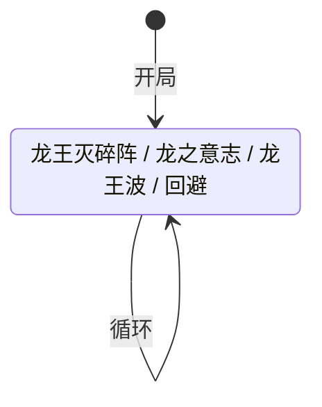

# 哈莫雷特

> **类型**：精英怪物
> **初始生命**：366 - 371
> **遭遇战**：第三层精英战斗
> **特性**：龙威（牌型克制 + 龙牌开局加成）+ 四招随机循环 + 回避恢复历史峰值属性

## 被动能力（开局自带）

| 名称 | 类型 | 效果 |
|------|------|------|
| **[龙威](/powers/dragon_majesty_power.md)** | 被动型，不可消除（不显示层数） | 战斗开始时，自身获得等量于敌人牌组中「龙」牌数量的全属性加成（力量/防御/命中/速度各 +N）。你打出的牌与上一张类型不同时重放一次；类型相同时此牌无效 |

::: tip 龙威机制
- **龙牌判定**：卡牌类名含「Dragon」或「龙」即算龙牌（只统计牌组中的牌，衍生牌不算）
- **开局加成**：战斗开始时统计每个玩家牌组中的龙牌数量，获得等量全属性（4 种属性各 +N）
- **牌型判定**（只对敌方玩家生效）：
  - 第一张牌：正常打出，记录卡牌类型（攻击/技能/能力等）
  - 与上一张**类型不同**：重放一次（额外打出一次，效果触发两遍）
  - 与上一张**类型相同**：此牌无效（不执行任何效果）
- **历史峰值**：在敌方回合（即哈莫雷特自己回合）开始和结束时更新，记录四种属性中出现过的最大值，供「回避」招式恢复使用
- 能力类型为不可消除（不被消除类效果清除）
:::

## 行动逻辑

开局自动施加龙威被动，之后每回合 4 选 1 随机出招，可连续重复。

> **说明**：`/` 表示四选一随机出招，每招可无限重复（可能连续出同一招）。

## 招式表

| 招式名 | 意图 | 类型 | 效果 |
|--------|------|------|------|
| **龙王灭碎阵** | 攻击 20 | 单次攻击 | 对单体目标造成 20 点伤害；向每个敌人的手牌加入 5 张碎屑 |
| **龙之意志** | 龙之意志 | 自身增益 | 翻倍自身所有正面属性加成（力量/防御/命中/速度各 +当前值，即翻倍） |
| **龙王波** | 攻击 7×2 | 多段攻击 | 对单体目标造成 7 点伤害 2 次（共 14 点）；所有敌人获得龙王波 debuff（下回合累计耗能 > 3 时强制结束回合） |
| **回避** | 回避 | 自身增益 | 自身获得 1 层缓冲；将所有属性恢复到历史最高值（取四属性中最高的一个值，将所有属性拉到该值） |

::: tip 龙王波 debuff 机制
- 施加 1 层，持续 1 回合（回合结束移除）
- 下回合内，每次打牌后累计已花费的能量
- 累计耗能 **> 3** 时强制结束回合（即最多花费 3 点能量）
- 例：打 2 费牌（累计 2）→ 再打 2 费牌（累计 4 > 3）→ 强制结束回合
- 0 费牌不累计耗能，可安全打出
:::

::: warning 回避的属性恢复机制
- 历史最高值 = 四种属性（力量/防御/命中/速度）中出现过的最大值（单一数值）
- 回避将所有属性拉到这个值：低于该值的属性补差值，等于或高于的不变
- 例：历史最高 5（力量 5 时记录），当前力量 2/防御 1/命中 3/速度 4 → 回避后全部变成 5
- 如果之前用龙之意志翻倍过属性，历史峰值也会翻倍，回避恢复后属性极高
:::

## 遭遇战

| 遭遇战 | 房间类型 | 池子 | 数量 | 说明 |
|--------|----------|------|------|------|
| 哈莫雷特精英 | Elite | 第三层精英池 | 1 只 | 单怪精英遭遇战 |
| 混合精英 | Elite | 第三层混合精英池 | 1 只（共 2 只） | 与 1 只原版精英同场，从原版池和 mod 池各随机选 1 只 |

::: tip 混合精英池
第三层混合精英的 mod 侧池子共 4 只：哈莫雷特、海耶克、斗魔王乔、伊扎克。原版侧池子共 2 只：机甲骑士、灵魂枢纽。每次遭遇从中各随机选 1 只组成 2 怪战斗。
:::

## 策略提示

1. **核心战术：主动利用龙威的牌型克制**：龙威是双刃剑——打出与上一张**类型不同**的牌会**重放一次**（玩家福利，效果双倍），打出与上一张**类型相同**的牌会**无效**（玩家惩罚）。所以玩家完全可以通过**交替出牌类型**（攻击→技能→攻击→能力→攻击...）让每张牌都重放，相当于全程双倍效果。这是哈莫雷特战斗的最大增益点，务必主动利用而非被动规避。

2. **第一张牌是基准，选最关键的**：龙威的牌型判定从第二张牌开始，第一张牌正常打出并记录类型。所以第一张牌不受龙威影响，应选最关键的牌打出（如核心爆发牌或关键 debuff），后续再围绕它的类型做交替。

3. **连续同类型牌会被无效，规划出牌顺序**：如果手里连续两张攻击牌，第二张会被龙威无效化。出牌前先看手牌类型分布，把同类型的牌隔开打（如攻击→技能→攻击），避免连续同类型。能力牌通常稀少，可以穿插在攻击/技能之间作为"类型切换器"。

4. **龙牌数量决定开局难度**：龙威在战斗开始时统计你牌组中含「龙」的牌数量，每张龙牌给哈莫雷特 +1 全属性（力量/防御/命中/速度各 +N）。如果牌组有 5 张龙牌，开局哈莫雷特全属性 +5，威胁极大。尽量减少牌组中的龙牌数量，或携带削弱属性的手段。注意龙牌判定基于卡牌类名是否含"Dragon"或"龙"。

5. **龙之意志让属性翻倍**：龙之意志翻倍所有正面属性加成。如果开局有 3 张龙牌（全属性 3），龙之意志后全属性 6。后续回避还会恢复到历史峰值 6。建议在龙之意志前削弱属性，或优先集火击杀。但注意龙之意志是四选一随机出，无法预判何时使用。

6. **回避恢复属性难以削弱**：回避将所有属性恢复到历史最高值（取四属性中出现过的最大值，所有属性拉到该值）。一旦哈莫雷特的属性被提升过（如龙之意志翻倍），即使你削弱了属性，回避也会恢复。需要在回避前击杀，或携带永久移除属性的能力（而非临时削弱）。回避还会附带 1 层缓冲，所以回避回合也很难打出伤害。

7. **龙王波的累计耗能限制**：龙王波命中后下回合累计耗能 > 3 强制结束回合。意味着你最多花 3 点能量。优先打高费牌（2~3 费），避免打 4+ 费牌触发强制结束。0 费牌不累计耗能，可安全打出。注意龙王波本身是 7×2=14 点多段伤害，配合龙威重放会更痛。

8. **龙王灭碎阵塞 5 张碎屑**：龙王灭碎阵向你的手牌加入 5 张碎屑，严重稀释关键牌。碎屑是状态牌，加入手牌而非弃牌堆，会占用手牌上限。需要携带过牌/消耗手段，或者在使用关键牌前先清理碎屑。注意碎屑类型是状态牌，可以作为龙威交替出牌的"类型切换器"（如攻击→碎屑→攻击）。

9. **四招随机无法预判**：哈莫雷特四招随机选择（RandomBranchState，每招可无限重复，可能连续出同一招）。需要同时准备格挡手段（应对龙王灭碎阵 20 伤害和龙王波 14 伤害）和属性削弱手段（应对龙之意志和回避）。无法像循环怪那样预判下一招，但每回合只需应对一招，压力可控。

10. **366~371 血高血量精英**：哈莫雷特血量极高，是精英怪物中血量最高的之一。配合龙威的开局加成和回避的属性恢复，战斗会偏持久。建议携带持续伤害手段（毒、固定伤害、流失伤害）绕过其高属性防御，同时利用龙威重放机制双倍输出，加快击杀速度。

## 源码

- 怪物：`SeerHamletMonster.cs`
- 被动能力：`SeerDragonMajestyPower.cs`（龙威）
- 龙王波 debuff：`SeerDragonWavePower.cs`（累计耗能限制）
- 意图：`SeerHamletIntents.cs`
- 遭遇战：`SeerHamletElite.cs`（单怪精英）、`SeerMixedEliteEncounter.cs`（混合精英）
- 本地化：`monsters.json`（`SEER_MONSTER_SEER_HAMLET_MONSTER.*`）、`intents.json`（`SEER_DRAGON_DESTROYER.*`、`SEER_DRAGON_WILL.*`、`SEER_DRAGON_WAVE_INTENT.*`、`SEER_EVADE.*`）、`powers.json`（`SEER_POWER_SEER_DRAGON_MAJESTY_POWER.*`、`SEER_POWER_SEER_DRAGON_WAVE_POWER.*`）
