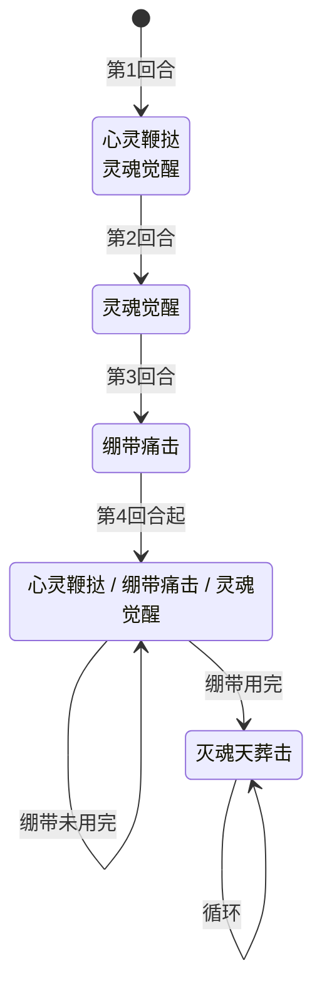

# 哈耶克

> **类型**：精英怪物
> **初始生命**：248 - 253
> **遭遇战**：第三层精英战斗
> **特性**：自由之魂（绷带缠绕递增耗能）+ 三招随机 + 绷带耗尽后灭魂天葬击（必定暴击 + 清空弃牌堆 PP）

## 被动能力（开局自带）

| 名称 | 类型 | 效果 |
|------|------|------|
| **[自由之魂](/powers/bandage_power.md)**（10 层） | 能力（不可消除） | 每回合开始时消耗 1 层，给每个敌人弃牌堆中随机 1 张牌加上绷带缠绕。绷带缠绕的牌耗能 +1，打出后解除 |

::: tip 绷带缠绕机制
- **自动消耗**：每回合怪物侧开始时，消耗 1 层绷带，给每个敌人的**弃牌堆**中随机 1 张牌加绷带缠绕
- **灵魂觉醒主动消耗**：灵魂觉醒招式消耗最多 2 层绷带，给每个敌人的**抽牌堆**中随机 2 张牌加绷带缠绕
- **绷带缠绕效果**：被缠绕的卡牌耗能 +1（通过底层补丁修改耗能计算），打出后解除缠绕
- **X 费牌不受影响**：X 费牌不被绷带缠绕增加耗能
- **随机源**：使用专用随机源确保多人同步
- 绷带层数耗尽后，哈耶克只使用灭魂天葬击
:::

## 行动逻辑

前 3 回合固定出招，之后 3 选 1 随机。绷带耗尽后只使用灭魂天葬击。

> **说明**：`/` 表示三选一随机出招；双招换行显示；绷带耗尽后进入灭魂天葬击永久循环。

::: warning 绷带消耗节奏
- 开局 10 层，每回合自动 -1，灵魂觉醒每次 -2
- 第 1 回合开始自动 -1（剩 9），灵魂觉醒 -2（剩 7）
- 第 2 回合开始自动 -1（剩 6），灵魂觉醒 -2（剩 4）
- 第 3 回合开始自动 -1（剩 3），绷带痛击不消耗
- 第 4 回合起每回合自动 -1，灵魂觉醒（如果随机到）再 -2
- 绷带用完后进入灭魂天葬击循环，威胁大幅升级
:::

## 招式表

| 招式名 | 意图 | 类型 | 效果 |
|--------|------|------|------|
| **心灵鞭挞·灵魂觉醒** | 心灵鞭挞 + 灵魂觉醒 | 组合招（第 1 回合） | 先施放心灵鞭挞，再施放灵魂觉醒 |
| **心灵鞭挞** | 心灵鞭挞 | 攻击 + Debuff | 对单体造成 14 点伤害；所有敌人获得虚弱/睡眠/束缚/易伤各 2 层 |
| **绷带痛击** | 攻击 3×N | 多段攻击 | 对单体造成 3 点伤害 × 当前绷带层数（至少 1 次） |
| **灵魂觉醒** | 灵魂觉醒 | 自身增益 + 干扰 | 自身全属性 +2，获得 18 点格挡；给每个敌人抽牌堆中随机 2 张牌加绷带缠绕（每张消耗 1 层绷带） |
| **灭魂天葬击** | 攻击 21 | 单次攻击（必定暴击） | 自身获得必定暴击，对单体造成 21 点伤害（**必定暴击 1.5×，实际约 32 点**）；清空每个敌人弃牌堆所有牌的 PP 并移入消耗牌堆 |

::: warning 灭魂天葬击的必定暴击
- 招式执行顺序：先施加「必定暴击」标记 → 再造成 21 点伤害
- 因此灭魂天葬击的 21 点伤害**必定暴击**（1.5×倍率），实际造成约 32 点伤害（21×1.5=31.5）
- 暴击后必定暴击标记消耗，下次攻击不再暴击（但灭魂天葬击循环使用，每次都重新施加）
- 即绷带耗尽后，哈耶克每回合造成约 32 点暴击伤害 + 清空弃牌堆 PP
:::

::: warning 本地化"下次攻击必定暴击"与实际效果不符
灭魂天葬击的本地化描述为"造成 21 点伤害。**下次**攻击必定暴击"——意图显示伤害为 21，"下次攻击"措辞暗示暴击属于"未来的某次攻击"，玩家会以为本回合只受 21 点。但实际效果是**先**施加必定暴击能力，**再**造成 21 点伤害——本次 21 点伤害就已经暴击（≈32）。意图显示的 21 远低于实际承受。本页以实际效果为准。
:::

::: warning 本地化"手牌"与实际效果"弃牌堆"不符
自由之魂被动能力的本地化描述为"使你随机一张**[手牌]**获得绷带缠绕"——但实际效果从 **弃牌堆** 取随机牌加绷带缠绕。描述与实际效果不符。本页以实际效果为准：弃牌堆。
:::

::: tip 灭魂天葬击的弃牌堆惩罚
- 将弃牌堆中**所有牌**移入消耗牌堆（永久损失）
- PP 牌的 PP 被清零
- 非 PP 牌也移入消耗牌堆，但无 PP 损失
- 注意：只影响弃牌堆，不影响手牌和抽牌堆
:::

## 遭遇战

| 遭遇战 | 房间类型 | 池子 | 数量 | 说明 |
|--------|----------|------|------|------|
| 哈耶克精英 | Elite | 第三层精英池 | 1 只 | 单怪精英遭遇战 |
| 混合精英 | Elite | 第三层混合精英池 | 1 只（共 2 只） | 与 1 只原版精英同场，从原版池和 mod 池各随机选 1 只 |

::: tip 混合精英池
第三层混合精英的 mod 侧池子共 4 只：哈莫雷特、海耶克、斗魔王乔、伊扎克。原版侧池子共 2 只：机甲骑士、灵魂枢纽。每次遭遇从中各随机选 1 只组成 2 怪战斗。
:::

## 策略提示

1. **核心战术：绷带是倒计时，前期速攻**：哈耶克开局 10 层绷带，每回合自动 -1，灵魂觉醒额外 -2。绷带耗尽后进入灭魂天葬击永久循环（每回合约 32 点暴击伤害 + 清空弃牌堆 PP），威胁骤升。所以前期（绷带未耗尽时）是黄金输出窗口，应全力速攻，尽量在 5-6 回合内击杀，避免拖到灭魂天葬击阶段。

2. **灭魂天葬击阶段是死亡螺旋**：绷带耗尽后哈耶克每回合约 32 点暴击伤害（21×1.5）+ 清空弃牌堆所有 PP 牌并移入消耗牌堆。这意味着每回合都要扛约 32 伤害，且 PP 资源持续流失，越拖越弱。若被迫进入此阶段，需准备 32+ 格挡/减伤 + PP 回复手段，否则必败。

3. **第 1 回合组合招压力最大**：第 1 回合心灵鞭挞+灵魂觉醒组合招，14 伤害 + 四种 debuff 各 2 层（虚弱/睡眠/束缚/易伤）+ 自身全属性+2 + 18 格挡 + 抽牌堆 2 张牌加绷带。开局即高压，需要提前准备解 debuff 手段或硬扛。

4. **绷带痛击是前期低威胁窗口**：绷带痛击 3×绷带层数，第 3 回合（首次使用）时绷带约 3-4 层 = 9-12 伤害，之后随绷带递减威胁更小。且绷带痛击不消耗绷带，不会加速进入灭魂天葬击阶段。所以第 3 回合及后续随机到绷带痛击时，是攒爆发牌或叠属性的安全回合。

5. **绷带缠绕增加耗能**：被绷带缠绕的牌耗能 +1。自动消耗给弃牌堆加绷带（影响抽回去的牌），灵魂觉醒给抽牌堆加绷带（直接影响下回合抽到的牌）。需要规划出牌顺序，优先打出被缠绕的牌解除标记，或用 0 费牌/X 费牌吸收绷带（X 费牌不受绷带影响）。

6. **灭魂天葬击清空弃牌堆 PP**：弃牌堆中所有 PP 牌的 PP 被清零并移入消耗牌堆。如果弃牌堆有重要 PP 牌，损失极大。建议在灭魂天葬击前尽量打完手中的 PP 牌，或用抽牌手段把弃牌堆的牌抽回手牌，减少损失。

7. **灵魂觉醒的 18 格挡难以突破**：灵魂觉醒每次给 18 格挡 + 全属性+2。如果不及时打破格挡，哈耶克会越来越强。建议携带高爆发伤害或固定伤害绕过格挡。但注意灵魂觉醒会消耗 2 层绷带，反而会加速进入灭魂天葬击阶段——所以灵魂觉醒对哈耶克是双刃剑。

8. **心灵鞭挞的四重 debuff**：虚弱（减攻）、睡眠（跳过）、束缚（无法行动）、易伤（受伤增加）各 2 层，严重限制行动。携带解 debuff 能力或免疫手段尤为重要。注意四种 debuff 叠加效果极强，第 1 回合组合招中就全中。

9. **三招随机无法预判**：第 4 回合后三招随机（绷带未耗尽时），可能连续出同一招。需要同时准备格挡（心灵鞭挞 14/绷带痛击 3×N）、解 debuff（心灵鞭挞）、破格挡（灵魂觉醒 18 格挡）。无法像循环怪那样精准预判，但每回合只出一招，压力可控。

## 源码

- 怪物：`SeerHayekMonster.cs`
- 被动能力：`SeerBandagePower.cs`（自由之魂/绷带）
- 绷带耗能 Patch：`SeerBandageCardIconPatch.cs`（CardEnergyCost.GetWithModifiers 后缀 +1）
- 必定暴击：`SeerNextGuaranteedCritPower.cs`
- 意图：`SeerHayekIntents.cs`
- 遭遇战：`SeerHayekElite.cs`（单怪精英）、`SeerMixedEliteEncounter.cs`（混合精英）
- 本地化：`monsters.json`（`SEER_MONSTER_SEER_HAYEK_MONSTER.*`）、`intents.json`（`SEER_SOUL_DESTROY.*`、`SEER_MIND_FLAY.*`、`SEER_BANDAGE_SMASH.*`、`SEER_SOUL_AWAKENING.*`）、`powers.json`（`SEER_POWER_SEER_BANDAGE_POWER.*`、`SEER_POWER_SEER_NEXT_GUARANTEED_CRIT_POWER.*`）
