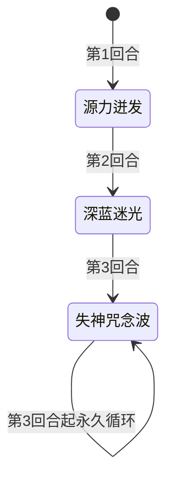

# 墨鲁萨

> **类型**：精英怪物
> **初始生命**：117 - 122
> **遭遇战**：第三层精英战斗（**必与[墨杜萨](/monsters/elite/medusa_monster)同场出现**，玩家居中、墨杜萨居左、墨鲁萨居右）
> **特性**：无限念力（被石化即力量翻倍）+ 三段固定序列（源力迸发→深蓝迷光→失神咒念波循环）+ 朝向决定所有招式效果

## 必与墨杜萨同场（核心机制）

::: warning 这不是"联动"——是必然同场
墨鲁萨**只会**在「墨杜萨精英」遭遇战中与[墨杜萨](/monsters/elite/medusa_monster)同场出现，没有"单独墨鲁萨"的情况。两个怪物的招式、朝向、状态都互相影响，必须当作一个整体来理解：

1. **朝向共用**：玩家只有一个朝向（朝左或朝右）。朝左 = 面对墨杜萨 / 背对墨鲁萨；朝右 = 背对墨杜萨 / 面对墨鲁萨。**没有"同时背对两个"的选项**，必选其一承受代价。
2. **石化传递（核心联动）**：墨杜萨的被动「石化之视」每回合遍历场上所有生物，墨鲁萨因右侧标记被判定为"面对墨杜萨"，每回合被施加 2 层石化。墨鲁萨被石化后，「无限念力」每回合触发 → **力量翻倍**。这个联动从第 1 回合就存在，与玩家朝向无关。
3. **朝向效果互斥**：朝左规避墨鲁萨的失神咒念波（30 伤害）但吃墨杜萨的石化之视（玩家自己被上石化）；朝右规避墨杜萨的石化之视（玩家不被上石化，但墨鲁萨仍被上石化）但吃墨鲁萨的失神咒念波 + 源力气场多打 2 次。
:::

## 被动能力（开局自带）

| 名称 | 类型 | 效果 |
|------|------|------|
| **[无限念力](/powers/infinite_telekinesis_power.md)**（1 层） | 能力（不可消除） | 自身回合开始时，若处于石化状态，则[力量]翻倍（获得等同于当前力量数值的额外力量）。**与墨杜萨的「墨杜莎之力」联动：墨杜萨出墨杜莎之力后，墨鲁萨下回合力量翻倍** |
| **右侧标记**（1 层，隐藏） | 能力（不可消除） | 标记墨鲁萨在战场**右侧**，用于朝向判断。不显示给玩家 |
| **[凝视](/powers/facing_power.md)**（1 层，施加给所有对手） | Debuff | 玩家加入房间时被施加，使玩家的朝向影响墨鲁萨所有招式效果（源力迸发/失神咒念波的分支判定都依赖朝向） |

::: tip 朝向判断规则
墨鲁萨位于**右侧**。玩家朝向为 Right 时视为"面对墨鲁萨"；朝向为 Left 时视为"背对墨鲁萨"。玩家使用指定目标的卡牌或药水可改变朝向。
:::

## 行动逻辑

固定三段序列，不可被打断（除非被击晕/击杀）：

> **说明**：墨鲁萨第 3 回合起**永久只使用失神咒念波**，不会回到源力迸发或深蓝迷光。失神咒念波只打面对自己的生物，朝左（背对墨鲁萨）可完全规避。

## 招式表

| 招式名 | 意图 | 类型 | 效果 |
|--------|------|------|------|
| **源力迸发** | 源力迸发 | 自身增益 + 朝向分支 | 自身全属性（力量/防御/命中/速度）各 +1。面对墨鲁萨的敌人陷入[睡眠](/powers/sleep_power.md) 4 层；背对墨鲁萨的敌人受[固定伤害](/mechanics/fixed-damage)（=墨鲁萨已损失生命 ÷ 4），墨鲁萨恢复等量生命 |
| **深蓝迷光** | 攻击 15 | 单体攻击 + 状态追加 | 对单体造成 15 点攻击伤害。若目标处于[睡眠](/powers/sleep_power.md)状态，额外附加 [虚弱](/powers/weak_power.md) 2 层 + [易伤](/powers/vulnerable_power.md) 2 层 |
| **失神咒念波** | 失神咒念波 | 群体非攻击伤害 | 对所有**面对墨鲁萨**的生物，造成 5 点伤害 6 次（共 30 点，非攻击伤害，不受力量影响，**可被格挡**）。背对墨鲁萨的目标不受影响 |

::: warning 招式威胁分析
- **源力迸发**：第 1 回合的强制招式。朝左（背对）→ 墨鲁萨满血时无损，残血时回血 + 固定伤害（满血 122 时最大回血 30 + 固定伤害 30）。朝右（面对）→ 睡眠 4 层，下回合深蓝迷光会额外加虚弱+易伤，形成"睡眠→虚弱+易伤→15 攻击伤害"的连锁
- **深蓝迷光**：第 2 回合的强制招式。基础 15 点攻击伤害可被格挡。配合睡眠的虚弱+易伤会显著放大伤害（易伤让受到伤害 ×1.5，虚弱让自己攻击伤害 ×0.75）
- **失神咒念波**：第 3 回合起的**永久循环招式**。30 点非攻击伤害不受力量影响，但可被格挡。背对墨鲁萨完全规避——这是朝左的核心收益
:::

## 与墨杜萨的联动机制（核心）

::: danger 联动一：石化之视 → 无限念力 → 力量翻倍（最致命，第 1 回合就触发）
墨杜萨的被动「石化之视」每回合开始时遍历**场上所有生物**，用朝向判断过滤。墨鲁萨位于右侧、墨杜萨位于左侧，朝向判断规则是"右侧生物面对左侧目标"，因此墨鲁萨每回合都被判定为"面对墨杜萨"，被施加 2 层石化。

**结论**：石化之视每回合会给墨鲁萨施加 2 层[石化](/powers/petrify_power.md)。墨鲁萨自身回合开始时，若仍处于石化状态，「无限念力」触发 → **力量翻倍**。

时序：
1. 第 1 回合（墨杜萨侧回合开始）：石化之视触发 → 墨鲁萨获得 2 层石化
2. 第 1 回合（墨鲁萨侧回合开始）：墨鲁萨处于石化状态 → 无限念力触发，力量翻倍（0 → 0，初始力量 0 翻倍还是 0，此时无实际增益）
3. 第 2 回合（墨杜萨侧回合开始）：石化之视再 +2 层 → 墨鲁萨累计 4 层石化（减 1 后）；同时墨杜萨出「墨杜莎之力」给所有生物 +5 力量 → 墨鲁萨力量变 5
4. 第 2 回合（墨鲁萨侧回合开始）：墨鲁萨仍处于石化状态 → 无限念力触发，力量翻倍（5 → 10）
5. 第 3 回合起：墨鲁萨永久循环失神咒念波（非攻击伤害不受力量影响）

**关键点**：
- 石化之视是**每回合**给墨鲁萨上石化，不是只在墨杜莎之力回合。只要墨杜萨活着，墨鲁萨就一直处于石化状态，无限念力每回合都触发力量翻倍。
- 墨杜莎之力给墨鲁萨 +5 力量（场上所有生物），配合无限念力翻倍 → 墨鲁萨力量可达 10+。
- 墨杜萨死后，石化之视消失，墨鲁萨不再被上石化，无限念力无法触发。**优先击杀墨杜萨可彻底解除墨鲁萨的力量翻倍威胁**。
:::

::: tip 联动二：墨杜莎之力的力量加成对墨鲁萨也生效
墨杜萨的「墨杜莎之力」（第 2 回合固定招式）给**场上所有生物**+5 力量，包括墨鲁萨自己。但注意：墨杜莎之力的**石化**只对敌人施加，**不包括墨鲁萨自己**。墨鲁萨的石化来源是石化之视，不是墨杜莎之力。

墨鲁萨的力量主要用于深蓝迷光（15 点攻击伤害 + 力量）。若墨鲁萨已力量翻倍（10 力量），深蓝迷光会变成 15+10 = 25 点攻击伤害。但深蓝迷光只第 2 回合出一次，之后永久失神咒念波（非攻击伤害不受力量影响），所以力量翻倍的实际威胁集中在第 2 回合的深蓝迷光。
:::

::: warning 联动三：朝向不可两全
玩家只有一个朝向，无法同时规避两个怪物的招式：

| 朝向 | 对墨杜萨 | 对墨鲁萨 |
|------|---------|---------|
| **朝左**（面对墨杜萨） | 石化之视每回合 +2 石化（玩家 + 墨鲁萨都被上石化）；源力气场正常 3 次 | 失神咒念波**完全规避**；源力迸发背对分支（回血+固定伤害） |
| **朝右**（面对墨鲁萨） | 石化之视不触发（玩家不被上石化，但**墨鲁萨仍被上石化**，因为墨鲁萨的朝向判断不依赖玩家朝向）；源力气场多打 2 次（共 5 次 = 25 伤害） | 失神咒念波吃满 30 伤害；源力迸发睡眠分支（4 层睡眠） |

**重要**：墨鲁萨被石化之视上石化，**与玩家朝向无关**——墨鲁萨的朝向判断走的是"右侧生物面对左侧目标"的规则，不看玩家朝向。所以无论玩家朝左还是朝右，墨鲁萨每回合都会被上石化，无限念力都会触发。

**两种朝向的代价仅影响玩家自身**：朝左玩家自己吃石化，朝右玩家不吃石化但吃源力气场多 2 次。对墨鲁萨的力量翻倍没有影响。
:::

## 遭遇战

| 遭遇战 | 房间类型 | 池子 | 数量 | 说明 |
|--------|----------|------|------|------|
| `SeerMedusaElite` | Elite | 第三层精英池 | 2 只 | [墨杜萨](/monsters/elite/medusa_monster)（左 medusa 槽）+ 墨鲁萨（右 minion 槽），玩家居中（自定义场景） |

::: warning 不参与混合精英池
墨杜萨精英是双怪遭遇战，不参与混合精英池（混合精英只选单怪精英）。
:::

## 策略提示

1. **核心矛盾：朝左吃石化降输出，朝右吃失神咒念波 30 伤害**：朝左面对墨杜萨 → 每回合受 2 层石化（攻击伤害降低 70%），但背对墨鲁萨可规避失神咒念波 30 伤害；朝右背对墨杜萨 → 不受石化保持输出，但源力气场多打 2 次（25 伤害）+ 面对墨鲁萨失神咒念波 30 伤害。两种朝向都有代价，需根据当前手牌和血量权衡。速攻流（2-3 回合击杀一只）建议朝右保输出；持久战建议朝左规避失神咒念波。

2. **第 2 回合是双怪联动的爆发点**：墨杜萨第 2 回合固定出「墨杜莎之力」，给所有生物 +5 力量 + 3 层石化。墨鲁萨被石化后下回合触发无限念力力量翻倍。如果玩家朝左（面对墨杜萨），第 2 回合也会吃到 3 层石化（共 2+3 = 5 层，5 回合内攻击伤害降低 70%）。**预判第 2 回合准备解石化手段**。

3. **优先击杀墨杜萨可阻止联动**：墨杜萨的「墨杜莎之力」是墨鲁萨力量翻倍（无限念力）的唯一触发源。墨杜萨死后，墨鲁萨不会再被施加石化，无限念力无法触发。但墨鲁萨仍会继续出失神咒念波（第 3 回合起永久循环）。建议优先击杀墨杜萨，解除石化威胁后再处理墨鲁萨。

4. **墨鲁萨第 3 回合起无限失神咒念波**：从第 3 回合起，墨鲁萨永久只使用失神咒念波（5×6=30 伤害，只打面对自己的生物，可被格挡）。如果朝左（背对墨鲁萨），完全不受失神咒念波影响——这是朝左的最大优势。如果朝右，需要每回合准备 30 点格挡或减伤。

5. **源力迸发回合的朝向抉择**：第 1 回合墨鲁萨强制出源力迸发。朝右（面对墨鲁萨）→ 4 层睡眠，下回合深蓝迷光会额外加虚弱+易伤，形成"睡眠→15 攻击伤害→虚弱+易伤"连锁。朝左（背对墨鲁萨）→ 墨鲁萨满血时无损；残血时回血 + 固定伤害。如果墨鲁萨满血或接近满血，朝左几乎无损；残血时回血量较大，需权衡。

6. **深蓝迷光的睡眠联动**：深蓝迷光对睡眠目标额外加 2 层虚弱 + 2 层易伤。若第 1 回合被施加睡眠（朝右），第 2 回合深蓝迷光会非常痛（15 伤害 + 易伤 ×1.5 = 22.5 伤害，加上虚弱让自己攻击伤害降低）。建议第 1 回合朝左规避睡眠，或第 2 回合前净化睡眠。

7. **石化操控后不要叠格挡**：墨杜萨的「石化操控」（第 3 回合及之后随机）会让玩家下回合结束时清除所有格挡并造成等量不可格挡的非攻击伤害。被施加石化操控后，下回合**不要叠格挡**，改用减伤、闪避、吸血等防御手段。

8. **双怪血量都不高，速攻可行**：墨杜萨和墨鲁萨都是 117~122 血，是精英中血量最低的。集中火力 2~3 回合可以击杀一只。但注意墨鲁萨的源力迸发会回血（背对时恢复已损失生命/4），朝左让墨鲁萨回血+造成固定伤害，朝右则让墨鲁萨睡眠。

9. **失神咒念波可被格挡**：失神咒念波是非攻击伤害，不受力量影响，但**可被格挡**。如果朝右面对墨鲁萨，第 3 回合起每回合准备 30 点格挡即可完全抵消失神咒念波。这是朝右持久战的可行方案。

10. **墨杜莎之力是双刃剑**：给所有生物 +5 力量，包括玩家。如果玩家有高攻击频率的牌，可以利用 +5 力量反制输出。但同时墨杜萨和墨鲁萨也 +5 力量，后续源力气场和深蓝迷光伤害增加。

## 源码

- 怪物：`SeerMedusaMinionMonster.cs`（生命 117-122，开局施加三被动，三段固定序列）
- 同场怪物：`SeerMedusaMonster.cs`（[墨杜萨](/monsters/elite/medusa_monster)，左侧）
- 被动能力：`SeerInfiniteTelekinesisPower.cs`（无限念力：石化时力量翻倍）、`SeerRightSidePower.cs`（右侧标记，隐藏）、`SeerFacingPower.cs`（凝视，施加给对手）
- 招式意图：`SeerMedusaIntents.cs`（`SEER_SOURCE_BURST.*`、`SEER_DEEP_BLUE_LIGHT.*`、`SEER_MINDBLANK_WAVE.*`）
- 遭遇战：`SeerMedusaElite.cs`（双怪精英，自定义场景，墨杜萨左 + 墨鲁萨右）
- 本地化：`monsters.json`（`SEER_MONSTER_SEER_MEDUSA_MINION_MONSTER.*`）、`intents.json`（`SEER_SOURCE_BURST.*`、`SEER_DEEP_BLUE_LIGHT.*`、`SEER_MINDBLANK_WAVE.*`）、`powers.json`（`SEER_POWER_SEER_INFINITE_TELEKINESIS_POWER.*`、`SEER_POWER_SEER_FACING_POWER.*`、`SEER_POWER_SEER_RIGHT_SIDE_POWER.*`）
