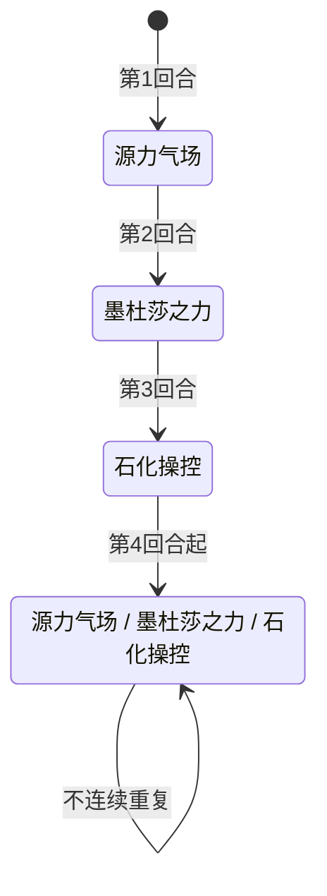

# 墨杜萨

> **类型**：精英怪物
> **初始生命**：117 - 122
> **遭遇战**：第三层精英战斗（**必与[墨鲁萨](/monsters/elite/medusa_minion_monster)同场出现**，玩家居中、墨杜萨居左、墨鲁萨居右）
> **特性**：石化之视（朝向即石化）+ 源力气场（背向多打）+ 石化操控（格挡转非攻击伤害）+ 墨杜莎之力（场上所有生物石化+力量，触发墨鲁萨无限念力）

## 必与墨鲁萨同场（核心机制）

::: warning 这不是"联动"——是必然同场
墨杜萨**只会**在「墨杜萨精英」遭遇战中与[墨鲁萨](/monsters/elite/medusa_minion_monster)同场出现，没有"单独墨杜萨"的情况。两个怪物的招式、朝向、状态都互相影响，必须当作一个整体来理解：

1. **朝向共用**：玩家只有一个朝向（朝左或朝右）。朝左 = 面对墨杜萨 / 背对墨鲁萨；朝右 = 背对墨杜萨 / 面对墨鲁萨。**没有"同时背对两个"的选项**，必选其一承受代价。
2. **石化传递（核心联动）**：墨杜萨的被动「石化之视」每回合遍历场上所有生物，墨鲁萨因右侧标记被判定为"面对墨杜萨"，每回合被施加 2 层石化。墨鲁萨被石化后，「无限念力」每回合触发 → **力量翻倍**。这个联动从第 1 回合就存在，与玩家朝向无关。
3. **朝向效果互斥**：朝左规避墨鲁萨的失神咒念波（30 伤害）但吃墨杜萨的石化之视（玩家自己被上石化）；朝右规避墨杜萨的石化之视（玩家不被上石化，但墨鲁萨仍被上石化）但吃墨鲁萨的失神咒念波 + 源力气场多打 2 次。
:::

## 被动能力（开局自带）

| 名称 | 类型 | 效果 |
|------|------|------|
| **[石化之视](/powers/petrify_gaze_power.md)**（1 层） | 能力（不可消除） | 每回合开始时，对所有正面对着墨杜萨的生物施加 2 层石化 |
| **左侧标记**（1 层，隐藏） | 能力（不可消除） | 标记墨杜萨在战场左侧，用于朝向判断。不显示给玩家 |

::: tip 朝向机制
- 墨杜萨在战场**左侧**，墨鲁萨在战场**右侧**，玩家居中
- 玩家有朝向（朝左或朝右），影响两个怪物的招式效果：
  - **朝左（面对墨杜萨）**：石化之视每回合施加 2 层石化；源力气场正常 3 次
  - **朝右（背对墨杜萨）**：石化之视不生效；源力气场多打 2 次（共 5 次 = 25 伤害）
- 朝向选择是核心策略：朝左承受石化，朝右承受额外伤害
:::

::: warning 石化状态效果
- **攻击伤害降低 70%**（只造成 30% 伤害）
- **攻击后获得格挡**：等于原始伤害的 70%
- 回合结束时减少 1 层
- 即石化状态下攻击几乎无效，且攻击会给自身加格挡（反而帮助石化操控）
:::

## 行动逻辑

前 3 回合固定出招，第 4 回合起 3 选 1 随机（不连续重复同一招）。

> **说明**：`/` 表示三选一随机出招，不会连续重复同一招。

## 招式表

| 招式名 | 意图 | 类型 | 效果 |
|--------|------|------|------|
| **源力气场** | 攻击 5×3 | 多段攻击 | 对单体目标造成 5 点伤害 3 次。若有任何敌人背对墨杜萨，连击 +2（共 5 次 = 25 伤害） |
| **墨杜莎之力** | 墨杜莎之力 | Debuff + 增益 | 对所有敌人施加石化 3 层；场上**所有生物**（含墨杜萨、墨鲁萨、玩家）获得 5 点力量 |
| **石化操控** | 石化操控 | Debuff | 对所有敌人施加石化操控（下回合结束时清除所有格挡并造成等量不可格挡的非攻击伤害） |

::: warning 石化操控机制
- 施加 1 层，持续 1 回合
- 下回合结束时：清除所有格挡 → 造成等量**不可格挡的非攻击伤害**（不受力量/易伤影响）
- 例：下回合叠了 20 格挡 → 回合结束失去 20 格挡 + 受 20 点不可格挡伤害
- 应对：被施加石化操控后，下回合**不要叠格挡**，改用其他防御手段（减伤、闪避等）
:::

## 与墨鲁萨的联动机制（核心）

::: danger 联动一：石化之视 → 无限念力 → 力量翻倍（最致命，第 1 回合就触发）
墨杜萨的被动「石化之视」每回合开始时遍历**场上所有生物**，用朝向判断过滤。墨鲁萨位于右侧、墨杜萨位于左侧，朝向判断规则是"右侧生物面对左侧目标"，因此墨鲁萨每回合都被判定为"面对墨杜萨"，被施加 2 层石化。

**结论**：石化之视每回合会给墨鲁萨施加 2 层[石化](/powers/petrify_power.md)。墨鲁萨自身回合开始时，若仍处于石化状态，「无限念力」触发 → **力量翻倍**。

时序：
1. 第 1 回合（墨杜萨侧回合开始）：石化之视触发 → 墨鲁萨获得 2 层石化
2. 第 1 回合（墨鲁萨侧回合开始）：墨鲁萨处于石化状态 → 无限念力触发，力量翻倍（0 → 0，初始力量 0 翻倍还是 0，此时无实际增益）
3. 第 2 回合（墨杜萨侧回合开始）：石化之视再 +2 层 → 墨鲁萨累计 4 层石化（减 1 后）；同时墨杜萨出「墨杜莎之力」给所有生物 +5 力量 → 墨鲁萨力量变 5
4. 第 2 回合（墨鲁萨侧回合开始）：墨鲁萨仍处于石化状态 → 无限念力触发，力量翻倍（5 → 10）
5. 第 3 回合起：墨鲁萨永久循环失神咒念波（非攻击伤害不受力量影响）

**关键点**：
- 石化之视是**每回合**给墨鲁萨上石化，不是只在墨杜莎之力回合。只要墨杜萨活着，墨鲁萨就一直处于石化状态，无限念力每回合都触发力量翻倍。
- 墨杜莎之力给墨鲁萨 +5 力量（场上所有生物），配合无限念力翻倍 → 墨鲁萨力量可达 10+。
- 墨杜萨死后，石化之视消失，墨鲁萨不再被上石化，无限念力无法触发。**优先击杀墨杜萨可彻底解除墨鲁萨的力量翻倍威胁**——这本身就是优先击杀墨杜萨的重要理由。
:::

::: tip 联动二：墨杜莎之力的力量加成对墨鲁萨也生效
墨杜萨的「墨杜莎之力」（第 2 回合固定招式）给**场上所有生物**+5 力量，包括墨鲁萨自己。但注意：墨杜莎之力的**石化**只对敌人施加，**不包括墨鲁萨自己**。墨鲁萨的石化来源是石化之视，不是墨杜莎之力。

墨鲁萨的力量主要用于深蓝迷光（15 点攻击伤害 + 力量）。若墨鲁萨已力量翻倍（10 力量），深蓝迷光会变成 15+10 = 25 点攻击伤害。但深蓝迷光只第 2 回合出一次，之后永久失神咒念波（非攻击伤害不受力量影响），所以力量翻倍的实际威胁集中在第 2 回合的深蓝迷光。
:::

::: warning 联动三：朝向不可两全
玩家只有一个朝向，无法同时规避两个怪物的招式：

| 朝向 | 对墨杜萨 | 对墨鲁萨 |
|------|---------|---------|
| **朝左**（面对墨杜萨） | 石化之视每回合 +2 石化（玩家 + 墨鲁萨都被上石化）；源力气场正常 3 次 | 失神咒念波**完全规避**；源力迸发背对分支（回血+固定伤害） |
| **朝右**（面对墨鲁萨） | 石化之视不触发（玩家不被上石化，但**墨鲁萨仍被上石化**，因为墨鲁萨的朝向判断不依赖玩家朝向）；源力气场多打 2 次（共 5 次 = 25 伤害） | 失神咒念波吃满 30 伤害；源力迸发睡眠分支（4 层睡眠） |

**重要**：墨鲁萨被石化之视上石化，**与玩家朝向无关**——墨鲁萨的朝向判断走的是"右侧生物面对左侧目标"的规则，不看玩家朝向。所以无论玩家朝左还是朝右，墨鲁萨每回合都会被上石化，无限念力都会触发。

**两种朝向的代价仅影响玩家自身**：朝左玩家自己吃石化，朝右玩家不吃石化但吃源力气场多 2 次。对墨鲁萨的力量翻倍没有影响。
:::

### 墨鲁萨的行动逻辑（必同场对手）

[墨鲁萨](/monsters/elite/medusa_minion_monster)（右侧）按固定三段序列行动，第 3 回合起永久循环失神咒念波：

| 招式名 | 回合 | 效果 |
|--------|------|------|
| **源力迸发** | 第 1 回合 | 自身全属性 +1；面对墨鲁萨的敌人睡眠 4 层；背对墨鲁萨的敌人受[固定伤害](/mechanics/fixed-damage)（=墨鲁萨已损失生命/4）并恢复等量生命 |
| **深蓝迷光** | 第 2 回合 | 对单体造成 15 点攻击伤害；对睡眠状态的敌人附加虚弱/易伤各 2 层 |
| **失神咒念波** | 第 3 回合起循环 | 对所有面对墨鲁萨的生物造成 5 点伤害 6 次（共 30 点，非攻击伤害，可被格挡） |

::: tip 墨鲁萨的被动
- **[无限念力](/powers/infinite_telekinesis_power.md)**：回合开始时，若自身处于石化状态，则力量翻倍（与墨杜萨的墨杜莎之力联动）
- **右侧标记**（隐藏）：标记墨鲁萨在战场右侧，用于朝向判断
- **[凝视](/powers/facing_power.md)**：施加给所有对手，使玩家朝向影响墨鲁萨招式效果
:::

## 遭遇战

| 遭遇战 | 房间类型 | 池子 | 数量 | 说明 |
|--------|----------|------|------|------|
| 墨杜萨精英 | Elite | 第三层精英池 | 2 只 | 墨杜萨（左）+ 墨鲁萨（右），玩家居中，自定义场景 |

::: warning 不参与混合精英池
墨杜萨精英是双怪遭遇战，不参与混合精英池（混合精英只选单怪精英）。
:::

## 策略提示

1. **核心矛盾：朝左吃石化降输出，朝右吃额外伤害**：朝左面对墨杜萨 → 每回合受 2 层石化（攻击伤害降低 70%），但背对墨鲁萨可规避失神咒念波 30 伤害；朝右背对墨杜萨 → 不受石化，但源力气场多打 2 次（25 伤害）+ 面对墨鲁萨失神咒念波 30 伤害。两种朝向都有代价，需根据当前手牌和血量权衡。速攻流（2-3 回合击杀一只）建议朝右保输出；持久战建议朝左规避失神咒念波。

2. **石化严重削弱输出**：石化降低 70% 攻击伤害 + 攻击后加 70% 格挡（反而帮助石化操控）。3 层石化持续 3 回合，期间攻击几乎无效。如果朝左面对墨杜萨，每回合 +2 石化，输出能力持续下降。携带解石化手段或选择朝右承受伤害更实际。

3. **石化操控后不要叠格挡**：被施加石化操控后，下回合结束时所有格挡会被清除并造成等量不可格挡的非攻击伤害。该回合应避免叠格挡，改用减伤、闪避、吸血等防御手段。预判石化操控回合（第 3 回合及之后随机到时）提前准备。

4. **墨杜莎之力是双刃剑**：给所有生物 +5 力量，包括玩家。如果玩家有高攻击频率的牌，可以利用 +5 力量反制输出。但同时墨杜萨和墨鲁萨也 +5 力量，后续源力气场和失神咒念波伤害增加。

5. **优先击杀墨杜萨**：墨杜萨的石化之视是持续威胁（每回合石化），且石化操控的格挡惩罚极强。墨鲁萨的失神咒念波虽然 30 伤害高，但只打面对自己的生物（朝左即可规避）。建议优先击杀墨杜萨解除石化威胁。

6. **双怪血量都不高，速攻可行**：墨杜萨和墨鲁萨都是 117~122 血，是精英中血量最低的。集中火力 2~3 回合可以击杀一只。但注意墨鲁萨的源力迸发会回血（背对时恢复已损失生命/4），朝左让墨鲁萨回血+造成固定伤害，朝右则让墨鲁萨睡眠。

7. **朝左的完整代价**：朝左面对墨杜萨 → 石化之视每回合 +2 石化 → 墨杜莎之力 +3 石化 → 共 5 层石化持续 5 回合。同时背对墨鲁萨 → 源力迸发固定伤害+回血 → 不受失神咒念波。朝左适合需要规避失神咒念波 30 伤害的情况。

8. **朝右的完整代价**：朝右背对墨杜萨 → 源力气场 25 伤害 → 不受石化之视。同时面对墨鲁萨 → 源力迸发睡眠 4 层 → 失神咒念波 30 伤害。朝右适合需要规避石化（保持输出能力）的情况，但伤害压力更大。

9. **墨鲁萨第 3 回合起无限失神咒念波**：墨鲁萨从第 3 回合起只使用失神咒念波（5×6=30 伤害，只打面对自己的生物，可被格挡）。如果朝左（背对墨鲁萨），完全不受失神咒念波影响。这是朝左的最大优势。

## 源码

- 怪物：`SeerMedusaMonster.cs`
- 同行怪物：`SeerMedusaMinionMonster.cs`（墨鲁萨）
- 被动能力：`SeerPetrifyGazePower.cs`（石化之视）、`SeerLeftSidePower.cs`（左侧标记，隐藏）
- 石化状态：`SeerPetrifyPower.cs`（降低攻击+加格挡）
- 石化操控：`SeerPetrifyControlPower.cs`（格挡转固定伤害）
- 墨鲁萨被动：`SeerInfiniteTelekinesisPower.cs`（无限念力）、`SeerRightSidePower.cs`（右侧标记）
- 遭遇战：`SeerMedusaElite.cs`（双怪精英，自定义场景）
- 本地化：`monsters.json`（`SEER_MONSTER_SEER_MEDUSA_MONSTER.*`、`SEER_MONSTER_SEER_MEDUSA_MINION_MONSTER.*`）、`intents.json`（`SEER_SOURCE_AURA.*`、`SEER_PETRIFY_CONTROL.*`、`SEER_MEDUSA_POWER.*`、`SEER_SOURCE_BURST.*`、`SEER_DEEP_BLUE_LIGHT.*`、`SEER_MIND_BLANK_WAVE.*`）、`powers.json`（`SEER_POWER_SEER_PETRIFY_GAZE_POWER.*`、`SEER_POWER_SEER_PETRIFY_CONTROL_POWER.*`、`SEER_POWER_SEER_PETRIFY_POWER.*`）
