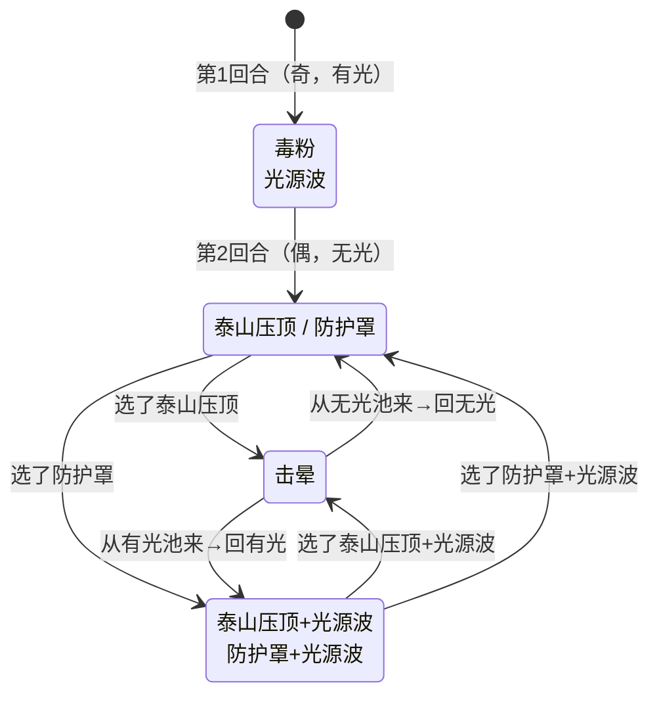

# 蘑菇怪

> **类型**：精英怪物
> **初始生命**：112 - 117
> **遭遇战**：第一层精英池（Overgrowth）、混合精英池、双蘑菇事件
> **特性**：光源波奇偶节奏 + 泰山压顶自击晕（两回合行动一次） + 毒粉污染牌组

## 被动能力

无被动能力。开局固定使用「毒粉·光源波」连招。

## 行动逻辑

第 1 回合固定使用**毒粉+光源波**连招。此后按**总回合数奇偶性**决定是否带光源波：奇数回合（第 1、3、5…回合）带光源波，偶数回合不带。每次在对应技能池随机选一招。若选了泰山压顶，下回合必击晕（空过一回合），击晕回合本身不带光源波，但击晕不改变光暗节奏。

> **说明**：`/` 表示随机二选一，`+` 表示双招连招（本回合连续放两个技能，框内换行显示），`击晕` 回合不攻击但占一个回合位置。

## 招式表

| 招式名 | 意图 | 类型 | 效果 |
|--------|------|------|------|
| **毒粉·光源波**（第 1 回合） | 毒粉 + 光源波 | 连招（双意图） | 先毒粉：所有敌人[中毒](/powers/poison_power.md) 6 层 + 抽牌堆加入 4 张**毒素**；再光源波：造成 10 点攻击伤害 |
| **泰山压顶** | 攻击 30 | 攻击 + 自击晕 | 造成 30 点攻击伤害；自身下回合被**击晕** |
| **泰山压顶·光源波** | 泰山压顶 + 光源波 | 连招（双意图） | 先泰山压顶：30 点攻击伤害 + 自身下回合击晕；再光源波：10 点攻击伤害 |
| **防护罩** | 防护罩 | 自身强化 | 自身获得 2 层[缓冲](/powers/buffer_power.md) |
| **防护罩·光源波** | 防护罩 + 光源波 | 连招（双意图） | 先防护罩：自身 2 层缓冲；再光源波：10 点攻击伤害 |
| **击晕** | 击晕 | 空操作 | 自身被击晕，仅播放击晕动画，不做任何事 |

::: tip 毒粉与光源波的独立版本
毒粉和光源波在图鉴中有独立预览，但战斗中不单独出现。毒粉仅在第 1 回合作为「毒粉·光源波」连招的一部分使用；光源波则作为奇偶节奏的附加意图出现。
:::

## 中毒与毒素机制

### 中毒（seer mod）

蘑菇怪使用的是 seer mod 的中毒能力，与原版中毒不同：

- **伤害公式**：每回合开始时受到 1 + 层数 ÷ 2 点伤害（向下取整），然后减少 1 层
- **伤害类型**：不可格挡伤害（不受力量/易伤影响）
- **6 层中毒伤害曲线**：

| 回合 | 层数 | 伤害 |
|------|------|------|
| 第 1 回合 | 6 | 1 + 6÷2 = 4 |
| 第 2 回合 | 5 | 1 + 5÷2 = 3 |
| 第 3 回合 | 4 | 1 + 4÷2 = 3 |
| 第 4 回合 | 3 | 1 + 3÷2 = 2 |
| 第 5 回合 | 2 | 1 + 2÷2 = 2 |
| 第 6 回合 | 1 | 1 + 1÷2 = 1 |
| **合计** | | **15 点** |

### 毒素（状态牌）

毒粉向每位玩家的抽牌堆随机位置加入 4 张毒素状态牌：

- **类型**：状态牌（Status）
- **效果**：消耗；回合结束在手牌中时，对自身造成 5 点可格挡伤害（不受力量影响）
- **威胁**：4 张毒素污染抽牌堆，不仅占用抽牌位，留在手牌还会造成伤害。需要尽快打出消耗掉

## 遭遇战

| 遭遇战 | 房间类型 | 池子 | 数量 | 说明 |
|--------|----------|------|------|------|
| `SeerMushroomElite` | Elite | 第一层精英池（Overgrowth） | 1 只 | 单怪物精英 |
| 混合精英池 | Elite | 第一层混合精英池 | 1 只 | 与[钢牙鲨](steel_jaw_shark_monster)、[里奥](rio_monster)、[提亚斯](tias_monster)混合出现 |
| `SeerEventTwoMushroomEncounter` | Monster | 事件遭遇战 | 2 只 | 双蘑菇事件，**无奖励**，房间类型为 Monster（非 Event，避免存档加载崩溃） |

## 策略提示

1. **第 1 回合是最大压力回合**：毒粉·光源波连招同时施加 6 层中毒 + 4 张毒素 + 10 点伤害。开局即面临牌组污染和持续伤害，需要准备净化手段或足够的格挡。

2. **泰山压顶的自击晕是输出窗口**：泰山压顶造成 30 点高伤害，但使用后下回合固定击晕（空操作）。击晕回合是安全的输出时间，可放心铺场或爆发。注意泰山压顶·光源波版本额外多 10 点伤害（共 40 点），需额外格挡。

3. **光源波的奇偶节奏**：第 1 回合带光源波；**所有非击晕回合，只要回合数是奇数就带光源波，偶数回合不带**。泰山压顶的击晕会消耗一个回合（总回合数+1），但**不会反转奇偶性**——在无光回合出泰山压顶，击晕后回到无光；在有光回合出泰山压顶，击晕后回到有光。

4. **防护罩的 2 层缓冲**：2 层缓冲可抵消两次致命伤害。爆发击杀时需预留溢出伤害，或先用两次小伤害破掉缓冲再爆发。注意防护罩·光源波版本额外多 10 点伤害。

5. **中毒是持续威胁**：6 层中毒 6 回合共造成 15 点不可格挡伤害。如果不净化，前 3 回合每回合 3~4 点不可格挡伤害会持续削弱血量。带净化能力或速战可减少中毒影响。

6. **毒素牌需尽快消耗**：4 张毒素塞入抽牌堆，不仅占用抽牌位（抽到毒素就少抽一张有用牌），留在手牌还会造成 5 点伤害。毒素是消耗牌，打出即消失，尽快打出减少手牌压力。

7. **双蘑菇事件威胁翻倍**：双蘑菇事件同时出现两只蘑菇怪，两只各自独立行动。第 1 回合双倍毒粉（12 层中毒 + 8 张毒素 + 20 点伤害），且不给奖励。遇到双蘑菇事件优先速杀一只减轻压力。

8. **112-117 血需要 2~3 回合击杀**：蘑菇怪血量适中，配合泰山压顶的击晕窗口（第 2~3 回合）可集中输出。注意防护罩的缓冲会拖慢击杀节奏。

## 源码

- 怪物：`SeerMushroomMonster.cs`（生命 112-117，回合计数器 + 自击晕机制 + 光源波奇偶节奏）
- 中毒能力：`SeerPoisonPower.cs`（每回合 1 + 层数÷2 点不可格挡伤害）
- 毒素状态牌：`Toxic.cs`（原版，消耗，回合结束在手牌造成 5 点可格挡伤害）
- 遭遇战：`SeerMushroomElite.cs`（第一层精英池）、`SeerEventTwoMushroomEncounter.cs`（双蘑菇事件，无奖励）、`SeerMixedEliteEncounter.cs`（混合精英池）
- 本地化：`monsters.json`（`SEER_MONSTER_SEER_MUSHROOM_MONSTER.*`）、`intents.json`（`SEER_POISON_POWDER.*`、`SEER_MOUNTAIN_CRUSH.*`、`SEER_SHIELD_GUARD.*`、`SEER_LIGHT_WAVE.*`）、`powers.json`（`SEER_POWER_SEER_POISON_POWER.*`）
