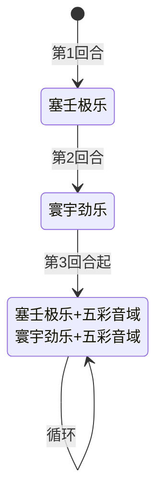

# 奈尼芬多

## 基本信息

| 属性 | 数值 |
|---|---|
| 分类 | [精英怪物](/monsters/elite/) |
| 生命值 | 142 - 147 |
| 被动能力 | [药剂反噬](#被动能力)（1 层） |

## 行动逻辑

开局自带药剂反噬被动，前 2 回合固定出招，第 3 回合起 2 选 1 随机双招组合（可重复）。

> **说明**：第3回合起每回合随机选一种双招组合（二选一），双招连续施放。

## 招式

| 招式 | 意图 | 描述 | 数值 |
|---|---|---|---|
| 塞壬极乐 | 塞壬极乐 | 造成10点伤害。向你的手牌中加入2张**杂音**。 | 伤害 10；每个敌人手牌 +2 张杂音 |
| 寰宇劲乐 | 寰宇劲乐 | 向你的**抽牌堆**中随机加入4张**杂音**。 | 每个敌人抽牌堆 +4 张杂音 |
| 五彩音域 | 五彩音域 | 自身获得20点**格挡**。强行使用你一瓶药水，并造成**2的x次幂**点伤害（x为你手牌中**杂音**的数量）。 | 自身 20 格挡；伤害 = 2^手牌杂音数；强用一瓶药水 |
| 塞壬极乐·五彩音域 | 塞壬极乐 + 五彩音域 | 先发动塞壬极乐，再发动五彩音域 | 10 伤害 + 2 杂音（入手牌） + 20 格挡 + 2^x 伤害（含刚塞的 2 张） + 强用药水 |
| 寰宇劲乐·五彩音域 | 寰宇劲乐 + 五彩音域 | 先发动寰宇劲乐，再发动五彩音域 | 4 杂音（入抽牌堆） + 20 格挡 + 2^x 伤害（不含刚塞的 4 张） + 强用药水 |

### 杂音卡牌

杂音是奈尼芬多战斗中的核心威胁牌，由塞壬极乐（塞入手牌）和寰宇劲乐（塞入抽牌堆）生成。

| 属性 | 值 |
|---|---|
| 类型 | 状态牌（不可升级） |
| 费用 | 1 PP |
| 关键词 | [保留](/mechanics/retain)（回合结束不弃牌）、[消耗](/mechanics/exhaust)（打出后移入消耗堆） |
| 打出效果 | 向自身施加隐藏能力「杂音复制」（战斗内持续生效） |

::: warning 杂音的自我复制机制
打出杂音后，玩家身上会获得一个隐藏的「杂音复制」能力（被动型，不可见，不堆叠），**持续至战斗结束**。该能力在**玩家回合结束时**触发，将手牌中**所有杂音**各复制一份到手牌。

- **指数增长**：手牌 2 张杂音 → 回合结束复制为 4 张 → 下回合结束复制为 8 张 → 16 张 → 32 张……每回合翻倍
- **与五彩音域的联动**：五彩音域伤害 = 2^(手牌杂音数)。杂音越多，五彩音域伤害指数级膨胀：3 张杂音 = 8 伤害，5 张 = 32 伤害，6 张 = 64 伤害
- **本地化描述偏差**：杂音卡牌描述为"你的回合开始时，自我复制一份到手牌"，但实际触发时机为**回合结束时**，且复制的是手牌中**所有**杂音而非仅复制一张。描述与实际行为有出入。
:::

::: tip 杂音 vs 五彩音域的时机差异
- **塞壬极乐·五彩音域**连招中，塞壬极乐先将 2 张杂音塞入手牌，紧接着五彩音域计算 2^x 伤害时**会包含这 2 张**。因此该连招的 2^x 伤害比预想更高。
- **寰宇劲乐·五彩音域**连招中，寰宇劲乐将 4 张杂音塞入**抽牌堆**（非手牌），五彩音域计算 2^x 伤害时**不含这 4 张**。但这 4 张后续会被抽到手牌，增加未来五彩音域的威胁。
:::

## 被动能力

### 药剂反噬（1 层）

每当你使用一瓶药水时，失去4点**最大生命值**。

- **施加方式**：怪物加入房间时对自身施加药水反噬（1 层）。
- **触发时机**：玩家使用药水时触发。包括玩家主动使用和**五彩音域强行使用**两种情况。
- **效果**：扣除使用药水的玩家 4 点最大生命值。
- **能力类型**：不可消除（不被消除 buff/debuff 类效果清除）。

::: warning 五彩音域的三重惩罚
五彩音域强行使用玩家一瓶药水（随机选一瓶，框架同步随机源确保多端同步），这会触发药剂反噬。因此五彩音域的实际惩罚是：
1. **2^x 伤害**（x 为手牌杂音数，无法格挡的部分需注意）
2. **随机浪费一瓶药水**（若玩家无药水则跳过）
3. **扣除 4 点最大生命值**（药剂反噬触发）

三重惩罚叠加，尤其在杂音较多时威胁极大。若玩家无药水，则只承受 2^x 伤害，可避免药水浪费和最大生命值损失。
:::

## 遭遇战

| 遭遇战 | 房间类型 | 池子 | 数量 | 说明 |
|---|---|---|---|---|
| `SeerNaiNiFenDuoElite` | Elite | 精英池（第二层） | 1 只 | 无具名位置 |

## 策略提示

1. **杂音自我复制是最大威胁**：打出杂音会施加隐藏的「杂音复制」能力，回合结束时手牌中所有杂音各复制一份——指数增长（2→4→8→16…）。五彩音域伤害 = 2^(手牌杂音数)，6 张杂音即 64 伤害。**核心原则：尽量不要打出杂音**，避免触发复制机制。用消耗类/弃牌类卡牌效果移除手牌杂音，而非主动打出。

2. **第 3 回合起每回合都是双招连招**：前 2 回合固定（塞壬极乐 → 寰宇劲乐），第 3 回合起每回合随机「塞壬极乐·五彩音域」或「寰宇劲乐·五彩音域」。即从第 3 回合起，**每回合都会塞杂音 + 按 2^x 打伤害 + 强用药水**，压力极高。务必在前期（前 2 回合）集中输出压血，争取 4~5 回合内击杀。

3. **两种连招的杂音时机差异**：
   - **塞壬极乐·五彩音域**：塞壬极乐将 2 张杂音塞入手牌后，五彩音域**立即计算**这 2 张。2^x 伤害会包含刚塞的杂音，威胁更大。
   - **寰宇劲乐·五彩音域**：寰宇劲乐将 4 张杂音塞入**抽牌堆**，五彩音域**不计算**这 4 张。但后续抽到手牌后会增加未来五彩音域威胁。

4. **五彩音域的三重惩罚**：2^x 伤害 + 强行使用一瓶药水（随机选） + 药剂反噬扣 4 最大生命值。若玩家无药水，则只承受 2^x 伤害。**策略**：进入奈尼芬多战前可考虑不携带药水（或战前用完），避免三重惩罚中的药水浪费和最大生命值损失。

5. **优先清除手牌杂音**：五彩音域只计算**手牌**中的杂音数量（不计算抽牌堆/弃牌堆）。在五彩音域回合前，尽量通过消耗/弃牌效果移除手牌杂音，将伤害压制在低位：0 张 = 1 伤害，1 张 = 2 伤害，2 张 = 4 伤害。

6. **药剂反噬的累积代价**：每次使用药水（主动或被动）损失 4 最大生命值。若携带药水且战斗持续 5 回合以上，最大生命值损失可达 20+，严重削弱续航。建议本战前用完药水或携带不依赖药水的牌组。

7. **142~147 血 + 前期速杀窗口**：奈尼芬多血量 142~147，前 2 回合是固定出招（无五彩音域威胁）的最佳输出窗口。第 1 回合塞壬极乐（10 伤害 + 2 杂音入手牌）、第 2 回合寰宇劲乐（4 杂音入抽牌堆），这两回合集中火力压血。第 3 回合起五彩音域登场，压力骤升。

8. **杂音的保留关键词**：杂音带有保留（回合结束不弃牌），会持续留在手牌占用空间。若不处理，手牌会被杂音填满，影响正常出牌节奏。携带消耗类/弃牌类卡牌是应对杂音的关键手段，但注意**不要主动打出杂音**（会触发复制）。

## 源码

- 怪物：`SeerNaiNiFenDuoMonster.cs`（生命 142~147，前 2 回合固定 + 第 3 回合起随机双招连招）
- 被动能力：`SeerPotionBacklashPower.cs`（玩家使用药水时扣 4 最大生命值）
- 杂音卡牌：`SeerNoise.cs`（状态牌，保留+消耗，打出施加杂音复制能力）
- 杂音复制：`SeerNoiseReplicatePower.cs`（回合结束时复制手牌所有杂音）
- 遭遇战：`SeerNaiNiFenDuoElite.cs`
- 本地化：`monsters.json`（`SEER_MONSTER_SEER_NAI_NI_FEN_DUO_MONSTER.*`）、`intents.json`（`SEER_SIREN_BLISS.*`、`SEER_COLORFUL_SOUND.*`、`SEER_UNIVERSAL_MUSIC.*`）、`powers.json`（`SEER_POWER_SEER_POTION_BACKLASH_POWER.*`）、`cards.json`（`SEER_CARD_SEER_NOISE.*`）
