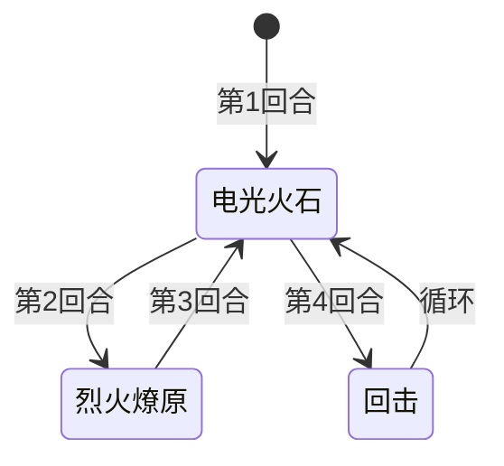

# 里奥斯

## 基本信息

| 属性 | 数值 |
|---|---|
| 分类 | [精英怪物](/monsters/elite/) |
| 生命值 | 98 - 103 |
| 被动能力 | [鬼火](#被动能力)（1 层） |

## 行动逻辑

开局自带鬼火被动，之后按「电光火石 → 烈火燎原 → 电光火石 → 回击」固定四步循环出招。

## 招式

| 招式 | 意图 | 描述 | 数值 |
|---|---|---|---|
| 电光火石 | 电光火石 | 自身先制+1，全属性+2。 | 先制+1；力量/防御/命中/速度各+2 |
| 烈火燎原 | 烈火燎原 | 造成10点伤害。你每有1层异常状态，伤害+1。 | 基础 10 伤害 + 目标每层异常状态 +1 |
| 回击 | 回击 | 造成15点伤害。自身每损失1点生命值，伤害+1%。 | 基础 15，公式 15×(1+已损失生命/100) |

## 被动能力

### 鬼火（1 层）

受到伤害后，使伤害者获得2层焚烬和2层烧伤。

- **施加方式**：怪物加入房间时对自身施加鬼火（1 层）。
- **触发时机**：自身受到伤害且伤害来源非自身且实际造成了伤害时触发。
- **效果**：对伤害者施加焚烬 2 层 + 烧伤 2 层。
- **能力类型**：不可消除（不被消除 buff/debuff 类效果清除）。

## 遭遇战

| 遭遇战 | 房间类型 | 池子 | 数量 | 说明 |
|---|---|---|---|---|
| `SeerRioElite` | Elite | 精英池（第一层 Overgrowth） | 1 只 | 无具名位置 |

## 攻略要点

- **鬼火反伤**：每次攻击里奥斯都会被反挂 2 层焚烬 + 2 层烧伤，多段攻击（如多段充能球）会反复触发，高频率小伤害反而最吃亏。建议用少量高伤害单次攻击。
- **烈火燎原惩罚异常状态**：基础 10 伤害，你身上每层异常状态 +1。被鬼火挂上焚烬/烧伤后，下一次烈火燎原伤害会显著抬高，注意在烈火燎原回合前清除异常或硬扛。
- **回击越残越痛**：回击伤害随里奥斯已损失生命值线性增长（每损 1 点 +1%）。残血时回击可远超 15，斩杀线计算时务必把回击回合的动态伤害纳入考量。
- **电光火石滚雪球**：每次电光火石使全属性 +2、先制 +1，多轮循环后里奥斯属性会逐步增长，建议速战。
- **视觉资源**：使用自定义序列帧动画场景（精英 2x 缩放）。

## 小贴士

- 用少量高伤害单次攻击，避免多段攻击多次触发鬼火反伤。
- 速战速决，避免电光火石滚雪球和残血回击的高额伤害。

## 源码

- 怪物：`SeerRioMonster.cs`
- 被动能力：`SeerGhostFirePower.cs`
- 遭遇战：`SeerRioElite.cs`
- 本地化：`monsters.json`（`SEER_MONSTER_SEER_RIO_MONSTER.*`）、`intents.json`（`SEER_LIGHTNING_FIRE.*`、`SEER_GHOST_FIRE.*`、`SEER_WILDFIRE.*`、`SEER_COUNTERSTRIKE.*`）、`powers.json`（`SEER_POWER_SEER_GHOST_FIRE_POWER.*`）
