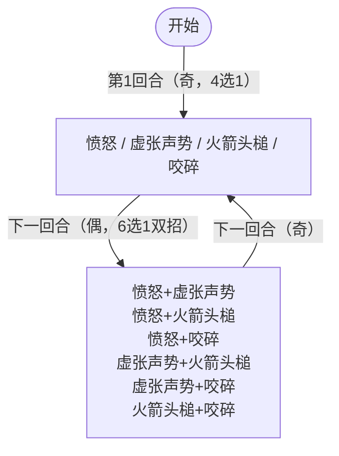

# 钢牙鲨

## 基本信息

| 属性 | 数值 |
|---|---|
| 分类 | [精英怪物](/monsters/elite/) |
| 生命值 | 95 - 100 |
| 被动能力 | 无 |

## 行动逻辑

奇数回合单意图 4 选 1，偶数回合双意图连招 6 选 1，交替循环。

> **说明**：`/` 表示随机选一招，`+` 表示双招连招（本回合连续放两个技能）。奇数回合4选1单招，偶数回合6选1双招。

## 招式

| 招式 | 意图 | 描述 | 数值 |
|---|---|---|---|
| 愤怒 | 愤怒 | 向你的抽牌堆中加入1张**暴怒**。 | 每个敌人抽牌堆 +1 张暴怒 |
| 虚张声势 | 虚张声势 | 自身**力量**、**防御**、**命中**、**速度**+2。 | 自身全属性+2 |
| 火箭头槌 | 火箭头槌 | 造成3点伤害6次。 | 3 伤害 ×6（共 18） |
| 咬碎 | 咬碎 | 造成15点伤害。所有敌人防御-2。 | 伤害 15 + 所有敌人防御-2 |
| 愤怒·虚张声势 | 愤怒 + 虚张声势 | 先愤怒，再虚张声势 | 1 暴怒 + 全属性+2 |
| 愤怒·火箭头槌 | 愤怒 + 火箭头槌 | 先愤怒，再火箭头槌 | 1 暴怒 + 3×6 伤害 |
| 愤怒·咬碎 | 愤怒 + 咬碎 | 先愤怒，再咬碎 | 1 暴怒 + 15 伤害 + 防御-2 |
| 虚张声势·火箭头槌 | 虚张声势 + 火箭头槌 | 先虚张声势，再火箭头槌 | 全属性+2 + 3×6 伤害 |
| 虚张声势·咬碎 | 虚张声势 + 咬碎 | 先虚张声势，再咬碎 | 全属性+2 + 15 伤害 + 防御-2 |
| 火箭头槌·咬碎 | 火箭头槌 + 咬碎 | 先火箭头槌，再咬碎 | 3×6 伤害 + 15 伤害 + 防御-2 |

## 遭遇战

| 遭遇战 | 房间类型 | 池子 | 数量 | 说明 |
|---|---|---|---|---|
| `SeerSteelJawSharkElite` | Elite | 精英池（第一层 Overgrowth） | 1 只 | 无具名位置 |

## 策略提示

1. **奇偶回合节奏是核心**：奇数回合只会出现单个意图（4 选 1），偶数回合必定双意图连招（6 选 1）。偶数回合威胁显著更高（如火箭头槌+咬碎 = 18+15 = 33 伤害 + 防御-2），需预留格挡应对偶数回合。

2. **咬碎削弱防御而非虚弱**：咬碎对所有敌人施加防御-2（负层数防御），而非虚弱。多次咬碎后防御叠减，格挡效率大幅下降。所有含咬碎的连招均附带防御-2 效果。

3. **火箭头槌多段触发力量加成**：3 伤害 × 6 = 18 总伤，多段攻击每段都触发力量加成。配合虚张声势堆叠的力量（每次 +2 力量），火箭头槌的实际伤害会滚雪球式增长：力量 4 时，3×6 + 4×6 = 42 伤害。

4. **愤怒塞暴怒污染抽牌堆**：愤怒向所有敌人抽牌堆塞 1 张暴怒诅咒牌，多次使用后抽牌堆污染严重，影响循环质量。携带净化/消耗手段可应对。

5. **虚张声势滚雪球**：每次全属性 +2（力量/防御/命中/速度），多次使用后钢牙鲨攻防命中速度全面领先。速度提升会增加怪物抽牌数，命中提升会增加攻击命中率。建议速战，避免虚张声势叠加过多。

6. **95~100 血适合 3~4 回合击杀**：钢牙鲨血量适中（95~100），3~4 回合内击杀可在虚张声势叠加 2~3 次前结束战斗，将力量增长控制在可接受范围内（力量 +4~6）。

## 源码

- 怪物：`SeerSteelJawSharkMonster.cs`（生命 95~100，奇数回合单意图 4 选 1 + 偶数回合双意图 6 选 1，`_turnCount % 2` 控制权重）
- 遭遇战：`SeerSteelJawSharkElite.cs`
- 本地化：`monsters.json`（`SEER_MONSTER_SEER_STEEL_JAW_SHARK_MONSTER.*`）、`intents.json`（`SEER_FURY.*`、`SEER_BLUFF.*`、`SEER_ROCKET_HEADBUTT.*`、`SEER_CRUNCH.*`）、`powers.json`（`SEER_POWER_SEER_DEFENSE_POWER.*`）
