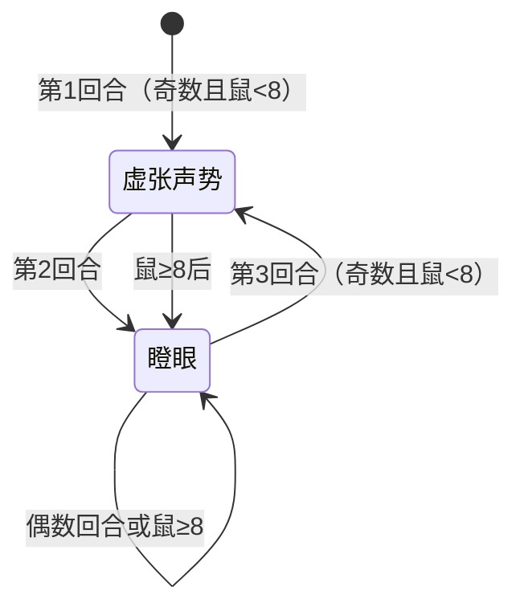

# 天雷鼠

## 基本信息

| 属性 | 数值 |
|---|---|
| 分类 | [精英怪物](/monsters/elite/) |
| 生命值 | 78 - 83 |
| 被动能力 | 无 |

## 行动逻辑

比比鼠 < 8 只且回合奇数时使用虚张声势（召唤），否则使用瞪眼（削属性）。达 8 只后永久只瞪眼。

> **说明**：奇数回合且比比鼠未满 8 只时召唤；其余情况或达 8 只后永久瞪眼。

## 招式

| 招式 | 意图 | 描述 | 数值 |
|---|---|---|---|
| 虚张声势 | 虚张声势 | 召唤1只**比比鼠**。 | 召唤上限 8 只 |
| 瞪眼 | 瞪眼 | 你的**力量**、**防御**、**命中**、**速度**-1。 | 全属性 -1 |

### 召唤物：比比鼠

天雷鼠通过虚张声势召唤的比比鼠，HP 13 - 18，作为召唤物（击杀后不结算掉落）。每回合 2 选 1 随机出招（可重复）：

| 招式 | 意图 | 描述 | 数值 |
|---|---|---|---|
| 撞击 | 攻击 5 | 造成攻击伤害 | 5 伤害 |
| 电火花 | 攻击 3 | 造成攻击伤害，附加固定伤害（下回合开始时结算，无法格挡） | 3 攻击伤害 + 4 固定伤害 |

::: warning 电火花的固定伤害
电火花除 3 点攻击伤害（可格挡）外，还通过固定伤害能力施加 4 点固定伤害（下回合开始时结算，**无法格挡**）。意图图标只显示 3 点攻击伤害，实际威胁为 7 点有效伤害。多只比比鼠同时使用电火花时，固定伤害会快速累积。
:::

## 遭遇战

| 遭遇战 | 房间类型 | 池子 | 数量 | 说明 |
|---|---|---|---|---|
| `SeerThunderMouseElite` | Monster | 强怪池 | 1 只 | 使用具名位置 thundermouse1 |
| `SeerThunderMouseStrongEncounter` | Monster | 强怪池 | 1 只 | 使用具名位置 thundermouse1 |

## 策略提示

1. **召唤链与群体压力快速膨胀**：天雷鼠每 2 回合召唤 1 只比比鼠（奇数回合召唤、偶数回合瞪眼），最多铺场 8 只。比比鼠 HP 仅 13~18，但每只每回合随机使用撞击（5 点攻击伤害）或电火花（3 点攻击 + 4 点固定伤害）。满场 8 只时，群体每回合输出可达 40~56 点伤害，威胁极大。应优先击杀天雷鼠本体以停止召唤。

2. **瞪眼累积削弱全属性**：瞪眼使玩家力量/防御/命中/速度各 -1，每 2 回合触发一次。5 回合后全属性已 -3，速度降低会减少抽牌数（速度影响每回合抽牌量），命中降低会显著增加攻击未命中率，力量降低直接削弱输出。长期战对玩家极为不利，建议 4~5 回合内击杀天雷鼠。

3. **电火花的固定伤害无法格挡**：比比鼠的电火花除 3 点攻击伤害（可格挡）外，还施加 4 点固定伤害（通过固定伤害能力，下回合开始时结算，**无法格挡**）。意图图标只显示 3 点攻击伤害，实际威胁为 7 点有效伤害。多只比比鼠同时使用电火花时，固定伤害会快速累积，需关注血量健康。

4. **比比鼠低血量易清除**：比比鼠 HP 仅 13~18，单次攻击即可击杀，且作为召唤物击杀后不结算掉落。群攻技能可一次性清除多只比比鼠，有效减轻群体压力。但不应过度投入清理比比鼠——应以击杀天雷鼠本体为优先目标，清理召唤物只是辅助手段。

5. **8 只上限后停止召唤**：场上比比鼠达 8 只后，天雷鼠永久只使用瞪眼（不再召唤）。此时不再有新召唤压力，但瞪眼的累积削弱仍持续。若场上已有较多比比鼠且天雷鼠即将停止召唤，应果断集中输出天雷鼠本体，不要在比比鼠上浪费过多回合。

6. **78~83 血适合 4~5 回合击杀**：天雷鼠血量适中（78~83），配合瞪眼的速战要求，4~5 回合内击杀可在比比鼠铺满 8 只前结束战斗（第 5 回合结束时最多 3 只比比鼠），将群体压力控制在可接受范围内。携带群攻牌清理比比鼠 + 集中输出天雷鼠本体是最佳策略。

## 源码

- 怪物：`SeerThunderMouseMonster.cs`（生命 78~83，交替召唤/瞪眼，比比鼠 ≥8 后永久瞪眼）
- 召唤物：`SeerBibiMouseMonster.cs`（生命 13~18，撞击 5 伤害 / 电火花 3+4 固定伤害）
- 遭遇战：`SeerThunderMouseElite.cs`、`SeerThunderMouseStrongEncounter.cs`
- 本地化：`monsters.json`（`SEER_MONSTER_SEER_THUNDER_MOUSE_MONSTER.*`、`SEER_MONSTER_SEER_BIBI_MOUSE_MONSTER.*`）、`intents.json`（`SEER_THUNDER_BLUFF.*`、`SEER_GLARE.*`、`SEER_TACKLE.*`、`SEER_BIBI_SPARK.*`）
