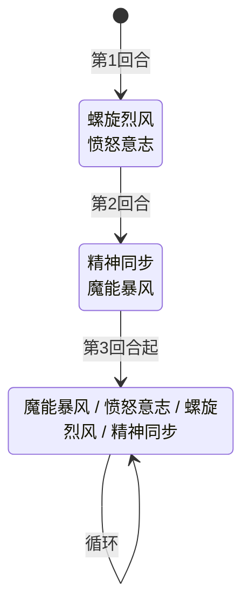

# 提亚斯

> **类型**：精英怪物
> **初始生命**：100 - 107
> **遭遇战**：第一层精英池（Overgrowth）、混合精英池
> **特性**：精神干涉每回合削命中/速度 + 螺旋烈风叠加领地意识滚雪球 + 精神同步三阶段暴击递进 + 愤怒意志双向清 buff

## 被动能力

### 精神干涉（1 层，开局自带）

**在你的回合开始时，你的命中 -1，速度 -1。**

- **施加方式**：怪物加入房间时对自身施加精神干涉（1 层）。
- **触发时机**：玩家回合开始前（仅对方回合开始时触发），对己方所有参与者施加命中 -1 与速度 -1。
- **叠加方式**：单例（不堆叠，层数不随触发增加）；每回合都会施加新的 -1 命中和 -1 速度，层数持续累积。
- **能力类型**：被动（不可消除）。

::: warning 精神干涉的累积效应
精神干涉本身是单例（层数始终为 1），但它每回合施加的 **命中 -1** 和 **速度 -1** 是独立的能力（命中下降/速度下降），会持续叠加。战斗拖得越久，玩家命中越低（攻击更易未命中）、速度越低（出牌节奏被打乱），长期战极为不利。
:::

## 行动逻辑

前 2 回合固定双招连招，第 3 回合起 4 选 1 随机出招（可重复）。

> **说明**：`/` 表示四选一随机出招；双招换行显示。

## 招式表

| 招式名 | 意图 | 类型 | 效果 | 数值 |
|--------|------|------|------|------|
| **螺旋烈风·愤怒意志**（第 1 回合连招） | 螺旋烈风 + 愤怒意志 | 双意图连招 | 先发动螺旋烈风，再发动愤怒意志 | 4 伤害 ×2 + 双向清 buff |
| **精神同步·魔能暴风**（第 2 回合连招） | 精神同步 + 魔能暴风 | 双意图连招 | 先发动精神同步（第 1 次使用→锁定I），再发动魔能暴风 | 锁定I 50% 暴击 + 12 伤害 |
| **魔能暴风** | 魔能暴风 | 攻击 | 造成攻击伤害 | 12 伤害 |
| **愤怒意志** | 愤怒意志 | 双向驱散 | ①清除自身所有能力下降（负面减益） ②清除你所有的能力强化（正面增益） | — |
| **螺旋烈风** | 螺旋烈风 | 多段攻击 + 自身增益 | 造成伤害多次，自身获得领地意识 | 4 伤害 ×2，自身 2 层**领地意识** |
| **精神同步** | 精神同步 | 自身增益（阶段递进） | 首次：暴击率 → 50%（锁定I） 再次：暴击率 → 100%（锁定II，替换锁定I） 三次及以上：下次攻击伤害 ×2 | 阶段递进 |

### 愤怒意志的双向清除机制

愤怒意志的效果是 **对提亚斯有利的双向驱散**：

1. **清除自身能力下降**：移除提亚斯身上的负面减益（如虚弱、易伤、中毒等 Debuff 的正层数，或力量、防御等 Buff 的负层数），**保留**自身的正面增益（如力量、领地意识、锁定等）。
2. **清除敌人能力强化**：移除玩家身上的正面增益（如力量、防御、敏捷等 Buff 的正层数，或虚弱等 Debuff 的负层数），**保留**玩家身上的负面减益（如虚弱、易伤等）。

::: tip 愤怒意志的来源
本地化描述为"清除自身所有能力下降，清除你所有的能力强化"。源码实现通过双向安全驱散（清自身负面、清敌人正面）实现，确保不会误清提亚斯自身的正面增益或玩家身上的负面减益。
:::

### 精神同步的三阶段递进

精神同步的效果取决于提亚斯当前已有的暴击锁定能力：

| 使用次数 | 当前状态 | 动作 | 结果 |
|----------|----------|------|------|
| 第 1 次 | 无锁定 | 施加 [锁定I](/powers/lock_one_power.md) | 暴击率修改为 50% |
| 第 2 次 | 有锁定I | 移除锁定I，施加 [锁定II](/powers/lock_two_power.md) | 暴击率修改为 100% |
| 第 3 次及以上 | 有锁定II | 施加 [精神同步（伤害翻倍）](/powers/next_attack_double_damage_power.md) | 下次攻击伤害 ×2（攻击后移除） |

::: warning 第 2 回合已用 1 次精神同步
第 2 回合的连招"精神同步·魔能暴风"中已包含 1 次精神同步（进入锁定I）。因此第 3 回合起的随机分支中，**首次抽到精神同步即为第 2 次使用**（进入锁定II 100% 暴击），再抽到即为第 3 次（伤害翻倍）。
:::

### 领地意识的滚雪球

螺旋烈风每次使用为提亚斯获得 2 层**领地意识**（增益类型，Counter 堆叠）：

- **效果**：提亚斯回合结束时，获得 `层数` 点力量。
- **滚雪球**：第 1 回合用 1 次螺旋烈风（+2 层→回合结束+2 力量），后续随机分支若再抽到螺旋烈风，层数继续累加，力量增长越来越快。

| 螺旋烈风使用次数 | 领地意识层数 | 每回合获得力量 |
|------------------|--------------|----------------|
| 1 次 | 2 | +2 |
| 2 次 | 4 | +4 |
| 3 次 | 6 | +6 |
| 4 次 | 8 | +8 |

## 遭遇战

| 遭遇战 | 房间类型 | 池子 | 数量 | 说明 |
|--------|----------|------|------|------|
| `SeerTiasElite` | Elite | 第一层精英池（Overgrowth） | 1 只 | 单怪物精英 |
| 混合精英池 | Elite | 第一层混合精英池 | 1 只 | 与[钢牙鲨](steel_jaw_shark_monster)、[里奥斯](rio_monster)、[蘑菇怪](mushroom_monster)混合出现 |

## 策略提示

1. **第 1 回合是压力峰值**：螺旋烈风（4×2=8 点伤害）+ 愤怒意志（清自身 debuff + 清玩家 buff）双意图连招。如果你开局堆叠了力量/防御等 buff，会被愤怒意志直接清空。建议第 1 回合优先格挡伤害，buff 留到愤怒意志之后再铺。

2. **第 2 回合的暴击威胁**：精神同步（第 1 次→50% 暴击）+ 魔能暴风（12 伤害）连招。50% 暴击意味着魔能暴风有概率变成 18 点伤害，需准备足够格挡。此后随机分支若再抽到精神同步，暴击率会升至 100%（锁定II），所有攻击必定暴击。

3. **愤怒意志是反增益利器**：愤怒意志清除玩家所有正面 buff，保留玩家负面 debuff。如果你身上挂着虚弱/易伤等 debuff 又想靠力量/防御 buff 抵消，愤怒意志会拿走抵消用的 buff 留下 debuff。应对方式：在提亚斯即将用愤怒意志时（第 1 回合固定 + 随机分支）不要铺关键 buff。

4. **精神干涉鼓励速战**：每回合命中 -1、速度 -1 持续累积。5 回合后命中 -5，攻击未命中率显著上升；速度降低会打乱出牌节奏。长期战对玩家极为不利，建议 4~5 回合内解决。

5. **领地意识让螺旋烈风越拖越痛**：每次螺旋烈风 +2 层领地意识，回合结束 +2 力量。如果随机分支多次抽到螺旋烈风，提亚斯力量会快速膨胀，后续所有攻击伤害都会被抬高。看到提亚斯领地意识层数较高时，需优先击杀或准备硬扛高伤害。

6. **精神同步第 3 次最危险**：第 3 次精神同步后，下次攻击伤害 ×2（乘法伤害修正返回 2 倍）。配合 100% 暴击（锁定II），一击魔能暴风可达 12×2×1.5=36 点伤害。注意观察提亚斯是否已进入伤害翻倍状态，提前防御。

7. **随机分支的可重复性**：第 3 回合起的随机分支允许连续重复同一招。可能连续 3 回合魔能暴风（36 点伤害），也可能连续 3 回合精神同步（快速进入伤害翻倍）。无法预测，需根据每回合意图灵活应对。

8. **100 血适合 3~4 回合击杀**：配合精神干涉的速战要求，3~4 回合内击杀可避免命中/速度被削太多，也能在领地意识滚起雪球前结束战斗。

## 源码

- 怪物：`SeerTiasMonster.cs`
- 被动能力：`SeerPsychicInterferencePower.cs`
- 意图：`SeerTiasIntents.cs`
- 暴击锁定：`SeerLockOnePower.cs`、`SeerLockTwoPower.cs`
- 伤害翻倍：`SeerNextAttackDoubleDamagePower.cs`
- 领地意识：`TerritorialPower.cs`
- 遭遇战：`SeerTiasElite.cs`、`SeerMixedEliteEncounter.cs`
- 本地化：`monsters.json`、`intents.json`、`powers.json`
