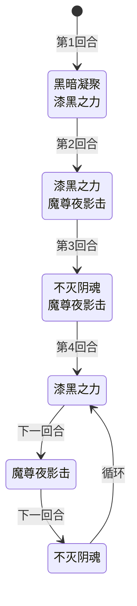

# 伊扎克

> **类型**：精英怪物
> **初始生命**：252 - 257
> **遭遇战**：第二层精英池
> **特性**：混沌暗影受击反弹消耗堆 + 黑暗凝聚召唤三巨头 + 漆黑之力塞状态/诅咒 + 魔尊夜影击差值增伤 + 不灭阴魂按诅咒数叠全属性

## 被动能力

### 混沌暗影（1 层，开局自带）

**受击时将敌方消耗堆中的状态牌与诅咒牌洗回其抽牌堆。**

- **施加方式**：怪物加入房间时对自身施加混沌暗影（1 层）。
- **触发时机**：自身受到伤害且伤害大于 0 时触发。
- **效果**：对每个敌方玩家，将其消耗堆中所有状态牌与诅咒牌以随机顺序洗回该玩家的抽牌堆。
- **叠加方式**：单例（不堆叠）。
- **能力类型**：被动（不可消除）。

::: warning 混沌暗影与漆黑之力的联动
伊扎克的"漆黑之力"会把 5 张状态牌 + 1 张诅咒塞入玩家**消耗堆**。而"混沌暗影"在伊扎克受击时，会把这些卡从消耗堆洗回玩家**抽牌堆**。形成"塞牌 → 玩家攻击伊扎克 → 卡牌反弹回抽牌堆 → 玩家重新抽到污染牌"的循环。用消耗流（自伤消耗状态牌）对抗伊扎克会被动触发反弹，需谨慎。
:::

## 行动逻辑

前 3 回合固定双招，第 4 回合起进入三招循环。

> **说明**：双招换行显示。

## 招式表

| 招式名 | 意图 | 类型 | 效果 | 数值 |
|--------|------|------|------|------|
| **黑暗凝聚·漆黑之力**（第 1 回合连招） | 黑暗凝聚 + 漆黑之力 | 双意图连招 | 先发动黑暗凝聚，再发动漆黑之力 | 召唤三巨头之一 + 5 状态牌 + 1 诅咒 |
| **漆黑之力·魔尊夜影击**（第 2 回合连招） | 漆黑之力 + 魔尊夜影击 | 双意图连招 | 先发动漆黑之力，再发动魔尊夜影击 | 5 状态牌 + 1 诅咒 + 19 伤害（含差值加成） |
| **不灭阴魂·魔尊夜影击**（第 3 回合连招） | 不灭阴魂 + 魔尊夜影击 | 双意图连招 | 先发动不灭阴魂，再发动魔尊夜影击 | 全属性提升（按诅咒数）+ 19 伤害（含差值加成） |
| **黑暗凝聚** | 黑暗凝聚 | 召唤 | 召唤伏魔三巨头之一（泰沃斯/狄修斯/加布三选一，等概率） | 三选一 |
| **漆黑之力** | 漆黑之力 | 牌组污染 | 向你**消耗堆**加入 5 张随机状态牌和 1 张随机赛尔诅咒 | 5 状态牌 + 1 诅咒 |
| **魔尊夜影击** | 魔尊夜影击 | 攻击（差值增伤） | 造成伤害，双方当前生命值每差 1 点，伤害 +1% | 基础 19，公式 19×(1+|双方生命差|×0.01) |
| **不灭阴魂** | 不灭阴魂 | 自身增益 | 自身全属性提升，数值等于你非消耗牌堆（抽牌堆+弃牌堆+手牌）的诅咒数量 | 全属性 +诅咒数（力量/防御/命中/速度各+诅咒数） |

### 魔尊夜影击的差值增伤机制

魔尊夜影击的伤害随双方当前生命值差值线性增长：

**伤害公式**：`19 × (1 + |伊扎克当前生命 - 目标当前生命| × 0.01)`

| 双方生命差值 | 伤害 |
|--------------|------|
| 0（同血量） | 19 |
| 50 | 28 |
| 100 | 38 |
| 150 | 47 |
| 200 | 57 |

::: warning 满血时威胁最大
伊扎克血量 252~257，玩家满血时差值最大（约 180~210），魔尊夜影击伤害可达 52~58。玩家血量越低，差值越小，伤害反而降低。这与大多数怪物"残血更危险"的逻辑相反——保持中高血量反而更危险，适当压低自身血量可减少魔尊夜影击伤害。
:::

### 不灭阴魂的诅咒计数

不灭阴魂统计玩家**非消耗牌堆**（抽牌堆 + 弃牌堆 + 手牌）中的诅咒牌数量，给伊扎克自身四项属性各加等量层数：

- 力量 +诅咒数
- 防御 +诅咒数
- 命中 +诅咒数
- 速度 +诅咒数

::: tip 漆黑之力的诅咒不计入不灭阴魂
漆黑之力塞入的诅咒进入玩家**消耗堆**，而不灭阴魂只统计**非消耗牌堆**的诅咒。因此漆黑之力塞的诅咒不会直接被不灭阴魂计算。但如果混沌暗影触发（伊扎克受击），消耗堆的诅咒被洗回抽牌堆，就会计入不灭阴魂的统计。
:::

### 黑暗凝聚的召唤池

黑暗凝聚从伏魔三巨头中等概率召唤一只：

| 召唤结果 | 怪物 |
|----------|------|
| 第 1 种 | [泰沃斯](/monsters/normal/taiwosi_monster) |
| 第 2 种 | [狄修斯](/monsters/normal/dixius_monster) |
| 第 3 种 | [加布](/monsters/normal/jiabu_monster) |

被召唤的怪物带有仆从标记（召唤物），击败后不结算掉落。

## 遭遇战

| 遭遇战 | 房间类型 | 池子 | 数量 | 说明 |
|--------|----------|------|------|------|
| `SeerYizhakeElite` | Elite | 第二层精英池 | 1 只 | 主怪位于 slot1；预留 summon1/summon2 供黑暗凝聚召唤三巨头使用 |

## 策略提示

1. **第 1 回合召唤 + 塞牌**：黑暗凝聚召唤三巨头之一 + 漆黑之力塞 5 状态 + 1 诅咒到消耗堆。召唤物需优先处理（否则双怪夹击），但伊扎克本体威胁更大。建议第 1 回合优先清召唤物，第 2 回合起集中打伊扎克。

2. **魔尊夜影击反直觉：满血更危险**：魔尊夜影击伤害随双方生命差值增长，玩家满血时差值最大（约 180~210），伤害可达 52~58。适当压低自身血量（如自伤卡牌）可降低魔尊夜影击伤害，但要注意别压得太低被其他攻击击杀。

3. **不灭阴魂依赖诅咒数**：不灭阴魂按玩家非消耗牌堆的诅咒数叠全属性。如果你的牌组本身诅咒较多（如拿了诅咒遗物），不灭阴魂会大幅强化伊扎克。漆黑之力塞的诅咒在消耗堆时不计入，但混沌暗影触发后会洗回抽牌堆被计入。

4. **混沌暗影惩罚消耗流**：每次攻击伊扎克都会触发混沌暗影，把消耗堆的状态/诅咒洗回抽牌堆。如果你用消耗流（如自伤消耗状态牌），这些牌会被反复洗回，污染抽牌堆。应对方式：避免在伊扎克战中依赖消耗机制，或尽快击杀减少触发次数。

5. **三回合循环可预测**：第 4 回合起固定"漆黑之力 → 魔尊夜影击 → 不灭阴魂"循环。可提前预判：漆黑之力回合准备净化/消耗手段，魔尊夜影击回合准备格挡（注意差值），不灭阴魂回合注意诅咒数别太多。

6. **252~257 血是高血量精英**：伊扎克血量远高于第一层精英（如里奥斯 98~103、提亚斯 100~107），需 5~7 回合击杀。配合三回合循环，至少会经历 2 轮完整循环。长期战会累积大量状态/诅咒污染，建议带净化或消耗牌组应对。

7. **召唤物优先级**：召唤的泰沃斯/狄修斯/加布是普通怪物血量（非精英），且带仆从标记不结算掉落。如果召唤物威胁不大（如加布的振翅被破后退化），可无视召唤物直击伊扎克；如果召唤物有高伤害技能（如狄修斯），需优先清除。

8. **差值增伤的双刃剑**：伊扎克自身血量也会随战斗降低。伊扎克残血时，与满血玩家的差值更大，魔尊夜影击更痛；但伊扎克残血也意味着即将击杀。权衡"压低伊扎克血量加速击杀"与"魔尊夜影击伤害抬升"的利弊。

## 源码

- 怪物：`SeerYizhakeMonster.cs`（生命 252~257，前 3 回合双意图连招 + 第 4 回合起三回合循环）
- 被动能力：`SeerChaosShadowPower.cs`（受击时把敌方消耗堆状态/诅咒洗回抽牌堆）
- 意图：`SeerYizhakeIntents.cs`（黑暗凝聚、漆黑之力、魔尊夜影击、不灭阴魂意图）
- 遭遇战：`SeerYizhakeElite.cs`（第二层精英池，预留 summon 槽位）
- 召唤池：`SeerTaiwosiMonster`、`SeerDixiusMonster`、`SeerJiabuMonster`（伏魔三巨头）
- 本地化：`monsters.json`（`SEER_MONSTER_SEER_YIZHAKE_MONSTER.*`）、`intents.json`（`SEER_DARK_GATHER.*`、`SEER_DARK_POWER.*`、`SEER_DARK_STRIKE.*`、`SEER_UNDYING_SPIRIT.*`）、`powers.json`（`SEER_POWER_SEER_CHAOS_SHADOW_POWER.*`）
