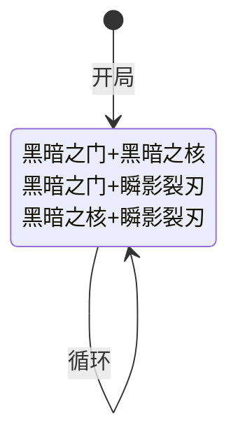

# 尤纳斯

> **类型**：精英怪物
> **初始生命**：58 - 63
> **遭遇战**：第二层精英池、四尤纳斯事件
> **特性**：暗影屏障三阶段减伤链（滑溜→无实体→复活缓冲） + 瞬影裂刃回合叠加 + 黑暗充能球 + 黑暗之门速度削减

## 被动能力

### 暗影屏障（1 层，开局自带）

**战斗开始时获得 12 层滑溜。滑溜消失后获得 2 层无实体。首次死亡后，回复至 1 点生命值并获得 5 层缓冲。**

- **施加方式**：怪物加入房间时对自身施加暗影屏障（1 层），同时通过施加钩子自动施加 12 层滑溜。
- **三阶段减伤链**：

| 阶段 | 触发条件 | 效果 | 持续 |
|------|----------|------|------|
| **滑溜** | 开局自带 | 每次受到未格挡伤害（未格挡伤害 ≥ 1）时，减 1 层滑溜并将该次生命损失降为 1 点 | 12 次有效攻击后消失 |
| **无实体** | 滑溜消耗完毕后仅触发一次 | 获得 2 层无实体，受到的所有伤害降为 1 | 2 次有效攻击后消失 |
| **复活** | 首次死亡时仅触发一次 | 阻止死亡，恢复至 1 血，获得 5 层缓冲 | 缓冲 5 次有效攻击后消失 |

- **复活期间保护**：复活过程中自身受到伤害为 0（乘法伤害修正返回 0）、拒收所有能力施加（施加量返回 0）、不可被选中攻击、阻止战斗结束。
- **死亡不移除**：能力在死亡状态下仍能生效（确保复活逻辑可触发）。
- **能力类型**：被动（不可消除）。

::: warning 滑溜是损1血，不是免伤
滑溜（原版滑溜能力）的机制是：每次受到未格挡伤害 ≥1 时，减 1 层滑溜并将该次**生命损失降为 1 点**（仍然掉血，只是只掉 1 点），而非"伤害归零/免伤"。12 层滑溜意味着前 12 次有效攻击每次只造成 1 点伤害，共掉 12 血。滑溜消耗完后才会正常掉血。
:::

::: tip 复活的关键修复
实际复活逻辑有一个关键修复：在阻止死亡后，必须**先重置复活标记**，再施加缓冲。否则能力施加会因复活标记仍为真而被自身免疫机制拒绝，导致复活后无缓冲保护。
:::

## 行动逻辑

开局自带三阶段减伤链（滑溜12层→无实体2层→缓冲5层+复活），每回合 3 选 1 随机双招组合。

> **说明**：每回合随机选一种双招组合（三选一），双招连续施放，组合内两个技能用+连接。

## 招式表

| 招式名 | 意图 | 类型 | 效果 | 数值 |
|--------|------|------|------|------|
| **黑暗之门·黑暗之核** | 黑暗之门 + 黑暗之核 | 双意图连招 | 先发动黑暗之门，再发动黑暗之核 | 12 伤害 + 速度 -1 + 力量 +3 + 1 黑暗充能球 |
| **黑暗之门·瞬影裂刃** | 黑暗之门 + 瞬影裂刃 | 双意图连招 | 先发动黑暗之门，再发动瞬影裂刃 | 12 伤害 + 速度 -1 + 4 伤害 ×回合数 |
| **黑暗之核·瞬影裂刃** | 黑暗之核 + 瞬影裂刃 | 双意图连招 | 先发动黑暗之核，再发动瞬影裂刃 | 力量 +3 + 1 黑暗充能球 + 4 伤害 ×回合数 |
| **黑暗之门** | 黑暗之门 | 攻击 + 削弱 | 造成伤害，所有敌人速度 -1 | 12 伤害，速度 -1 |
| **黑暗之核** | 黑暗之核 | 自身增益 | 自身力量 +3，获得 1 个黑暗充能球 | 力量 +3 + 1 球 |
| **瞬影裂刃** | 瞬影裂刃 | 多段攻击 | 造成伤害多次，攻击次数等于当前回合数 | 4 伤害 ×回合数 |

### 瞬影裂刃的回合叠加

瞬影裂刃的攻击次数 = 当前回合数（初始为 1，每个组合执行后 +1）：

| 回合 | 攻击次数 | 单次伤害 | 总伤害 |
|------|----------|----------|--------|
| 第 1 回合 | 1 | 4 | 4 |
| 第 2 回合 | 2 | 4 | 8 |
| 第 3 回合 | 3 | 4 | 12 |
| 第 4 回合 | 4 | 4 | 16 |
| 第 5 回合 | 5 | 4 | 20 |
| 第 6 回合 | 6 | 4 | 24 |

::: warning 配合黑暗之核的力量加成
如果瞬影裂刃与黑暗之核同回合使用（黑暗之核·瞬影裂刃），黑暗之核先施加力量 +3，瞬影裂刃的每次攻击都会 +3 伤害。第 6 回合时：6×(4+3)=42 伤害，威胁极大。
:::

### 黑暗充能球机制

黑暗之核每次使用生成 1 个黑暗充能球（最多 2 个），模仿原版黑暗充能球：

- **初始激发值**：6
- **被动效果（回合结束）**：每球激发值 +6
- **激发（满槽再生成）**：对生命值最少的敌人造成该球当前激发值的伤害，然后移除该球
- **伤害类型**：非攻击伤害（不受力量/暴击/易伤/虚弱影响）

| 球存在回合数 | Evoke 值 | 激发伤害 |
|--------------|----------|----------|
| 刚 Channel | 6 | 6 |
| 存活 1 回合 | 12 | 12 |
| 存活 2 回合 | 18 | 18 |
| 存活 3 回合 | 24 | 24 |

## 遭遇战

| 遭遇战 | 房间类型 | 池子 | 数量 | 说明 |
|--------|----------|------|------|------|
| `SeerYounasElite` | Elite | 第二层精英池 | 1 只 | 单怪精英 |
| `SeerEventFourYounasEncounter` | Monster | 事件遭遇战 | 4 只 | 无奖励；房间类型为 Monster（非 Event，避免存档加载崩溃） |

## 策略提示

1. **三阶段减伤链总穿透需求**：滑溜 12 次（每次只损 1 血，共损 12）+ 无实体 2 次（每次只损 1 血，共损 2）+ 剩余血量 46（60−12−2）+ 复活后 1 血 + 缓冲 5 次致命伤害被阻止。多段攻击是穿透滑溜和无实体的关键——每段都能消耗 1 层，且每段只损 1 血。

2. **瞬影裂刃越拖越痛**：瞬影裂刃攻击次数 = 回合数，第 5 回合起单次瞬影裂刃可造成 20+ 伤害。配合黑暗之核的力量 +3，第 6 回合"黑暗之核·瞬影裂刃"可达 6×7=42 伤害。速战速决至关重要，建议 4 回合内击杀。

3. **黑暗充能球自动激发**：尤纳斯回合结束时每球激发值 +6，满槽（2 球）再使用黑暗之核会激发最旧的球，对最弱玩家造成激发值伤害（非攻击伤害，不受减伤影响）。存活 3 回合的球激发 24 点非加成伤害，需关注充能球进度。

4. **黑暗之门削速度**：每次黑暗之门使所有玩家速度 -1，多次叠加会减少抽牌数（速度影响抽牌）。长期战不仅瞬影裂刃伤害膨胀，抽牌也会受限，进一步恶化局势。

5. **滑溜阶段用多段攻击破**：滑溜 12 层，每次未格挡伤害 ≥1 减 1 层并将该次生命损失降为 1。多段攻击（如多段充能球、多段攻击牌）每段都能破 1 层滑溜，且每段只损 1 血，是高效穿透滑溜的手段。12 层滑溜全破共只损 12 血。

6. **无实体阶段伤害降为 1**：滑溜破完后获得 2 层无实体，受到的伤害降为 1。这 2 次攻击每次只造成 1 点伤害，是输出的低效期。可以用低费攻击牌蹭掉无实体层数，再用爆发输出。

7. **复活后优先破缓冲**：首次死亡后复活至 1 血 + 5 层缓冲。缓冲机制是每次受到致命伤害时减 1 层并阻止死亡，相当于 5 次免死。复活后优先用多段攻击快速破掉 5 层缓冲，再用爆发输出收掉 1 血。

8. **4 尤纳斯事件极危险**：4 只尤纳斯同时出现，每只独立计算暗影屏障减伤链与瞬影裂刃回合数。第 3 回合起 4 只尤纳斯同时瞬影裂刃，群体压力极大。该事件战无奖励，遇到优先考虑速清或逃跑。

## 源码

- 怪物：`SeerYounasMonster.cs`
- 被动能力：`SeerShadowBarrierPower.cs`
- 黑暗充能球：`SeerDarkOrbCounterPower.cs`
- 意图：`SeerYounasIntents.cs`
- 遭遇战：`SeerYounasElite.cs`、`SeerEventFourYounasEncounter.cs`
- 本地化：`monsters.json`、`intents.json`、`powers.json`
