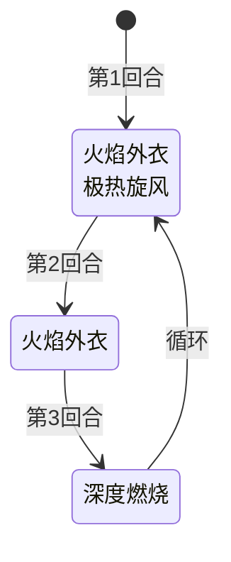

# 安妮

> **类型**：普通怪物
> **初始生命**：120 - 125
> **遭遇战**：第一、二层普通战斗
> **特性**：小熊怒气驱动一切——烧伤层数、深度燃烧伤害、强制结束回合都由小熊层数决定

## 被动能力（开局自带）

| 名称 | 类型 | 效果 |
|------|------|------|
| **[小熊](/powers/bear_power.md)**（4 层） | 能力（不可消除） | 受到卡牌伤害时累积怒气，每满 10 层强行结束敌方回合 |

::: tip 小熊怒气细节
- 每次受到卡牌伤害（总伤害 > 0 且有卡牌来源）时 +1 层
- 多段攻击的每一段都独立触发 +1（如 3 段连击 = +3 层）
- 累积到 10 的倍数时强制结束所有敌方玩家的回合
- 小熊层数同时驱动安妮的三招：极热旋风的烧伤层数 = 小熊层数、深度燃烧的伤害 = 小熊层数、火焰外衣根据小熊层数个位决定增益
:::

## 行动逻辑

安妮开局使用 Combo「火焰外衣·极热旋风」，之后进入三招循环：火焰外衣 → 深度燃烧 → 火焰外衣·极热旋风 → 火焰外衣 → 深度燃烧 → ……

> **说明**：双招换行显示。

## 招式表

| 招式名 | 意图 | 类型 | 效果 |
|--------|------|------|------|
| **火焰外衣·极热旋风** | 火焰外衣 + 极热旋风（双意图） | Combo | 依次执行火焰外衣和极热旋风 |
| **火焰外衣** | 火焰外衣 | 自身增益 | 获得 2 层[荆棘](/powers/thorns_power.md)；若小熊层数个位 < 5，小熊 +5；若个位 ≥ 5，自身[防御](/powers/defense_power.md) +5 |
| **极热旋风** | 攻击 15 | 攻击 + Debuff | 造成 15 点攻击伤害，对所有敌方施加[烧伤](/powers/burn_power.md)，层数 = 当前小熊层数 |
| **深度燃烧** | 深度燃烧 | 攻击 | 造成等于当前小熊层数的攻击伤害；若任意敌方有烧伤，伤害翻倍 |

::: warning 火焰外衣的小熊阈值
火焰外衣根据小熊层数的**个位数**决定效果：
- 个位 < 5：小熊 +5（自我增长怒气，让后续招式更强）
- 个位 ≥ 5：自身防御 +5（转向防御姿态）

例如开局小熊 = 4，个位 = 4 < 5 → 小熊 +5 变为 9。下一轮循环时小熊 = 9，个位 = 9 ≥ 5 → 防御 +5。
:::

## 烧伤机制

| 属性 | 数值 |
|------|------|
| 中文名 | [烧伤](/powers/burn_power.md) |
| 每回合伤害 | 受到烧伤层数对应的伤害（每回合开始时结算） |
| 攻击减益 | 攻击伤害降低 |
| 持续时间 | 每回合 -1 层 |

安妮的烧伤层数 = 施加时的小熊层数。开局 Combo 中火焰外衣先把小熊从 4 加到 9，随后极热旋风施加 9 层烧伤——这是安妮最危险的开局爆发。

## 遭遇战

| 遭遇战 | 池子 | 数量 | 说明 |
|--------|------|------|------|
| 弱怪池 | 弱怪池 | 1 只 | 单只安妮 |
| 强怪池 | 强怪池 | 1 只 | 与 2 只[坤格](/monsters/normal/kunge_monster)同行 |

## 策略提示

1. **小熊层数是安妮的核心引擎**：三招全部依赖小熊层数——极热旋风的烧伤 = 小熊层数，深度燃烧的伤害 = 小熊层数（有烧伤时翻倍），火焰外衣根据小熊个位决定增益。控制小熊层数 = 控制安妮的威胁。

2. **慎用多段攻击**：小熊每受一次卡牌伤害 +1，多段攻击的每段都算一次。一张 3 段连击直接 +3 层小熊，可能直接触发强制结束回合。打安妮时优先用单次高伤牌而非多段低伤牌。

3. **开局 Combo 是最大威胁**：第 1 回合 Combo 先把小熊从 4 加到 9，再施加 9 层烧伤。第 3 回合深度燃烧造成 9 点伤害（有烧伤翻倍 = 18 点）。如果不清掉烧伤或准备格挡，第 3 回合会被打很痛。烧伤每回合 -1，到第 3 回合还有 7 层（仍然翻倍），所以必须在第 2 回合就想办法清烧伤或准备足够格挡。

4. **荆棘会越叠越高**：每次火焰外衣都 +2 荆棘，循环 3 轮后荆棘 = 6。用多段攻击打安妮既叠小熊又吃荆棘反伤，双重亏。荆棘在受到攻击伤害前反弹，多段攻击会触发多次反伤。

5. **小熊自我增长的节奏**：火焰外衣在个位 < 5 时会 +5 小熊，这意味着安妮的怒气会自我成长，即使你不打她她也在变强。不宜久战，越拖深度燃烧伤害越高。

6. **坤格配合下的双重压力**：强怪池遭遇中安妮 + 2 只坤格同场，坤格不会触发安妮的小熊（小熊仅安妮自身受击时累积），但需要同时应对多目标输出。优先击杀坤格减轻压力，但注意安妮的小熊在你不打她的回合也会通过火焰外衣自我增长。

## 源码

- 怪物：`SeerAnnieMonster.cs`
- 被动能力：`SeerBearPower.cs`（小熊）、`SeerBurnPower.cs`（烧伤）
- 本地化：`monsters.json`（`SEER_MONSTER_SEER_ANNIE_MONSTER.*`）、`intents.json`（`SEER_FLAME_CLOAK.*`、`SEER_EXTREME_HOT_WIND.*`、`SEER_DEEP_BURN.*`）、`powers.json`（`SEER_POWER_SEER_BEAR_POWER.*`、`SEER_POWER_SEER_BURN_POWER.*`）
