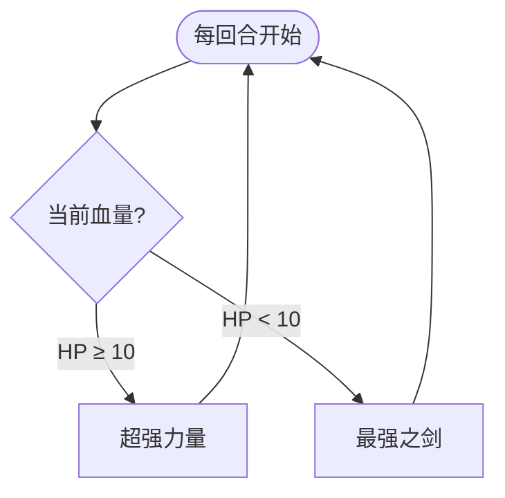

# 攻击史莱姆

## 基本信息

| 属性 | 数值 |
|---|---|
| 分类 | [普通怪物](/monsters/normal/) |
| 生命值 | 32 - 37 |
| 被动能力 | [力量](#力量5-层)（5 层） |

## 行动逻辑

由当前生命值驱动出招：血量 ≥ 10 时使用「超强力量」叠加力量；血量 < 10 时使用「最强之剑」输出伤害。每回合重新判定血量。

> **说明**：每回合根据当前血量重新选择招式。

## 招式

| 招式 | 意图 | 描述 | 数值 |
|---|---|---|---|
| 最强之剑 | 攻击 | 造成20点伤害。 | 伤害 20（+力量加成） |
| 超强力量 | 超强力量 | 自身**力量**翻倍。 | 当前力量层数 ×2 |

## 被动能力

### 力量（5 层）

原版力量能力：每点力量使造成的攻击伤害 +1。

- **初始层数**：5（怪物加入房间时施加）。
- **与招式联动**：「超强力量」每次执行都将当前力量层数翻倍（5 → 10 → 20 → 40 → ...），呈指数增长。
- **伤害公式**：「最强之剑」基础伤害 20 + 当前力量层数。

## 遭遇战

| 遭遇战 | 房间类型 | 池子 | 数量 | 说明 |
|---|---|---|---|---|
| `SeerAttackSlimeWeakEncounter` | Monster | 弱怪池 | 1 只 | 位置 attackslime1 |
| `SeerAttackSlimeTripleWeakEncounter` | Monster | 弱怪池 | 3 只 | 位置 slime1/slime2/slime3 |
| `SeerLeafSlimeAttackStrongEncounter` | Monster | 强怪池 | 2 只 | 叶子史莱姆 ×1（位置 leaf1）+ 攻击史莱姆 ×1（位置 slime1） |

## 策略提示

1. **力量指数增长是核心威胁**：开局自带 5 层力量，「超强力量」每次将当前力量翻倍——5 → 10 → 20 → 40 → 80。只要它一直血量 ≥ 10，力量会以 2 的幂次膨胀。第 3 回合力量已达 20，此时切到「最强之剑」将造成 20 + 20 = 40 点攻击伤害，几乎足以秒杀满血角色。必须在 2 回合内击杀或将其打到 10 血以下。

2. **血量阈值的战术陷阱**：血量 ≥ 10 时只用「超强力量」叠力量（不攻击），血量 < 10 时切换为「最强之剑」输出。这意味着把它打到低血量反而触发了攻击模式——但此时它只累计了少量力量翻倍（通常 1~2 次），「最强之剑」伤害约 25~30。如果让它自然在高血量叠力量再被打到低血，伤害会爆炸性增长。最优策略是在血量 ≥ 10 阶段全力输出，趁它只叠力量不攻击时一波带走。

3. **最强之剑受力量加成**：「最强之剑」基础伤害 20 + 当前力量层数。攻击伤害，可被格挡、受[易伤](/powers/vulnerable_power.md)放大、受[虚弱](/powers/weak_power.md)削弱。如果攻击史莱姆力量已叠高（如 40 层），「最强之剑」伤害 = 60，配合易伤可达 90。施加虚弱可降低 25% 伤害（60 → 45），但仍很致命。

4. **三只共斗优先集火**：弱怪池 3 只攻击史莱姆遭遇战中，每只独立叠力量。如果 3 只同时存活到第 3 回合，3 只各自力量 20，一旦切到最强之剑总伤 = 3 × 40 = 120。必须第一回合集火一只，第二回合再杀一只，把同时存活的数量降到最低。

5. **消除力量是有效反制**：力量是原版 Buff 类型，可被消除 Buff 类卡牌清除。清除后攻击史莱姆力量归零，需重新从 0 开始翻倍。但消除 Buff 卡牌本身消耗资源，且攻击史莱姆每回合仍会继续用「超强力量」重新叠加，效果有限。不如直接用爆发伤害速杀。

6. **固定伤害/流失伤害无视防御**：攻击史莱姆没有格挡或防御能力，所有伤害类型都有效。但 32~37 血量极低，普通攻击牌 1~2 回合即可击杀，无需特殊伤害类型。重点是在它叠力量之前速杀。

## 源码

- 怪物：`SeerAttackSlimeMonster.cs`
- 被动能力：原版 `StrengthPower.cs`（开局施加 5 层）
- 遭遇战：`SeerAttackSlimeWeakEncounter.cs`、`SeerAttackSlimeTripleWeakEncounter.cs`、`SeerLeafSlimeAttackStrongEncounter.cs`
- 本地化：`monsters.json`（`SEER_MONSTER_SEER_ATTACK_SLIME_MONSTER.*`）、`intents.json`（`SEER_STRONGEST_SWORD.*`、`SEER_SUPER_STRENGTH.*`）
