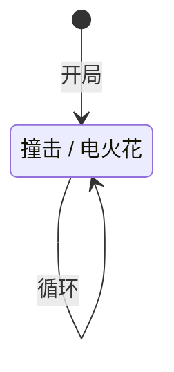

# 比比鼠

## 基本信息

| 属性 | 数值 |
|---|---|
| 分类 | [普通怪物](/monsters/normal/) |
| 生命值 | 13 - 18 |

## 行动逻辑

每回合在「撞击」和「电火花」之间等概率随机选择，允许连续重复。

> **说明**：`/` 表示二选一随机出招，可连续重复。

## 招式

| 招式 | 意图 | 描述 | 数值 |
|---|---|---|---|
| 撞击 | 攻击 | 造成5点伤害。 | 伤害 5 |
| 电火花 | 电火花 | 造成3点伤害，附加4点**固定伤害**。 | 伤害 3 + 固定伤害 4 |

## 遭遇战

| 遭遇战 | 房间类型 | 池子 | 数量 | 说明 |
|---|---|---|---|---|
| `SeerBibiMouseWeakEncounter` | Monster | 弱怪池 | 3 只 | 三只比比鼠 |

## 策略提示

1. **电火花的固定伤害无法格挡**：「电火花」造成 3 点攻击伤害 + 4 点[固定伤害](/mechanics/fixed-damage)（下回合开始时结算）。攻击伤害可被格挡，但固定伤害无法格挡——即使你加满格挡，下回合仍会流失 4 点生命。单回合总伤 = 7 点，是「撞击」5 点伤害的 1.4 倍。电火花是比比鼠更危险的招式。

2. **三只共斗前期减员是关键**：弱怪池遭遇战固定 3 只比比鼠同场，每只独立随机出招。最坏情况 3 只同时电火花 = 3 × 3 = 9 点攻击伤害 + 3 × 4 = 12 点固定伤害，总伤 21 伤害/轮。前期血量有限时 21 伤害/轮压力极大，必须第一回合集火一只（13~18 血一回合可杀），把威胁从 3 只降到 2 只。

3. **13~18 血量极低，一回合可杀**：比比鼠血量是全游戏最低档之一，前期任何中等伤害攻击牌（8~10 伤害）配合先制或速度即可一回合击杀。优先在第一回合减员，避免拖延后固定伤害累积。

4. **随机出招不可预判**：每回合在「撞击」和「电火花」之间等概率随机选择（各 50%），允许连续重复。无法精确预判下回合出哪招，但两招伤害差距不大（5 vs 7），不需要针对特定招式准备——重点是速杀。

5. **被雷鼠召唤时的应对**：比比鼠通常作为雷鼠的召唤物出现。雷鼠遭遇战中，雷鼠会用「虚张声势」召唤最多 8 只比比鼠。场上比比鼠越多，电火花的固定伤害总量越高。建议优先清理比比鼠（血量低、易杀），再集中火力击杀雷鼠本体。

6. **固定伤害免疫可完全应对**：如果你拥有[固定伤害免疫](/powers/immune_fixed_damage_power.md)能力，电火花的固定伤害部分会被完全抵消，只剩 3 点攻击伤害。但比比鼠血量极低，通常不需要专门准备固定伤害免疫——直接速杀更高效。

## 源码

- 怪物：`SeerBibiMouseMonster.cs`
- 意图实现：`SeerMouseIntents.cs`
- 遭遇战：`SeerBibiMouseWeakEncounter.cs`
- 本地化：`monsters.json`（`SEER_MONSTER_SEER_BIBI_MOUSE_MONSTER.*`）、`intents.json`（`SEER_TACKLE.*`、`SEER_BIBI_SPARK.*`）
