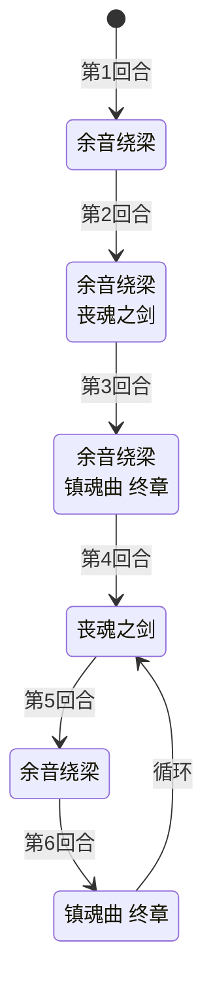

# 布鲁克

> **类型**：普通怪物
> **初始生命**：122 - 127
> **遭遇战**：第三层强怪池
> **特性**：三招联动——塞状态牌 → 消耗状态牌 → 按消耗牌堆数量平方造成伤害

## 被动能力

无。

## 行动逻辑

布鲁克开局固定 4 回合序列，之后进入 3 招循环。

**开局序列**（第 1~4 回合）：余音绕梁 → 余音绕梁·丧魂之剑 → 余音绕梁·镇魂曲 → 丧魂之剑

**循环阶段**（第 5 回合起）：余音绕梁 → 镇魂曲 终章 → 丧魂之剑 → 余音绕梁 → ……

> **说明**：双招换行显示。

## 招式表

| 招式名 | 意图 | 类型 | 效果 |
|--------|------|------|------|
| **余音绕梁** | 余音绕梁 | 干扰 | 向每位玩家手牌加入 1 张[杂音](/cards/status/noise) + 2 张**灵魂** |
| **丧魂之剑** | 攻击 15 | 攻击 + 消耗 | 造成 15 点攻击伤害（受力量/易伤加成，可被格挡），将每位玩家手牌、抽牌堆、弃牌堆中所有的灵魂和状态牌移至消耗牌堆 |
| **镇魂曲 终章** | 镇魂曲 终章 | 普通伤害 | 造成等于每位玩家消耗牌堆数量平方的伤害（意图显示为 0，实际伤害极高）。**伤害类型**：直接伤害 + 攻击伤害（受力量加成）——受[力量](/powers/strength_power.md)/[易伤](/powers/vulnerable_power.md)加成、可被格挡，但**不会触发"受攻击时"hook**（如反伤、振翅 -1） |
| **余音绕梁·丧魂之剑** | 余音绕梁 + 丧魂之剑（双意图） | Combo | 依次执行余音绕梁和丧魂之剑 |
| **余音绕梁·镇魂曲** | 余音绕梁 + 镇魂曲 终章（双意图） | Combo | 依次执行余音绕梁和镇魂曲 终章 |

::: warning 招式联动链
1. **余音绕梁**向手牌塞 3 张状态牌（1 杂音 + 2 灵魂）
2. **丧魂之剑**把这些状态牌全部移到消耗牌堆
3. **镇魂曲 终章**按消耗牌堆数量平方造成伤害

消耗牌堆越多，镇魂曲 终章越致命：3 张 = 9 伤，5 张 = 25 伤，8 张 = 64 伤。
:::

::: warning 镇魂曲 终章的伤害类型
镇魂曲 终章使用直接伤害（受力量加成的攻击伤害）而非普通攻击伤害：
- ✅ 受[力量](/powers/strength_power.md)加成（属于攻击伤害）
- ✅ 受[易伤](/powers/vulnerable_power.md)加成（1.5 倍）
- ✅ 可被**格挡**抵消
- ❌ **不触发"受攻击时"hook**——不会触发反伤（如荆棘）、不会消耗[振翅](/powers/flutter_power.md)层数、不会触发"被攻击时获得 X"类能力
- 意图伤害显示为 0，必须自行计算消耗牌堆数量平方
:::

## 特殊状态牌

| 牌名 | 类型 | 效果 |
|------|------|------|
| [杂音](/cards/status/noise) | 状态牌 | 回合开始时自我复制一份到手牌（会不断增殖） |
| **灵魂** | 状态牌（原版） | 抽 1 张牌 |

::: tip 杂音的增殖性
杂音每回合自我复制，如果不主动消耗或打出，手牌会被杂音占满。丧魂之剑会把杂音移到消耗牌堆，反而让镇魂曲 终章更痛——但如果不移走杂音，手牌会被挤爆。这是一个两难选择。
:::

## 遭遇战

| 遭遇战 | 池子 | 数量 | 说明 |
|--------|------|------|------|
| 强怪池 | 强怪池 | 1 只 | 单只布鲁克 |

## 策略提示

1. **镇魂曲 终章的意图显示是 0，别被骗了**：镇魂曲 终章的意图显示伤害为 0，但实际造成消耗牌堆数量平方的伤害。消耗牌堆 5 张 = 25 伤，8 张 = 64 伤。看到镇魂曲 终章意图时，必须根据当前消耗牌堆数量预判真实伤害。**此伤害可被格挡**（不是不可格挡伤害），但意图不显示数值，需要主动计算并准备格挡牌。

2. **开局 4 回合序列是最大威胁窗口**：第 2 回合 Combo「余音绕梁·丧魂之剑」同时塞牌 + 消耗，第 3 回合 Combo「余音绕梁·镇魂曲」塞牌 + 平方伤害。到第 3 回合时消耗牌堆可能已有 5~6 张（3 张状态牌 + 玩家自己消耗的牌），镇魂曲可能造成 25~36 伤。第 2 回合必须准备足够格挡。

3. **杂音会增殖，但不能不处理**：杂音每回合自我复制，不处理会让手牌爆满。但丧魂之剑把杂音移到消耗牌堆后，镇魂曲 终章会更痛。最佳策略是在丧魂之剑之前手动打出或消耗掉杂音，减少进入消耗牌堆的数量。

4. **不要主动消耗自己的牌**：布鲁克的镇魂曲 终章按消耗牌堆总数量平方计算伤害，包括你自己消耗的牌。打布鲁克时尽量避免使用消耗类卡牌，否则在给镇魂曲 终章递弹药。

5. **丧魂之剑只移灵魂和状态牌**：丧魂之剑只移动手牌、抽牌堆、弃牌堆中的灵魂和状态牌到消耗牌堆，不会影响普通牌。所以不用担心核心牌被消耗，但要留意消耗牌堆的总量增长。

6. **镇魂曲 终章不触发"受攻击时"hook**：镇魂曲 终章使用直接伤害（受力量加成的攻击伤害）而非普通攻击伤害，所以**不会触发"被攻击时"类能力**——荆棘不反伤、振翅不减层、不触发"被攻击获得 X"类能力。如果你的牌组依赖反伤或受击触发，对镇魂曲 终章无效。

7. **122~127 血量需要持续输出**：布鲁克血量不算太高但也不低，需要 3~4 回合的持续输出才能击杀。关键是控制消耗牌堆数量在安全线以下（建议 ≤ 4 张，镇魂曲最多 16 伤）。

## 源码

- 怪物：`SeerBulukeMonster.cs`
- 遭遇战：`SeerBulukeStrongEncounter.cs`
- 本地化：`monsters.json`、`intents.json`、`cards.json`
