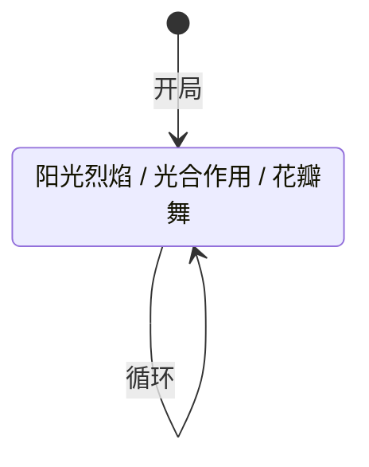

# 仙人掌

> **类型**：普通怪物
> **初始生命**：18 - 23
> **遭遇战**：第一、二层普通战斗
> **特性**：三招随机 + 祸移每回合自增荆棘 + 光合作用回血

## 被动能力（开局自带）

| 名称 | 类型 | 效果 |
|------|------|------|
| **[祸移](/powers/calamity_shift_power.md)**（1 层） | Buff | 在你的回合开始时，获得 1 点[荆棘](/powers/thorns_power.md) |

::: tip 祸移细节
- 每回合开始时自动获得 1 层荆棘，层数持续累积
- 荆棘层数 = 回合数（第 1 回合 = 1，第 3 回合 = 3，第 5 回合 = 5……）
- 祸移是 Buff 类型，可被消除 Buff 类效果清除
:::

## 行动逻辑

仙人掌每回合在「阳光烈焰」「光合作用」「花瓣舞」三招之间等概率随机选择（各 1/3），允许连续重复同一招。

> **说明**：`/` 表示三选一随机出招，可连续重复。

## 招式表

| 招式名 | 意图 | 类型 | 效果 |
|--------|------|------|------|
| **阳光烈焰** | 攻击 6 | 攻击 | 造成 6 点攻击伤害 |
| **光合作用** | 光合作用 | 自身增益 | 自身[力量](/powers/strength_power.md) +1，恢复已损失生命值的 1/2 |
| **花瓣舞** | 花瓣舞 | 自身增益 | 自身获得 3 层[荆棘](/powers/thorns_power.md) |

::: warning 光合作用回血比例不一致
本地化描述写的是"恢复已损失生命值的 1/3"，但实际恢复 **1/2** 已损失生命值。以实际效果为准。
:::

## 遭遇战

| 遭遇战 | 池子 | 数量 | 说明 |
|--------|------|------|------|
| 弱怪池 | 弱怪池 | 2 只 | 双仙人掌 |
| 强怪池 | 强怪池 | 3 只 | 三仙人掌 |
| 与魔法花同行 | 强怪池 | 2 只 | 与 1 只魔法花同行 |
| 精英遭遇 | 强怪池 | 2 只 | 与 1 只魔法花同行（精英池） |

## 策略提示

1. **荆棘是最大威胁，越拖越疼**：祸移每回合 +1 荆棘，花瓣舞额外 +3 荆棘。第 3 回合荆棘可能已有 3~9 层，用攻击牌打仙人掌会被反伤很疼。多段攻击尤其危险——3 段连击打 5 层荆棘 = 15 点反伤。尽快击杀或用非攻击手段处理。

2. **光合作用回血拖不起**：光合作用恢复 1/2 已损失生命值。如果仙人掌被打到半血（约 10 HP），一次光合作用能回 5~6 点，几乎等于白打一回合。低血量时不要指望它不回血——1/3 概率随时可能触发。

3. **18~23 血是低血量，适合一波带走**：仙人掌血量很低，前期集中火力 1~2 回合击杀是最优策略。拖到第 3 回合后荆棘累积 + 光合作用回血，击杀成本急剧上升。

4. **三只仙人掌同场荆棘叠加极快**：强怪池 3 只仙人掌遭遇战，每只各自叠加荆棘。3 回合后场上总荆棘可能达到 9~27 层，任何攻击牌都会被反伤到死。这种遭遇战必须第一时间集火，逐个击破。

5. **消除 Buff 可破**：祸移和花瓣舞的荆棘都是 Buff 类型，用消除 Buff 类卡牌可以清零荆棘。但祸移每回合重新触发，清除后下回合又会有 1 层。

6. **阳光烈焰只有 6 点伤害**：仙人掌唯一的攻击手段只有 6 点伤害，威胁远低于荆棘反伤。不需要为阳光烈焰准备格挡，重点放在快速击杀上。

## 源码

- 怪物：`SeerCactusMonster.cs`
- 被动能力：`SeerCalamityShiftPower.cs`（祸移）
- 本地化：`monsters.json`（`SEER_MONSTER_SEER_CACTUS_MONSTER.*`）、`intents.json`（`SEER_SOLAR_FLARE.*`、`SEER_PHOTOSYNTHESIS.*`、`SEER_PETAL_DANCE.*`）、`powers.json`（`SEER_POWER_SEER_CALAMITY_SHIFT_POWER.*`）
