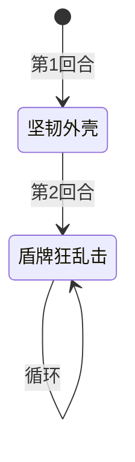

# 防御史莱姆

## 基本信息

| 属性 | 数值 |
|---|---|
| 分类 | [普通怪物](/monsters/normal/) |
| 生命值 | 32 - 37 |
| 被动能力 | [防御](#防御2-层)（2 层）+ [王者之灵](#王者之灵1-层)（1 层） |

## 行动逻辑

首回合固定使用「坚韧外壳」叠加硬化外壳，之后每回合循环使用「盾牌狂乱击」输出。

## 招式

| 招式 | 意图 | 描述 | 数值 |
|---|---|---|---|
| 盾牌狂乱击 | 攻击 | 造成12点伤害，附加等于自身**防御**层数的**固定伤害**。 | 基础伤害 12 + 固定伤害（= 2 × 防御层数） |
| 坚韧外壳 | 坚韧外壳 | 自身获得**最大生命40%**的**硬化外壳**。 | 硬化外壳 = 最大生命 × 40% |

## 被动能力

### 防御（2 层）

每有一层，受到的攻击伤害降低 1 点。

- **初始层数**：2（怪物加入房间时施加）。
- **持续累积**：王者之灵每回合开始时再 +1 层防御，层数会随回合数持续增长。
- **能力类型**：Buff，可被消除 buff 类效果清除。
- **与招式联动**：「盾牌狂乱击」的固定伤害 = 2 × 当前防御层数，所以防御越高，固定伤害越高。

### 王者之灵（1 层）

获得 2 层**防御**。在其回合开始时获得 1 层**防御**。

- **初始层数**：1（怪物加入房间时施加）。
- **效果**：仅负责每回合开始时 +1 层防御。开局 2 层防御由怪物加入房间时直接施加（能力描述中"获得2层防御"指此开局行为）。
- **能力类型**：不可消除（不被消除 buff/debuff 类效果清除）。

## 遭遇战

| 遭遇战 | 房间类型 | 池子 | 数量 | 说明 |
|---|---|---|---|---|
| `SeerDefenseSlimeWeakEncounter` | Monster | 弱怪池 | 1 只 | 位置 defenseslime1 |
| `SeerDefenseSlimeTripleWeakEncounter` | Monster | 弱怪池 | 3 只 | 位置 slime1/slime2/slime3 |
| `SeerLeafSlimeDefenseStrongEncounter` | Monster | 强怪池 | 2 只 | 叶子史莱姆 ×1（位置 leaf1）+ 防御史莱姆 ×1（位置 slime1） |

## 策略提示

1. **固定伤害威胁是核心**：「盾牌狂乱击」除基础 12 点攻击伤害外，还施加 2 × 当前防御层数 的[固定伤害](/mechanics/fixed-damage)（下回合开始时结算，无法格挡）。意图描述写的是"附加等于自身防御层数的固定伤害"（即 1 倍），但实际为 2 倍。意图显示的总伤害（12 + 2×防御）与实际一致，但描述文字未体现 2 倍系数。固定伤害无法被格挡，只能靠[固定伤害免疫](/powers/immune_fixed_damage_power.md)或恢复生命来应对。

2. **防御持续滚雪球**：开局 2 层防御 + 每回合 +1（王者之灵）。防御层数随回合线性增长：

   | 回合 | 防御层数 | 固定伤害（2×防御） | 总伤害（12+固定） |
   |------|----------|---------------------|-------------------|
   | 第 2 回合 | 3 | 6 | 18 |
   | 第 3 回合 | 4 | 8 | 20 |
   | 第 5 回合 | 6 | 12 | 24 |
   | 第 8 回合 | 9 | 18 | 30 |

   回合越久固定伤害越高，且无法格挡。必须在 3 回合内击杀，否则固定伤害会压垮你的血量。

3. **硬化外壳按最大生命缩放**：第 1 回合「坚韧外壳」获得 = 最大生命 × 40% 的硬化外壳。普通难度下（生命 32-37）约 12-14 层，每层完全抵消一次 HP 损失。需先打破外壳才能对本体造成有效伤害，建议保留高伤牌在第二回合及以后使用。精英化或 Boss 化时生命值更高，外壳更厚。

4. **消除 Buff 可破防御**：防御是 Buff 类型，可被消除 Buff 类卡牌清除。清除后盾牌狂乱击的固定伤害归零，只剩 12 点基础攻击伤害。但王者之灵本身不可消除，每回合仍会继续 +1 防御。需在消除防御后的同一回合或下回合立即爆发输出，否则防御又会重新累积。

5. **三只共斗前期几乎无法击穿**：三只防御史莱姆遭遇战中，3 只同时叠加防御和外壳——第 1 回合 3 只各自坚韧外壳（共 36-42 层硬化外壳），第 2 回合起 3 只同时盾牌狂乱击。前期普通攻击几乎无法破防，必须用[固定伤害](/mechanics/fixed-damage)、流失伤害或穿透伤害机制绕过外壳和防御。优先集火一只，把 3 只的威胁降到 2 只再到 1 只。

6. **坚韧外壳回合是安全输出窗口**：第 1 回合防御史莱姆只使用「坚韧外壳」不攻击，是安全的输出时间。但此回合它获得了 12-14 层硬化外壳，后续攻击需要先破外壳。建议第 1 回合用低费攻击牌消耗外壳层数，第 2 回合再爆发输出——这样既能利用第 1 回合的安全窗口，又能在第 2 回合造成有效伤害。

## 源码

- 怪物：`SeerDefenseSlimeMonster.cs`
- 被动能力：`SeerDefensePower.cs`（防御）、`SeerKingsSpiritPower.cs`（王者之灵，每回合 +1 防御）
- 遭遇战：`SeerDefenseSlimeWeakEncounter.cs`、`SeerDefenseSlimeTripleWeakEncounter.cs`、`SeerLeafSlimeDefenseStrongEncounter.cs`
- 本地化：`monsters.json`（`SEER_MONSTER_SEER_DEFENSE_SLIME_MONSTER.*`）、`intents.json`（`SEER_SHIELD_FRENZY.*`、`SEER_TOUGH_SHELL.*`）、`powers.json`（`SEER_POWER_SEER_DEFENSE_POWER.*`、`SEER_POWER_SEER_KINGS_SPIRIT_POWER.*`）
