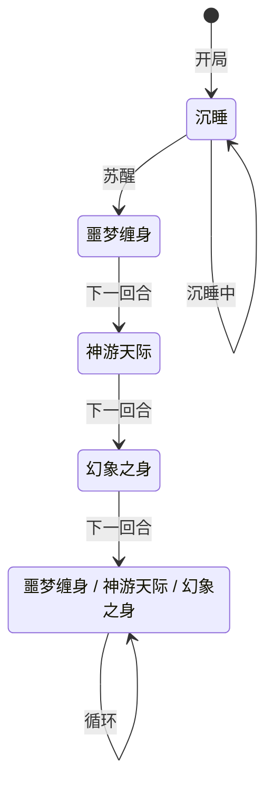

# 狄修斯

> **类型**：普通怪物
> **初始生命**：108 - 113
> **遭遇战**：第一、二层普通战斗
> **特性**：沉睡苏醒后噩梦缠身——沉睡越久，苏醒时施加的异常状态越多

## 被动能力（开局自带）

| 名称 | 类型 | 效果 |
|------|------|------|
| **沉睡**（8 层） | 能力（不可消除） | 沉睡中，每回合 -1 层。受到未被格挡的伤害时立即苏醒 |
| **覆甲**（7 层） | Buff | 每层完全抵消一次 HP 损失，触发后 -1 |
| **无实体**（3 层） | 能力 | 每次受到的任何伤害降为 1 点，触发后 -1 |

::: tip 沉睡机制
- 沉睡期间每回合空操作，沉睡回合数 +1
- 沉睡能力每回合 -1 层，8 层耗尽后自然苏醒
- 受到未被格挡的伤害时立即移除沉睡和覆甲，强制苏醒
- 苏醒后强制执行一次噩梦缠身，噩梦缠身的异常状态种类数和持续回合数 = 沉睡回合数
:::

## 行动逻辑

狄修斯分两阶段：沉睡阶段和苏醒阶段。

**沉睡阶段**：每回合空操作，沉睡能力耗尽或受到未格挡伤害后苏醒。
**苏醒阶段**：噩梦缠身 → 神游天际 → 幻象之身 → 三招随机循环。

> **说明**：`/` 表示三选一随机出招；沉睡期间空操作。

## 招式表

| 招式名 | 意图 | 类型 | 效果 |
|--------|------|------|------|
| **沉睡** | 沉睡 | 空操作 | 沉睡中，空操作 |
| **噩梦缠身** | 噩梦缠身 | 攻击 + Debuff | 造成 5 点攻击伤害，对每位敌方施加随机异常状态——种类数 = 持续回合数 = 沉睡回合数 |
| **神游天际** | 神游天际 | Debuff | 对所有敌方施加[睡眠](/powers/sleep_power.md) 3 层 + [神游](/powers/trance_power.md) 3 层 |
| **幻象之身** | 幻象之身 | 自身增益 + 固定伤害 | 自身获得 2 层[无实体](/powers/intangible_power.md)，对每位敌方造成等于其异常状态总层数的[固定伤害](/mechanics/fixed-damage) |

::: warning 三招联动
1. **噩梦缠身**施加多种随机异常状态
2. **神游天际**追加睡眠 + 神游（也是异常状态），增加异常总层数
3. **幻象之身**按异常状态总层数造成固定伤害——前面叠的异常越多，这招越疼
:::

## 遭遇战

| 遭遇战 | 池子 | 数量 | 说明 |
|--------|------|------|------|
| 弱怪池 | 弱怪池 | 2 只 | 与 1 只熟睡甲虫同行 |
| 强怪池 | 强怪池 | 1 只 | 单只狄修斯 |
| 事件遭遇 | 事件（无奖励） | 3 只 | 狄修斯 + 塔沃斯 + 加布（三魔王事件） |

## 策略提示

1. **沉睡阶段是免费输出窗口**：狄修斯沉睡时不会行动，但自带 7 覆甲 + 3 无实体，直接攻击很难破防。无实体让每次伤害降为 1，覆甲吞掉 HP 损失。但只要打出 1 点未被格挡的伤害就能强制苏醒——用低费攻击牌触发苏醒比硬打覆甲更划算。

2. **沉睡越久苏醒越恐怖**：噩梦缠身的异常状态种类数 = 持续回合数 = 沉睡回合数。如果让它睡满 8 回合自然苏醒，一次性施加 8 种随机异常状态各 8 回合——几乎全身上下都是 Debuff。最好在 2~3 回合内主动打醒它，限制异常状态数量。

3. **幻象之身的伤害看你的异常层数**：幻象之身造成等于异常状态总层数的固定伤害，无法格挡。噩梦缠身 + 神游天际叠了大量异常后，幻象之身可能造成 10~20+ 点固定伤害。及时清除异常状态或准备固定伤害免疫手段。

4. **神游天际的睡眠和神游**：睡眠让你在回合开始时有概率无法出牌，神游让你在回合结束时手牌返回抽牌堆而非弃牌堆。两个都是异常状态，也会被幻象之身计入总层数。

5. **三魔王事件极其危险**：狄修斯 + 塔沃斯 + 加布同场，三只怪物各有独立机制，且事件无奖励。如果状态不好建议跳过这个事件。

6. **苏醒后无实体仍会刷新**：幻象之身每次使用都 +2 无实体，苏醒后仍需穿透无实体才能有效输出。准备多段攻击或固定伤害来消耗无实体层数。

## 源码

- 怪物：`SeerDixiusMonster.cs`
- 被动能力：`SeerAsleepPower.cs`（沉睡）
- 本地化：`monsters.json`（`SEER_MONSTER_SEER_DIXIUS_MONSTER.*`）、`intents.json`（`SEER_SLEEPING.*`、`SEER_NIGHTMARE.*`、`SEER_DREAM_TRAVEL.*`、`SEER_ILLUSION_BODY.*`）、`powers.json`（`SEER_POWER_SEER_ASLEEP_POWER.*`）
