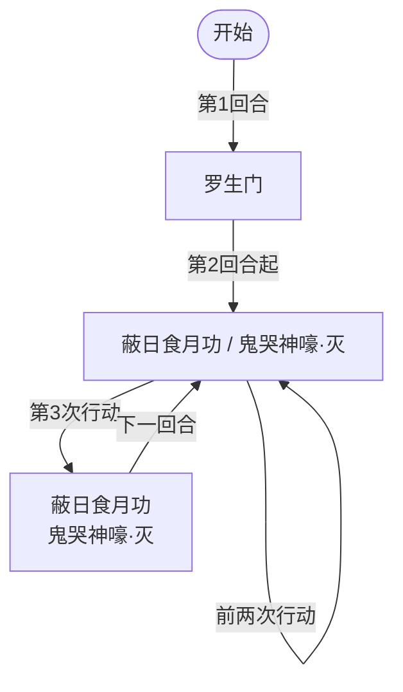

# 斗神瑞尔斯

## 基本信息

| 属性 | 数值 |
|---|---|
| 分类 | [普通怪物](/monsters/normal/) |
| 生命值 | 114 - 119 |

## 行动逻辑

开局固定使用一次「罗生门」（不累计行动计数），随后进入主分支：每累计 3 次行动计数后触发组合招式「蔽日食月功·鬼哭神嚎」，其余回合在「蔽日食月功」与「鬼哭神嚎·灭」之间随机二选一。

> **说明**：`/` 表示二选一随机出招；双招换行显示；每 3 次行动触发一次组合招。

## 招式

| 招式 | 意图 | 描述 | 数值 |
|---|---|---|---|
| 罗生门 | 罗生门 | 自身免疫异常状态，你的 PP 消耗为 3 倍，持续 5 回合。 | 自身罗生门 5 层 |
| 蔽日食月功 | 蔽日食月功 | 恢复自身已损失生命值的 1/4，并造成等量固定伤害。 | 治疗 = 已损失 HP / 4；固定伤害 = 同值 |
| 鬼哭神嚎·灭 | 鬼哭神嚎·灭 | 造成 15 点伤害。若自身当前生命大于你，伤害翻倍。 | 伤害 15（翻倍 30） |
| 蔽日食月功·鬼哭神嚎 | 蔽日食月功 + 鬼哭神嚎·灭 | 组合招式：依次执行蔽日食月功与鬼哭神嚎·灭。 | 同上两项 |

## 遭遇战

| 遭遇战 | 房间类型 | 池子 | 数量 | 说明 |
|---|---|---|---|---|
| `SeerDoushenRuiersiStrongEncounter` | Monster | 强怪池 | 1 只 | 单只斗神瑞尔斯 |
| `SeerEventGaiaRuiersiEncounter` | Monster | 事件遭遇战 | 2 只 | 1 盖亚（第一层 Boss）+ 1 斗神瑞尔斯；无奖励 |

## 策略提示

1. **罗生门的开局压制——PP 消耗 3 倍 + 免疫异常**：首回合即施加 5 层罗生门，使你的 PP 消耗变为 3 倍并免疫异常状态。PP 是单场战斗资源，每场战斗开始时重置为 MaxPp。罗生门持续 5 回合，期间打 PP 牌的 PP 消耗 ×3——原本 1 PP 的牌变 3 PP，原本 2 PP 的牌变 6 PP。务必在前期准备低 PP 消耗或 0 PP 的卡牌应对，避免 PP 被快速耗尽后无法出牌。

2. **蔽日食月功的滚雪球——回血+固定伤害联动**：蔽日食月功恢复自身已损失生命值的 1/4，并造成等量[固定伤害](/mechanics/fixed-damage)（下回合开始时结算，无法格挡）。治疗量和固定伤害量相同，都等于 已损失 HP / 4。斗神瑞尔斯血量越低该招式越致命——既能回血又会造成等量固定伤害。例如：当前 114 HP，已损失 5 HP → 回血 1 + 固定伤害 1；当前 60 HP，已损失 59 HP → 回血 14 + 固定伤害 14。优先用爆发伤害一击秒杀，避免其反复回血+固定伤害滚雪球。

3. **鬼哭神嚎·灭的斩杀线——血量对比翻倍**：鬼哭神嚎·灭造成 15 点攻击伤害；若自身当前生命大于任一敌方当前生命，伤害翻倍至 30。注意触发条件是"大于任一敌方"——多人模式下只要有一个玩家血量低于斗神瑞尔斯就触发翻倍。保持自身血量高于对方以规避翻倍，或准备 30 格挡应对。

4. **组合招式节奏——每 3 次行动触发一次组合招**：每累计 3 次行动计数会触发「蔽日食月功·鬼哭神嚎」组合招式（一回合内同时回血+固定伤害+15/30 攻击伤害）。组合招回合威胁最大——可能同时回血 10+、固定伤害 10+、攻击伤害 15/30，总伤可达 25~40+。需预留防御资源应对组合招回合。其余回合在蔽日食月功与鬼哭神嚎·灭之间随机二选一（各 50%）。

5. **罗生门免疫异常但可被直伤击杀**：罗生门让斗神瑞尔斯免疫异常状态（中毒/烧伤/麻痹/睡眠/冻伤等全部无效），但不会免疫直接伤害或固定伤害。中毒流/异常流牌组对斗神瑞尔斯完全无效，必须依靠直伤或[固定伤害](/mechanics/fixed-damage)。罗生门持续 5 回合后自然消失，之后异常状态才可生效——但通常战斗在 5 回合内已结束。

6. **盖亚同场的双重压制**：事件遭遇战中盖亚（第一层 Boss）+ 1 只斗神瑞尔斯同场，无奖励。盖亚有自己的属性反转机制，斗神瑞尔斯有罗生门 PP 削减和蔽日食月功回血。两只同时施压，PP 被削减后输出能力下降，同时还要应对盖亚的机制。状态不好建议跳过这个事件。

7. **114~119 血需要 3~4 回合击杀**：斗神瑞尔斯血量中等，配合蔽日食月功回血和罗生门 PP 削减，实际战斗时间可能拖长。建议在罗生门持续期间用低 PP 卡牌过渡，等蔽日食月功把血量压低后再爆发——但注意血量越低蔽日食月功的固定伤害越高。最优策略是在 2~3 回合内集中火力一击秒杀，避免陷入回血+固定伤害的滚雪球循环。

## 源码

- 怪物：`SeerDoushenRuiersiMonster.cs`
- 遭遇战：`SeerDoushenRuiersiStrongEncounter.cs`、`SeerEventGaiaRuiersiEncounter.cs`
- 本地化：`monsters.json`（`SEER_MONSTER_SEER_DOUSHEN_RUIERSI_MONSTER.*`）、`intents.json`（`SEER_RASHOMON.*`、`SEER_ECLIPSE_MOON.*`、`SEER_GHOST_CRY.*`）
