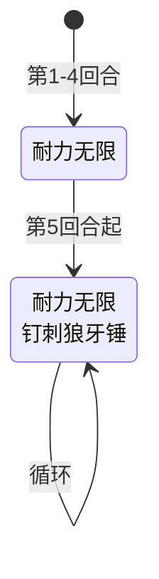

# 体力史莱姆

> **类型**：普通怪物
> **初始生命**：95 - 105
> **遭遇战**：第一层普通战斗
> **特性**：越拖越痛——前 4 回合纯回血，第 5 回合起每回合回血 + 按当前生命值 1/10 造成伤害

## 被动能力

无。

## 行动逻辑

体力史莱姆根据回合数分两阶段：

- **第 1~4 回合**：只使用耐力无限（恢复 10 点生命，不攻击）
- **第 5 回合及以后**：每回合使用组合招耐力无限·钉刺狼牙锤（先回血再攻击）

> **说明**：双招换行显示。

## 招式表

| 招式名 | 意图 | 类型 | 效果 |
|--------|------|------|------|
| **耐力无限** | 耐力无限 | 自身增益 | 恢复 10 点生命 |
| **钉刺狼牙锤** | 攻击 N | 攻击 | 造成等于当前生命值 1/10 的攻击伤害（向下取整） |
| **耐力无限·钉刺狼牙锤** | 耐力无限 + 钉刺狼牙锤 | 组合招（第 5 回合起） | 先执行耐力无限（恢复 10 生命），再执行钉刺狼牙锤（造成当前生命值 1/10 伤害） |

::: warning 钉刺狼牙锤伤害计算
- 伤害 = 当前生命值 / 10，向下取整
- 满血 105 时：伤害 = 10
- 50 血时：伤害 = 5
- 10 血时：伤害 = 1
- **低于 10 血时：伤害 = 0**（取整为 0，不造成伤害）
- 伤害是攻击伤害，可被格挡、受力量/易伤影响
:::

::: tip 组合招的回血-攻击顺序
组合招先回血 10 点，再按回血后的生命值计算钉刺狼牙锤伤害。这意味着：
- 回血后生命值更高，钉刺狼牙锤伤害也更高
- 例：当前 90 血 → 回血到 100 → 钉刺狼牙锤造成 10 伤害
- 如果当前生命值已满（105），回血无效，钉刺狼牙锤造成 10 伤害
:::

## 遭遇战

| 遭遇战 | 池子 | 数量 | 说明 |
|--------|------|------|------|
| 弱怪池 | 弱怪池 | 1 只 | 单只体力史莱姆 |
| 弱怪池（三只） | 弱怪池 | 3 只 | 三只体力史莱姆 |
| 强怪池 | 强怪池 | 2 只 | 与原版叶史莱姆同场 |

## 策略提示

1. **95~105 血中等血量**：体力史莱姆血量中等，但每回合回血 10 点会让战斗拖长。建议集中火力快速击杀，避免它持续回血续命。

2. **前 4 回合是免费输出窗口**：体力史莱姆前 4 回合只使用耐力无限（回血 10 点），不造成任何伤害。这是安全的输出时间，尽量在这 4 回合内击杀。如果 4 回合内击杀，全程不会受到任何伤害。

3. **钉刺狼牙锤越满血越疼**：钉刺狼牙锤伤害 = 当前生命值 / 10。满血 105 时造成 10 伤害，回血后续航能力很强。把血量压低可以降低钉刺狼牙锤伤害——50 血时只造成 5 伤害。

4. **低于 10 血时钉刺狼牙锤无效**：钉刺狼牙锤伤害向下取整，低于 10 血时伤害为 0。如果你能把体力史莱姆打到 10 血以下，它虽然还会回血，但钉刺狼牙锤不再造成伤害（直到回血到 10 以上）。

5. **第 5 回合起每回合回血 + 攻击**：第 5 回合起组合招每回合回血 10 + 造成当前生命/10 的伤害。如果让它保持满血，每回合净伤害 10 点。配合回血，硬杀会很慢。用固定伤害或流失伤害绕过格挡，或者用高爆发一回合秒杀。

6. **组合招先回血再攻击**：组合招先回血 10 点，再按回血后的生命值计算伤害。这意味着回血会让钉刺狼牙锤伤害更高。如果你能在它回血前把血量压低，回血后的伤害也会降低。

7. **三只体力史莱姆遭遇战**：弱怪池 3 只体力史莱姆同场，前 4 回合 3 只同时回血（共 30 点/回合）。第 5 回合起 3 只同时攻击（共 30+ 伤害/回合）。优先击杀一只，把威胁减半。3 只血量合计 285~315，需要较强的爆发能力。

8. **与叶史莱姆强怪池联动**：强怪池中 2 只体力史莱姆与原版叶史莱姆同场。叶史莱姆有自己的机制，体力史莱姆负责回血续航。优先击杀体力史莱姆可以切断回血链，再处理叶史莱姆。

## 源码

- 怪物：`SeerHpSlimeMonster.cs`
- 意图：`SeerHpSlimeIntents.cs`
- 遭遇战：`SeerHpSlimeWeakEncounter.cs`、`SeerHpSlimeTripleWeakEncounter.cs`、`SeerLeafSlimeHpStrongEncounter.cs`
- 本地化：`monsters.json`（`SEER_MONSTER_SEER_HP_SLIME_MONSTER.*`）、`intents.json`（`SEER_ENDLESS_STAMINA.*`、`SEER_SPIKED_MACE.*`）
