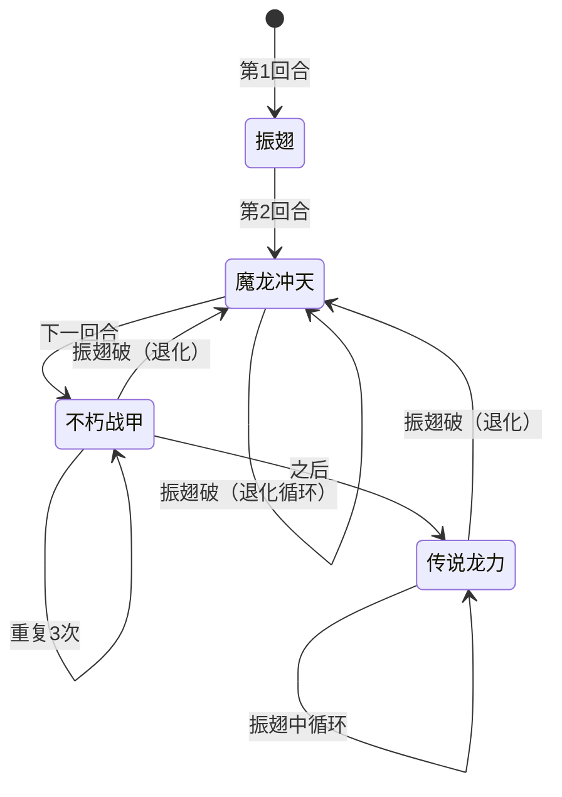

# 加布

> **类型**：普通怪物
> **初始生命**：108 - 113
> **遭遇战**：第二层普通战斗
> **特性**：振翅状态驱动行动序列——振翅期间按固定序列推进并偷属性，击晕后退化

## 被动能力（开局自带）

| 名称 | 类型 | 效果 |
|------|------|------|
| **[龙之保护](/powers/dragon_protection_power.md)**（1 层） | 能力（不可消除） | 振翅状态下，每回合开始时吸取所有敌方的正向属性（力量/防御/命中/速度全部层数转移至自身） |

## 行动逻辑

第 1 回合振翅获 7 层，之后按固定序列推进。振翅被破（归 0 击晕）后退化，只用魔龙冲天。

> **说明**：不朽战甲连续使用3次后进入传说龙力永久循环；任何时刻振翅被破（归0击晕）都退化为魔龙冲天永久循环。

## 招式表

| 招式名 | 意图 | 类型 | 效果 |
|--------|------|------|------|
| **振翅** | 振翅 7 | 自身增益 | 自身获得 7 层[振翅](/powers/flutter_power.md)：受到的攻击伤害减半，每受一次攻击 -1 层，归零时被击晕 |
| **魔龙冲天** | 攻击 6 ×N | 多段攻击 | 造成 6 点攻击伤害 ×（2 + 累计使用次数）次。每用一次连击 +1 |
| **不朽战甲** | 不朽战甲 | 自身增益 | 自身获得 15 格挡 + [防御](/powers/defense_power.md) +2 + 恢复 15 生命 |
| **传说龙力** | 传说龙力 | 削弱 | 对所有敌方扣除 3 点最大生命（永久，不可恢复） |

::: warning 振翅机制
- 振翅 7 层：受到的攻击牌伤害减少 50%，每受一次攻击 -1 层
- 振翅期间龙之保护每回合偷走你所有正向属性
- 振翅归零时加布被击晕，此后只会反复使用魔龙冲天（但仍会成长连击数）
- 振翅**不会在回合结束时自然衰减**——只有受击才会 -1（与原版振翅能力一致）
:::

## 遭遇战

| 遭遇战 | 池子 | 数量 | 说明 |
|--------|------|------|------|
| 弱怪池 | 弱怪池 | 3 只 | 加布 + 偷窃草蜢 + 斯普林特 |
| 强怪池 | 强怪池 | 1 只 | 单只加布 |
| 事件遭遇 | 事件（无奖励） | 3 只 | 狄修斯 + 塔沃斯 + 加布（三魔王事件） |

## 策略提示

1. **振翅期间别叠正向属性**：龙之保护每回合开始偷走你所有正向属性（力量/防御/命中/速度全层数），叠 Buff 等于给加布送属性。振翅期间以格挡、非攻击伤害、直伤为主，等击晕后再爆发。

2. **7 次攻击破振翅是关键**：振翅 7 层，每次受攻击 -1，7 次攻击即可击晕。但振翅期间攻击伤害减半，需要多段攻击或固定伤害快速消耗振翅层数。击晕后加布只会用魔龙冲天，威胁大减。

3. **魔龙冲天越用越疼**：初始 6×2 = 12 伤，第二次 6×3 = 18 伤，第三次 6×4 = 24 伤……连击数只增不减。无论振翅是否被破，魔龙冲天的成长性都是核心威胁，不能拖。

4. **不朽战甲三连极难硬杀**：振翅序列中不朽战甲连续使用 3 次，每次 +15 格挡 +2 防御 +15 回血。3 次共 45 格挡 +6 防御 +45 回血，硬杀几乎不可能。用固定伤害或流失伤害绕过格挡。

5. **传说龙力永久削血上限**：扣除 3 点最大生命是不可恢复的，振翅后期连续使用会显著压缩血上限。如果振翅没破掉拖到传说龙力阶段，每回合 -3 最大生命，几回合就废了。

6. **三魔王事件最危险之一**：加布 + 狄修斯 + 塔沃斯同场，三只怪物各有独立机制且无奖励。加布的龙之保护会偷属性，狄修斯会叠异常，塔沃斯也有自己的机制。状态不好建议跳过。

## 源码

- 怪物：`SeerJiabuMonster.cs`
- 被动能力：`SeerDragonProtectionPower.cs`（龙之保护）、`SeerFlutterPower.cs`（振翅）
- 本地化：`monsters.json`（`SEER_MONSTER_SEER_JIABU_MONSTER.*`）、`intents.json`（`SEER_FLUTTER.*`、`SEER_DRAGON_DIVE.*`、`SEER_IMMORTAL_ARMOR.*`、`SEER_LEGENDARY_DRAGON_POWER.*`）、`powers.json`（`SEER_POWER_SEER_DRAGON_PROTECTION_POWER.*`、`SEER_POWER_SEER_FLUTTER_POWER.*`）
