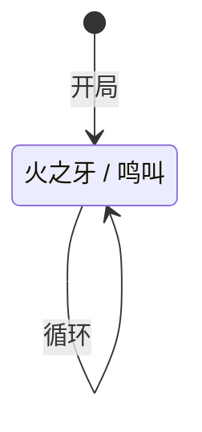

# 吉尔

> **类型**：普通怪物
> **初始生命**：23 - 28
> **遭遇战**：第一层弱怪池
> **特性**：低血脆皮——火之牙 + 烧伤 / 鸣叫 + 虚弱易伤 + 黏液

## 被动能力

无。

## 行动逻辑

每回合在「火之牙」与「鸣叫」之间等概率随机选择（各 1/2），允许连续重复。

> **说明**：`/` 表示二选一随机出招，可连续重复。

## 招式表

| 招式名 | 意图 | 类型 | 效果 |
|--------|------|------|------|
| **火之牙** | 攻击 11 | 攻击 + Debuff | 造成 11 点攻击伤害，施加[烧伤](/powers/burn_power.md) 1 层 |
| **鸣叫** | 鸣叫 | Debuff + 干扰 | 施加[虚弱](/powers/weak_power.md) 2 层 + [易伤](/powers/vulnerable_power.md) 2 层，向弃牌堆加入 1 张**黏液** |

## 遭遇战

| 遭遇战 | 池子 | 数量 | 说明 |
|--------|------|------|------|
| 弱怪池 | 弱怪池 | 2 只 | 双吉尔 |

## 策略提示

1. **23~28 血一回合可杀**：吉尔血量极低，集中火力一回合击杀是最优策略。留着不管会被鸣叫叠虚弱+易伤拖慢节奏。

2. **鸣叫的虚弱+易伤联动火之牙**：鸣叫给 2 层虚弱 + 2 层易伤，下一回合如果出火之牙，11 点伤害在易伤下变成 13 点。两只吉尔同时鸣叫会叠到 4 层虚弱 + 4 层易伤，输出效率骤降。

3. **双吉尔优先击杀一只**：弱怪池 2 只吉尔同场，两只同时鸣叫 Debuff 翻倍。第一回合集中火力杀一只，把威胁减半。

4. **黏液只是小干扰**：鸣叫塞的黏液是原版状态牌（抽 1 张牌），影响不大。真正威胁是虚弱和易伤的叠加。

## 源码

- 怪物：`SeerJillMonster.cs`
- 本地化：`monsters.json`（`SEER_MONSTER_SEER_JILL_MONSTER.*`）、`intents.json`（`SEER_FIRE_FANG.*`、`SEER_JILL_CHIRP.*`）
