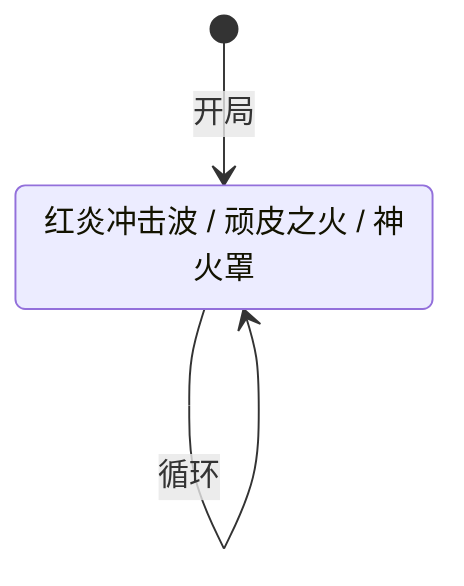

# 坤格

> **类型**：普通怪物
> **初始生命**：88 - 93
> **遭遇战**：第二层强怪池
> **特性**：烧伤联动削 PP——红炎叠烧伤 → 顽皮之火按烧伤层数扣 PP

## 被动能力

无。

## 行动逻辑

每回合在「红炎冲击波」「顽皮之火」「神火罩」三招之间等概率随机选择（各 1/3），允许连续重复。

> **说明**：`/` 表示三选一随机出招，可连续重复。

## 招式表

| 招式名 | 意图 | 类型 | 效果 |
|--------|------|------|------|
| **红炎冲击波** | 攻击 8 | 攻击 + Debuff | 造成 8 点攻击伤害，施加[烧伤](/powers/burn_power.md) 2 层 |
| **顽皮之火** | 顽皮之火 | PP 削弱 | 对每位玩家：按其当前烧伤层数，随机选择等同烧伤层数的 PP 卡，每张 PP -1 |
| **神火罩** | 神火罩 | 自身增益 + 群体治疗 | 自身获得 8 格挡 + 恢复 8 生命，所有友方也各恢复 8 生命 |

::: warning 三招联动
1. **红炎冲击波**叠加烧伤（每用一次 +2 层）
2. **顽皮之火**按烧伤层数削减 PP——烧伤 4 层 = 随机 4 张 PP 卡各 -1 PP
3. **神火罩**群体回血，在安妮+坤格遭遇战中会同时奶安妮

烧伤越多，PP 被扣越多。PP 是单场战斗资源，被扣后本場战斗无法恢复。
:::

## 遭遇战

| 遭遇战 | 池子 | 数量 | 说明 |
|--------|------|------|------|
| 强怪池 | 强怪池 | 2 只 | 与 1 只[安妮](/monsters/normal/annie_monster)同行 |

## 策略提示

1. **烧伤是 PP 削减的前置条件**：顽皮之火按烧伤层数扣 PP，没有烧伤就不扣。所以关键是控制烧伤层数——红炎冲击波每次 +2 烧伤，如果连续出 2~3 次红炎（烧伤叠到 4~6 层），再出顽皮之火会一次性扣 4~6 张 PP 卡的 PP。及时清烧伤可以打断联动。

2. **神火罩会奶安妮**：强怪池遭遇中 2 只坤格 + 1 只安妮同场，神火罩治疗所有友方 8 点。如果安妮正在被你打残，一只坤格的神火罩就能帮安妮回 8 血。优先击杀坤格可以切断治疗链。

3. **三招随机不可预判**：三招等概率随机，无法预判下回合是输出（红炎）、削 PP（顽皮之火）还是续航（神火罩）。保留应对多种情况的资源，不要把格挡全留给某一招。

4. **PP 卡组尤其要小心**：如果你的牌组高度依赖 PP 卡（如先古牌、角色牌），坤格的顽皮之火会跨手牌/抽牌堆/弃牌堆随机削减 PP。烧伤叠高时可能一次性扣掉多张关键 PP 卡的 PP，导致整场战斗输出能力下降。

5. **88~93 血需要 2~3 回合击杀**：坤格血量中等，不算高但也不能一回合秒。配合神火罩回血可能拖到 4~5 回合。集中火力逐个击破，避免两只坤格同时存活互相奶。

## 源码

- 怪物：`SeerKungeMonster.cs`
- 本地化：`monsters.json`（`SEER_MONSTER_SEER_KUNGE_MONSTER.*`）、`intents.json`（`SEER_RED_FLAME_BLAST.*`、`SEER_NAUGHTY_FIRE.*`、`SEER_DIVINE_FLAME_SHIELD.*`）
