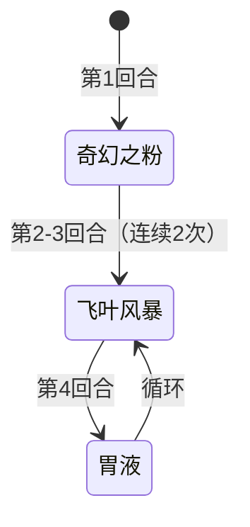

# 魔花仙子

## 基本信息

| 属性 | 数值 |
|---|---|
| 分类 | [普通怪物](/monsters/normal/) |
| 生命值 | 43 - 48 |
| 被动能力 | 无 |

## 行动逻辑

开局先施放「奇幻之粉」，随后进入「飞叶风暴 × 2 → 胃液」的循环：每两次飞叶风暴后接一次胃液，胃液重置计数后再次进入两连飞叶风暴。

## 招式

| 招式 | 意图 | 描述 | 数值 |
|---|---|---|---|
| 奇幻之粉 | 奇幻之粉 | 对你施加**麻痹**2层、**中毒**2层、**睡眠**2层。 | 麻痹/中毒/睡眠 各 2 层 |
| 飞叶风暴 | 飞叶风暴 | 造成2点伤害5次。 | 伤害 2，命中 5 次（总伤 10） |
| 胃液 | 胃液 | 反转自身所有能力下降，反转你所有的能力强化。 | — |

## 遭遇战

| 遭遇战 | 房间类型 | 池子 | 数量 | 同场怪物 | 说明 |
|---|---|---|---|---|---|
| `SeerMagicFlowerWeakEncounter` | Monster | 弱怪池 | 1 只 | — | — |
| `SeerMagicFlowerCactusStrongEncounter` | Monster | 强怪池 | 2 只 | [仙人掌](../normal/cactus_monster.md) | — |
| `SeerMagicFlowerCactusElite` | Monster | 强怪池 | 2 只 | [仙人掌](../normal/cactus_monster.md) | 命名带 Elite，实际为强怪池遭遇 |
| `SeerSeapunkMagicFlowerStrongEncounter` | Monster | 强怪池 | 2 只 | 海寇 | — |
| `SeerShrinkerBeetleMagicFlowerStrongEncounter` | Monster | 强怪池 | 2 只 | 缩小甲虫 | — |

## 策略提示

1. **奇幻之粉的三重异常威胁**：开局直接施加[麻痹](/powers/ma_power.md) 2 层 + [中毒](/powers/poison_power.md) 2 层 + [睡眠](/powers/sleep_power.md) 2 层。麻痹让你下回合有概率无法出牌，睡眠让你回合开始时有概率跳过，中毒每回合造成 2 点伤害。三种异常叠加让你下一回合大概率无法行动并持续掉血。建议开局立即用解异常卡牌或遗物应对，或在魔花仙子行动前打出爆发击杀。

2. **飞叶风暴总伤固定 10 但受力量影响**：飞叶风暴造成 2 点攻击伤害 × 5 次，总伤 10。每次均可被护盾/格挡独立抵挡，但会被力量加成放大。注意：魔花仙子自身力量被胃液清零后（如果有负力量），飞叶风暴伤害不受力量减免——因为胃液只清零负值，不会让力量变正。43~48 血量极低，飞叶风暴的 10 伤害对魔花仙子自身威胁不大。

3. **胃液强力反制属性流**：胃液反转自身所有能力下降（负值清零），并反转你所有的能力强化（正值翻号为负值，施加 -2×当前正向层数）。例如你有 5 层力量，胃液会施加 -10 力量，使你力量从 +5 变为 -5。切勿在胃液回合前过度堆叠属性强化——你叠的越多，被反转后损失越大。建议在胃液回合前用完属性增益，或完全不叠属性用固定伤害/流失伤害输出。

4. **43~48 血一回合可杀**：魔花仙子血量极低，前期任何中等伤害攻击牌（15~20 伤害）配合先制或速度即可一回合击杀。优先在第一回合（奇幻之粉）或第二回合（飞叶风暴）集火秒杀，避免胃液回合清掉你的属性。

5. **循环可预判——奇幻之粉 → 飞叶风暴 ×2 → 胃液 → 飞叶风暴 ×2 → 胃液 → ...**：开局奇幻之粉后进入「飞叶风暴 ×2 → 胃液」循环。奇幻之粉回合需准备解异常，飞叶风暴回合需准备 10 格挡，胃液回合不直接造成伤害但会清属性——是相对安全的输出窗口。但胃液回合你的属性会被反转，不宜在这回合前叠属性。

6. **仙人掌同场的荆棘联动**：强怪池遭遇中魔花仙子与仙人掌同行。仙人掌每回合自增荆棘（祸移），飞叶风暴的 5 段攻击会触发 5 次荆棘反伤。但飞叶风暴是魔花仙子的招式，打的是你——不会触发你的荆棘。如果你的荆棘层数高，飞叶风暴每段都会触发你的荆棘反伤，5 段 × 荆棘层数 = 可观的反伤输出。荆棘流应对飞叶风暴效果极佳。

7. **缩小甲虫同场的力量联动**：强怪池中魔花仙子与缩小甲虫同行。缩小甲虫可能施加力量削弱，魔花仙子的胃液会反转你的正向属性——双重力量削弱让你的攻击伤害大幅下降。优先击杀魔花仙子（血量低、易杀），避免胃液清属性后再处理缩小甲虫。

## 源码

- 怪物：`SeerMagicFlowerMonster.cs`
- 遭遇战：`SeerMagicFlowerWeakEncounter.cs`、`SeerMagicFlowerCactusStrongEncounter.cs`、`SeerMagicFlowerCactusElite.cs`、`SeerSeapunkMagicFlowerStrongEncounter.cs`、`SeerShrinkerBeetleMagicFlowerStrongEncounter.cs`
- 本地化：`monsters.json`（`SEER_MONSTER_SEER_MAGIC_FLOWER_MONSTER.*`）、`intents.json`（`SEER_FANTASY_POWDER.*`、`SEER_LEAF_STORM.*`、`SEER_GASTRIC_JUICE.*`）
