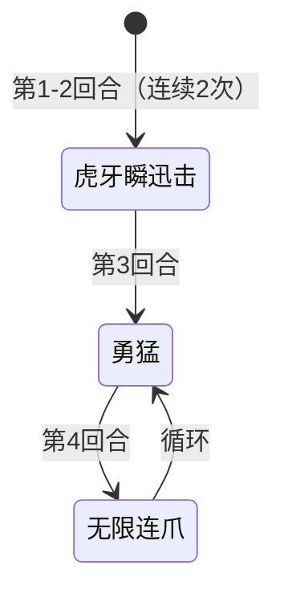

# 猛虎王

## 基本信息

| 属性 | 数值 |
|---|---|
| 分类 | [普通怪物](/monsters/normal/) |
| 生命值 | 162 - 167 |
| 被动能力 | [百兽之王](#被动能力)（1 层） |

## 行动逻辑

开局前两个回合连续使用「虎牙瞬迅击」，第 3 回合使用「勇猛」，之后「无限连爪」与「勇猛」交替循环。

## 招式

| 招式 | 意图 | 描述 | 数值 |
|---|---|---|---|
| 虎牙瞬迅击 | 虎牙瞬迅击 | 自身**先制**+1，**速度**+1，造成25点伤害。 | 伤害 25，先制 1，速度 1 |
| 勇猛 | 勇猛 | 复制并清除你的全属性提升。 | 全属性=力量/防御/命中/速度 |
| 无限连爪 | 无限连爪 | 造成2点伤害12次。 | 伤害 2，命中 12 次（总伤 24） |

## 被动能力

### 百兽之王（1 层）

战斗开始时，猛虎王对自身施加 1 层"百兽之王"标记，并对所有玩家施加 2 层[臣服](#臣服)与 2 层[害怕](#害怕)。

- **百兽之王**：增益，标记型能力，本身无触发逻辑。战斗开始时使敌人臣服并害怕 2 回合——该效果在加入房间时直接施加。
- **臣服（2 层，施加给玩家）**：攻击伤害降低 70%，玩家回合结束时减少 1 层；被移除时若拥有者为玩家，获得 2 张随从牌（随机来自随从打击/随从献祭/随从俯冲轰炸，本回合免费）。
- **害怕（2 层，施加给玩家）**：攻击伤害降低 30%，玩家回合结束时减少 1 层。
- **威胁**：开局前 2 回合玩家攻击伤害被严重削弱（前 2 回合叠加降至约 21% 原伤害），而猛虎王同时连续释放 25 伤害的虎牙瞬迅击，配合先制+1、速度+1进一步压制。

## 遭遇战

| 遭遇战 | 房间类型 | 池子 | 数量 | 同场怪物 | 说明 |
|---|---|---|---|---|---|
| `SeerMenghuwangStrongEncounter` | Monster | 强怪池 | 1 只 | — | — |

## 策略提示

1. **开局双压制——虎牙瞬迅击 + 臣服/害怕**：前两回合连续使用「虎牙瞬迅击」（25 点攻击伤害 + 先制 +1 + 速度 +1），同时被动百兽之王开局对所有玩家施加 2 层[臣服](#臣服)（攻击伤害 -70%）+ 2 层[害怕](#害怕)（攻击伤害 -30%）。两层叠加后你的攻击伤害仅剩约 21% 原伤害——25 伤害的虎牙瞬迅击打你只被你反击 5 点。而猛虎王同时输出 25 伤害 × 2 回合 = 50 伤害。开局几乎无法有效反击，必须用护盾、固定伤害或解 debuff 卡牌应对。

2. **臣服的随从牌补偿机制**：臣服被移除时（回合结束 -1 层或被清除），若拥有者为玩家，会获得 2 张随从牌（随机来自随从打击/随从献祭/随从俯冲轰炸，本回合免费）。这意味着前 2 回合结束后，你会获得 4 张免费随从牌作为补偿。利用这些随从牌可以在臣服消退后快速反击。

3. **勇猛反制属性流——复制并清除全属性提升**：第 3 回合及之后的偶数回合使用「勇猛」，复制并清除你的全属性提升（力量/防御/命中/速度全部正向层数转移至猛虎王）。叠属性流派要避免在勇猛回合前过度堆叠——你叠的力量/防御/命中/速度会被猛虎王全部偷走。建议在勇猛回合前用完属性增益，或在勇猛回合后叠属性。

4. **无限连爪怕护盾和荆棘**：单次仅 2 伤害但命中 12 次（总伤 24），每次独立触发荆棘反伤和护盾。荆棘流应对极佳——3 层荆棘 × 12 次 = 36 点反伤，几乎能反杀猛虎王。护盾也能完全抵挡每次 2 点的小伤害。但注意猛虎王可能通过勇猛偷走你的防御，降低护盾效率。

5. **循环节奏可预判**：前 2 回合虎牙瞬迅击，第 3 回合勇猛，之后无限连爪与勇猛交替（奇数回合无限连爪，偶数回合勇猛）。虎牙瞬迅击回合需准备 25 格挡，无限连爪回合需准备 24 格挡或荆棘反伤。勇猛回合猛虎王不直接造成伤害，是相对安全的输出窗口——但你的正向属性会被偷走。

6. **162~167 血是高血量普通怪**：猛虎王血量在普通怪物中偏高，配合臣服/害怕削弱前 2 回合输出，实际击杀需要 4~5 回合。建议前 2 回合以防御为主（格挡虎牙瞬迅击的 25 伤害），等臣服/害怕消退后再爆发输出。固定伤害/流失伤害不受臣服/害怕影响（它们只削弱攻击伤害），是前 2 回合的有效输出手段。

7. **先制和速度持续增长**：虎牙瞬迅击每次 +1 先制 +1 速度。前 2 回合后猛虎王先制 +2、速度 +2，回合顺位靠前且可能影响你的出牌节奏。但第 3 回合起猛虎王不再使用虎牙瞬迅击，先制和速度不再增长。

## 源码

- 怪物：`SeerMenghuwangMonster.cs`
- 被动能力：`SeerBeastKingPower.cs`、`SeerSubjugationPower.cs`、`SeerFearPower.cs`、`SeerFirstStrikePower.cs`、`SeerSpeedPower.cs`
- 遭遇战：`SeerMenghuwangStrongEncounter.cs`
- 本地化：`monsters.json`（`SEER_MONSTER_SEER_MENGHUWANG_MONSTER.*`）、`intents.json`（`SEER_INFINITE_CLAW.*`、`SEER_BRAVERY.*`、`SEER_TIGER_FANG.*`）、`powers.json`（`SEER_POWER_SEER_BEAST_KING_POWER.*`、`SEER_POWER_SEER_SUBJUGATION_POWER.*`、`SEER_POWER_SEER_FEAR_POWER.*`、`SEER_POWER_SEER_FIRST_STRIKE_POWER.*`、`SEER_POWER_SEER_SPEED_POWER.*`）
