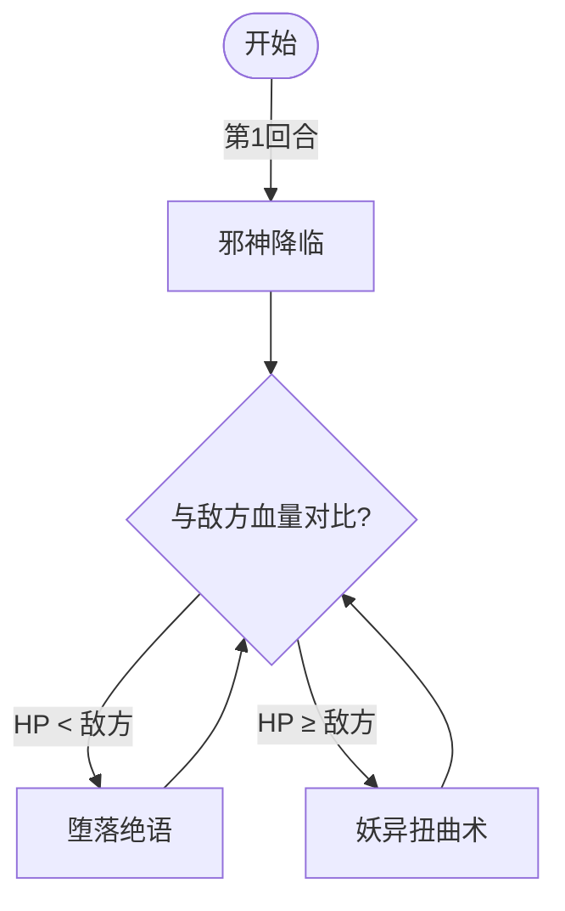

# 摩哥斯

> **类型**：普通怪物
> **初始生命**：123 - 128
> **遭遇战**：第二层（弱怪池单只 / 强怪池与尼尔同行）、第三层（弱怪池 3 只）
> **特性**：开局自伤强化全属性——之后根据生命对比切换攻击模式

## 被动能力

无。但开局固定使用邪神降临自我强化。

## 行动逻辑

摩哥斯开局第 1 回合固定使用邪神降临（自伤 10 + 全属性 +1 + 仪式 3 层），之后根据自身与敌方的生命对比切换攻击模式：血量低于敌方时使用堕落绝语，血量高于或等于敌方时使用妖异扭曲术。

> **说明**：每回合根据当前血量对比重新选择招式。

## 招式表

| 招式名 | 意图 | 类型 | 效果 |
|--------|------|------|------|
| **邪神降临** | 邪神降临 | 自伤 + 自身强化 | 自身受到 10 点不可格挡伤害；自身[力量](/powers/strength_power.md)/[防御](/powers/defense_power.md)/[命中](/powers/accuracy_power.md)/[速度](/powers/speed_power.md) 各 +1，[仪式](/powers/ritual_power.md) +3 层；变形每位敌方弃牌堆中 3 张可变形牌 |
| **堕落绝语** | 攻击 14 | 攻击 + 属性清除 | 造成 14 点攻击伤害；若自身当前生命 < 任一敌方当前生命，伤害翻倍为 28；清除所有敌方正向属性（力量/防御/命中/速度，仅层数 > 0 时移除） |
| **妖异扭曲术** | 攻击 3 ×3 | 多段攻击 + 变形 | 造成 3 点攻击伤害 × 3 次；变形每位敌方抽牌堆中 3 张可变形牌 |

::: warning 邪神降临的开局强化
开局自伤 10 血（123~128 → 113~118），换来全属性 +1 + 仪式 3 层。仪式每回合结束自动 +1 力量，意味着摩哥斯的力量会持续增长。自伤 10 血也让它更容易触发堕落绝语的翻倍条件——开局后自身血量约 113~118，如果你满血（70~80），摩哥斯血量大概率高于你，不会翻倍；但如果你被打了几个回合掉到 100 以下，摩哥斯反而会满足翻倍条件。
:::

## 遭遇战

| 遭遇战 | 章节 | 池子 | 数量 | 同场怪物 | 说明 |
|--------|------|------|------|----------|------|
| `SeerMogesWeakEncounter` | 第二层 | 弱怪池 | 1 只 | — | 单只摩哥斯 |
| `SeerMogesNilStrongEncounter` | 第二层 | 强怪池 | 2 只 | [尼尔](/monsters/normal/nil_monster) | 摩哥斯 + 尼尔（详见下方联动） |
| `SeerMogesTripleWeakEncounter` | 第三层 | 弱怪池 | 3 只 | — | 3 只摩哥斯同场（详见下方联动） |

## 策略提示

1. **开局邪神降临是唯一的自伤窗口**：摩哥斯第 1 回合自伤 10 血不出攻击，是安全的输出时间。123~128 血打掉 10 血后约 113~118，集中火力这回合可以进一步压低血量。

2. **堕落绝语翻倍是最大威胁**：14 伤翻倍 = 28 伤，还会清除你所有正向属性。触发条件是摩哥斯血量 < 你——开局它自伤后血量约 113~118，如果你保持高血量（> 118），它不会翻倍。但随着战斗进行你不可避免会掉血，一旦你的血量低于摩哥斯，堕落绝语就会翻倍。保持血量健康或准备足够格挡。

3. **仪式让力量持续增长**：仪式 3 层每回合结束 +3 力量，第 3 回合力量已有 1+3+3 = 7，所有攻击伤害 +7。妖异扭曲术 3×3 = 9 伤 + 力量 7×3 = 21 伤 = 30 伤。拖得越久攻击越致命。

4. **妖异扭曲术变形牌库**：变形抽牌堆 3 张牌为随机牌，可能打乱你的抽牌节奏。但相比堕落绝语的 28 伤 + 清属性，妖异扭曲术（9 伤 + 变形）反而更"温和"——保持你的血量高于摩哥斯可以迫使它只出妖异扭曲术。

5. **清属性比伤害更致命**：堕落绝语清除力量/防御/命中/速度全部正向层数。如果你叠了大量力量准备爆发，被清掉等于白叠。在血量可能低于摩哥斯时，不要把爆发全押在正向属性上。

6. **123~128 血需要 3~4 回合击杀**：配合仪式增长的力量和邪神降临的全属性，拖到第 4 回合后威胁急剧上升。最好在 3 回合内击杀。

7. **第二层强怪池：与尼尔同场，变化术加剧堕落绝语威胁**：遭遇战 `SeerMogesNilStrongEncounter` 中摩哥斯与[尼尔](/monsters/normal/nil_monster)同行。尼尔第 1 回合固定「空间跳跃·变化术」——变化你抽牌堆 4 张牌为随机牌。这会打乱你的格挡牌/输出牌节奏，可能让你在第 2 回合抽不到格挡时被摩哥斯 28 伤堕落绝语秒杀。建议第 1 回合优先压制尼尔血量（46~51 血可一回合击杀），稳定抽牌后再处理摩哥斯。注意尼尔「念力射线」会获得 12 格挡，固定伤害或流失伤害可绕过。

8. **第三层弱怪池：3 只摩哥斯同场，第 1 回合 3 倍自伤强化**：遭遇战 `SeerMogesTripleWeakEncounter` 中 3 只摩哥斯同场。第 1 回合 3 只同时使用邪神降临——共自伤 30 血（每只 123~128 → 113~118），3 只同时获得全属性 +1 + 仪式 3 层。第 2 回合起每只每回合 +3 力量，3 只合计 +9 力量/回合。如果 3 只同时满足堕落绝语翻倍条件（你的血量低于任一摩哥斯），单回合可能承受 3 × 28 = 84 伤 + 清属性。必须第一回合集火一只（自伤后 113~118 血，3 只合计输出可杀），第二回合再杀一只，把同时存活的数量降到最低。3 只血量合计 339~384，需要较强爆发能力。

## 源码

- 怪物：`SeerMogesMonster.cs`
- 遭遇战：`SeerMogesWeakEncounter.cs`、`SeerMogesNilStrongEncounter.cs`、`SeerMogesTripleWeakEncounter.cs`
- 本地化：`monsters.json`（`SEER_MONSTER_SEER_MOGES_MONSTER.*`）、`intents.json`（`SEER_TWISTED_ART.*`、`SEER_FALLEN_WORD.*`、`SEER_EVIL_GOD_DESCEND.*`）
