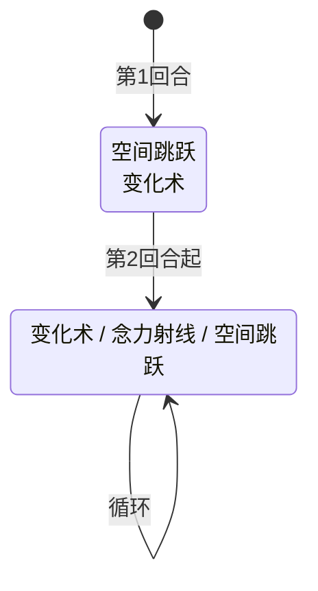

# 尼尔

> **类型**：普通怪物
> **初始生命**：46 - 51
> **遭遇战**：第一、二层普通战斗
> **特性**：开局组合招（缓冲 + 变化抽牌） → 三招随机循环（变化 / 念力射线 / 空间跳跃）

## 被动能力

无。

## 行动逻辑

尼尔开局第 1 回合固定使用组合招「空间跳跃·变化术」（先施放空间跳跃获得缓冲，再施放变化术打乱抽牌堆），之后进入三选一随机，每回合从「变化术 / 念力射线 / 空间跳跃」中等概率随机选择一招（各 1/3），允许连续重复。

> **说明**：`/` 表示三选一随机出招；双招换行显示；可连续重复同一招。

## 招式表

| 招式名 | 意图 | 类型 | 效果 |
|--------|------|------|------|
| **空间跳跃·变化术** | 空间跳跃 + 变化术 | 组合招（开局固定） | 先执行空间跳跃（自身获得 1 层[缓冲](/powers/buffer_power.md)），再执行变化术（变化每位敌方抽牌堆 4 张牌） |
| **变化术** | 变化术 | 干扰 | 对每位敌方：从其抽牌堆中随机选择 4 张可变化牌，将其变化为随机卡牌（状态牌、诅咒牌等不可变化牌不受影响） |
| **念力射线** | 攻击 12 | 攻击 + 自身增益 | 造成 12 点攻击伤害，自身获得等量 12 格挡 |
| **空间跳跃** | 空间跳跃 | 自身增益 | 自身获得 1 层[缓冲](/powers/buffer_power.md) |

::: warning 变化术机制
- 只变化"可变化"的牌（普通牌、攻击/技能/能力牌等），**状态牌和诅咒牌不受影响**
- 变化后的卡牌从整个卡池中随机抽取（受原版变化池规则限制，不会变成状态/诅咒牌）
- 变化数量受抽牌堆中可变化牌数限制：抽牌堆可变化牌不足 4 张时，只变化实际可变的数量
- 多人模式下对每位敌方分别判定，各自抽牌堆独立变化
- 变化使用房间级随机数，多端同步一致
:::

::: tip 念力射线攻防一体
念力射线造成 12 点攻击伤害后，自身立即获得 12 点格挡。这意味着：
- 攻击伤害可被你的格挡抵消，但尼尔获得的格挡会让它更难被反杀
- 念力射线是**攻击伤害**，受[力量](/powers/strength_power.md)、[易伤](/powers/vulnerable_power.md)影响
- 如果尼尔有力量加成，念力射线实际伤害会更高
:::

## 遭遇战

| 遭遇战 | 池子 | 数量 | 说明 |
|--------|------|------|------|
| 弱怪池 | 弱怪池 | 2 只 | 双尼尔 |
| 强怪池 | 强怪池 | 1 只 | 与 1 只[摩哥斯](/monsters/normal/moges_monster)同行 |

## 策略提示

1. **46~51 血一回合可杀**：尼尔血量偏低，集中火力一回合击杀是最优策略。如果放任不管，变化术会持续打乱你的抽牌堆，念力射线的 12 格挡也会让它越来越难杀。

2. **开局组合招的威胁评估**：第 1 回合尼尔同时获得 1 层缓冲 + 变化你抽牌堆 4 张牌。缓冲让它第一回合难以被秒杀（吸收一次攻击），变化术则打乱你后续回合的抽牌节奏。建议第 1 回合用低费攻击牌破缓冲，不要把高伤牌浪费在缓冲上。

3. **变化术是核心干扰**：变化术把你抽牌堆的 4 张牌变成随机卡牌，可能把核心牌变成废牌。但变化只影响抽牌堆，**手牌和弃牌堆不受影响**。如果你关键的牌在手牌里，变化术威胁不大；如果核心牌还在抽牌堆里，变化后你抽到的是别的卡而非原来的核心牌。

4. **念力射线回合是输出窗口**：念力射线虽然给尼尔 12 格挡，但这一回合它没有出缓冲。如果你能在尼尔出念力射线后立即用固定伤害或流失伤害（绕过格挡）输出，可以避免被格挡抵消。另外念力射线是攻击伤害，尼尔如果被施加虚弱，12 伤害会降为 9。

5. **空间跳跃是最弱回合**：空间跳跃只获得 1 层缓冲，是尼尔三招中威胁最低的。如果尼尔出空间跳跃，说明这回合它没有打你也没有干扰你的牌，是安全的输出时间。集中火力破缓冲后输出。

6. **双尼尔弱怪池要速杀一只**：弱怪池 2 只尼尔同场，第 1 回合两只同时释放组合招——2 层缓冲 + 变化你抽牌堆 8 张牌。抽牌堆被大规模打乱后很难维持节奏。第一回合集中火力杀一只，把威胁减半。

7. **摩哥斯 + 尼尔强怪池联动**：强怪池中尼尔与摩哥斯同行。摩哥斯根据生命对比切换攻击模式（自身血量低时用 28 伤堕落绝语），尼尔的变化术会打乱你的牌序，可能导致你抽不到格挡牌而被摩哥斯秒杀。优先击杀尼尔可以稳定抽牌，再处理摩哥斯。

8. **变化是永久的**：变化术把牌变成另一张牌，不消耗、不移除，但变化是**永久**的——整局冒险中这张牌会一直保持变化后的形态，战斗结束后也不会恢复。所以变化术的威胁是"永久打乱牌组节奏"，尤其要小心核心牌被变化。

## 源码

- 怪物：`SeerNilMonster.cs`
- 意图：`SeerNilIntents.cs`（`SeerTransformIntent`、`SeerNamedSingleAttackIntent`、`SeerSpaceJumpIntent`）
- 遭遇战：`SeerNilWeakEncounter.cs`、`SeerMogesNilStrongEncounter.cs`
- 本地化：`monsters.json`（`SEER_MONSTER_SEER_NIL_MONSTER.*`）、`intents.json`（`SEER_TRANSFORM.*`、`SEER_PSIONIC_RAY.*`、`SEER_SPACE_JUMP.*`）
