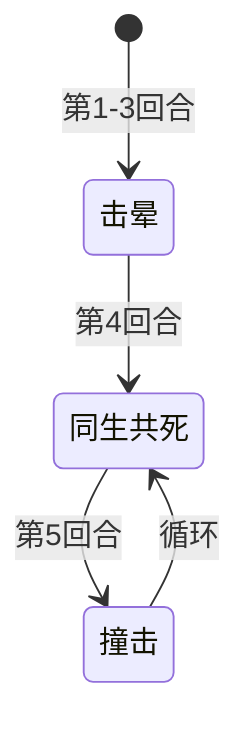

# 皮皮

> **类型**：普通怪物
> **初始生命**：10 - 13
> **遭遇战**：第一、二层普通战斗
> **特性**：同生共死（强制同步血量） + 神宠召唤链（击杀后召唤新皮皮，最多 5 次）

## 被动能力（开局自带）

| 名称 | 类型 | 效果 |
|------|------|------|
| **[神宠](/powers/divine_pet_power.md)**（5 层） | 能力（不可消除） | 自身被击败后，所有玩家获得 20 万赛尔豆，并召唤一只新的皮皮。剩余次数减 1。新皮皮同样携带递减后的神宠。共召唤 5 只新皮皮，第 6 只不携带神宠，击杀后不再召唤。 |

## 行动逻辑

皮皮的行动分两阶段：前 3 回合击晕（空操作），第 4 回合起进入「同生共死 → 撞击」交替循环。被召唤的新皮皮也会从击晕阶段重新开始。

> **说明**：击晕期间空操作，不造成任何伤害。

## 招式表

| 招式名 | 意图 | 类型 | 效果 |
|--------|------|------|------|
| **登场 / 苏醒 / 蓄势** | 击晕 | 空操作 | 不做任何事，仅播放等待动画。前 3 回合各使用一次 |
| **同生共死** | 同生共死 | 特殊 | 将所有敌方目标的当前生命值设为与皮皮自身**当前生命值**相同 |
| **撞击** | 攻击 5 | 攻击 | 造成 5 点攻击伤害 |

::: warning 同生共死机制
- 直接设置目标当前生命值，**不是伤害**——不触发格挡、不触发受伤类能力、不受力量/易伤影响
- 多人模式下对所有敌方目标分别生效
- 设为皮皮的**当前生命值**（不是最大生命值）：如果皮皮被攻击后血量降低，目标也会被设到较低的血量
- 如果皮皮当前生命值高于目标，目标生命值反而会**上升**（但不会超过最大生命值）
- 同生共死后下一回合必定是撞击（5 点伤害）；如果同生共死时皮皮血量 ≤5，被撞击后可能直接死亡
:::

## 神宠召唤链

皮皮被击败时触发神宠效果：

1. 所有玩家获得 20 万赛尔豆
2. 在原位召唤一只新皮皮（新皮皮从第 1 回合击晕阶段重新开始）
3. 新皮皮的神宠层数 = 击杀者皮皮的神宠层数 - 1
4. 重复直到第 6 只皮皮（神宠层数 = 0），击杀后不再召唤

| 击杀顺序 | 神宠层数 | 获得赛尔豆 | 召唤新皮皮 |
|----------|----------|-----------|-----------|
| 第 1 只 | 5 | 20 万 | ✅ |
| 第 2 只 | 4 | 20 万 | ✅ |
| 第 3 只 | 3 | 20 万 | ✅ |
| 第 4 只 | 2 | 20 万 | ✅ |
| 第 5 只 | 1 | 20 万 | ✅ |
| 第 6 只 | 0 | 无 | ❌ |

**完整击杀一只皮皮及其召唤链**：共击杀 6 只，获得 100 万赛尔豆。

## 遭遇战

| 遭遇战 | 池子 | 数量 | 说明 |
|--------|------|------|------|
| 弱怪池 | 弱怪池 | 2 只 | 双皮皮 |
| 强怪池 | 强怪池 | 3 只 | 三皮皮 |
| 八皮皮 | 强怪池 | 8 只 | 八皮皮同场 |
| 事件遭遇 | 事件 | 6 只 | 事件触发 |

## 策略提示

1. **前 3 回合是免费输出窗口**：皮皮前 3 回合击晕不做任何事，是安全的输出时间。尽量在这 3 回合内击杀第一只皮皮，否则第 4 回合的同生共死会把你的血量压到皮皮当前的血量值。

2. **同生共死不是伤害，是直接设血**：同生共死直接把你的当前生命值设为皮皮的**当前生命值**（不是最大生命值），不经过格挡、不受减伤能力影响。唯一应对方式是在第 4 回合之前击杀皮皮。同生共死后下一回合撞击造成 5 点伤害——如果同生共死时皮皮血量 >5，被撞击后不会死；如果皮皮血量 ≤5，你会被直接打死。如果你血量本身低于皮皮当前血量，同生共死反而会帮你回血。

3. **多只皮皮同场时威胁叠加**：2~3 只皮皮同时在场时，第 4 回合可能同时释放同生共死（效果不叠加，取最后一只皮皮的血量），之后轮流撞击。8 皮皮遭遇战尤其危险——前 3 回合是全力清场的窗口，尽量在击晕阶段多杀几只。

4. **召唤链是赛尔豆农场**：每杀一只皮皮获得 20 万赛尔豆，完整击杀一只皮皮的召唤链共获 100 万。如果遇到 8 皮皮遭遇战且每只都走完召唤链，理论收益极高。但要注意每只新皮皮又有 3 回合击晕 + 同生共死循环，战斗时间会很长。

5. **新皮皮从击晕重新开始**：被召唤的新皮皮不会立刻行动，而是从第 1 回合击晕阶段重新开始。这给了玩家 3 回合缓冲时间来恢复状态或继续输出。

6. **同生共死和撞击的交替节奏**：第 4 回合同生共死后，第 5 回合撞击，第 6 回合又同生共死……两招交替。记住这个节奏：同生共死回合不需要格挡（格挡无效），撞击回合只需要 5 点格挡即可完全防住。

## 源码

- 怪物：`SeerPipiMonster.cs`
- 被动能力：`SeerDivinePetPower.cs`
- 本地化：`monsters.json`（`SEER_MONSTER_SEER_PIPI_MONSTER.*`）、`intents.json`（`SEER_LIFE_LINK.*`、`SEER_TACKLE.*`）、`powers.json`（`SEER_POWER_SEER_DIVINE_PET_POWER.*`）
