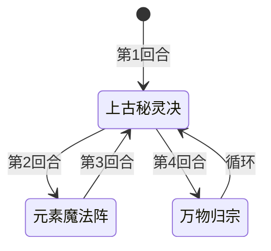

# 萨克森

> **类型**：普通怪物
> **初始生命**：97 - 102
> **遭遇战**：第三层普通战斗
> **特性**：元素克制驱动——开局获得 2 个克制你的元素，四步循环中持续扩张克制属性

## 被动能力（开局自带）

| 名称 | 类型 | 效果 |
|------|------|------|
| **[远古魔法](/powers/ancient_magic_power.md)**（1 层） | 能力（不可消除） | 第一回合怪物侧开始时触发：移除自身所有元素属性，随机施加 2 个克制对方的元素属性。若对方无元素属性，则从所有未拥有的元素中随机选择 |

::: tip 元素克制机制
- "克制"定义：伤害倍率为 1.5 倍
- 萨克森的攻击伤害对被克制元素的目标造成 1.5 倍伤害
- 若你无元素属性（未分配元素），所有元素均作为候选，等价于随机
- 远古魔法仅在第一回合触发一次，之后不再重复
:::

## 行动逻辑

萨克森第一回合开始时先触发远古魔法被动（移除自身元素 + 施加 2 个克制元素），之后进入固定四步循环：

**上古秘灵决 → 元素魔法阵 → 上古秘灵决 → 万物归宗 → 循环回到上古秘灵决**

## 招式表

| 招式名 | 意图 | 类型 | 效果 |
|--------|------|------|------|
| **上古秘灵决** | 攻击 15 | 攻击 + 干扰 | 造成 15 点攻击伤害，向每位敌方手牌加入 1 张**渺小**状态牌，并施加[渺小](/powers/tiny_power.md)能力 |
| **元素魔法阵** | 元素魔法阵 | 自身增益 + 干扰 | 自身全属性 +5（力量/防御/命中/速度各 +5），每位敌方的所有牌（抽牌堆/手牌/弃牌堆/消耗堆）获得[消耗](/mechanics/exhaust)关键字 |
| **万物归宗** | 万物归宗 | 自身增益 | 自身获得 20 格挡，再添加 1 个克制对方的元素属性 |

::: warning 渺小连锁伤害机制
- 上古秘灵决向你的手牌加入 1 张「渺小」状态牌（不可打出）
- 同时对你施加「渺小」能力：你打出卡牌时，每张手牌中的渺小牌造成 2 点伤害
- 例：手牌有 3 张渺小牌时打出 1 张卡，受到 3×2 = 6 点伤害
- 手牌中无渺小牌时，渺小能力自动移除
:::

::: warning 元素魔法阵的致命性
元素魔法阵会给你的**所有牌**（包括抽牌堆、手牌、弃牌堆、消耗堆中的全部卡牌）添加消耗关键字。这意味着：
- 此后打出的每一张牌都会被消耗，无法回收
- 已有消耗关键字的牌不受影响（本身就会消耗）
- 在元素魔法阵回合前尽量打出关键牌，避免核心牌被消耗
:::

## 遭遇战

| 遭遇战 | 池子 | 数量 | 说明 |
|--------|------|------|------|
| 弱怪池 | 弱怪池 | 1 只 | 单只萨克森 |
| 强怪池 | 强怪池 | 1 只 | 与活雾、拳击构装体同行（活雾会召唤毒气弹） |

## 策略提示

1. **97~102 血需要 2~3 回合击杀**：萨克森血量中等，配合万物归宗的 20 格挡可能拖到 4 回合。建议在元素魔法阵回合前集中火力击杀，避免核心牌被消耗。

2. **元素克制是核心威胁**：开局萨克森获得 2 个克制你的元素，攻击伤害 1.5 倍。如果你有元素属性，上古秘灵决的 15 伤害在克制下变成 22~23 伤害。如果你无元素属性，萨克森随机选择 2 个元素，后续可能通过万物归宗再添加 1 个，克制压力持续放大。

3. **元素魔法阵前要清空关键牌**：第 2 回合元素魔法阵会让你的所有牌获得消耗。如果你有核心combo牌或关键输出牌，必须在第 1~2 回合打出。否则这些牌一旦被消耗，整局战斗的输出能力会大幅下降。

4. **渺小牌要尽早处理**：渺小牌不可打出，占用手牌位置，且每打出 1 张牌会受到 2 点伤害/张渺小牌。上古秘灵决每用一次加 1 张渺小，4 步循环中有 2 次上古秘灵决，意味着循环一轮手牌会多 2 张渺小。可以通过消耗、弃牌等方式处理渺小牌。

5. **四步循环可预判**：萨克森行动序列固定，可以精确预判每回合的招式。第 1 回合上古秘灵决（15 伤），第 2 回合元素魔法阵（全属性+5+消耗），第 3 回合上古秘灵决，第 4 回合万物归宗（20 格挡+1 克制元素）。根据预判分配格挡和输出资源。

6. **万物归宗回合是输出空窗**：万物归宗只获得 20 格挡 + 1 个克制元素，没有直接伤害或干扰。但这 20 格挡会让本回合难以造成有效伤害。用固定伤害或流失伤害绕过格挡，或者在这回合保留资源，等下回合上古秘灵决时再输出。

7. **元素魔法阵的全属性+5会累积**：每次元素魔法阵使用，萨克森全属性+5（力量+5、防御+5、命中+5、速度+5）。如果战斗拖到第二轮循环（第 6 回合元素魔法阵），全属性会到+10，上古秘灵决的伤害在力量加成下显著提升。尽快击杀避免属性滚雪球。

8. **强怪池联动极其危险**：强怪池中萨克森 + 活雾 + 拳击构装体同场。活雾会召唤毒气弹，拳击构装体有自己的输出机制，萨克森的元素魔法阵会让你的所有牌消耗。三只怪物同时干扰，建议优先击杀萨克森（血量最低且元素魔法阵最致命），或者跳过这个强怪池。

## 源码

- 怪物：`SeerSakesenMonster.cs`
- 被动能力：`SeerAncientMagicPower.cs`（远古魔法）
- 渺小机制：`SeerTinyPower.cs`（渺小能力）、`SeerTiny.cs`（渺小状态牌）
- 意图：`SeerSakesenIntents.cs`
- 遭遇战：`SeerSakesenWeakEncounter.cs`、`SeerLivingFogSakesenPunchConstructStrongEncounter.cs`
- 本地化：`monsters.json`（`SEER_MONSTER_SEER_SAKESEN_MONSTER.*`）、`intents.json`（`SEER_ELEMENT_MAGIC_ARRAY.*`、`SEER_ANCIENT_SECRET.*`、`SEER_ALL_RETURN.*`）、`powers.json`（`SEER_POWER_SEER_ANCIENT_MAGIC_POWER.*`、`SEER_POWER_SEER_TINY_POWER.*`）
