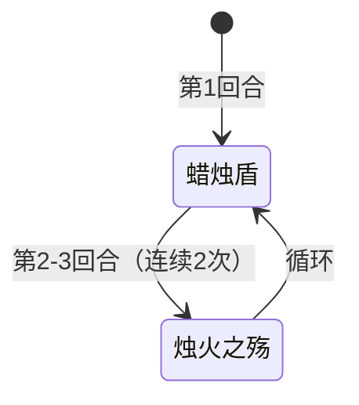

# 斯嘟尔

> **类型**：普通怪物
> **初始生命**：84 - 89
> **遭遇战**：第一、二层普通战斗
> **特性**：蜡烛光环吞 PP 牌——打出 PP 牌时 PP 清零并消耗，蜡烛盾受击叠加光环

## 被动能力（开局自带）

| 名称 | 类型 | 效果 |
|------|------|------|
| **[蜡烛光环](/powers/candle_aura_power.md)**（5 层） | Buff | 敌方打出 PP 牌时，该牌 PP 清零并移入消耗堆，蜡烛光环 -1 层。层数耗尽后不再触发 |

::: tip 蜡烛光环机制
- 仅对 **PP 牌**生效——非 PP 牌打出时不触发
- PP 牌被打出后 PP 被清零且移入消耗堆，无法回收
- 多只斯嘟尔同场时，只有战斗顺序中第一个仍有蜡烛光环层数的斯嘟尔触发，其余不触发（一层一层消耗，而非一起消耗）
- 初始 5 层，最多吞掉 5 张 PP 牌
:::

## 行动逻辑

斯嘟尔第一回合固定使用蜡烛盾，之后进入固定三步循环：

**蜡烛盾 → 烛火之殇 → 烛火之殇 → 循环回到蜡烛盾**

## 招式表

| 招式名 | 意图 | 类型 | 效果 |
|--------|------|------|------|
| **蜡烛盾** | 蜡烛盾 | 自身增益 | 自身获得 3 层[滑溜](/powers/slippery_power.md) + 3 层[蜡烛盾](/powers/candle_shield_power.md)。蜡烛盾期间每次受到伤害获得 2 层蜡烛光环，3 次后蜡烛盾耗尽 |
| **烛火之殇** | 攻击 15 | 攻击 + Debuff | 造成 15 点攻击伤害，对所有生物（敌方 + 友方）施加[烧伤](/powers/burn_power.md) 3 层 |

::: warning 蜡烛盾机制
- 蜡烛盾 3 层：每次受到实际伤害（伤害值 > 0）时获得 2 层蜡烛光环，蜡烛盾 -1 层
- 3 次受击后蜡烛盾耗尽，期间共获得 6 层蜡烛光环
- 配合开局 5 层蜡烛光环，第一次蜡烛盾结束后蜡烛光环可达 11 层
- 蜡烛盾期间受击会持续滚雪球式叠加蜡烛光环，需控制攻击节奏
:::

::: warning 烛火之殇的全场烧伤
烛火之殇对所有生物施加烧伤，包括斯嘟尔自己及其队友。这意味着：
- 斯嘟尔自己也会被烧伤，每回合受到烧伤伤害
- 如果场上有斯嘟尔的友军（如双斯嘟尔强怪池），友军也会被烧伤
- 烧伤是按层数每回合造成伤害的 Debuff，3 层烧伤 = 每回合 3 点伤害
:::

## 遭遇战

| 遭遇战 | 池子 | 数量 | 说明 |
|--------|------|------|------|
| 弱怪池 | 弱怪池 | 1 只 | 与 1 只墨滴同行 |
| 强怪池 | 强怪池 | 2 只 | 双斯嘟尔 |
| 弱怪池（坤格蛋） | 弱怪池 | 1 只 | 与 2 只[坤格的蛋](/monsters/special/kunge_egg)同行 |
| 强怪池（坤格蛋） | 强怪池 | 1 只 | 与 4 只[坤格的蛋](/monsters/special/kunge_egg)同行 |

## 策略提示

1. **蜡烛光环是 PP 牌杀手**：开局 5 层蜡烛光环，打出 PP 牌时 PP 清零并消耗。如果你的牌组高度依赖 PP 牌（如先古牌、角色牌），斯嘟尔会吞掉你 5 张关键 PP 牌。优先用非 PP 牌或低价值 PP 牌消耗蜡烛光环层数。

2. **蜡烛盾受击叠加光环**：蜡烛盾期间每次受击获得 2 层蜡烛光环，3 次受击共获得 6 层。配合开局 5 层，第一次蜡烛盾结束后蜡烛光环可达 11 层。如果让斯嘟尔走完一轮循环（蜡烛盾+2 烛火之殇），蜡烛光环会滚雪球到难以处理的程度。

3. **滑溜抵消小伤害**：蜡烛盾附带 3 层滑溜，每次失去生命值时只损失 1 点。多段小伤害攻击会被滑溜大量抵消。建议用单次高伤攻击破滑溜，而非多段小伤害。

4. **烛火之殇全场烧伤包括自己**：烛火之殇对所有生物施加 3 层烧伤，斯嘟尔自己也会被烧伤。每回合 3 点烧伤伤害，2 次烛火之殇后斯嘟尔自身 6 层烧伤，每回合自伤 6 点。可以利用这一点加速击杀。

5. **三步循环可预判**：斯嘟尔行动序列固定——第 1 回合蜡烛盾，第 2~3 回合烛火之殇，第 4 回合蜡烛盾。烛火之殇回合需要 15 点格挡防住伤害，蜡烛盾回合是安全输出时间（但要注意受击叠加光环）。

6. **双斯嘟尔强怪池威胁翻倍**：强怪池 2 只斯嘟尔同场，蜡烛光环一个一个消耗（只有第一个有光环的触发）。但 2 只斯嘟尔各自有 5 层光环，共可吞 10 张 PP 牌。第 1 回合两只同时蜡烛盾，第 2~3 回合两只同时烛火之殇（30 伤/回合 + 全场烧伤）。建议优先击杀一只，把威胁减半。

7. **坤格的蛋遭遇战联动**：斯嘟尔与坤格的蛋同场时，坤格的蛋会孵化成坤格。坤格的顽皮之火按烧伤层数削 PP，而斯嘟尔的烛火之殇全场烧伤——包括坤格的蛋/坤格。烧伤叠高后坤格的顽皮之火会大幅削 PP，形成双重 PP 削减。

8. **84~89 血配合自伤可加速击杀**：斯嘟尔血量中等，但烛火之殇的自伤（每回合 3~6 点烧伤伤害）会帮你削血。如果让斯嘟尔走完一轮循环，自身烧伤伤害约 9~12 点，相当于帮你打了 10%~14% 的血量。

## 源码

- 怪物：`SeerSiduerMonster.cs`
- 被动能力：`SeerCandleAuraPower.cs`（蜡烛光环）、`SeerCandleShieldPower.cs`（蜡烛盾）
- 意图：`SeerSiduerIntents.cs`
- 遭遇战：`SeerSiduerWeakEncounter.cs`、`SeerSiduerDoubleStrongEncounter.cs`、`SeerKungeWeakEncounter.cs`、`SeerKungeStrongEncounter.cs`
- 本地化：`monsters.json`（`SEER_MONSTER_SEER_SIDUER_MONSTER.*`）、`intents.json`（`SEER_CANDLE_GRIEF.*`、`SEER_CANDLE_SHIELD.*`）、`powers.json`（`SEER_POWER_SEER_CANDLE_AURA_POWER.*`、`SEER_POWER_SEER_CANDLE_SHIELD_POWER.*`）
