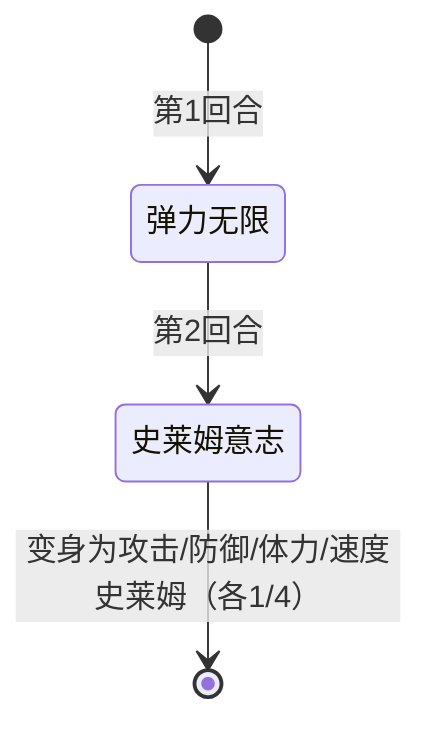

# 史莱姆

> **类型**：普通怪物
> **初始生命**：114512 - 114517
> **遭遇战**：第一、二层普通战斗
> **特性**：超高血量 + 两回合后变身为随机变种史莱姆

## 被动能力

无。史莱姆本身没有被动能力，但变身后的新史莱姆各自携带不同被动。

## 行动逻辑

史莱姆只有两招，按顺序使用。第 1 回合使用弹力无限污染抽牌堆，第 2 回合使用史莱姆意志变身为随机变种史莱姆，本体立即死亡并由新史莱姆接管槽位。**变身只发生一次**——变身后的新史莱姆不会再变回本体。

> **说明**：史莱姆意志回合自身死亡，变身后由新史莱姆接管。

## 招式表

| 招式名 | 意图 | 类型 | 效果 |
|--------|------|------|------|
| **弹力无限** | 弹力无限 | 干扰 | 对每位玩家：从抽牌堆中随机选择 2 张可变形牌，变为**黏液**（原版状态牌，抽1张牌） |
| **史莱姆意志** | 史莱姆意志 | 变身 | 自身死亡，在原槽位生成随机一种变种史莱姆（攻击/防御/体力/速度，等概率） |

::: tip 弹力无限细节
- 只变抽牌堆中的牌，不影响手牌和弃牌堆
- 只变"可变形"的牌，诅咒牌和部分特殊牌不受影响
- 多人模式下对每位玩家分别生效
- 变身目标由同步随机数决定，多端一致
:::

## 变身目标：四种变种史莱姆

变身后本体消失，新史莱姆拥有独立血量和行动逻辑。以下是四种变种的概要：

### 攻击史莱姆

> **初始生命**：32 - 37 · **开局自带**：5 层[力量](/powers/strength_power.md)
> **行动逻辑**：血量 ≥ 10 时使用「超强力量」（力量翻倍），血量 < 10 时使用「最强之剑」（20 点攻击伤害）

| 招式 | 意图 | 效果 |
|------|------|------|
| 超强力量 | 自身力量翻倍 | 读取当前力量层数，再施加等量力量（翻倍） |
| 最强之剑 | 攻击 20 | 造成 20 点攻击伤害（受力量加成） |

::: warning 核心威胁
力量翻倍是指数增长——开局 5 层力量，第 1 回合翻到 10，第 2 回合翻到 20，第 3 回合翻到 40……拖得越久攻击越致命。血量低于 10 时切换为 20 点固定重击（仍受力量加成），实际伤害可能极高。
:::

### 防御史莱姆

> **初始生命**：32 - 37 · **开局自带**：2 层[防御](/powers/defense_power.md) + [王者之灵](/powers/kings_spirit_power.md)（每回合开始防御 +1）
> **行动逻辑**：第 1 回合使用「坚韧外壳」，之后每回合使用「盾牌狂乱击」

| 招式 | 意图 | 效果 |
|------|------|------|
| 坚韧外壳 | 自身增益 | 获得 ⌊最大生命值 × 40%⌋ 层**硬化外壳**（即 12-14 层，每回合受到的总生命损失不超过该值） |
| 盾牌狂乱击 | 攻击 + 固定伤害 | 造成 12 点攻击伤害，附加 2 × 当前防御层数的[固定伤害](/mechanics/fixed-damage) |

::: warning 核心威胁
防御层数每回合 +1（王者之灵），盾击的固定伤害随之线性增长。由于开局 2 层 + 每回合 +1，行动时防御 = 回合数 + 1（第 1 回合防御 3，第 2 回合防御 4，固定伤害 = 8；第 5 回合防御 7，固定伤害 = 14）。固定伤害无法被格挡，只能靠[固定伤害免疫](/powers/immune_fixed_damage_power.md)抵消。加上硬化外壳限制每回合最多掉 12-14 血，生存力极强。
:::

### 体力史莱姆

> **初始生命**：95 - 105 · **开局自带**：无
> **行动逻辑**：前 4 回合使用「耐力无限」（回血 10），第 5 回合起每回合使用 Combo「耐力无限·钉刺狼牙锤」

| 招式 | 意图 | 效果 |
|------|------|------|
| 耐力无限 | 自身恢复 | 恢复 10 点生命 |
| 钉刺狼牙锤 | 攻击 | 造成 ⌊当前生命值 ÷ 10⌋ 点攻击伤害 |
| 耐力无限·钉刺狼牙锤 | 双意图 Combo | 先回血 10，再按回血后的生命值计算伤害 |

::: warning 核心威胁
前 4 回合纯回血不出手，无伤情况下第 5 回合 HP = 95~105 + 4×10 = 135~145。第 5 回合 Combo 先回血 10（HP 升至 145~155），再按回血后的生命值计算伤害：⌊145~155 ÷ 10⌋ = 14~15 点。之后每回合继续回血 + 输出，且伤害随 HP 增长。血量是四种变种中最高的，但前 4 回合是安全输出窗口。
:::

### 速度史莱姆

> **初始生命**：32 - 37 · **开局自带**：1 层[迅捷](/powers/swift_one_power.md)（先制 +1）
> **行动逻辑**：从第 1 回合起，每回合都使用 Combo「速度之魂·迅捷撞击」

| 招式 | 意图 | 效果 |
|------|------|------|
| 速度之魂 | 自身增益 | 速度 +1，先制 +1 |
| 迅捷撞击 | 多段攻击 | 造成 3 点攻击伤害 ×（2 + 当前速度层数）次 |
| 速度之魂·迅捷撞击 | 双意图 Combo | 先加速，再按加速后的速度计算连击数 |

::: warning 核心威胁
连击数随回合线性增长——第 1 回合 2 次（6 伤），第 2 回合 3 次（9 伤），第 3 回合 4 次（12 伤）……同时先制每回合 +1，怪物回合顺位越来越靠前，最终可能抢在玩家之前行动。是最不能拖延的变种。
:::

## 遭遇战

| 遭遇战 | 池子 | 数量 | 说明 |
|--------|------|------|------|
| 弱怪池 | 弱怪池 | 2 只 | 双史莱姆 |
| 强怪池 | 强怪池 | 3 只 | 三史莱姆 |
| 与皮皮同行 | 强怪池 | 1 只 | 与 1 只[皮皮](/monsters/normal/pipi_monster)同行 |
| 与迷雾同行 | 强怪池 | 1 只 | 与 1 只 LivingFog 同行 |
| 与雇佣兵同行 | 强怪池 | 2 只 | 与 1 只 GremlinMerc 同行 |
| 与史莱姆王子同行 | 强怪池 | 1 只 | 与 1 只史莱姆王子同行 |
| 事件遭遇 | 事件（无奖励） | 4 只 | 事件触发 |

## 策略提示

1. **11 万血量是设计来杀不掉的**：史莱姆本体生命值高达 11 万+，意图是让玩家挨一回合弹力无限后等它自己变身。硬杀本体几乎不可能，也没必要——变身后的新史莱姆只有 32~105 血，是真正的击杀目标。

2. **弹力无限只有一回合**：弹力无限把抽牌堆 2 张牌变成黏液（抽 1 张牌的状态牌），只会在第 1 回合使用一次。黏液本身不是废牌（能抽 1 张），但如果关键牌被变了节奏会断。手牌里留好关键输出，不要全指望抽牌堆。

3. **变身后立刻判断威胁优先级**：四种变种的危险程度不同——速度史莱姆越拖越强（连击指数增长），必须第一时间击杀；攻击史莱姆力量翻倍同样不能拖，但血量 < 10 后会切换为重击模式反而好预判；防御史莱姆有硬化外壳（每回合最多掉 12-14 血），需要持续输出或[固定伤害](/mechanics/fixed-damage)穿透；体力史莱姆前 4 回合纯回血是安全窗口，第 5 回合才开始 Combo。

4. **防御史莱姆的固定伤害会越来越疼**：盾牌狂乱击附带 2 × 防御层数的固定伤害，防御每回合 +1，固定伤害无法格挡。如果变了防御史莱姆，尽快在其防御堆高之前击杀，或准备固定伤害免疫手段。

5. **速度史莱姆的先制会改变回合顺序**：速度之魂每回合给自身 +1 速度和 +1 先制，先制越高回合顺位越靠前。拖到 3-4 回合后速度史莱姆可能抢先行动，在你来得及加格挡之前就打完连击。

6. **遭遇多只史莱姆时变身目标各自独立**：2-3 只史莱姆同场时，每只各自在第 2 回合独立变身，变身目标互不影响。可能同时出现 2 只速度史莱姆或 2 只攻击史莱姆的情况，威胁叠加。

## 源码

- 怪物：`SeerSlimeMonster.cs`
- 变种：`SeerAttackSlimeMonster.cs`、`SeerDefenseSlimeMonster.cs`、`SeerHpSlimeMonster.cs`、`SeerSpeedSlimeMonster.cs`
- 本地化：`monsters.json`（`SEER_MONSTER_SEER_SLIME_MONSTER.*`）、`intents.json`（`SEER_BOUNCE.*`、`SEER_SLIME_WILL.*`）
