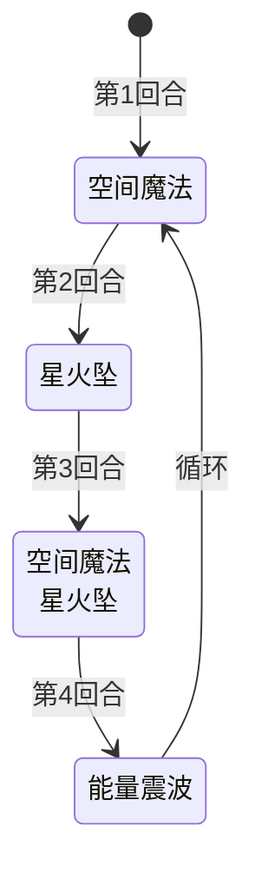

# 史莱姆王子

## 基本信息

| 属性 | 数值 |
|---|---|
| 分类 | [普通怪物](/monsters/normal/) |
| 生命值 | 113 - 118 |

## 行动逻辑

按「空间魔法 → 星火坠 → 空间魔法·星火坠 → 能量震波」四回合一循环。

> **说明**：双招换行显示。

## 招式

| 招式 | 意图 | 描述 | 数值 |
|---|---|---|---|
| 空间魔法 | 空间魔法 | 施加闪光漩涡。若已有，造成12点伤害。 | 闪光漩涡 1 层；已有则 12 点伤害 |
| 星火坠 | 星火坠 | 造成7点伤害。向你的抽牌堆加入3张黏液？。 | 伤害 7，黏液？ 3 张 |
| 能量震波 | 能量震波 | 你的全属性-1，先制-1。升级所有黏液？。 | 全属性 -1，先制 -1 |
| 空间魔法·星火坠 | 空间魔法 + 星火坠 | 第3回合组合招式，依次执行空间魔法与星火坠。 | 同上两项 |

## 相关能力说明

- **闪光漩涡**：每回合结束时，若你的四个牌堆（抽牌/手牌/弃牌/消耗）都有状态牌，战斗结束后向你的牌组加入一张粘液。
- **全属性**：指力量、防御、命中、速度各 -1，能量震波额外施加先制 -1。
- **黏液？**：状态牌，被能量震波升级后会增强。
- **空间魔法的伤害**：已有闪光漩涡时造成的 12 点伤害为移动伤害（不可计数），不属攻击伤害。

## 遭遇战

| 遭遇战 | 房间类型 | 池子 | 数量 | 说明 |
|---|---|---|---|---|
| `SeerSlimePrinceWeakEncounter` | Monster | 弱怪池 | 1 只 | 单王子（位置 prince1） |
| `SeerSlimePrinceStrongEncounter` | Monster | 强怪池 | 1 只 | 与 1 只史莱姆同行 |
| `SeerSlimePrinceDoubleKingWeakEncounter` | Monster | 弱怪池 | 2 只 | 与 1 只史莱姆国王同行 |

## 策略提示

1. **闪光漩涡的潜伏威胁——四牌堆状态牌触发**：闪光漩涡本身不立即造成伤害，但每回合结束时，若你的四个牌堆（抽牌/手牌/弃牌/消耗）**都有**状态牌，战斗结束后会向你的牌组加入一张粘液，长期污染牌组。星火坠塞的黏液？是状态牌，会满足"抽牌堆有状态牌"的条件。如果你的手牌有状态牌（如原版粘液）、弃牌堆也有状态牌，闪光漩涡就会触发。及时清理状态牌可避免牌组被长期污染。

2. **空间魔法的二段伤害机制**：首次空间魔法施加闪光漩涡（不造成伤害），再次使用空间魔法时（如第 3 回合组合招中的空间魔法）因你已有闪光漩涡而直接造成 12 点**移动伤害**（不可计数，不属攻击伤害，不受力量/易伤影响）。若不希望被砸，可在其再次行动前清除闪光漩涡。但闪光漩涡是能力类型，难以清除。

3. **能量震波的全属性削弱**：第 4 回合能量震波使你全属性（力量/防御/命中/速度）各 -1、先制 -1，并升级所有黏液？。全属性 -1 会削弱你的输出和防御能力，先制 -1 会让你回合顺位靠后。应在此之前抢血或清理黏液？，避免被削弱后输出能力下降。

4. **黏液？污染抽牌堆**：星火坠每回合向抽牌堆加入 3 张黏液？，能量震波又会升级它们。3 回合一循环中星火坠出现 2 次（第 2 回合 + 第 3 回合组合招），共塞入 6 张黏液？。黏液？是状态牌，会堵塞抽牌堆并可能触发闪光漩涡。应及时打出或处理黏液？，避免抽牌堆被堵塞。

5. **四步循环可预判**：史莱姆王子行动序列固定——空间魔法 → 星火坠 → 空间魔法+星火坠（组合招）→ 能量震波。第 3 回合组合招同时施加闪光漩涡（触发 12 移动伤害）+ 7 攻击伤害 + 3 黏液？，是威胁最大的回合。第 4 回合能量震波不直接造成伤害但会削弱全属性，是相对安全的输出窗口。

6. **113~118 血需要 2~3 回合击杀**：史莱姆王子血量中等，配合闪光漩涡和黏液？污染，拖延会让牌组越来越差。建议在第 3 回合组合招前集中火力击杀，避免能量震波削弱全属性后输出能力下降。

7. **与史莱姆国王同场的双重威胁**：弱怪池遭遇战中史莱姆王子与 1 只史莱姆国王同行。国王首回合传说结界+国王之怒，王子首回合空间魔法施加闪光漩涡。两只同时施压，状态牌会快速堆积触发双方的闪光漩涡/黏液污染机制。优先击杀王子（血量较低），再处理国王。

## 源码

- 怪物：`SeerSlimePrinceMonster.cs`
- 招式相关 Power：`SeerFlashVortexPower.cs`、`SeerDefensePower.cs`、`SeerAccuracyPower.cs`、`SeerSpeedPower.cs`、`SeerFirstStrikePower.cs`、`StrengthPower.cs`
- 卡牌：`SeerSlimeQuest.cs`（黏液？）
- 遭遇战：`SeerSlimePrinceWeakEncounter.cs`、`SeerSlimePrinceStrongEncounter.cs`、`SeerSlimePrinceDoubleKingWeakEncounter.cs`
- 本地化：`monsters.json`（`SEER_MONSTER_SEER_SLIME_PRINCE_MONSTER.*`）、`intents.json`（`SEER_SPACE_MAGIC.*`、`SEER_STAR_FALL.*`、`SEER_ENERGY_SHOCKWAVE.*`）、`powers.json`（`SEER_POWER_SEER_FLASH_VORTEX_POWER.*`、`SEER_POWER_SEER_DEFENSE_POWER.*`、`SEER_POWER_SEER_ACCURACY_POWER.*`、`SEER_POWER_SEER_SPEED_POWER.*`、`SEER_POWER_SEER_FIRST_STRIKE_POWER.*`）
