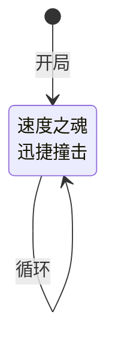

# 速度史莱姆

## 基本信息

| 属性 | 数值 |
|---|---|
| 分类 | [普通怪物](/monsters/normal/) |
| 生命值 | 32 - 37 |
| 被动能力 | [迅捷I](#被动能力)（1 层） |

## 行动逻辑

每回合都同时使用组合招式「速度之魂·迅捷撞击」（双意图），即先速度之魂再迅捷撞击，无限循环。

> **说明**：双招换行显示；连击数随速度层数递增。

## 招式

| 招式 | 意图 | 描述 | 数值 |
|---|---|---|---|
| 迅捷撞击 | 迅捷撞击 | 造成3点伤害（2 + 速度层数）次。每有1层速度，连击数+1。 | 伤害 3/次，连击 = 2 + 速度层数 |
| 速度之魂 | 速度之魂 | 自身速度+1，先制+1。 | 速度 +1，先制 +1 |
| 速度之魂·迅捷撞击 | 速度之魂 + 迅捷撞击 | 每回合组合招式，依次执行速度之魂与迅捷撞击。 | 同上两项 |

## 被动能力

### 迅捷I（1 层）

每场战斗开始时获得1层先制。

- **初始层数**：1（怪物加入房间时施加）。
- **触发机制**：战斗开始前对自身施加 1 层先制（先制 +1）。
- **能力类型**：增益。

## 遭遇战

| 遭遇战 | 房间类型 | 池子 | 数量 | 说明 |
|---|---|---|---|---|
| `SeerSpeedSlimeWeakEncounter` | Monster | 弱怪池 | 1 只 | 单速度史莱姆 |
| `SeerSpeedSlimeTripleWeakEncounter` | Monster | 弱怪池 | 3 只 | 三速度史莱姆 |
| `SeerLeafSlimeSpeedStrongEncounter` | Monster | 强怪池 | 1 只 | 与 1 只叶史莱姆同行 |

## 策略提示

1. **连击滚雪球是核心威胁**：组合招每回合先速度之魂（速度 +1）再迅捷撞击，连击数随回合递增。伤害计算如下：

   | 回合 | 速度层数 | 连击数 | 单次伤害 | 总伤害 |
   |------|----------|--------|----------|--------|
   | 第 1 回合 | 0 → 1 | 3 | 3 | 9 |
   | 第 2 回合 | 1 → 2 | 4 | 3 | 12 |
   | 第 3 回合 | 2 → 3 | 5 | 3 | 15 |
   | 第 5 回合 | 4 → 5 | 7 | 3 | 21 |

   组合招先加速再攻击，所以第 1 回合速度从 0 加到 1 后立即按 1 层速度计算连击 = 2 + 1 = 3 次。连击线性增长，拖到第 5 回合后每回合 21+ 伤害，必须速战速决。

2. **先制叠加改变回合顺序**：被动迅捷I 提供开局 1 层先制，速度之魂每回合再 +1 先制。先制越高回合顺位越靠前，3~4 回合后速度史莱姆可能抢在你之前行动——在你来得及加格挡之前就打完连击。这会让你的防御节奏被打乱，更加被动。

3. **32~37 血量极低，一回合可杀**：速度史莱姆血量是四种变种中最低的（与攻击/防御史莱姆相同），前期任何中等伤害攻击牌都能一波带走。优先在第 1 回合集火秒杀，避免连击滚起来后造成毁灭性伤害。

4. **三只同场威胁指数增长**：三只速度史莱姆遭遇战中，3 只各自独立叠加速度和连击。第 3 回合 3 只同时迅捷撞击 = 3 × 15 = 45 伤害。必须第一回合集火一只（9 伤害/只 × 3 = 27 伤害/回合来自3只），把同时存活数降到最低。

5. **消除速度可压制连击**：速度是 Buff 类型，可被消除 Buff 类卡牌清除。清除后连击数回到基础 2 次（6 伤害）。但速度之魂每回合重新 +1 速度，消除效果只能持续一回合。不如直接用爆发伤害速杀——32~37 血量用一张中等攻击牌即可解决。

6. **多段攻击怕荆棘但速度史莱姆无荆棘**：速度史莱姆没有反伤能力，多段攻击打它不会被反伤。但迅捷撞击本身是多段攻击（3~7 段），如果你有荆棘能力，每段都会触发荆棘反伤——第 3 回合 5 段连击 × 荆棘层数 = 可观的反伤输出。荆棘流应对速度史莱姆效果极佳。

## 源码

- 怪物：`SeerSpeedSlimeMonster.cs`
- 被动能力：`SeerSwiftOnePower.cs`
- 招式相关 Power：`SeerSpeedPower.cs`、`SeerFirstStrikePower.cs`
- 遭遇战：`SeerSpeedSlimeWeakEncounter.cs`、`SeerSpeedSlimeTripleWeakEncounter.cs`、`SeerLeafSlimeSpeedStrongEncounter.cs`
- 本地化：`monsters.json`（`SEER_MONSTER_SEER_SPEED_SLIME_MONSTER.*`）、`intents.json`（`SEER_SWIFT_BASH.*`、`SEER_SPEED_SOUL.*`）、`powers.json`（`SEER_POWER_SEER_SWIFT_ONE_POWER.*`、`SEER_POWER_SEER_SPEED_POWER.*`、`SEER_POWER_SEER_FIRST_STRIKE_POWER.*`）
