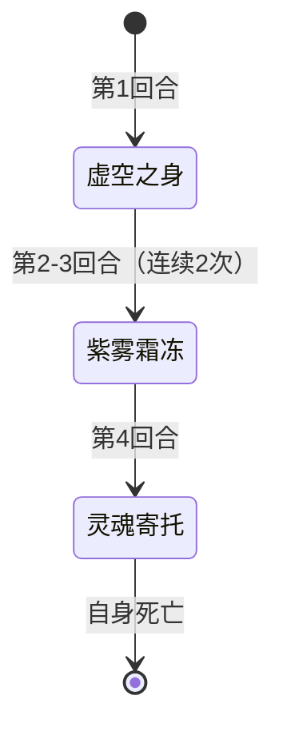

# 斯普林特

## 基本信息

| 属性 | 数值 |
|---|---|
| 分类 | [普通怪物](/monsters/normal/) |
| 生命值 | 93 - 98 |

## 行动逻辑

按固定顺序行动：虚空之身 → 紫雾霜冻 ×2 → 灵魂寄托（自杀，亡语移除遗物）。

> **说明**：灵魂寄托回合自身死亡，战斗结束后随机移除 1 个遗物。

## 招式

| 招式 | 意图 | 描述 | 数值 |
|---|---|---|---|
| 紫雾霜冻 | 紫雾霜冻 | 造成 13 点伤害。你的**攻击**-2，并获得**冻伤**和**害怕**各2层。 | 伤害 13；攻击 -2；冻伤/害怕各 2 层 |
| 虚空之身 | 虚空之身 | 自身获得2层**无实体**。 | 自身无实体 2 层 |
| 灵魂寄托 | 灵魂寄托 | 自身死亡。战斗结束后随机移除你一个遗物。 | 对自身造成等于当前生命的不可格挡伤害 |

## 遭遇战

| 遭遇战 | 房间类型 | 池子 | 数量 | 说明 |
|---|---|---|---|---|
| `SeerSplinterWeakEncounter` | Monster | 弱怪池 | 2 只 | — |
| `SeerSplinterNormalEncounter` | Monster | 强怪池 | 3 只 | — |
| `SeerJiabuHopperSplinterWeakEncounter` | Monster | 弱怪池 | 3 只 | 加布 + 原版偷窃草蜢 + 斯普林特 |
| `SeerDevoutSculptorSplinterStrongEncounter` | Monster | 强怪池 | 2 只 | 原版虔诚雕刻师 + 斯普林特 |

## 策略提示

1. **无实体优先处理——前 2 次攻击只受 1 点伤害**：开局获得 2 层[无实体](/powers/intangible_power.md)，每次受到伤害时伤害降为 1 点，触发后 -1 层。2 层无实体意味着前 2 次受击每次只受 1 点伤害。建议用低费多段攻击快速消耗无实体层数（每次攻击只触发一次无实体，所以多段攻击不比单次更优），或用固定伤害/流失伤害绕过无实体。等无实体耗尽后再爆发输出。

2. **遗物威胁——战斗结束后移除遗物**：灵魂寄托在战斗结束后才移除遗物（仅普通/罕见/稀有稀有度，不从消耗池移除）。⚠️ 灵魂寄托的能力不在开局施加，仅在使用"灵魂寄托"招式时才给自身施加——确保只有真正使用该技能时才触发亡语移除遗物。多只斯普林特同场时，每只都会触发一次移除，建议在灵魂寄托回合前击杀或硬控。

3. **自杀不可格挡**：灵魂寄托对自身造成等于当前生命的不可格挡的非攻击伤害，目标是自己。玩家无法阻止自杀——一旦斯普林特在第 4 回合使用灵魂寄托，它会立即死亡并触发亡语。唯一应对方式是在第 4 回合前击杀它，避免触发灵魂寄托。

4. **紫雾霜冻的属性削弱+异常**：紫雾霜冻造成 13 点攻击伤害，并施加力量 -2、[冻伤](/powers/frostbite_power.md) 2 层、[害怕](/powers/fear_power.md) 2 层。力量 -2 会削弱你的攻击伤害，冻伤会让你受到额外冰属性伤害，害怕进一步降低攻击伤害。第 2~3 回合连续两次紫雾霜冻后，你力量 -4、冻伤/害怕各 4 层，输出能力大幅下降。

5. **固定行动序列可预判**：斯普林特按固定顺序行动——虚空之身 → 紫雾霜冻 ×2 → 灵魂寄托（自杀）。第 1 回合虚空之身不攻击（安全输出窗口但有无实体），第 2~3 回合紫雾霜冻（需准备 13 格挡），第 4 回合灵魂寄托（自杀）。必须在第 4 回合前击杀，否则触发遗物移除。3 回合内击杀 93~98 血需要较强的爆发能力。

6. **多只斯普林特同场威胁叠加**：弱怪池 3 只斯普林特遭遇战中，每只独立行动。第 1 回合 3 只同时虚空之身（共 6 层无实体），第 2~3 回合 3 只同时紫雾霜冻（共 39 伤害/回合 + 力量 -6），第 4 回合 3 只同时灵魂寄托（移除 3 个遗物）。必须优先集火一只，在第 4 回合前击杀至少 1~2 只，减少遗物移除数量。

7. **与原版怪物同场的联动**：弱怪池遭遇中加布 + 原版偷窃草蜢 + 斯普林特同场。加布有龙之保护偷属性，斯普林特有紫雾霜冻削力量，双重力量削弱让你的攻击伤害骤降。强怪池中原版虔诚雕刻师 + 斯普林特同场，雕刻师有自己的机制，斯普林特负责遗物威胁。优先击杀斯普林特避免遗物损失。

## 源码

- 怪物：`SeerSplinterMonster.cs`
- 被动能力：`SeerSoulSustenancePower.cs`（仅在"灵魂寄托"招式中施加，非开局被动）
- 遭遇战：`SeerSplinterWeakEncounter.cs`、`SeerSplinterNormalEncounter.cs`、`SeerJiabuHopperSplinterWeakEncounter.cs`、`SeerDevoutSculptorSplinterStrongEncounter.cs`
- 本地化：`monsters.json`（`SEER_MONSTER_SEER_SPLINTER_MONSTER.*`）、`intents.json`（`SEER_PURPLE_FROST.*`、`SEER_VOID_BODY.*`、`SEER_SOUL_SUSTENANCE.*`）、`powers.json`（`SEER_POWER_SEER_SOUL_SUSTENANCE_POWER.*`、`SEER_POWER_SEER_FROSTBITE_POWER.*`、`SEER_POWER_SEER_FEAR_POWER.*`）
