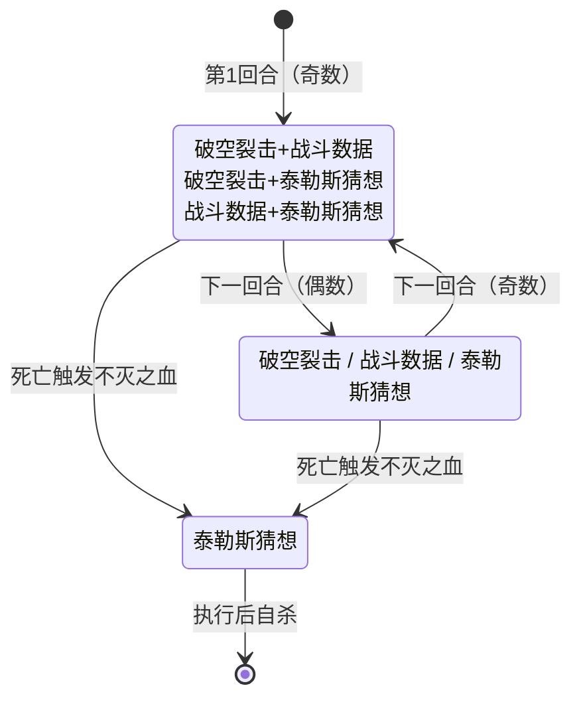

# 泰勒斯

> **类型**：普通怪物
> **初始生命**：142 - 147
> **遭遇战**：第三层普通战斗
> **特性**：算力驱动——开局算力 = 敌方牌库总数，泰勒斯猜想按算力开平方造成不可格挡流失伤害；死亡后复活一次再执行泰勒斯猜想后自杀

## 被动能力（开局自带）

| 名称 | 类型 | 效果 |
|------|------|------|
| **[算力](/powers/computing_power.md)**（初始 = 敌方牌库总数） | 能力（不可消除） | 初始层数为加入房间时所有敌方玩家牌库（抽牌堆 + 弃牌堆 + 手牌 + 消耗堆）的卡牌总数。泰勒斯猜想的伤害基于当前算力层数开平方（向下取整） |
| **[不灭之血](/powers/infinite_blood_power.md)**（1 层） | 能力（不可消除） | 首次致死时复活至 999999999 HP（血条显示为无穷符号），复活回合强制使用泰勒斯猜想后移除不灭之血并自杀 |

::: warning 本地化与源码不一致
不灭之血的本地化描述写的是"首次致死时复活至 1 HP，下回合结束死亡"，但实际实际复活至 999999999 HP（显示无穷符号），且复活回合执行泰勒斯猜想后立即自杀。以实际效果为准。
:::

## 行动逻辑

泰勒斯根据回合奇偶分两组随机选择行动：

- **奇数回合（第 1、3、5…回合）**：从 3 个组合招式中随机选 1（各 1/3）
- **偶数回合（第 2、4、6…回合）**：从 3 个单一招式中随机选 1（各 1/3）

死亡后触发不灭之血，进入复活状态再活 1 回合并强制使用泰勒斯猜想后自杀。

> **说明**：`/` 表示随机选一招，`+` 表示双招连招（本回合连续放两个技能）。奇数回合3选1双招，偶数回合3选1单招。死亡触发不灭之血后强制泰勒斯猜想自杀。

## 招式表

| 招式名 | 意图 | 类型 | 效果 |
|--------|------|------|------|
| **破空裂击** | 攻击 16 | 攻击 + 自身增益 | 造成 16 点攻击伤害，自身获得 5 层算力 |
| **战斗数据** | 战斗数据 | 自身增益 | 自身获得 24 层算力 |
| **泰勒斯猜想** | 泰勒斯猜想 | 流失伤害 | 你流失 √(算力层数) 点生命（向下取整），**不可格挡、不受力量影响** |
| **破空裂击·战斗数据** | 破空裂击 + 战斗数据 | 组合招（奇数回合） | 先执行破空裂击，再执行战斗数据 |
| **破空裂击·泰勒斯猜想** | 破空裂击 + 泰勒斯猜想 | 组合招（奇数回合） | 先执行破空裂击，再执行泰勒斯猜想（无独立招式名，仅显示双意图） |
| **战斗数据·泰勒斯猜想** | 战斗数据 + 泰勒斯猜想 | 组合招（奇数回合） | 先执行战斗数据，再执行泰勒斯猜想（无独立招式名，仅显示双意图） |

::: warning 泰勒斯猜想的伤害计算
- 伤害 = √(当前算力层数)，向下取整
- 算力 9 层 → 流失 3 点生命
- 算力 25 层 → 流失 5 点生命
- 算力 49 层 → 流失 7 点生命
- 算力 100 层 → 流失 10 点生命
- 流失生命**不可格挡**，唯一应对方式是恢复生命或降低算力
:::

::: tip 算力增长机制
- 开局算力 = 敌方所有牌库总数（抽牌堆 + 弃牌堆 + 手牌 + 消耗堆）
- 每次使用破空裂击：算力 +5
- 每次使用战斗数据：算力 +24
- 组合招中的破空裂击/战斗数据也会增长算力
- 算力只增不减，战斗越久泰勒斯猜想越致命
:::

## 遭遇战

| 遭遇战 | 池子 | 数量 | 说明 |
|--------|------|------|------|
| 弱怪池 | 弱怪池 | 1 只 | 单只泰勒斯 |
| 强怪池 | 强怪池 | 2 只 | 双泰勒斯 |

## 策略提示

1. **142~147 血是高血量普通怪**：泰勒斯血量在普通怪物中偏高，需要 3~4 回合击杀。配合不灭之血复活，实际需要打两次，战斗时间较长。

2. **算力初始值取决于你的牌库大小**：开局算力 = 敌方牌库总数。如果你的牌组很大（如 30 张牌），首回合泰勒斯猜想可能流失 5~6 点生命。牌组越小，初始算力越低，泰勒斯猜想威胁越小。

3. **泰勒斯猜想不可格挡**：泰勒斯猜想造成流失生命伤害，无法用格挡抵消。唯一应对方式是恢复生命或尽快击杀泰勒斯。如果算力叠到 50+ 层（流失 7+ 生命），每次泰勒斯猜想都是致命威胁。

4. **算力只增不减**：破空裂击 +5 算力，战斗数据 +24 算力。战斗越久算力越高，泰勒斯猜想越致命。战斗数据单次 +24 算力增长极快，如果连续抽到战斗数据相关组合，算力会迅速滚雪球。尽快击杀避免算力膨胀。

5. **奇偶回合预判**：奇数回合必出组合招（双重威胁），偶数回合只出单招。奇数回合威胁更大——可能同时受 16 伤 + 流失伤害，或 16 伤 + 算力 +24。偶数回合是相对安全的输出时间。

6. **复活回合必出泰勒斯猜想**：不灭之血死亡后复活至无穷血，复活回合强制使用泰勒斯猜想后自杀。这意味着你无需再打第二次——复活回合泰勒斯会自杀。但复活回合的泰勒斯猜想伤害基于当前算力（已经增长过），可能比之前更高。预留足够血量撑过这一击。

7. **双泰勒斯强怪池极其危险**：强怪池 2 只泰勒斯同场，每只泰勒斯独立计算自己看到的敌方牌库总数作为初始算力。2 只泰勒斯各自有不灭之血，共需击杀 4 次（每只 2 次）。奇数回合 2 只同时出组合招，威胁翻倍。建议跳过或准备充分后再挑战。

8. **控制牌库可以降低初始算力**：如果能在遭遇泰勒斯前消耗一些牌（如通过事件消耗、变换等），可以降低初始算力。但这种方式效果有限，核心策略仍是尽快击杀。

## 源码

- 怪物：`SeerTailesiMonster.cs`
- 被动能力：`SeerComputingPower.cs`（算力）、`SeerInfiniteBloodPower.cs`（不灭之血）
- 意图：`SeerTailesiIntents.cs`
- 遭遇战：`SeerTailesiWeakEncounter.cs`、`SeerTailesiDoubleStrongEncounter.cs`
- 本地化：`monsters.json`（`SEER_MONSTER_SEER_TAILESI_MONSTER.*`）、`intents.json`（`SEER_SKY_BREAK_STRIKE.*`、`SEER_BATTLE_DATA.*`、`SEER_THALES_GUESS.*`）、`powers.json`（`SEER_POWER_SEER_COMPUTING_POWER.*`、`SEER_POWER_SEER_INFINITE_BLOOD_POWER.*`）
