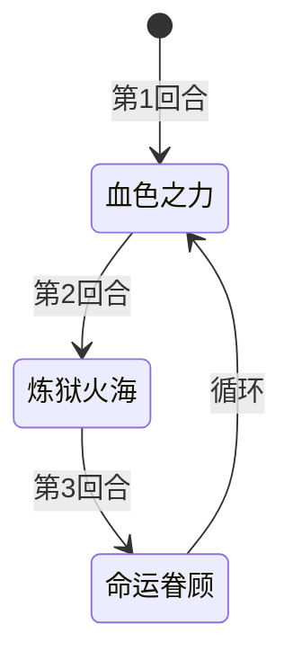

# 泰沃斯

> **类型**：普通怪物
> **初始生命**：108 - 113
> **遭遇战**：第一、二层普通战斗
> **特性**：三步循环 + 命运之击——血色之力塞煤灰削力量 → 炼狱火海按手牌数连击 → 命运眷顾回血标记必中

## 被动能力（开局自带）

| 名称 | 类型 | 效果 |
|------|------|------|
| **[命运之击](/powers/fate_strike_power.md)**（1 层） | 能力（不可消除） | 怪物侧回合结束时触发：50% 概率对所有敌方造成 10 点流失伤害，50% 概率自伤 10 点。被命运眷顾标记后下次必定命中敌方 |

::: tip 命运之击机制
- 触发时机：怪物侧回合结束时
- 伤害属性：**不可格挡**的流失生命伤害，不受力量影响
- 正常情况：50% 概率命中敌方（对所有敌方各 10 点），50% 概率自伤 10 点
- 命运眷顾标记后：下次触发时 **100% 命中**敌方，命中后标记重置
- 随机判定使用同步随机数，多端一致
:::

## 行动逻辑

泰沃斯按固定三步循环行动：血色之力 → 炼狱火海 → 命运眷顾 → 循环回到血色之力。

> **说明**：命运眷顾回合不攻击，仅回血+标记下次命运之击必中。

## 招式表

| 招式名 | 意图 | 类型 | 效果 |
|--------|------|------|------|
| **血色之力** | 血色之力 | 自身增益 + 削弱 + 干扰 | 自身获得 13 格挡 + 力量 +2，每位敌方力量 -2，向每位敌方手牌加入 2 张**煤灰**（保留） |
| **炼狱火海** | 攻击 3 ×N | 多段攻击 | 造成 3 点攻击伤害 ×（3 + 主目标手牌数）次。手牌越多，连击越多 |
| **命运眷顾** | 命运眷顾 | 自身增益 | 恢复已损失生命值的 1/3，使下次命运之击必定命中敌方 |

::: warning 三招联动链
1. **血色之力**向手牌塞 2 张煤灰（保留），并削弱你的力量 -2
2. **炼狱火海**按主目标手牌数追加连击——煤灰占手牌导致连击数增加
3. **命运眷顾**回血 + 标记下次命运之击必中

煤灰是保留状态牌，会持续占用手牌位置。血色之力塞 2 张煤灰后，下回合炼狱火海的连击数会因此增加 2 次（6 点额外伤害）。
:::

::: warning 力量削弱的累积
血色之力每用一次，你 -2 力量、泰沃斯 +2 力量。三步循环中每轮一次血色之力，两轮后你 -4 力量、泰沃斯 +4 力量。力量削弱会让你的攻击伤害大幅下降，而泰沃斯的炼狱火海在力量加成下更致命。
:::

## 遭遇战

| 遭遇战 | 池子 | 数量 | 说明 |
|--------|------|------|------|
| 强怪池 | 强怪池 | 1 只 | 单只泰沃斯 |
| 弱怪池 | 弱怪池 | 2 只 | 泰沃斯 + 原版猎杀者 |
| 事件遭遇 | 事件（无奖励） | 3 只 | 狄修斯 + 泰沃斯 + 加布（三魔王事件） |

## 策略提示

1. **108~113 血需要 2~3 回合击杀**：泰沃斯血量中等，但命运眷顾会回血 1/3 已损失生命，可能拖长战斗。建议在命运眷顾回合前集中火力击杀，避免它回血续命。

2. **炼狱火海前要清空手牌**：炼狱火海连击数 = 3 + 主目标手牌数。手牌越多伤害越高——5 张手牌时 3×8 = 24 伤，10 张手牌时 3×13 = 39 伤。血色之力塞的 2 张煤灰会让连击数 +2。在炼狱火海回合前尽量打出或消耗手牌，降低连击数。

3. **煤灰是保留牌要尽早处理**：煤灰带有保留关键字，回合结束时不弃牌而是保留在手中。这意味着煤灰会持续占用手牌位置，每回合都在影响炼狱火海的连击数。通过消耗、弃牌等方式处理煤灰。

4. **命运之击的 50% 概率**：每回合结束 50% 概率吃 10 点流失伤害（不可格挡），50% 概率泰沃斯自伤 10 点。平均每回合 5 点伤害期望值。如果运气不好连续被命中，血量压力会很大。命运眷顾后下次必定命中，需要预留 10 点以上血量。

5. **三步循环可预判**：泰沃斯行动序列固定——第 1 回合血色之力，第 2 回合炼狱火海，第 3 回合命运眷顾。炼狱火海回合需要格挡（手牌数×3 伤害），血色之力回合需要应对力量削弱，命运眷顾回合是输出时间（泰沃斯不攻击）。

6. **力量削弱会累积**：血色之力每用一次你 -2 力量。如果战斗拖到第二轮循环（第 4 回合血色之力），你 -4 力量，攻击伤害大幅下降。对于依赖攻击伤害的牌组尤其致命。尽快击杀或用非攻击伤害（固定伤害、流失伤害）输出。

7. **三魔王事件极其危险**：狄修斯 + 泰沃斯 + 加布同场，三只怪物各有独立机制且无奖励。泰沃斯塞煤灰+炼狱火海连击，狄修斯叠异常状态，加布偷属性。三只同时干扰，状态不好建议跳过。

8. **命运眷顾回合是输出窗口**：命运眷顾只回血 + 标记必中，没有直接伤害。但回血 1/3 已损失生命可能让泰沃斯续命。如果能在命运眷顾回合击杀泰沃斯，可以避免回血。注意命运眷顾后下回合命运之击必中 10 点流失伤害。

## 源码

- 怪物：`SeerTaiwosiMonster.cs`
- 被动能力：`SeerFateStrikePower.cs`（命运之击）
- 意图：`SeerTaiwosiIntents.cs`
- 遭遇战：`SeerTaiwosiStrongEncounter.cs`、`SeerTaiwosiHunterKillerWeakEncounter.cs`、`SeerEventThreeDemonKingsEncounter.cs`
- 本地化：`monsters.json`（`SEER_MONSTER_SEER_TAIWOSI_MONSTER.*`）、`intents.json`（`SEER_FATE_FAVOR.*`、`SEER_BLOOD_POWER.*`、`SEER_HELLFIRE.*`）、`powers.json`（`SEER_POWER_SEER_FATE_STRIKE_POWER.*`）
