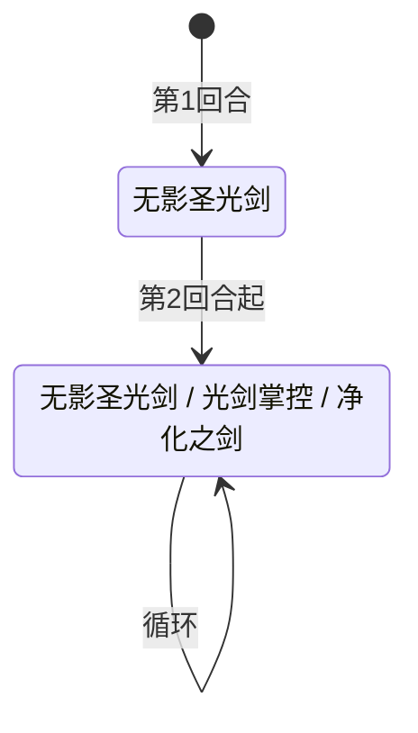

# 特兰西

> **类型**：普通怪物
> **初始生命**：169 - 174
> **遭遇战**：第三层普通战斗
> **特性**：光明剑道递增秒杀——每回合概率递增的秒杀机制，光剑掌控让概率翻倍

## 被动能力（开局自带）

| 名称 | 类型 | 效果 |
|------|------|------|
| **[光明剑道](/powers/light_sword_power.md)**（1 层） | 能力（不可消除） | 怪物侧回合开始时触发：按递增概率秒杀所有敌方（造成等于最大生命的不可格挡流失伤害）。基础 3%，每回合 +1%。被光剑掌控标记后概率永久翻倍 |

::: warning 光明剑道秒杀机制
- 触发时机：怪物侧回合开始时
- 秒杀伤害：等于目标最大生命的流失伤害，**不可格挡、不受力量影响**
- 概率递增：第 1 回合 3%，第 2 回合 4%，第 3 回合 5%……逐回合 +1%
- 光剑掌控标记后：概率**永久**翻倍（3%→6%，4%→8%，5%→10%……）
- 随机判定使用同步随机数，多端一致
:::

## 行动逻辑

特兰西开局第 1 回合固定使用无影圣光剑，之后从「无影圣光剑 / 光剑掌控 / 净化之剑」三招中等概率随机选择（各 1/3），允许连续重复。

> **说明**：`/` 表示三选一随机出招，可连续重复；光明剑道秒杀概率逐回合递增。

## 招式表

| 招式名 | 意图 | 类型 | 效果 |
|--------|------|------|------|
| **无影圣光剑** | 攻击 8 ×2 | 多段攻击 + Debuff | 造成 8 点攻击伤害 ×2 次，对每位敌方施加[光刃虚弱](/powers/light_weaken_power.md) 2 层 |
| **光剑掌控** | 光剑掌控 | 自身增益 | 自身力量 +3，光明剑道秒杀概率**永久翻倍** |
| **净化之剑** | 攻击 19 | 攻击 + Debuff | 造成 19 点攻击伤害，净化自身所有异常状态，将每位敌方已有的异常状态层数翻倍 |

::: tip 光刃虚弱机制
- 造成的攻击伤害降低 50%
- 持续 2 回合，回合结束 -1 层
- 无影圣光剑施加 2 层，影响你下两回合的攻击伤害
- 对于依赖攻击伤害的牌组极其致命
:::

::: warning 净化之剑的异常翻倍
净化之剑会将你身上**已有的异常状态层数翻倍**：
- 2 层烧伤 → 4 层
- 3 层虚弱 → 6 层
- 5 层易伤 → 10 层
- 同时清除特兰西自身所有异常状态

如果你身上有多种异常状态且层数较高，净化之剑会让异常状态滚雪球。在特兰西即将使用净化之剑前，尽量清除自身异常状态。
:::

## 遭遇战

| 遭遇战 | 池子 | 数量 | 说明 |
|--------|------|------|------|
| 强怪池 | 强怪池 | 1 只 | 单只特兰西 |

## 策略提示

1. **169~174 血是高血量普通怪**：特兰西血量在普通怪物中最高档，需要 3~4 回合击杀。配合光明剑道的递增秒杀概率，战斗拖延越久越危险。速战速决是核心策略。

2. **光明剑道是倒计时机制**：第 1 回合 3% 秒杀概率，第 5 回合 7%，第 10 回合 12%……如果光剑掌控使用过，概率翻倍（第 5 回合 14%，第 10 回合 24%）。虽然单次概率不高，但累积下来几乎必死。尽快击杀避免概率滚雪球。

3. **光剑掌控让概率永久翻倍**：光剑掌控使用后，光明剑道概率永久翻倍。如果特兰西连续使用光剑掌控（虽然翻倍不会叠加），概率会从 3%→6% 起步，递增速度也翻倍。光剑掌控同时 +3 力量，让无影圣光剑和净化之剑的伤害也提升。

4. **无影圣光剑的光刃虚弱削弱输出**：无影圣光剑施加 2 层光刃虚弱，你下两回合攻击伤害减半。对于依赖攻击伤害的牌组，这会让你的输出能力大幅下降。用非攻击伤害（固定伤害、流失伤害）输出可以绕过光刃虚弱。

5. **净化之剑前要清异常**：净化之剑会翻倍你身上的异常状态层数。如果你有 4 层烧伤，净化之剑后变成 8 层，每回合 8 点烧伤伤害。在特兰西可能使用净化之剑的回合前，尽量清除自身异常状态。但三招随机无法精确预判净化之剑的回合。

6. **三招随机不可预判**：第 1 回合固定无影圣光剑后，三招等概率随机。无法预判下回合是输出（无影圣光剑/净化之剑）还是增益（光剑掌控）。保留应对多种情况的资源。

7. **硬控可跳过回合压制光明剑道**：眩晕、冰封等硬控可以让特兰西跳过回合，间接压制光明剑道的触发。但光明剑道在怪物侧回合开始时触发，即使特兰西被眩晕无法行动，光明剑道仍会触发判定——硬控只能跳过特兰西的招式行动，不能阻止秒杀概率递增和判定。

8. **净化之剑清除自身异常**：净化之剑会清除特兰西自身的所有异常状态。如果你给特兰西挂了烧伤、虚弱等异常状态，净化之剑会全部清除。不要依赖异常状态作为主要输出手段。

## 源码

- 怪物：`SeerTelanxiMonster.cs`
- 被动能力：`SeerLightSwordPower.cs`（光明剑道）、`SeerLightWeakenPower.cs`（光刃虚弱）
- 意图：`SeerTelanxiIntents.cs`
- 遭遇战：`SeerTelanxiStrongEncounter.cs`
- 本地化：`monsters.json`（`SEER_MONSTER_SEER_TELANXI_MONSTER.*`）、`intents.json`（`SEER_SHADOWLESS_SWORD.*`、`SEER_LIGHT_SWORD_CONTROL.*`、`SEER_PURIFY_SWORD.*`）、`powers.json`（`SEER_POWER_SEER_LIGHT_SWORD_POWER.*`、`SEER_POWER_SEER_LIGHT_WEAKEN_POWER.*`）
