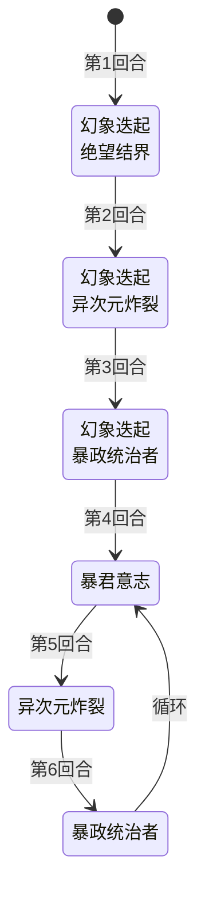

# 暴君史莱姆

## 基本信息

| 属性 | 数值 |
|---|---|
| 分类 | [普通怪物](/monsters/normal/) |
| 生命值 | 168 - 173 |

## 行动逻辑

按固定脚本行动：开局连续 3 回合使用「幻象迭起 + X」组合招式（依次搭配绝望结界、异次元炸裂、暴政统治者），召唤 3 只史莱姆；之后进入「暴君意志 → 异次元炸裂 → 暴政统治者」的循环。

> **说明**：双招换行显示；前 3 回合每回合召唤 1 只史莱姆。

## 招式

| 招式 | 意图 | 描述 | 数值 |
|---|---|---|---|
| 幻象迭起 | 召唤 | 召唤1只**史莱姆**。 | 召唤 1 只史莱姆（带 Minion） |
| 绝望结界 | 绝望结界 | 免疫异常状态和能力下降。施加**幻灵破碎**。 | 自身传说结界 1 层；玩家幻灵破碎 1 层 |
| 暴君意志 | 暴君意志 | 自身**全属性**+2。所有友军（不含自己）最大生命+50%；所有友军（含自己）获得**易伤**3层。 | 自身攻击/防御/命中/速度 各 +2；友军（不含自己）最大生命 +50%；所有友军（含自己）易伤 3 层 |
| 异次元炸裂 | 异次元炸裂 | 造成5点伤害（2 + 状态牌数）次。向你的弃牌堆加入3张随机状态牌。 | 伤害 5/次；总命中 = 2 + 玩家牌堆中状态牌数（取最大值）；每玩家弃牌堆 +3 张随机状态牌 |
| 暴政统治者 | 暴政统治者 | 造成18点伤害。获得1层**缓冲**。 | 伤害 18；自身缓冲 1 层 |
| 幻象迭起·绝望结界 | 召唤 + 绝望结界 | 先使用"幻象迭起"，再使用"绝望结界"。 | 召唤 1 只 + 自身传说结界 1 层 + 玩家幻灵破碎 1 层 |
| 幻象迭起·异次元炸裂 | 召唤 + 异次元炸裂 | 先使用"幻象迭起"，再使用"异次元炸裂"。 | 召唤 1 只 + 5/次 × (2 + 状态牌数) + 3 张状态牌 |
| 幻象迭起·暴政统治者 | 召唤 + 暴政统治者 | 先使用"幻象迭起"，再使用"暴政统治者"。 | 召唤 1 只 + 18 伤害 + 自身缓冲 1 层 |

## 遭遇战

| 遭遇战 | 房间类型 | 池子 | 数量 | 说明 |
|---|---|---|---|---|
| `SeerTyrantSlimeStrongEncounter` | Monster | 强怪池 | 1 只 | 预留召唤位供幻象迭起使用 |

## 策略提示

1. **召唤链威胁——前 3 回合每回合召唤 1 只史莱姆**：开局连续 3 回合使用组合招式「幻象迭起 + X」，每回合召唤 1 只史莱姆（带 Minion 标记）。第 3 回合场上最多 4 个怪物（暴君本体 + 3 只召唤史莱姆）。召唤的史莱姆会在第 2 回合变身为随机变种（攻击/防御/体力/速度），变身后血量降至 32~105。建议携带 AOE 卡牌或在前 3 回合内迅速清理召唤物，避免场上怪物数量失控。

2. **绝望结界首回合即开**：第 1 回合组合招「幻象迭起 + 绝望结界」中，绝望结界让暴君永久免疫攻击/防御/命中/速度/虚弱/易伤/燃烧/冻伤/冰封/中毒的负层数，并向你施加幻灵破碎。无法用异常状态削弱暴君，必须靠直伤或[固定伤害](/mechanics/fixed-damage)。

3. **幻灵破碎的反制——不要消耗状态牌**：幻灵破碎让你每消耗 1 张状态牌扣 1 点最大生命（永久，不可恢复）。配合异次元炸裂塞入的状态牌，如果你用消耗类卡牌清场会持续掉最大生命。建议不要主动消耗状态牌，让其留在弃牌堆。异次元炸裂塞的状态牌是随机状态牌（来自原版 + mod 状态牌池），会进入弃牌堆。

4. **暴君意志强化召唤物**：第 4 回合起首次「暴君意志」让暴君本体全属性 +2，所有友军（不含自己）最大生命 +50% 并回血等量，所有友军（含自己）获得 3 层[易伤](/powers/vulnerable_power.md)。召唤物此时会变得非常肉（最大生命 +50%），但同时也获得 3 层易伤，攻击它们会造成 50% 额外伤害。建议在暴君意志前清掉召唤物，避免它们被强化后更难处理。

5. **异次元炸裂连击随状态牌数增长**：异次元炸裂造成 5 点攻击伤害 ×（2 + 非消耗牌堆状态牌数）次，计算你抽牌堆+手牌+弃牌堆中的状态牌总数（取所有敌方的最大值）。前 3 回合的组合招中异次元炸裂会向弃牌堆塞 3 张随机状态牌，使下次异次元炸裂命中数飙升。务必在状态牌堆积前击杀本体——状态牌越多，连击数越高，伤害越致命。

6. **暴政统治者缓冲累积**：每次暴政统治者获得 1 层[缓冲](/powers/buffer_power.md)，长期战斗会让暴君免死多次。缓冲会吸收下一次致命伤害，必须用多段伤害或连续攻击破缓冲后再补刀。循环阶段每 3 回合一次暴政统治者，缓冲层数会持续累积。

7. **循环节奏可预判**：开局 3 回合组合招（召唤+绝望结界 → 召唤+异次元炸裂 → 召唤+暴政统治者），之后进入「暴君意志 → 异次元炸裂 → 暴政统治者」的循环。异次元炸裂回合需根据状态牌数预判连击伤害（基础 2 次 + 状态牌数），暴政统治者回合需准备 18 格挡。

8. **168~173 血是高血量普通怪**：暴君血量在普通怪物中偏高，配合召唤链、绝望结界免疫和暴政统治者缓冲，实际击杀需要 5~6 回合。建议优先击杀召唤物（变身后血量低），减少场上威胁后再集中火力击杀暴君本体。用[固定伤害](/mechanics/fixed-damage)或流失伤害绕过暴君的防御机制。

## 源码

- 怪物：`SeerTyrantSlimeMonster.cs`
- 关联能力：`SeerLegendaryBarrierPower.cs`（传说结界）、`SeerPhantomBreakPower.cs`（幻灵破碎）
- 召唤物：`SeerSlimeMonster.cs`（被幻象迭起召唤，带仆从标记）
- 遭遇战：`SeerTyrantSlimeStrongEncounter.cs`
- 本地化：`monsters.json`（`SEER_MONSTER_SEER_TYRANT_SLIME_MONSTER.*`）、`intents.json`（`SEER_PHANTOM_ERUPTION.*`、`SEER_DESPAIR_BARRIER.*`、`SEER_TYRANT_WILL.*`、`SEER_DIMENSION_BLAST.*`、`SEER_TYRANT_RULER.*`）、`powers.json`（`SEER_POWER_SEER_LEGENDARY_BARRIER_POWER.*`、`SEER_POWER_SEER_PHANTOM_BREAK_POWER.*`）
